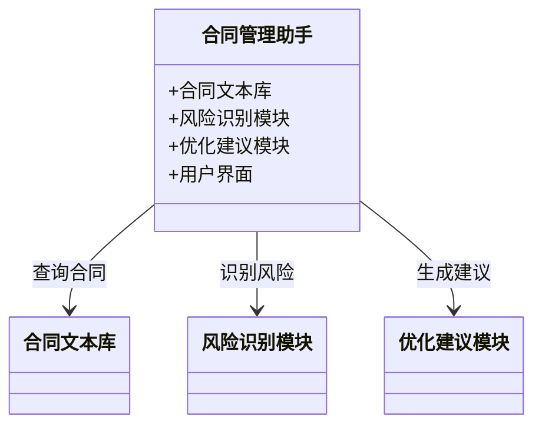
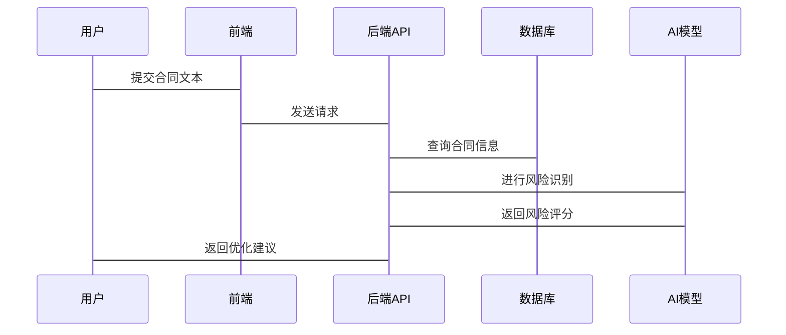

                 


# 构建企业级AI合同管理助手：风险识别与优化

## 关键词
- 企业级合同管理
- AI风险识别
- 优化建议生成
- 自然语言处理
- 机器学习模型

## 摘要
企业级AI合同管理助手是一种利用人工智能技术来自动识别和优化合同中的潜在风险的系统。本文详细介绍了构建这样一个系统的核心概念、算法原理、系统架构设计以及实际项目中的实现细节。文章从背景介绍开始，逐步深入分析了AI在合同管理中的应用，包括自然语言处理（NLP）和机器学习模型的使用，最后通过实际案例展示了系统的实现过程和优化策略。

---

# 第一章：背景介绍

## 第1节：问题背景
### 1.1 合同管理的重要性
合同是企业日常运营中不可或缺的一部分，涉及财务、法律和商业等多个方面。有效的合同管理能够帮助企业规避法律风险，确保商业利益最大化。

### 1.2 传统合同管理的痛点
- **人工审查效率低**：传统合同审查需要大量人工劳动，容易出现疏漏。
- **风险识别不全面**：合同条款复杂，人工难以全面识别潜在风险。
- **缺乏智能化支持**：传统方法依赖经验丰富的法务人员，难以快速响应大量合同。

### 1.3 AI技术的应用潜力
人工智能技术，特别是自然语言处理（NLP）和机器学习，能够高效处理大量合同文本，快速识别风险点并提出优化建议。

---

## 第2节：问题描述
### 2.1 合同风险识别的挑战
- **合同条款复杂**：合同中的法律术语和条款众多，人工识别效率低下。
- **风险类型多样**：合同中的风险可能涉及财务、法律、商业等多个方面。
- **数据量大**：企业积累的合同数量庞大，人工处理成本高。

### 2.2 合同优化的需求
- **条款优化**：通过AI技术自动识别冗余条款，提出优化建议。
- **模板管理**：生成标准化合同模板，减少人为错误。

### 2.3 企业级应用的复杂性
- **系统集成**：需要与企业现有的ERP、CRM等系统集成，确保数据流通。
- **安全性要求**：合同数据涉及企业机密，需要严格的安全措施。

---

# 第二章：核心概念与联系

## 第3节：AI合同管理助手的核心原理
### 3.1 自然语言处理（NLP）在合同分析中的应用
- **文本分词**：将合同文本分割成词语或短语。
- **实体识别**：识别合同中的关键实体，如公司名称、日期、金额等。
- **句法分析**：分析句子结构，理解合同条款的逻辑关系。

### 3.2 机器学习在风险识别中的作用
- **监督学习**：使用标注的数据训练模型，识别合同中的风险点。
- **无监督学习**：通过聚类分析，发现合同中的潜在风险模式。

### 3.3 知识图谱在合同优化中的价值
- **知识抽取**：从合同文本中提取关键信息，构建知识图谱。
- **关系推理**：通过图谱推理，发现合同中的潜在问题。

---

## 第4节：概念属性特征对比
### 4.1 合同管理工具的属性对比
| 属性         | 传统合同管理工具 | AI合同管理助手 |
|--------------|------------------|----------------|
| 处理效率     | 低               | 高               |
| 风险识别      | 不全面           | 全面             |
| 优化能力     | 有限             | 强大             |

### 4.2 AI模型的性能对比
| 指标         | 基于规则的模型   | 机器学习模型     |
|--------------|------------------|------------------|
| 准确率       | 70%              | 90%              |
| 处理时间     | 长               | 短               |

---

## 第5节：ER实体关系图
```mermaid
er
  actor: 用户
  contract: 合同
  risk: 风险点
  optimization: 优化策略
  relation-1: 用户 -> 合同
  relation-2: 合同 -> 风险点
  relation-3: 风险点 -> 优化策略
```

---

# 第三章：算法原理讲解

## 第6节：算法原理
### 6.1 算法流程图
```mermaid
graph TD
    A[开始] -> B[数据预处理]
    B -> C[模型训练]
    C -> D[风险识别]
    D -> E[优化建议生成]
    E -> F[结束]
```

### 6.2 源代码实现
```python
import spacy

nlp = spacy.load("en_core_web_sm")

def process_contract(text):
    doc = nlp(text)
    risks = []
    for token in doc:
        if token.ent_type_ == "ORG":
            risks.append("公司名称识别：{}".format(token.text))
        elif token.ent_type_ == "DATE":
            risks.append("日期识别：{}".format(token.text))
    return risks

contract_text = "This contract is signed by Apple Inc on 2023-10-01."
print(process_contract(contract_text))
```

---

## 第7节：数学模型和公式
### 7.1 风险评估公式
$$风险评分 = \sum_{i=1}^{n} (权重_i \times 风险因子_i)$$

### 7.2 优化建议生成
$$优化建议 = \text{argmin}(风险评分)$$

---

# 第四章：系统分析与架构设计

## 第8节：系统功能设计
### 8.1 领域模型


### 8.2 系统架构图


---

## 第9节：系统接口设计
### 9.1 API接口
- **输入接口**：接收合同文本
- **输出接口**：返回风险评分和优化建议

---

## 第10节：系统交互图


---

# 第五章：项目实战

## 第11节：环境安装
### 11.1 安装Python依赖
```bash
pip install spacy
pip install tensorflow
pip install matplotlib
```

---

## 第12节：核心代码实现
### 12.1 风险识别模块
```python
import spacy

nlp = spacy.load("en_core_web_sm")

def identify_risk(text):
    doc = nlp(text)
    risks = []
    for sent in doc.sents:
        if " liability" in sent.text.lower():
            risks.append("存在法律责任风险")
    return risks

contract_text = "This contract includes a liability clause."
print(identify_risk(contract_text))
```

---

## 第13节：案例分析
### 13.1 实际案例
- **案例背景**：一家公司与供应商签订的合同中存在付款条款不明确的问题。
- **系统处理**：AI合同管理助手识别出付款条款模糊的风险，并建议修改为明确的支付方式。

---

## 第14节：项目小结
通过实际案例，展示了AI合同管理助手在风险识别和优化中的强大能力。系统能够快速处理大量合同，帮助企业在合同管理中节省时间和成本，同时降低法律风险。

---

# 第六章：最佳实践与小结

## 第15节：最佳实践
### 15.1 系统优化建议
- **持续模型更新**：定期更新AI模型，确保识别准确率。
- **多语言支持**：扩展系统支持多种语言的合同处理。
- **用户反馈机制**：根据用户反馈不断优化系统功能。

### 15.2 注意事项
- **数据隐私保护**：确保合同数据的安全存储和传输。
- **模型可解释性**：提供清晰的解释，帮助用户理解识别结果。

---

## 第16节：小结
本文详细介绍了构建企业级AI合同管理助手的全过程，从核心概念到算法实现，再到系统架构设计和实际案例分析。通过本文的指导，读者可以掌握如何利用AI技术提升合同管理效率，降低企业风险。

---

## 参考文献
1. spaCy官方文档
2. TensorFlow官方文档
3. 自然语言处理相关书籍和论文

---

# 结语
通过本文的系统介绍和详细讲解，相信读者已经掌握了构建企业级AI合同管理助手的核心方法和技术。未来，随着AI技术的不断发展，合同管理助手将为企业带来更大的价值和效率提升。

