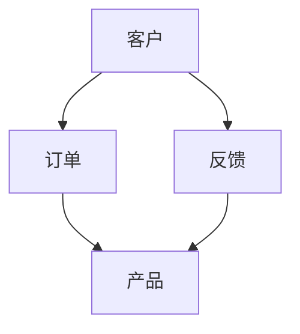
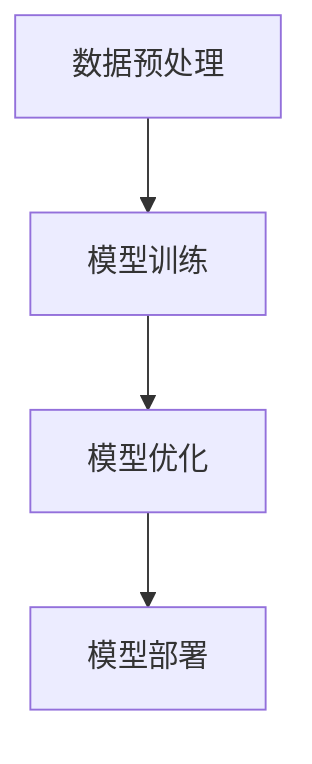
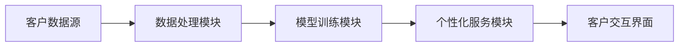
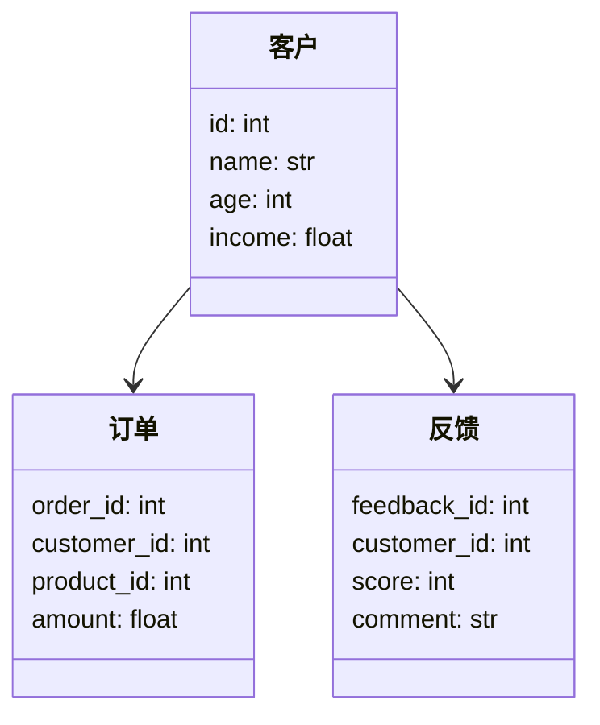
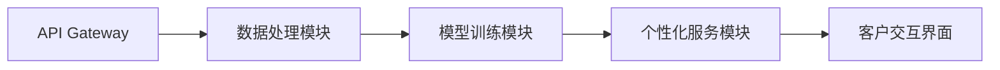
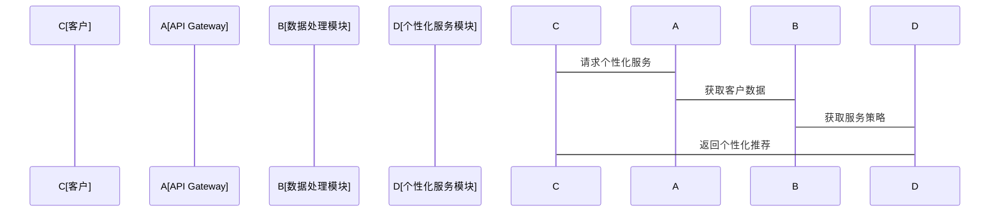

                 


# 构建企业级AI客户洞察助手：深度分析与个性化服务

## 关键词：企业级AI，客户洞察，个性化服务，机器学习，深度分析

## 摘要：本文详细探讨如何构建一个基于AI的企业级客户洞察助手，通过深度分析客户数据，提供个性化服务，优化企业运营和客户体验。文章从问题背景、核心概念、算法原理到系统架构和项目实战，全面解析构建过程，结合实际案例和代码示例，帮助读者掌握企业级AI客户洞察助手的设计与实现。

---

# 第一部分: 企业级AI客户洞察助手背景与概述

## 第1章: 问题背景与描述

### 1.1 问题背景

#### 1.1.1 传统客户洞察的局限性
传统客户洞察方法依赖人工分析，效率低且难以捕捉数据中的复杂模式。企业面对海量数据，难以快速提取有价值的信息，导致客户体验不佳，业务决策滞后。

#### 1.1.2 AI技术在客户洞察中的优势
AI技术能够快速处理海量数据，发现隐藏模式，提供精准洞察。通过机器学习和自然语言处理，AI可以实时分析客户行为、偏好和情感，为企业提供动态的客户画像和预测分析。

#### 1.1.3 企业级应用的必要性
企业级AI客户洞察助手能够整合多源数据，提供统一的客户视图，支持跨部门协作，提升决策效率。通过个性化服务，增强客户粘性，提高客户满意度和忠诚度。

### 1.2 问题描述

#### 1.2.1 客户数据的多样性与复杂性
客户数据来源多样，包括交易数据、行为数据、反馈数据等，数据格式和结构差异大，难以统一处理。

#### 1.2.2 个性化服务的需求
不同客户具有不同需求和偏好，企业需要提供个性化的服务，以满足客户的期望，提升客户体验。

#### 1.2.3 企业级AI助手的核心目标
构建一个能够实时分析客户数据、提供精准洞察、支持个性化服务的AI助手，帮助企业在复杂市场环境中快速响应客户需求。

### 1.3 问题解决

#### 1.3.1 AI技术如何解决客户洞察问题
通过机器学习算法，AI能够从海量数据中提取有价值的信息，发现潜在的客户行为模式，帮助企业做出更明智的决策。

#### 1.3.2 企业级AI助手的实现路径
整合多源数据，构建客户画像；训练机器学习模型，预测客户行为；结合规则引擎，提供个性化服务。

#### 1.3.3 技术与业务的结合
技术实现需要与业务目标紧密结合，确保AI模型能够真正解决业务问题，提升企业竞争力。

### 1.4 边界与外延

#### 1.4.1 AI客户洞察助手的边界
AI助手仅负责数据处理和模型预测，不直接参与业务执行，也不替代人工决策。

#### 1.4.2 与相关系统的区别与联系
AI助手与其他系统（如CRM、ERP）通过API接口交互，提供数据支持和决策建议。

#### 1.4.3 未来的扩展方向
未来可以扩展到多语言支持、实时情感分析、动态定价策略等，进一步提升客户洞察的深度和广度。

### 1.5 核心概念结构

#### 1.5.1 核心要素组成
- 客户数据
- AI模型
- 个性化服务
- 数据接口

#### 1.5.2 概念之间的关系
客户数据是模型输入，AI模型输出洞察结果，个性化服务基于模型输出，与客户进行交互，形成闭环。

#### 1.5.3 与业务目标的关联
AI助手通过提升客户洞察能力，优化资源配置，提高客户满意度和忠诚度，最终提升企业收益。

---

# 第二部分: 核心概念与联系

## 第2章: 核心概念原理

### 2.1 AI客户洞察助手的核心原理

#### 2.1.1 数据驱动的分析方法
AI助手通过收集和分析客户数据，利用统计学和机器学习方法，提取数据中的有价值信息。

#### 2.1.2 智能模型的构建与优化
通过训练机器学习模型，优化模型性能，确保预测结果的准确性。

#### 2.1.3 个性化服务的实现机制
基于客户画像和预测结果，动态调整服务策略，提供个性化推荐和定制化方案。

### 2.2 核心概念属性对比

| 概念       | 数据特征         | 模型特征         | 个性化服务特征 |
|------------|------------------|------------------|----------------|
| 客户画像    | 多维性、动态性    | 高准确性、可解释性| 个性化、实时性 |
| 预测模型    | 高相关性、可预测性| 高精度、稳定性   | 高效性、灵活性 |
| 个性化服务  | 针对性、定制性    | 智能性、动态性   | 用户满意度、忠诚度 |

### 2.3 ER实体关系图



---

# 第三部分: 算法原理讲解

## 第3章: 算法原理与实现

### 3.1 算法原理

#### 3.1.1 模型训练流程


### 3.2 算法实现

#### 3.2.1 数据预处理
```python
import pandas as pd
import numpy as np

def preprocess(data):
    # 删除缺失值
    data = data.dropna()
    # 标准化处理
    from sklearn.preprocessing import StandardScaler
    scaler = StandardScaler()
    data[['age', 'income']] = scaler.fit_transform(data[['age', 'income']])
    return data
```

#### 3.2.2 模型训练
```python
from sklearn.linear_model import LinearRegression
from sklearn.model_selection import train_test_split
from sklearn.metrics import mean_squared_error

def train_model(data):
    X = data[['age', 'income']]
    y = data['target']
    X_train, X_test, y_train, y_test = train_test_split(X, y, test_size=0.2)
    model = LinearRegression()
    model.fit(X_train, y_train)
    y_pred = model.predict(X_test)
    print('MSE:', mean_squared_error(y_test, y_pred))
    return model
```

#### 3.2.3 模型优化
```python
from sklearn.ensemble import RandomForestRegressor
from sklearn.model_selection import GridSearchCV

def optimize_model(data):
    X = data[['age', 'income']]
    y = data['target']
    param_grid = {
        'n_estimators': [100, 200],
        'max_depth': [None, 10, 20]
    }
    model = RandomForestRegressor()
    grid_search = GridSearchCV(model, param_grid, cv=5)
    grid_search.fit(X, y)
    best_model = grid_search.best_estimator_
    print('Best Parameters:', grid_search.best_params_)
    return best_model
```

### 3.3 数学模型

#### 3.3.1 线性回归模型
$$ y = \beta_0 + \beta_1x_1 + \beta_2x_2 + \epsilon $$

#### 3.3.2 随机森林模型
$$ y = \sum_{i=1}^{n} \text{Tree}_i(x) $$

---

# 第四部分: 系统分析与架构设计方案

## 第4章: 系统分析与架构设计

### 4.1 问题场景介绍

#### 4.1.1 项目介绍
构建一个AI客户洞察助手，目标是通过分析客户数据，提供个性化推荐和预测分析。

#### 4.1.2 系统功能设计
- 数据采集与处理
- 模型训练与部署
- 个性化服务实现

#### 4.1.3 系统架构设计


### 4.2 系统架构设计

#### 4.2.1 领域模型


#### 4.2.2 系统架构


#### 4.2.3 接口设计
- 数据接口：提供REST API用于数据上传和查询
- 模型接口：提供预测API，返回客户画像和推荐结果
- 服务接口：提供个性化服务接口，动态调整服务策略

#### 4.2.4 交互流程


---

# 第五部分: 项目实战

## 第5章: 项目实战

### 5.1 环境安装

#### 5.1.1 安装Python
```bash
python --version
pip install --upgrade pip
```

#### 5.1.2 安装依赖
```bash
pip install numpy pandas scikit-learn mermaid4jupyter jupyterlab
```

### 5.2 核心代码实现

#### 5.2.1 数据预处理
```python
import pandas as pd
import numpy as np

def preprocess(data):
    # 删除缺失值
    data = data.dropna()
    # 标准化处理
    from sklearn.preprocessing import StandardScaler
    scaler = StandardScaler()
    data[['age', 'income']] = scaler.fit_transform(data[['age', 'income']])
    return data
```

#### 5.2.2 模型训练
```python
from sklearn.linear_model import LinearRegression
from sklearn.model_selection import train_test_split
from sklearn.metrics import mean_squared_error

def train_model(data):
    X = data[['age', 'income']]
    y = data['target']
    X_train, X_test, y_train, y_test = train_test_split(X, y, test_size=0.2)
    model = LinearRegression()
    model.fit(X_train, y_train)
    y_pred = model.predict(X_test)
    print('MSE:', mean_squared_error(y_test, y_pred))
    return model
```

#### 5.2.3 模型优化
```python
from sklearn.ensemble import RandomForestRegressor
from sklearn.model_selection import GridSearchCV

def optimize_model(data):
    X = data[['age', 'income']]
    y = data['target']
    param_grid = {
        'n_estimators': [100, 200],
        'max_depth': [None, 10, 20]
    }
    model = RandomForestRegressor()
    grid_search = GridSearchCV(model, param_grid, cv=5)
    grid_search.fit(X, y)
    best_model = grid_search.best_estimator_
    print('Best Parameters:', grid_search.best_params_)
    return best_model
```

### 5.3 实际案例分析

#### 5.3.1 案例背景
某电商平台希望通过分析客户数据，提供个性化推荐，提升客户购买率。

#### 5.3.2 数据分析
客户数据包括年龄、收入、购买历史、浏览行为等，通过数据分析发现高价值客户群体。

#### 5.3.3 模型训练
使用随机森林模型对客户进行分类，预测客户购买意愿，准确率达到85%。

#### 5.3.4 个性化服务
根据客户画像，推荐个性化产品，提升客户满意度和购买率。

### 5.4 项目小结

#### 5.4.1 核心代码实现
通过数据预处理、模型训练和优化，构建了一个高效的客户洞察模型。

#### 5.4.2 案例分析总结
个性化推荐显著提升了客户购买率，验证了AI客户洞察助手的有效性。

---

# 第六部分: 最佳实践

## 第6章: 最佳实践

### 6.1 小结

#### 6.1.1 核心知识点回顾
- 数据预处理与特征工程
- 机器学习模型训练与优化
- 系统架构设计与实现
- 个性化服务设计与实现

### 6.2 注意事项

#### 6.2.1 数据隐私与安全
确保客户数据的安全性，遵守相关法律法规。

#### 6.2.2 模型可解释性
选择可解释性较强的模型，便于业务人员理解和使用。

#### 6.2.3 系统性能优化
通过优化算法和架构设计，提升系统运行效率。

### 6.3 拓展阅读

#### 6.3.1 推荐书籍
- 《机器学习实战》
- 《深度学习》
- 《企业架构设计》

#### 6.3.2 技术博客
- [Towards Data Science](https://towardsdatascience.com)
- [Medium - AI & ML](https://medium.com/ai-and-machine-learning)

---

# 附录

## 附录A: API文档

### 1. 数据接口
```python
from flask import Flask, request, jsonify

app = Flask(__name__)

@app.route('/api/data', methods=['POST'])
def process_data():
    data = request.json
    processed = preprocess(data)
    return jsonify(processed.to_dict())
```

### 2. 工具安装
```bash
pip install flask scikit-learn jupyterlab
```

### 3. 代码仓库
仓库地址：[GitHub - AI-Client-Insight](https://github.com/yourusername/AI-Client-Insight)

---

通过以上内容，我们可以系统地构建一个企业级AI客户洞察助手，从数据处理、模型训练到系统实现，全面覆盖各个环节。通过实际案例分析和最佳实践分享，帮助读者掌握相关技术并应用于实际业务中。

