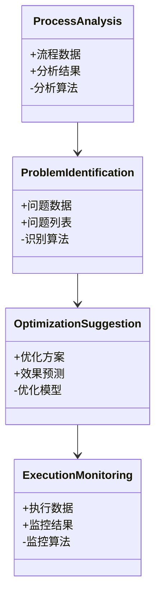
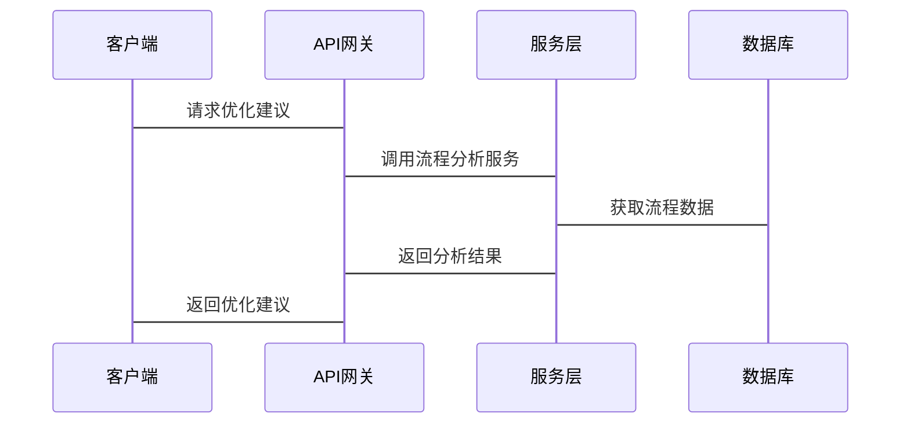

                 


# 构建企业级AI工作流程优化助手：提升运营效率

---

## 关键词：
企业级AI工作流程优化助手、AI技术、流程优化、机器学习、自然语言处理、流程挖掘

---

## 摘要：
本文详细探讨了构建企业级AI工作流程优化助手的关键技术与方法，从背景概念到核心算法，再到系统架构设计和项目实战，系统性地分析了如何利用AI技术提升企业运营效率。文章结合流程挖掘、自然语言处理（NLP）和机器学习等技术，构建了一个完整的解决方案，并通过实际案例展示了其应用效果。通过本文的讲解，读者可以全面了解企业级AI工作流程优化助手的设计与实现，为企业的数字化转型提供有力支持。

---

# 第一部分：企业级AI工作流程优化助手概述

## 第1章：企业级AI工作流程优化助手的背景与概念

### 1.1 企业工作流程优化的背景

#### 1.1.1 工作流程优化的定义与重要性
工作流程优化是指通过对现有流程的分析、改进和重新设计，以提高流程的效率、减少资源浪费、降低运营成本并提升整体业务绩效的过程。在企业运营中，工作流程优化是提升竞争力的重要手段。

#### 1.1.2 AI技术在企业流程优化中的作用
随着AI技术的快速发展，企业开始利用AI技术来优化工作流程。AI能够通过自动化处理、数据挖掘和模式识别，发现流程中的瓶颈和低效环节，并提出优化建议。

#### 1.1.3 企业级AI工作流程优化助手的定义
企业级AI工作流程优化助手是一种基于AI技术的工具，能够自动化分析企业的工作流程，识别优化点，并提供智能化的改进建议。它通过整合流程挖掘、NLP和机器学习等技术，帮助企业实现高效、智能的流程优化。

### 1.2 AI技术与工作流程优化的结合

#### 1.2.1 AI技术的基本概念
AI（人工智能）是指模拟人类智能的计算机系统，涵盖机器学习、自然语言处理、计算机视觉等领域。在工作流程优化中，AI技术能够处理大量数据，发现隐藏的模式，并提供决策支持。

#### 1.2.2 AI技术在工作流程优化中的应用领域
AI技术广泛应用于企业资源计划（ERP）、客户关系管理（CRM）、供应链管理等领域。通过AI，企业可以实现流程自动化、智能监控和预测性维护。

#### 1.2.3 企业级AI工作流程优化助手的核心功能
企业级AI工作流程优化助手的核心功能包括流程分析、问题识别、优化建议生成和自动化执行。它能够帮助企业在复杂环境中快速识别问题，并提供高效的解决方案。

### 1.3 本章小结
本章介绍了企业级AI工作流程优化助手的背景、AI技术在流程优化中的作用，以及优化助手的核心功能。通过这些内容，读者可以理解企业级AI工作流程优化助手的重要性和基本概念。

---

# 第二部分：企业级AI工作流程优化的核心概念与联系

## 第2章：企业工作流程优化的核心概念

### 2.1 工作流程优化的基本原理

#### 2.1.1 工作流程的定义与特点
工作流程是指一系列有序的步骤，用于完成特定任务或目标。其特点包括结构化、可重复性和明确的目标。

#### 2.1.2 工作流程优化的目标与方法
工作流程优化的目标是提高效率、降低成本和提升质量。常用方法包括流程再造、自动化技术应用和持续改进。

#### 2.1.3 企业级工作流程优化的挑战
企业级工作流程优化的挑战包括复杂性高、部门间协调困难以及数据孤岛问题。

### 2.2 AI技术在工作流程优化中的应用原理

#### 2.2.1 AI技术的基本原理
AI通过数据训练模型，模拟人类学习和决策能力。在流程优化中，AI能够分析数据，识别模式，并预测潜在问题。

#### 2.2.2 AI技术在工作流程优化中的具体应用
AI技术在工作流程优化中的具体应用包括流程自动化、异常检测和智能预测。

#### 2.2.3 AI技术与传统工作流程优化方法的区别
与传统方法相比，AI技术能够处理更大规模的数据，并提供更精准的预测和优化建议。

## 第3章：AI工作流程优化的核心概念与联系

### 3.1 流程挖掘与分析

#### 3.1.1 流程挖掘的定义与作用
流程挖掘是从日志数据中提取流程信息，用于分析和优化流程的技术。其作用包括流程发现、监控和优化。

#### 3.1.2 流程挖掘的关键技术
流程挖掘的关键技术包括日志数据处理、模型构建和模型分析。

#### 3.1.3 流程挖掘在企业级AI工作流程优化中的应用
流程挖掘可以帮助企业发现流程中的瓶颈，并提供优化建议。

### 3.2 自然语言处理（NLP）与工作流程优化

#### 3.2.1 NLP的定义与作用
NLP是处理人类语言的AI技术，能够理解、生成和分析文本。在工作流程优化中，NLP可用于文本分析和流程自动化。

#### 3.2.2 NLP在工作流程优化中的具体应用
NLP在工作流程优化中的具体应用包括文档处理、信息抽取和自动回复。

#### 3.2.3 NLP与流程挖掘的结合
通过结合NLP和流程挖掘，企业可以实现从文本数据到流程优化的无缝连接。

### 3.3 机器学习与工作流程优化

#### 3.3.1 机器学习的定义与作用
机器学习是AI的一种技术，通过数据训练模型，用于分类、回归和聚类等任务。

#### 3.3.2 机器学习在工作流程优化中的具体应用
机器学习在工作流程优化中的具体应用包括异常检测、预测性维护和流程自动化。

#### 3.3.3 机器学习与流程挖掘的结合
通过结合机器学习和流程挖掘，企业可以实现智能化的流程优化，提升运营效率。

## 第4章：核心概念与联系的数学模型与公式

### 4.1 流程挖掘的数学模型

#### 4.1.1 流程挖掘的基本公式
流程挖掘的基本公式包括日志数据的处理和模型的构建。

#### 4.1.2 流程挖掘的算法模型
流程挖掘的算法模型包括序列图、泳道图和表格图。

#### 4.1.3 流程挖掘的数学表达式
流程挖掘的数学表达式包括序列图的表示和模型的相似性度量。

### 4.2 NLP与工作流程优化的数学模型

#### 4.2.1 NLP的基本公式
NLP的基本公式包括文本表示和模型训练。

#### 4.2.2 NLP在工作流程优化中的算法模型
NLP在工作流程优化中的算法模型包括文本分类和信息抽取。

#### 4.2.3 NLP与流程挖掘的数学表达式
NLP与流程挖掘的数学表达式包括文本数据的处理和流程模型的结合。

### 4.3 机器学习与工作流程优化的数学模型

#### 4.3.1 机器学习的基本公式
机器学习的基本公式包括模型训练和预测。

#### 4.3.2 机器学习在工作流程优化中的算法模型
机器学习在工作流程优化中的算法模型包括异常检测和预测性维护。

#### 4.3.3 机器学习与流程挖掘的数学表达式
机器学习与流程挖掘的数学表达式包括模型的训练和优化。

## 第5章：系统分析与架构设计方案

### 5.1 问题场景介绍

#### 5.1.1 企业级AI工作流程优化助手的目标
企业级AI工作流程优化助手的目标是通过AI技术优化企业工作流程，提升运营效率。

#### 5.1.2 问题场景的具体描述
问题场景包括流程复杂、数据分散和效率低下。

#### 5.1.3 问题场景的边界与外延
问题场景的边界包括企业的核心业务流程，外延包括外部合作伙伴的流程。

### 5.2 系统功能设计

#### 5.2.1 领域模型设计
领域模型设计包括流程分析、问题识别和优化建议生成。

#### 5.2.2 系统功能设计
系统功能设计包括数据采集、流程分析、优化建议生成和执行监控。

#### 5.2.3 领域模型的Mermaid类图


### 5.3 系统架构设计

#### 5.3.1 系统架构的Mermaid架构图


#### 5.3.2 系统架构设计的细节
系统架构设计包括客户端、API网关、服务层和数据库。客户端与API网关交互，API网关调用服务层，服务层处理数据并存储在数据库中。

#### 5.3.3 系统接口设计
系统接口设计包括API接口和数据接口。API接口用于与外部系统交互，数据接口用于与数据库交互。

#### 5.3.4 系统交互的Mermaid序列图


## 第6章：项目实战

### 6.1 环境安装

#### 6.1.1 系统环境要求
系统环境要求包括操作系统、Python版本和依赖库。

#### 6.1.2 安装步骤
安装步骤包括安装Python、安装依赖库和配置环境变量。

### 6.2 系统核心实现源代码

#### 6.2.1 核心代码
核心代码包括流程分析模块、问题识别模块和优化建议生成模块。

#### 6.2.2 代码实现
```python
# 流程分析模块
def process_analysis(data):
    # 数据预处理
    pass
    # 数据分析
    pass
    return result

# 问题识别模块
def problem_identification(result):
    # 问题检测
    pass
    return problem_list

# 优化建议生成模块
def optimization_suggestion(problem_list):
    # 优化方案生成
    pass
    return optimization_plan
```

#### 6.2.3 代码应用解读与分析
代码实现通过流程分析模块对数据进行预处理和分析，问题识别模块检测问题并生成问题列表，优化建议生成模块根据问题列表生成优化方案。

### 6.3 实际案例分析

#### 6.3.1 案例背景
案例背景包括企业面临的流程问题和优化目标。

#### 6.3.2 案例分析与解决方案
案例分析包括问题识别、流程优化和效果评估。

#### 6.3.3 实际案例的详细讲解剖析
详细讲解剖析包括流程分析、问题识别和优化建议生成的具体步骤和效果。

### 6.4 项目小结
项目小结包括项目的实现目标、主要成果和经验总结。

## 第7章：最佳实践、小结、注意事项与拓展阅读

### 7.1 最佳实践 tips

#### 7.1.1 数据质量的重要性
数据质量直接影响优化效果，需确保数据的准确性和完整性。

#### 7.1.2 模型选择的策略
根据具体问题选择合适的模型，避免过度复杂的模型。

#### 7.1.3 持续优化的策略
定期监控和评估优化效果，持续改进流程。

### 7.2 小结
本章总结了企业级AI工作流程优化助手的核心概念、算法原理和系统设计，并通过实际案例展示了其应用效果。

### 7.3 注意事项

#### 7.3.1 数据隐私保护
在处理企业数据时，需注意数据隐私保护，遵守相关法律法规。

#### 7.3.2 模型的可解释性
模型的可解释性直接影响优化的可信度，需注重模型的可解释性。

#### 7.3.3 技术的可扩展性
在系统设计中，需考虑技术的可扩展性，以应对未来业务发展。

### 7.4 拓展阅读

#### 7.4.1 流程挖掘的深入研究
推荐阅读流程挖掘相关的书籍和论文。

#### 7.4.2 NLP与机器学习的最新进展
关注NLP与机器学习领域的最新研究和技术进展。

#### 7.4.3 企业级系统的架构设计
学习企业级系统的架构设计原则和最佳实践。

---

# 结语

企业级AI工作流程优化助手的构建是一个复杂而系统的过程，需要结合流程挖掘、NLP和机器学习等多种技术。通过本文的详细讲解，读者可以掌握企业级AI工作流程优化助手的核心概念、算法原理和系统设计方法，并能够将其应用于实际场景中，帮助企业实现高效、智能的流程优化，从而提升运营效率。

---

**感谢您的阅读，希望本文对您有所帮助！**

