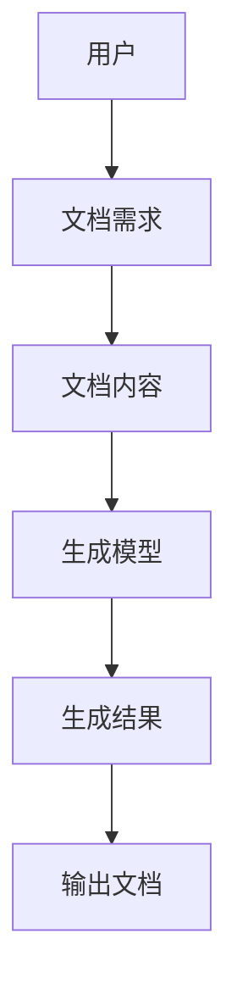
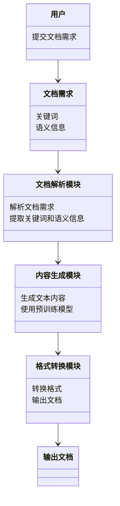
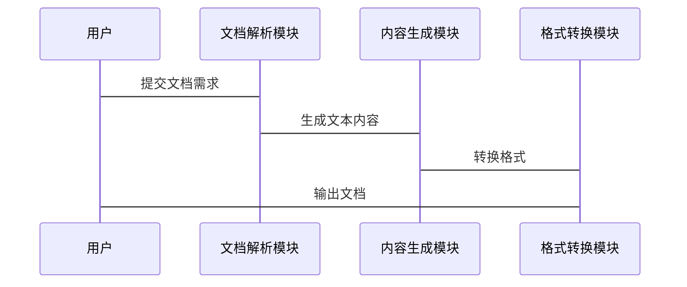

                 


# 构建企业级AI文档助手：自动生成报告与提案

## 关键词：企业级AI文档助手、自动报告生成、自然语言处理、文本生成、企业文档管理

## 摘要：本文详细探讨如何构建一个企业级AI文档助手，通过自然语言处理和文本生成技术实现报告与提案的自动生成。文章从问题背景、核心概念、算法原理、系统架构设计到项目实战，全面解析了AI文档助手的构建过程，旨在为企业提供高效、智能的文档生成解决方案。

---

# 第1章: 企业级AI文档助手的背景与核心概念

## 1.1 问题背景与需求分析

### 1.1.1 传统文档生成的痛点
企业在日常运营中需要处理大量的文档，包括报告、提案、会议记录等。传统的文档生成方式依赖人工编写，效率低、耗时长且容易出错。特别是在面对大量重复性任务时，人工操作的效率瓶颈尤为明显。

### 1.1.2 企业级文档助手的市场需求
随着AI技术的快速发展，企业对自动化文档生成工具的需求日益增长。AI文档助手能够显著提高文档生成效率，降低成本，并减少人为错误。特别是在需要快速生成标准化报告和提案的场景中，AI文档助手展现出巨大的应用潜力。

### 1.1.3 问题解决思路
通过引入自然语言处理（NLP）技术，AI文档助手可以实现文档内容的理解、分析和自动生成。结合企业文档的结构化特点，AI文档助手能够根据输入的需求快速生成符合规范的文档。

### 1.1.4 问题的边界与外延
企业级文档助手的目标是辅助而非完全替代人工工作。其边界包括文档内容的理解与生成，而边界之外的功能如文档存储、协作编辑等则属于其他办公工具的范畴。

---

## 1.2 核心概念与联系

### 1.2.1 核心概念的层次结构
AI文档助手的核心概念包括文档需求解析、文本生成模型、文档结构化处理等。这些概念相互关联，共同构成完整的文档生成流程。

### 1.2.2 ER实体关系图


---

# 第2章: 自然语言处理与文本生成算法

## 2.1 自然语言处理（NLP）技术

### 2.1.1 文档解析
AI文档助手需要理解用户提供的文档需求，包括关键词提取、语义分析等步骤。例如，用户输入“编写季度销售报告”，系统需要提取“季度销售报告”这一关键词，并理解其核心内容。

### 2.1.2 文本生成模型
文本生成模型是AI文档助手的核心组件。基于Transformer的模型（如GPT）能够生成连贯且符合语境的文本。生成过程包括编码器和解码器的交互，确保输出内容与输入需求高度相关。

### 2.1.3 模型训练与优化
通过大量的文档数据训练生成模型，可以提高文本生成的质量和准确性。优化策略包括调整模型参数、引入领域知识等。

---

## 2.2 文本生成的数学模型

### 2.2.1 Transformer模型的结构
$$\text{Transformer}(x) = \text{FFN}(x)$$

### 2.2.2 注意力机制的计算公式
$$\text{Attention}(Q, K, V) = \text{softmax}\left(\frac{QK^T}{\sqrt{d_k}}\right)V$$

---

## 2.3 算法实现的代码示例

```python
import torch
from torch import nn

class Transformer(nn.Module):
    def __init__(self, d_model):
        super(Transformer, self).__init__()
        self.ffn = nn.Linear(d_model, d_model)

    def forward(self, x):
        return self.ffn(x)

# 示例输入
x = torch.randn(1, 512)
model = Transformer(512)
output = model(x)
print(output.size())
```

---

# 第3章: 系统架构设计与实现

## 3.1 问题场景介绍
企业级AI文档助手需要处理多种文档类型，包括报告、提案、会议记录等。系统需要具备高可用性和扩展性，能够支持大量用户的并发请求。

## 3.2 系统功能设计

### 3.2.1 功能模块
- 文档解析模块：解析用户输入的需求，提取关键信息。
- 内容生成模块：基于解析结果生成文档内容。
- 格式转换模块：将生成的内容转换为多种格式（如PDF、Word）。

### 3.2.2 功能实现
- 文档解析：使用NLP技术提取关键词和语义信息。
- 内容生成：调用预训练的生成模型生成文本。
- 格式转换：将生成的文本转换为指定格式。

---

## 3.3 系统架构设计

### 3.3.1 系统架构图


### 3.3.2 类图设计


---

## 3.4 系统接口设计

### 3.4.1 API接口
- 输入接口：用户提交文档需求。
- 输出接口：生成并输出文档。

### 3.4.2 接口设计
- 输入：文档需求（JSON格式）。
- 输出：生成的文档（多种格式支持）。

---

## 3.5 系统交互流程

### 3.5.1 序列图


---

# 第4章: 项目实战与案例分析

## 4.1 环境安装与配置

### 4.1.1 安装Python和相关库
```bash
pip install torch transformers
```

### 4.1.2 安装开发环境
建议使用Jupyter Notebook或VS Code进行开发。

## 4.2 系统核心实现

### 4.2.1 文档解析模块实现
```python
import torch
from transformers import GPT2LMHeadModel, GPT2Tokenizer

def parse_document_request(prompt):
    tokenizer = GPT2Tokenizer.from_pretrained('gpt2')
    inputs = tokenizer(prompt, return_tensors='pt')
    return inputs
```

### 4.2.2 内容生成模块实现
```python
def generate_document_content(model, tokenizer, prompt, max_length=50):
    input_ids = tokenizer.encode(prompt, return_tensors='pt')
    output = model.generate(input_ids, max_length=max_length, num_beams=5)
    return tokenizer.decode(output[0], skip_special_tokens=True)
```

### 4.2.3 格式转换模块实现
```python
def convert_to_pdf(text, output_path):
    # 示例代码，实际实现需要使用PDF生成库
    print(f"生成的文档内容：{text}")
    print(f"输出路径：{output_path}")
```

## 4.3 案例分析与实际应用

### 4.3.1 案例背景
假设企业需要快速生成季度销售报告，用户只需输入“编写季度销售报告”，系统即可自动生成相关内容。

### 4.3.2 实际应用
用户输入：
```
编写季度销售报告，内容包括销售额、增长率、主要产品表现。
```
系统输出：
```
季度销售报告
1. 销售额：同比增长15%
2. 主要产品表现：产品A增长20%，产品B增长10%
3. 建议：优化产品B的市场推广策略。
```

## 4.4 项目小结

### 4.4.1 核心代码功能解读
- 文档解析模块：将用户需求转换为模型可以理解的格式。
- 内容生成模块：基于预训练模型生成文本内容。
- 格式转换模块：将生成的文本转换为指定格式。

### 4.4.2 案例分析总结
通过案例分析，我们可以看到AI文档助手在实际应用中的高效性和灵活性。用户只需提供需求，系统即可快速生成高质量的文档。

---

# 第5章: 最佳实践与注意事项

## 5.1 最佳实践

### 5.1.1 模型选择
选择适合任务的预训练模型，如GPT-3或GPT-4，以确保生成质量。

### 5.1.2 数据安全
确保用户数据的安全性，避免数据泄露风险。

### 5.1.3 系统优化
通过优化模型参数和引入领域知识，进一步提升生成质量。

## 5.2 注意事项

### 5.2.1 模型调优
在实际应用中，需要根据具体需求对模型进行微调，以提高生成效果。

### 5.2.2 用户反馈
收集用户反馈，不断优化系统功能。

## 5.3 小结

通过本文的详细讲解，我们可以看到构建企业级AI文档助手的复杂性和挑战性。但随着技术的进步，AI文档助手必将在企业文档管理中发挥越来越重要的作用。

---

# 附录

## 附录A: 参考文献
- [1] Vaswani, A., et al. "Attention is all you need." Advances in neural information processing systems, 2017.
- [2] Radford, A., et al. "Language models are few-shot learners." arXiv preprint arXiv:1909.08719, 2019.

## 附录B: 工具与库
- Hugging Face Transformers库：https://huggingface.co/transformers
- PyTorch：https://pytorch.org

---

通过本文的系统介绍，我们详细探讨了企业级AI文档助手的构建过程，从理论到实践，为读者提供了全面的技术指导。

