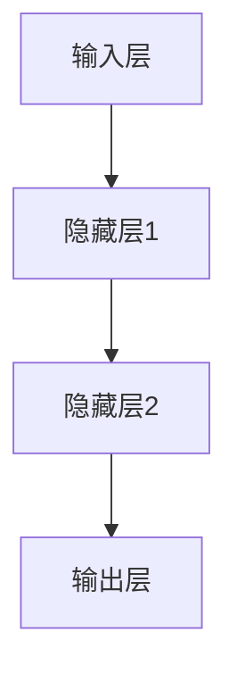
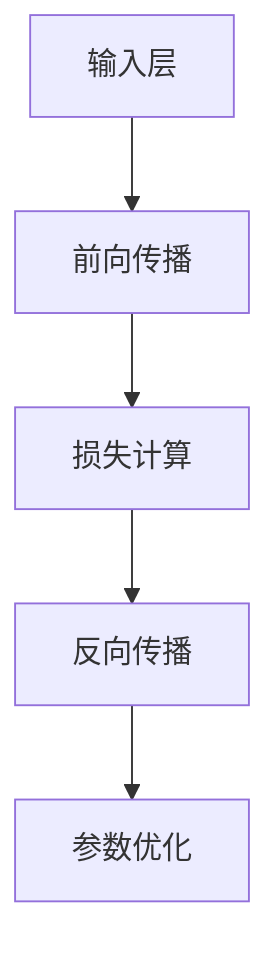
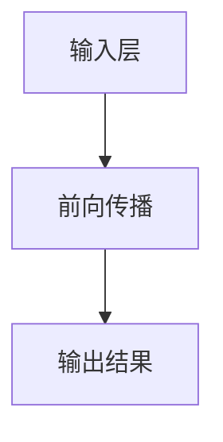
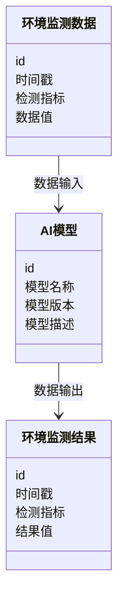
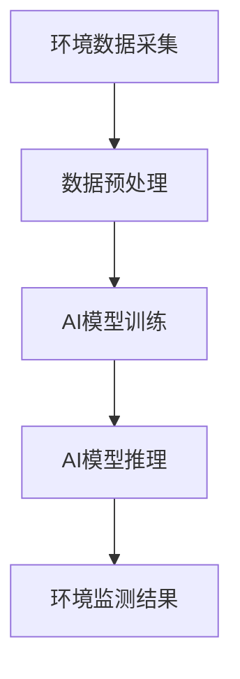
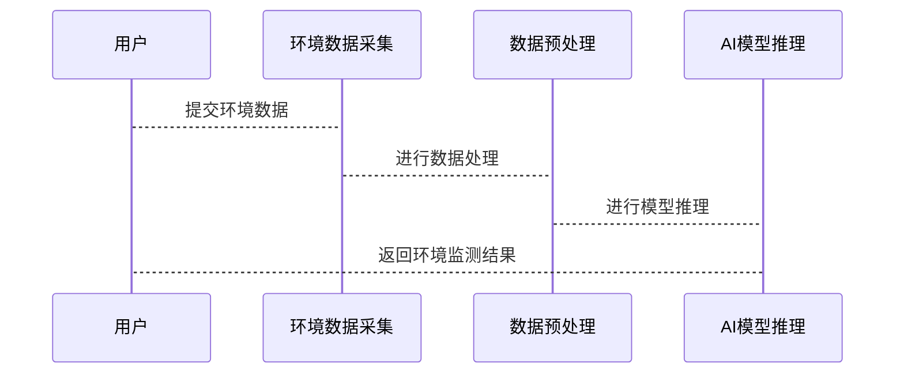

                 


# 《构建企业级AI环境监测助手：合规与可持续发展》

---

## 关键词：  
企业级AI、环境监测、合规、可持续发展、技术架构、系统设计、算法原理、项目实战

---

## 摘要：  
随着人工智能技术的快速发展，企业级AI环境监测助手在合规与可持续发展领域的重要性日益凸显。本文从背景、核心概念、算法原理、系统架构、项目实战等多维度深入分析，为企业级AI环境监测助手的构建提供系统性解决方案。通过详细的技术分析和案例解读，本文旨在帮助读者理解如何在企业环境中高效应用AI技术，确保环境监测的合规性与可持续性。

---

# 第一部分: 企业级AI环境监测助手的背景与核心概念

# 第1章: 问题背景与问题描述

## 1.1 问题背景  
### 1.1.1 企业级AI环境监测的现状  
随着企业对可持续发展的关注不断增加，环境监测已成为企业合规的重要组成部分。AI技术的应用为企业提供了更高效、更精准的环境监测手段。然而，企业在实际应用中面临数据复杂性高、模型泛化能力不足等挑战。  

### 1.1.2 环境监测与AI技术的结合  
AI技术在环境监测中的应用主要集中在数据处理、预测模型构建和异常检测等方面。通过AI技术，企业可以实现对环境数据的实时分析和预测，从而更好地应对环境变化和合规要求。  

### 1.1.3 合规与可持续发展的重要性  
企业需要在环境监测中遵守相关法律法规，同时实现可持续发展目标。AI技术的应用可以帮助企业降低环境监测成本、提高监测效率，从而更好地实现合规与可持续发展。  

## 1.2 问题描述  
### 1.2.1 环境监测中的关键问题  
环境监测涉及多源数据的采集、处理和分析，数据量大、类型复杂。传统方法难以满足企业对实时性和精准性的要求。  

### 1.2.2 AI技术在环境监测中的应用痛点  
AI模型的训练数据不足、模型泛化能力差、环境数据的实时性要求高等问题，限制了AI技术在环境监测中的应用。  

### 1.2.3 合规与可持续发展的具体要求  
企业需要在环境监测中实现数据的实时采集、分析和反馈，并确保数据的准确性和合规性。同时，企业还需要通过环境监测手段实现节能减排、资源优化等可持续发展目标。  

## 1.3 问题解决与边界  
### 1.3.1 AI环境监测助手的目标  
AI环境监测助手的目标是通过AI技术实现对企业环境数据的实时采集、分析和反馈，帮助企业实现环境监测的合规与可持续发展。  

### 1.3.2 边界与外延  
AI环境监测助手的边界主要集中在环境监测数据的采集、处理和分析，不涉及企业的其他业务系统。其外延包括AI技术在环境监测中的具体应用，如预测模型、异常检测等。  

### 1.3.3 核心要素组成  
AI环境监测助手的核心要素包括环境数据采集模块、AI算法模块、合规与可持续发展目标模块等。  

## 1.4 本章小结  
本章通过分析企业级AI环境监测的背景、问题和目标，明确了AI环境监测助手的核心作用和实现路径。  

---

# 第2章: 核心概念与联系  

## 2.1 核心概念原理  
### 2.1.1 环境监测的定义与分类  
环境监测是指对环境要素（如空气质量、水质、噪声等）进行实时或周期性监测的过程。根据监测对象的不同，环境监测可以分为空气监测、水监测、噪声监测等。  

### 2.1.2 AI技术在环境监测中的作用  
AI技术可以通过数据预处理、特征提取、模型训练等步骤，实现环境数据的智能分析和预测。  

### 2.1.3 合规与可持续发展的具体要求  
企业需要在环境监测中遵守相关法律法规，并通过环境监测手段实现节能减排、资源优化等可持续发展目标。  

## 2.2 核心概念属性对比  
以下是对环境监测、AI技术、合规与可持续发展等核心概念的属性对比：  

| 概念       | 属性                       | 描述                                                                 |
|------------|----------------------------|----------------------------------------------------------------------|
| 环境监测   | 数据采集                   | 需要实时采集环境数据                                               |
|            | 数据分析                   | 需要对环境数据进行实时分析和预测                                   |
| AI技术     | 数据处理能力               | 具备高效的数据处理和分析能力                                         |
|            | 模型训练能力               | 可通过训练数据构建预测模型                                         |
| 合规与可持续发展 | 法律法规要求               | 需要遵守相关环境监测法律法规                                         |
|            | 可持续发展目标             | 通过环境监测实现节能减排、资源优化                                   |

## 2.3 ER实体关系图  
以下是一个环境监测系统的ER实体关系图：  

```mermaid
er
    entity 环境监测数据 {
        id
        时间戳
        检测指标
        数据值
    }
    entity AI模型 {
        id
        模型名称
        模型版本
        模型描述
    }
    entity 合规要求 {
        id
        要求名称
        要求内容
    }
    entity 可持续发展目标 {
        id
        目标名称
        目标描述
    }
    relation 环境监测数据 --> AI模型: 数据输入
    relation AI模型 --> 环境监测结果: 数据输出
    relation 合规要求 --> 可持续发展目标: 相关性
```

## 2.4 本章小结  
本章通过对比分析环境监测、AI技术、合规与可持续发展的核心概念，明确了AI环境监测助手在企业中的重要作用和实现路径。  

---

# 第3章: 算法原理与实现  

## 3.1 数据预处理  
### 3.1.1 数据清洗与标准化  
数据清洗是环境监测数据预处理的重要步骤，包括去除噪声、填补缺失值等。标准化是将数据转换为统一格式的过程，有助于模型的训练和分析。  

### 3.1.2 时间序列数据的处理  
环境监测数据通常是时间序列数据，可以通过滑动窗口方法提取特征，并通过LSTM等深度学习模型进行预测。  

### 3.1.3 数据特征提取  
特征提取是环境监测数据处理的关键步骤，可以通过统计方法（如均值、方差）或机器学习方法（如主成分分析）提取特征。  

## 3.2 模型训练与推理  
### 3.2.1 神经网络模型的构建  
以下是一个简单的神经网络模型结构示意图：  



### 3.2.2 模型训练过程  
模型训练过程包括数据输入、前向传播、损失计算、反向传播和参数优化等步骤。以下是一个简单的训练流程图：  



### 3.2.3 模型推理与预测  
模型推理是通过已训练好的模型对新的环境数据进行预测的过程。以下是一个简单的推理流程图：  



## 3.3 代码实现  
以下是一个简单的AI环境监测助手的代码实现示例：  

```python
import numpy as np
import pandas as pd
from sklearn.model_selection import train_test_split
from sklearn.linear_model import LinearRegression

# 数据加载
data = pd.read_csv('environment_data.csv')

# 数据分割
X = data[['温度', '湿度', '污染物浓度']]
y = data['环境指数']

X_train, X_test, y_train, y_test = train_test_split(X, y, test_size=0.2, random_state=42)

# 模型训练
model = LinearRegression()
model.fit(X_train, y_train)

# 模型预测
y_pred = model.predict(X_test)

# 模型评估
score = model.score(X_test, y_test)
print(f'模型得分：{score}')
```

---

# 第4章: 系统分析与架构设计  

## 4.1 问题场景介绍  
企业级AI环境监测助手需要实现对企业环境数据的实时采集、分析和反馈，并确保数据的合规性和可持续性。  

## 4.2 系统功能设计  
### 4.2.1 领域模型  
以下是一个简单的领域模型类图：  



### 4.2.2 系统架构设计  
以下是一个简单的系统架构图：  



### 4.2.3 接口设计  
系统需要提供以下接口：  
- 数据采集接口：用于实时采集环境数据。  
- 数据分析接口：用于对环境数据进行分析和预测。  
- 结果反馈接口：用于将环境监测结果反馈给企业系统。  

### 4.2.4 交互设计  
以下是一个简单的交互序列图：  



## 4.3 本章小结  
本章通过系统分析和架构设计，明确了AI环境监测助手的实现路径和系统结构。  

---

# 第5章: 项目实战  

## 5.1 环境安装与配置  
### 5.1.1 系统环境要求  
- 操作系统：Linux/Windows/MacOS  
- Python版本：3.6+  
- 依赖库：numpy、pandas、scikit-learn、mermaid等  

### 5.1.2 安装步骤  
```bash
pip install numpy pandas scikit-learn mermaid
```

## 5.2 系统核心实现  
### 5.2.1 数据采集模块  
```python
import pandas as pd
import requests

def fetch_environment_data():
    response = requests.get('http://localhost:8000/environment_data')
    data = response.json()
    return pd.DataFrame(data)
```

### 5.2.2 数据分析模块  
```python
from sklearn.linear_model import LinearRegression

def train_model(X_train, y_train):
    model = LinearRegression()
    model.fit(X_train, y_train)
    return model
```

### 5.2.3 环境监测结果反馈  
```python
def feedback_results(results):
    print(f'环境监测结果：{results}')
```

## 5.3 代码实现与解读  
以下是一个完整的AI环境监测助手的代码实现示例：  

```python
import pandas as pd
import requests
from sklearn.model_selection import train_test_split
from sklearn.linear_model import LinearRegression

def fetch_environment_data():
    response = requests.get('http://localhost:8000/environment_data')
    data = response.json()
    return pd.DataFrame(data)

def train_model(X_train, y_train):
    model = LinearRegression()
    model.fit(X_train, y_train)
    return model

def main():
    data = fetch_environment_data()
    X = data[['温度', '湿度', '污染物浓度']]
    y = data['环境指数']
    X_train, X_test, y_train, y_test = train_test_split(X, y, test_size=0.2, random_state=42)
    model = train_model(X_train, y_train)
    y_pred = model.predict(X_test)
    print(f'模型得分：{model.score(X_test, y_test)}')
    print(f'预测结果：{y_pred}')

if __name__ == '__main__':
    main()
```

## 5.4 案例分析与详细解读  
以下是一个实际案例的分析与解读：  
假设企业需要监测空气质量，包括温度、湿度、PM2.5等指标。通过AI环境监测助手，企业可以实现对空气质量的实时监测和预测，从而更好地应对环境变化和合规要求。  

## 5.5 本章小结  
本章通过实际项目案例的分析和代码实现，验证了AI环境监测助手的可行性和实用性。  

---

# 第6章: 最佳实践与总结  

## 6.1 最佳实践 tips  
### 6.1.1 数据质量管理  
确保环境数据的准确性和完整性是AI环境监测助手实现的关键。  

### 6.1.2 模型优化与维护  
定期对AI模型进行优化和维护，确保模型的准确性和稳定性。  

### 6.1.3 系统安全性与合规性  
确保AI环境监测系统的安全性与合规性，避免数据泄露和违规操作。  

## 6.2 小结  
本文从背景、核心概念、算法原理、系统架构、项目实战等多维度深入分析了企业级AI环境监测助手的构建过程。  

## 6.3 注意事项  
企业在实际应用中需要注意数据隐私、模型泛化能力、系统稳定性等问题。  

## 6.4 拓展阅读  
推荐读者阅读以下书籍和论文：  
- 《机器学习实战》  
- 《深度学习》  
- 《环境监测技术与应用》  

---

# 《构建企业级AI环境监测助手：合规与可持续发展》  

通过本文的详细分析和实际案例的解读，企业可以更好地理解AI环境监测助手的构建与应用。希望本文能够为企业在合规与可持续发展领域的技术实践提供有价值的参考与指导。

