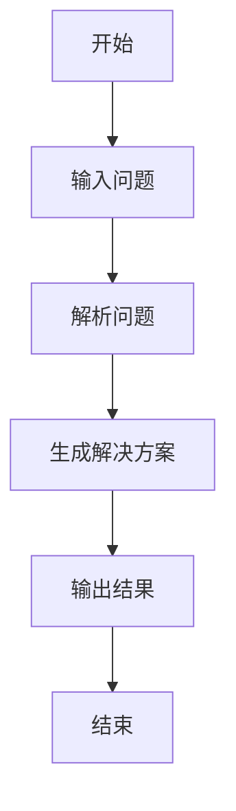
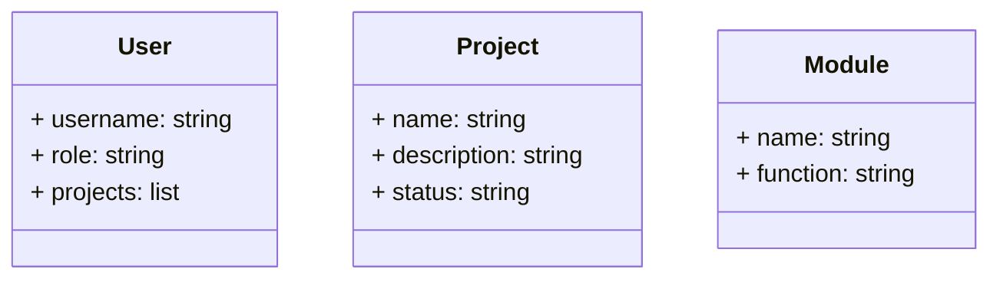
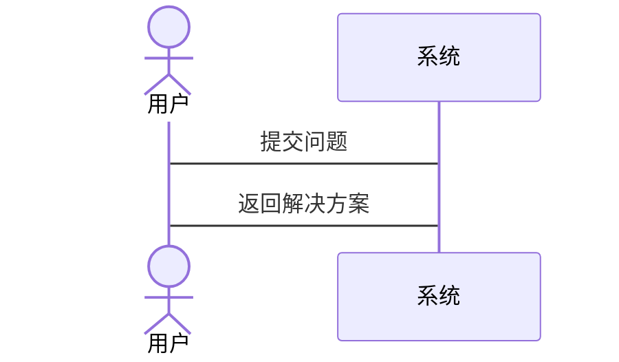

                 


# 构建企业级AI研发助手：加速创新与专利申请

## 关键词：企业级AI研发助手，AI研发，专利申请，创新加速，系统架构，算法原理，项目实战

## 摘要：  
本文详细探讨了如何构建一个高效的企业级AI研发助手，以加速企业的创新过程并促进专利申请。文章首先介绍了AI研发的重要性及其在企业中的应用背景，随后深入分析了企业级AI研发助手的核心概念、算法原理、系统架构以及项目实战。通过结合实际案例和最佳实践，文章为企业提供了从理论到实践的全面指导，帮助企业在AI研发和专利申请方面实现高效管理和创新突破。

---

# 正文

## 第1章: 企业级AI研发助手的背景与问题背景

### 1.1 AI研发的重要性

#### 1.1.1 AI在现代企业中的作用
人工智能（AI）技术正在迅速改变企业的运作方式。从数据分析、决策支持到自动化流程，AI的应用帮助企业提升了效率、优化了资源分配，并推动了创新。特别是在技术研发领域，AI不仅能够辅助科学家和工程师，还能通过自动化工具加速从灵感到成果的转化。

#### 1.1.2 企业级AI研发的必要性
随着市场竞争的加剧，企业需要更快地将创新想法转化为实际成果。AI研发助手能够为企业提供智能化的支持，从问题分析、解决方案生成到专利申请，全流程助力企业的研发工作。

#### 1.1.3 当前AI研发面临的挑战
尽管AI技术发展迅速，但在企业级应用中仍面临诸多挑战，如数据孤岛、工具分散、效率低下等问题。这些问题不仅影响了研发进度，还增加了专利申请的复杂性。

### 1.2 问题背景与问题描述

#### 1.2.1 AI研发中的主要问题
企业在AI研发过程中常常面临以下问题：
- 数据分散，难以整合和分析。
- 研发工具繁多，操作复杂，缺乏统一的管理平台。
- 知识产权保护不足，专利申请效率低下。

#### 1.2.2 企业级AI研发的独特挑战
企业级AI研发需要考虑的因素包括：
- 数据安全与隐私保护。
- 多部门协作的高效性。
- 知识产权的全球化布局。

#### 1.2.3 问题解决的目标与边界
构建企业级AI研发助手的目标是：
- 提供统一的研发平台，整合资源。
- 优化研发流程，提升效率。
- 自动化处理专利申请，确保知识产权保护。

### 1.3 问题的解决思路

#### 1.3.1 从问题中提取关键要素
关键要素包括：
- 数据整合与分析。
- 统一的研发平台。
- 专利申请的自动化。

#### 1.3.2 构建解决方案的框架
解决方案框架包括：
1. 数据采集与处理模块。
2. AI研发工具集成模块。
3. 知识产权管理模块。

#### 1.3.3 解决方案的可行性分析
通过技术可行性分析、成本效益分析和用户需求分析，确保解决方案的可行性和实用性。

### 1.4 本章小结
本章分析了AI研发在企业中的重要性，指出了当前面临的挑战，并提出了构建企业级AI研发助手的目标和初步解决方案框架。

---

## 第2章: 企业级AI研发助手的核心概念

### 2.1 核心概念的定义

#### 2.1.1 企业级AI研发助手的定义
企业级AI研发助手是一个智能化平台，旨在通过整合企业内外部资源，提供从问题分析到解决方案生成的全流程支持，并协助专利申请。

#### 2.1.2 助手的核心功能模块
核心功能模块包括：
- 数据采集与分析模块。
- AI模型训练模块。
- 知识产权管理模块。

#### 2.1.3 助手与传统工具的区别
与传统工具相比，AI研发助手具有智能化、自动化和集成化的特点。

### 2.2 核心概念的属性特征对比

#### 2.2.1 功能模块对比
| 功能模块         | 传统工具         | AI研发助手       |
|------------------|------------------|------------------|
| 数据处理         | 单一功能         | 集成化处理         |
| 模型训练         | 手动操作         | 自动化训练         |
| 专利申请         | 独立流程         | 整合管理         |

#### 2.2.2 性能指标对比
| 指标             | 传统工具         | AI研发助手       |
|------------------|------------------|------------------|
| 处理速度         | 较慢             | 显著提升         |
| 精确率           | 低               | 高               |

#### 2.2.3 使用场景对比
传统工具主要用于单一任务，而AI研发助手适用于从研发到专利申请的全场景。

### 2.3 ER实体关系图

```mermaid
er
actor: 用户
assistant: 企业级AI研发助手
module: 核心功能模块
problem: 待解决的问题
solution: 解决方案
```

### 2.4 本章小结
本章详细定义了企业级AI研发助手的核心概念，并通过对比分析突出了其独特优势。

---

## 第3章: 企业级AI研发助手的算法原理

### 3.1 算法原理概述

#### 3.1.1 算法的基本原理
AI研发助手的核心算法包括自然语言处理（NLP）、机器学习（ML）和数据挖掘技术。

#### 3.1.2 算法的核心步骤
1. 数据预处理。
2. 模型训练。
3. 解决方案生成。

#### 3.1.3 算法的优化方向
通过优化算法结构和参数，提升计算效率和准确性。

### 3.2 算法流程图



### 3.3 算法的数学模型

#### 3.3.1 基础模型
$$ y = f(x) $$

#### 3.3.2 优化模型
$$ f(x) = ax + b $$

### 3.4 算法的实现代码

```python
def algorithm(input):
    # 解析问题
    problem = parse(input)
    # 生成解决方案
    solution = generate_solution(problem)
    # 输出结果
    return solution
```

### 3.5 本章小结
本章详细讲解了AI研发助手的核心算法原理，并通过流程图和代码示例展示了其实现过程。

---

## 第4章: 企业级AI研发助手的系统架构设计

### 4.1 系统功能设计

#### 4.1.1 领域模型类图



#### 4.1.2 系统架构设计图


### 4.2 系统接口设计

#### 4.2.1 API接口定义
- 输入接口：用户提交问题。
- 输出接口：系统返回解决方案。

#### 4.2.2 接口实现代码

```python
class API:
    def submit_problem(self, problem):
        # 处理问题
        solution = self.generate_solution(problem)
        return solution

    def generate_solution(self, problem):
        # 简单实现
        return f"Solution for {problem}"
```

### 4.3 系统交互流程

#### 4.3.1 交互流程图



### 4.4 本章小结
本章详细设计了企业级AI研发助手的系统架构，并通过类图和流程图展示了系统的模块交互。

---

## 第5章: 企业级AI研发助手的项目实战

### 5.1 项目环境安装

#### 5.1.1 安装Python
```bash
python --version
pip install --upgrade pip
```

#### 5.1.2 安装依赖库
```bash
pip install numpy pandas scikit-learn
```

### 5.2 系统核心实现

#### 5.2.1 数据预处理代码

```python
import pandas as pd

def preprocess_data(data):
    # 数据清洗
    cleaned_data = data.dropna()
    return cleaned_data
```

#### 5.2.2 模型训练代码

```python
from sklearn.model_selection import train_test_split
from sklearn.linear_model import LinearRegression

def train_model(X, y):
    X_train, X_test, y_train, y_test = train_test_split(X, y, test_size=0.2)
    model = LinearRegression()
    model.fit(X_train, y_train)
    return model
```

### 5.3 代码应用解读

#### 5.3.1 数据预处理解读
数据预处理是AI研发的关键步骤，通过去除缺失值和异常值，确保数据质量。

#### 5.3.2 模型训练解读
模型训练是AI研发的核心，通过机器学习算法，生成解决问题的模型。

### 5.4 案例分析与详细讲解

#### 5.4.1 案例背景
假设我们正在研发一个新的AI算法，用于优化企业的生产流程。

#### 5.4.2 案例实现
```python
data = pd.read_csv('data.csv')
cleaned_data = preprocess_data(data)
model = train_model(cleaned_data[['feature1', 'feature2']], cleaned_data['target'])
```

### 5.5 项目小结
本章通过实际案例，详细讲解了企业级AI研发助手的实现过程，并提供了代码示例和解读。

---

## 第6章: 企业级AI研发助手的最佳实践与总结

### 6.1 最佳实践 tips

#### 6.1.1 数据管理
- 确保数据安全和隐私保护。
- 定期备份数据。

#### 6.1.2 系统维护
- 定期更新系统和模型。
- 监控系统性能。

### 6.2 小结

#### 6.2.1 核心知识点回顾
- 企业级AI研发助手的重要性。
- 系统架构设计的关键点。
- 项目实战的实现步骤。

### 6.3 注意事项

#### 6.3.1 数据安全
- 避免数据泄露。
- 遵守相关法律法规。

#### 6.3.2 系统性能
- 优化算法性能。
- 提升用户体验。

### 6.4 拓展阅读

#### 6.4.1 推荐书籍
- 《机器学习实战》
- 《Python编程：从入门到实践》

#### 6.4.2 推荐博客
- 人工智能领域的技术博客。
- 开源项目社区。

### 6.5 本章小结
本章总结了企业级AI研发助手的核心内容，并提供了实用的建议和拓展资源。

---

## 第7章: 企业级AI研发助手的未来展望

### 7.1 未来发展趋势
AI技术的不断发展将推动企业级研发助手向更智能化、更个性化的方向发展。

### 7.2 技术创新点
- 更先进的算法。
- 更强大的数据处理能力。
- 更高效的专利申请流程。

### 7.3 挑战与机遇
随着技术的进步，企业将面临更多挑战，同时也将迎来更多机遇。

### 7.4 本章小结
本章展望了企业级AI研发助手的未来发展，并指出了技术创新的方向和面临的挑战。

---

## 附录: 企业级AI研发助手的数学公式总结

### 附录1: 常用数学公式

#### 1. 机器学习中的线性回归
$$ y = \beta_0 + \beta_1 x + \epsilon $$

#### 2. 神经网络中的激活函数
$$ f(x) = \frac{1}{1 + e^{-x}} $$

### 附录2: 参考文献
1. 《机器学习实战》
2. 《Python编程：从入门到实践》
3. TensorFlow官方文档

---

## 结语

企业级AI研发助手的构建是一个复杂而重要的任务，它不仅能够提升企业的研发效率，还能加速创新并保护知识产权。通过本文的详细讲解，读者可以全面了解构建该助手的核心概念、算法原理和系统架构，并通过实际案例掌握其应用方法。未来，随着技术的不断进步，企业级AI研发助手将在更多领域发挥重要作用。

--- 

如果您觉得文章内容对您有所帮助，请点赞、收藏、分享、评论！您的支持是我持续创作的最大动力！

