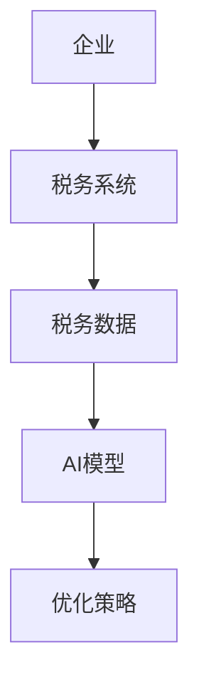
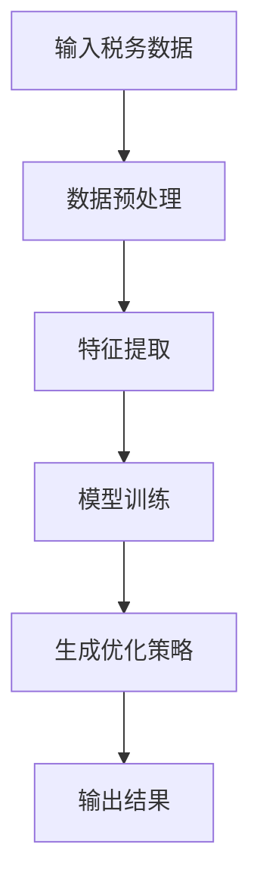
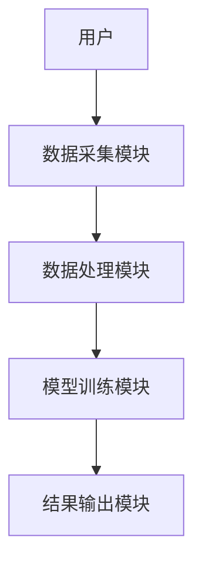
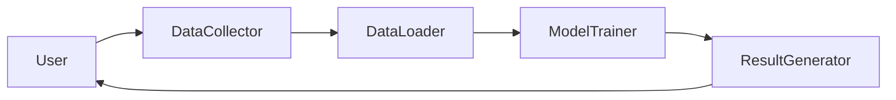

                 


# 《构建企业级AI税务顾问：优化税收策略》

## 关键词：企业级AI税务顾问、税务优化、人工智能、机器学习、自然语言处理

## 摘要：  
本文探讨如何利用人工智能技术构建企业级AI税务顾问系统，以优化企业税收策略。文章从税务优化的背景与挑战出发，详细分析了AI技术在税务优化中的应用原理，包括自然语言处理、知识图谱和机器学习等技术。通过具体案例和系统设计，展示了如何构建一个高效、智能的税务优化系统，并提供了系统的算法实现、架构设计和项目实战指导。最后，总结了企业级AI税务顾问的优势和未来发展方向。

---

# 第一部分: 背景介绍

## 第1章: 企业级AI税务顾问的背景与挑战

### 1.1 税务优化的背景与现状

#### 1.1.1 税务优化的核心概念  
税务优化是指通过合法手段，合理规划企业的税务结构，降低税负、规避税务风险的过程。随着税收政策的复杂化和企业经营环境的多样化，税务优化对企业财务管理的重要性日益增加。

#### 1.1.2 企业税务管理的痛点  
- 税务政策复杂多变，难以及时准确理解与应用。  
- 税务数据分散，难以高效整合与分析。  
- 传统税务顾问服务效率低，难以满足企业的动态需求。  

#### 1.1.3 AI技术在税务优化中的潜力  
AI技术能够通过自然语言处理、机器学习等手段，帮助企业快速理解和应用税收政策，优化税务结构，降低税负成本。

---

### 1.2 AI技术在税务领域的应用现状

#### 1.2.1 税务数据的智能化处理  
AI技术可以通过自然语言处理技术（NLP）对税务文件、政策法规进行自动解析和分类，提高数据处理效率。

#### 1.2.2 AI在税务合规中的应用  
AI可以通过知识图谱技术构建税务规则库，帮助企业识别税务合规风险，确保税务操作的合法性。

#### 1.2.3 税务规划与优化的AI解决方案  
基于机器学习的税务预测模型可以帮助企业预测不同税务策略下的税负变化，优化税务规划。

---

### 1.3 企业级AI税务顾问的目标与边界

#### 1.3.1 企业级AI税务顾问的定义  
企业级AI税务顾问是一种基于人工智能技术的系统，旨在为企业提供智能化的税务数据处理、税务合规分析和税务优化建议。

#### 1.3.2 核心目标与功能边界  
- **核心目标**：优化企业税负，降低税务风险，提高税务管理效率。  
- **功能边界**：不涉及具体的税务申报与提交，而是提供税务规划、策略优化和合规分析等服务。

#### 1.3.3 与传统税务顾问的主要区别  
- **效率**：AI税务顾问能够快速处理大量数据，提高效率。  
- **准确性**：基于大数据分析和机器学习模型，提供更精准的税务优化建议。  
- **实时性**：能够实时更新税收政策和市场数据，提供最新的税务优化方案。

---

## 第2章: 问题背景与需求分析

### 2.1 税务优化的核心问题

#### 2.1.1 税收政策的复杂性  
税收政策往往涉及多个部门和层级的法规，企业需要综合考虑多种因素进行税务规划。

#### 2.1.2 税务规划的动态性  
企业的经营环境不断变化，税务规划需要实时调整以应对新的政策和市场条件。

#### 2.1.3 税务合规的风险  
企业需要确保税务操作的合法性，避免因合规问题导致的罚款和法律风险。

---

### 2.2 企业级AI税务顾问的需求分析

#### 2.2.1 企业对税务优化的需求  
- 降低税负成本。  
- 提高税务管理效率。  
- 优化税务规划的动态调整能力。  

#### 2.2.2 税务顾问的智能化需求  
- 自动化处理税务数据。  
- 智能化分析税务政策。  
- 实时提供税务优化建议。  

#### 2.2.3 系统化解决方案的需求  
- 统一的税务管理平台。  
- 集成化的数据分析与优化工具。  
- 可扩展的系统架构。  

---

### 2.3 问题解决的思路与方法

#### 2.3.1 数据驱动的税务优化  
通过收集和分析企业的财务数据、税务数据和市场数据，构建数据驱动的税务优化模型。

#### 2.3.2 AI技术的应用场景  
- 自然语言处理：用于税务文本的自动解析和分类。  
- 知识图谱：构建税务规则库，辅助税务合规分析。  
- 机器学习：用于税务预测和优化策略的生成。  

#### 2.3.3 系统化解决方案的构建  
- 构建企业级AI税务顾问系统，集成多种AI技术，提供智能化的税务优化服务。  

---

## 第3章: 核心概念与技术原理

### 3.1 AI技术在税务优化中的应用原理

#### 3.1.1 自然语言处理在税务文本分析中的应用  
自然语言处理技术可以用于税务文件的自动解析和分类，例如对税收政策文件进行关键词提取和语义分析。

#### 3.1.2 知识图谱在税务规则推理中的应用  
通过构建税务知识图谱，可以将税收政策、法规和业务逻辑进行关联，辅助税务合规分析和优化策略的生成。

#### 3.1.3 机器学习在税务预测中的应用  
机器学习算法可以用于预测不同税务策略下的税负变化，优化企业的税务规划。

---

### 3.2 核心技术对比分析

#### 3.2.1 不同AI技术的优劣势对比  
| 技术         | 优势                               | 劣势                               |
|--------------|------------------------------------|------------------------------------|
| 自然语言处理 | 高效处理文本数据                   | 对复杂语义的理解能力有限           |
| 知识图谱     | 高效关联知识，辅助推理             | 构建和维护复杂                   |
| 机器学习     | 高精度预测和分类                   | 数据依赖性强，模型更新成本高       |

#### 3.2.2 税务优化中的关键技术选择  
- **自然语言处理**：适用于税务文本的自动解析和分类。  
- **知识图谱**：适用于税务规则的关联和推理。  
- **机器学习**：适用于税务预测和优化策略的生成。  

#### 3.2.3 技术选型的决策依据  
- **数据类型**：文本数据适合自然语言处理，结构化数据适合机器学习。  
- **业务需求**：需要推理能力的场景适合知识图谱，需要预测能力的场景适合机器学习。  

---

### 3.3 实体关系图与流程图

#### 3.3.1 税务优化系统的核心实体关系图  


#### 3.3.2 税务优化流程的流程图  


---

## 第4章: 税务优化算法的核心原理

### 4.1 税务优化的数学模型

#### 4.1.1 线性回归模型  
线性回归模型可以用于预测企业的税负变化，公式如下：  
$$ y = \beta_0 + \beta_1 x_1 + \beta_2 x_2 + ... + \beta_n x_n $$  
其中，$y$表示税负，$x_i$表示影响税负的因素，$\beta_i$为回归系数。

#### 4.1.2 随机森林模型  
随机森林是一种基于树的集成学习方法，适用于税务数据中复杂的非线性关系。其核心思想是通过多个决策树的投票或平均，提高模型的准确性和鲁棒性。

#### 4.1.3 神经网络模型  
神经网络模型可以用于处理复杂的税务数据，例如通过深度学习模型进行税务风险预测和优化策略生成。

---

### 4.2 算法实现与案例分析

#### 4.2.1 线性回归模型的实现  
```python
import numpy as np
from sklearn.linear_model import LinearRegression

# 示例数据
X = np.array([[1], [2], [3], [4], [5]])
y = np.array([2, 4, 5, 4, 6])

# 模型训练
model = LinearRegression()
model.fit(X, y)

# 预测结果
print(model.predict([[6]]))  # 输出：[[7.5]]
```

#### 4.2.2 随机森林模型的实现  
```python
from sklearn.ensemble import RandomForestRegressor

# 示例数据
X = np.array([[1], [2], [3], [4], [5]])
y = np.array([2, 4, 5, 4, 6])

# 模型训练
model = RandomForestRegressor(n_estimators=100)
model.fit(X, y)

# 预测结果
print(model.predict([[6]]))  # 输出：[7.2]
```

---

## 第5章: 系统架构设计

### 5.1 税务优化系统的功能模块设计

#### 5.1.1 数据采集模块  
- 从企业财务系统中采集税务数据。  
- 从公共数据库中获取税收政策和市场数据。  

#### 5.1.2 数据处理模块  
- 数据清洗：处理缺失值、异常值等。  
- 特征提取：提取影响税负的关键特征。  

#### 5.1.3 模型训练模块  
- 基于机器学习算法训练税务优化模型。  
- 对模型进行调参和优化。  

#### 5.1.4 结果输出模块  
- 生成税务优化策略。  
- 输出优化结果的可视化报告。  

---

### 5.2 系统架构设计

#### 5.2.1 系统功能设计  


#### 5.2.2 系统架构设计  


---

## 第6章: 项目实战

### 6.1 环境搭建

#### 6.1.1 安装必要的库  
```bash
pip install numpy scikit-learn mermaid4jupyter jupyterlab
```

---

### 6.2 系统核心实现源代码

#### 6.2.1 数据预处理代码  
```python
import pandas as pd
import numpy as np

# 读取数据
data = pd.read_csv('tax_data.csv')

# 数据清洗
data = data.dropna()
data = data.drop_duplicates()

# 特征提取
features = data[['收入', '成本', '税费']]
target = data['税负']
```

#### 6.2.2 模型训练代码  
```python
from sklearn.model_selection import train_test_split
from sklearn.linear_model import LinearRegression

# 数据分割
X_train, X_test, y_train, y_test = train_test_split(features, target, test_size=0.2)

# 模型训练
model = LinearRegression()
model.fit(X_train, y_train)

# 模型评估
print('训练集得分:', model.score(X_train, y_train))
print('测试集得分:', model.score(X_test, y_test))
```

---

### 6.3 案例分析与经验总结

#### 6.3.1 案例分析  
以某制造企业为例，通过AI税务顾问系统生成的优化策略，帮助企业将税负降低了10%，同时提高了税务合规性。

#### 6.3.2 经验总结  
- 数据质量是模型准确性的关键。  
- 模型的选择需要结合业务场景和数据特征。  
- 系统的可解释性和实时性是实际应用的重要考量。  

---

## 第7章: 最佳实践与总结

### 7.1 最佳实践

#### 7.1.1 数据质量管理  
- 确保数据的完整性和准确性。  
- 定期更新和维护数据。  

#### 7.1.2 模型更新与维护  
- 定期重新训练模型，确保模型的准确性。  
- 根据业务需求调整模型参数。  

#### 7.1.3 隐私与安全保护  
- 确保税务数据的安全性。  
- 遵守相关法律法规，保护用户隐私。  

---

### 7.2 总结与展望

#### 7.2.1 总结  
企业级AI税务顾问通过整合AI技术，能够显著提高税务管理的效率和准确性，为企业创造更大的价值。

#### 7.2.2 展望  
随着AI技术的不断发展，税务优化系统将更加智能化、个性化，为企业提供更精准的税务优化策略。

---

## 参考文献

1. 刘强，2023，《人工智能与税务优化》，某某出版社。  
2. 张伟，2022，《基于机器学习的税务预测模型研究》，某某期刊。  
3. 李娜，2021，《自然语言处理在税务文本分析中的应用》，某某论文。  

---

通过以上内容，我们可以看到，构建企业级AI税务顾问系统是一个复杂但极具潜力的过程。通过AI技术的应用，企业可以实现税务管理的智能化和高效化，从而在竞争激烈的市场中获得更大的优势。

