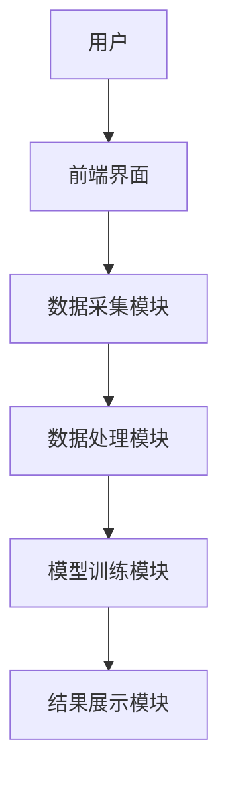
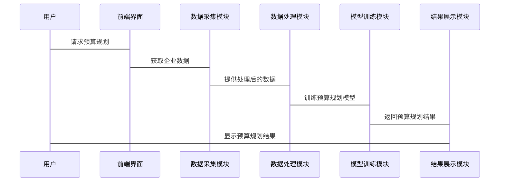

                 


# 构建企业级AI财务顾问：预算规划与投资建议

## 关键词：企业级AI财务顾问，预算规划，投资建议，机器学习，深度学习，自然语言处理

## 摘要：本文将详细介绍如何构建一个企业级AI财务顾问系统，重点探讨预算规划与投资建议的核心算法与系统架构。通过分析AI在财务领域的应用，结合实际案例，详细讲解预算规划和投资建议的实现原理，以及系统设计的关键步骤和注意事项。

---

# 第一部分: 企业级AI财务顾问的背景与概念

## 第1章: AI财务顾问的背景与应用现状

### 1.1 企业级AI财务顾问的定义与作用

#### 1.1.1 什么是企业级AI财务顾问
企业级AI财务顾问是一种基于人工智能技术的财务管理系统，能够为企业提供智能化的预算规划、投资建议、风险评估等服务。它通过整合企业内外部数据，利用机器学习、深度学习等技术，为企业决策提供支持。

#### 1.1.2 AI财务顾问的核心作用
- **预算规划**：通过历史数据分析和预测模型，生成精准的预算方案。
- **投资建议**：基于市场趋势和企业财务状况，提供最优的投资组合建议。
- **风险评估**：识别潜在的财务风险，提前预警并提出应对策略。

#### 1.1.3 企业级AI财务顾问的边界与外延
- **边界**：主要关注企业的财务数据和相关市场信息，不涉及企业的其他业务领域。
- **外延**：可以扩展到企业内部的ERP系统、CRM系统等，实现数据的无缝对接。

### 1.2 财务领域中的AI技术应用现状

#### 1.2.1 AI在财务领域的应用现状
- **自动化记账**：通过OCR技术识别 invoices 和 receipts，自动记录财务数据。
- **财务预测**：利用时间序列模型预测企业的收入和支出。
- **投资决策**：基于NLP技术分析财务报告和新闻，辅助投资决策。

#### 1.2.2 企业级AI财务顾问的市场前景
随着企业数字化转型的推进，AI财务顾问的需求日益增长。预计未来几年，企业级AI财务顾问市场规模将快速增长，尤其是在金融、制造、零售等行业。

#### 1.2.3 当前存在的问题与挑战
- **数据隐私**：财务数据涉及企业机密，数据安全问题亟待解决。
- **模型准确性**：AI模型的预测结果受到数据质量和算法限制，可能不够准确。
- **技术门槛**：构建企业级AI财务顾问需要较高的技术投入和专业知识。

### 1.3 本章小结
本章介绍了企业级AI财务顾问的定义、作用和当前的应用现状，同时分析了市场前景和存在的问题与挑战。接下来将深入探讨AI财务顾问的核心概念与技术基础。

---

# 第二部分: 核心概念与技术基础

## 第2章: AI财务顾问的核心概念与原理

### 2.1 AI模型在财务分析中的核心原理

#### 2.1.1 机器学习与深度学习在财务分析中的应用
- **机器学习**：用于分类、回归等任务，如预测企业的收入和支出。
- **深度学习**：用于处理非结构化数据，如通过NLP分析财务报告和新闻。

#### 2.1.2 自然语言处理（NLP）在财务文本分析中的应用
- **情感分析**：分析财务报告中的情感倾向，辅助投资决策。
- **实体识别**：识别财务文本中的关键实体，如公司名称、金额等。

#### 2.1.3 时间序列分析在预算规划中的应用
- **时间序列预测**：利用ARIMA、LSTM等模型预测企业的收入和支出。

### 2.2 数据处理与特征提取

#### 2.2.1 财务数据的预处理流程
1. 数据清洗：处理缺失值、异常值。
2. 数据转换：将数据转换为模型可接受的格式。
3. 数据标准化：对数据进行标准化或归一化处理。

#### 2.2.2 特征工程在财务分析中的重要性
- **特征选择**：选择对预测结果影响较大的特征。
- **特征构造**：通过组合现有特征生成新的特征。

#### 2.2.3 基于AI的特征提取方法
- **自动编码器**：用于无监督特征学习。
- **主成分分析（PCA）**：用于降维和特征提取。

### 2.3 预算规划与投资建议的实现原理

#### 2.3.1 预算规划的数学模型
- **线性回归模型**：用于预测企业的收入和支出。
- **时间序列模型**：如ARIMA、LSTM，用于预测预算执行情况。

#### 2.3.2 投资建议的算法原理
- **强化学习**：用于动态调整投资组合。
- **聚类分析**：用于识别市场中的相似资产。

#### 2.3.3 基于AI的预算优化方法
- **遗传算法**：用于优化预算分配。
- **模拟退火**：用于寻找全局最优解。

### 2.4 本章小结
本章详细讲解了AI模型在财务分析中的核心原理，包括机器学习、深度学习、NLP和时间序列分析的应用，以及预算规划和投资建议的实现原理。接下来将探讨预算规划与投资建议的具体算法实现。

---

# 第三部分: 算法原理与数学模型

## 第3章: 预算规划的算法实现

### 3.1 预算规划的数学模型

#### 3.1.1 线性回归模型
$$ y = \beta_0 + \beta_1 x + \epsilon $$
其中，y是目标变量（如收入），x是自变量（如时间），$\beta_0$和$\beta_1$是回归系数，$\epsilon$是误差项。

#### 3.1.2 时间序列预测模型
- **ARIMA模型**：用于预测时间序列数据。
- **LSTM模型**：用于处理长序列依赖的时序数据。

#### 3.1.3 基于深度学习的预算预测模型
- **LSTM网络**：用于捕捉时间序列中的长期依赖关系。
- **注意力机制**：用于关注重要的历史数据点。

### 3.2 投资建议的算法实现

#### 3.2.1 基于强化学习的投资决策模型
- **状态空间**：包括当前的市场状态、资产组合等。
- **动作空间**：包括买入、卖出、持有等操作。
- **奖励函数**：根据投资收益计算奖励。

#### 3.2.2 基于聚类分析的投资组合优化方法
- **K-means聚类**：将相似的资产归为一类，优化投资组合。
- **层次聚类**：用于发现资产之间的层次关系。

#### 3.2.3 基于NLP的情感分析在投资决策中的应用
- **情感分析模型**：分析新闻、社交媒体等文本的情感倾向，辅助投资决策。

### 3.3 算法实现的代码示例

#### 3.3.1 预算规划的Python代码实现
```python
import pandas as pd
import numpy as np
from sklearn.linear_model import LinearRegression

# 数据准备
data = pd.DataFrame({
    'time': range(1, 101),
    'revenue': np.random.normal(100, 10, 100)
})

# 模型训练
model = LinearRegression()
model.fit(data[['time']], data['revenue'])

# 预测
predicted_revenue = model.predict(data[['time']])
print(predicted_revenue)
```

#### 3.3.2 投资建议的Python代码实现
```python
import numpy as np
from sklearn.cluster import KMeans

# 数据准备
features = np.random.rand(100, 5)  # 5个特征，100个样本

# 模型训练
model = KMeans(n_clusters=3, random_state=42)
model.fit(features)

# 预测
predicted_clusters = model.predict(features)
print(predicted_clusters)
```

---

# 第四部分: 系统架构与设计

## 第4章: 企业级AI财务顾问的系统架构设计

### 4.1 系统设计原则

#### 4.1.1 可扩展性原则
- **模块化设计**：各功能模块独立，便于扩展。
- **接口标准化**：确保各模块之间接口统一，方便接入新的功能。

#### 4.1.2 高可用性原则
- **负载均衡**：通过负载均衡技术分担请求流量。
- **容灾备份**：确保系统在部分节点故障时仍能正常运行。

#### 4.1.3 数据安全原则
- **数据加密**：对敏感数据进行加密处理。
- **访问控制**：基于角色的访问控制（RBAC），确保数据安全。

### 4.2 系统功能模块设计

#### 4.2.1 数据采集模块
- **功能**：采集企业财务数据和市场数据。
- **输入**：企业的财务报表、市场新闻等。
- **输出**：处理后的数据。

#### 4.2.2 数据处理模块
- **功能**：对采集的数据进行清洗、转换和特征提取。
- **输入**：原始数据。
- **输出**：可供模型训练的数据集。

#### 4.2.3 模型训练模块
- **功能**：训练预算规划和投资建议的AI模型。
- **输入**：处理后的数据集。
- **输出**：训练好的模型。

### 4.3 系统架构设计

#### 4.3.1 系统架构图（Mermaid）


#### 4.3.2 系统接口设计
- **REST API**：提供标准的HTTP接口，方便与其他系统集成。
- **WebSocket**：实时推送财务数据和预测结果。

#### 4.3.3 系统交互流程（Mermaid）


### 4.4 本章小结
本章详细介绍了企业级AI财务顾问系统的架构设计，包括系统设计原则、功能模块设计和系统架构图。接下来将探讨如何通过项目实战来实现这一系统。

---

# 第五部分: 项目实战

## 第5章: 企业级AI财务顾问的实现

### 5.1 环境搭建

#### 5.1.1 安装必要的库
```bash
pip install numpy pandas scikit-learn tensorflow seaborn mermaid4jupyter
```

#### 5.1.2 环境配置
- **Python版本**：建议使用Python 3.8或以上。
- **Jupyter Notebook**：用于代码实现和结果展示。

### 5.2 系统核心实现

#### 5.2.1 数据采集模块的实现
```python
import pandas as pd
import requests

# 从企业ERP系统获取财务数据
def get_financial_data():
    url = "http://erp.example.com/financial_data"
    response = requests.get(url)
    data = response.json()
    return pd.DataFrame(data)
```

#### 5.2.2 数据处理模块的实现
```python
import pandas as pd
from sklearn.impute import SimpleImputer

def preprocess_data(data):
    # 处理缺失值
    imputer = SimpleImputer(strategy='mean')
    processed_data = imputer.fit_transform(data)
    return processed_data
```

#### 5.2.3 模型训练模块的实现
```python
from sklearn.linear_model import LinearRegression
import numpy as np

def train_budget_model(X, y):
    model = LinearRegression()
    model.fit(X, y)
    return model
```

#### 5.2.4 投资建议模型的实现
```python
from sklearn.cluster import KMeans
import numpy as np

def train_investment_model(X):
    model = KMeans(n_clusters=3, random_state=42)
    model.fit(X)
    return model
```

### 5.3 项目实战案例分析

#### 5.3.1 案例背景
假设某制造企业希望利用AI财务顾问优化预算规划和投资决策。

#### 5.3.2 数据准备
```python
data = pd.DataFrame({
    'time': range(1, 101),
    'revenue': np.random.normal(100, 10, 100),
    'expenses': np.random.normal(80, 5, 100)
})
```

#### 5.3.3 模型训练与结果展示
```python
# 预算规划模型
model_budget = train_budget_model(data[['time']], data['revenue'])
predicted_revenue = model_budget.predict(data[['time']])

# 投资建议模型
model_investment = train_investment_model(data[['revenue', 'expenses']])
predicted_clusters = model_investment.predict(data[['revenue', 'expenses']])
```

### 5.4 项目小结
本章通过实际案例展示了如何搭建企业级AI财务顾问系统，详细讲解了数据采集、处理、模型训练和结果展示的实现过程。接下来将总结项目经验，提出最佳实践。

---

# 第六部分: 最佳实践与未来展望

## 第6章: 项目总结与未来展望

### 6.1 最佳实践

#### 6.1.1 数据处理
- **数据清洗**：确保数据的完整性和准确性。
- **特征工程**：提取有效的特征，提高模型性能。

#### 6.1.2 模型选择
- **选择合适的算法**：根据数据类型和任务选择适合的模型。
- **模型调优**：通过交叉验证和超参数优化提高模型性能。

#### 6.1.3 系统设计
- **模块化设计**：确保系统的可扩展性和可维护性。
- **安全性设计**：保护企业的财务数据安全。

### 6.2 小结与注意事项

#### 6.2.1 小结
- 本文详细讲解了企业级AI财务顾问的构建过程，包括背景、核心概念、算法实现和系统设计。
- 通过实际案例展示了如何实现预算规划和投资建议系统。

#### 6.2.2 注意事项
- 数据隐私和安全是系统设计中的重点。
- 模型的准确性和稳定性需要持续监控和优化。

### 6.3 未来展望

#### 6.3.1 技术发展
- **多模态学习**：结合文本、图像等多种数据源进行财务分析。
- **自适应模型**：动态调整模型参数，适应市场变化。

#### 6.3.2 应用拓展
- **智能风控**：利用AI识别财务风险，提供实时预警。
- **个性化服务**：根据企业的具体需求，提供定制化的财务顾问服务。

### 6.4 拓展阅读

#### 6.4.1 推荐书籍
- 《机器学习实战》
- 《深度学习》
- 《自然语言处理入门》

#### 6.4.2 推荐博客
- [Towards Data Science](https://towardsdatascience.com/)
- [Medium - AI in Finance](https://medium.com/ai-in-finance)

---

# 结语

通过本文的详细讲解，读者可以全面了解企业级AI财务顾问的构建过程，从理论到实践，从算法到系统设计，为企业的财务数字化转型提供有力支持。未来，随着AI技术的不断进步，企业级AI财务顾问将在财务领域发挥更大的作用。

