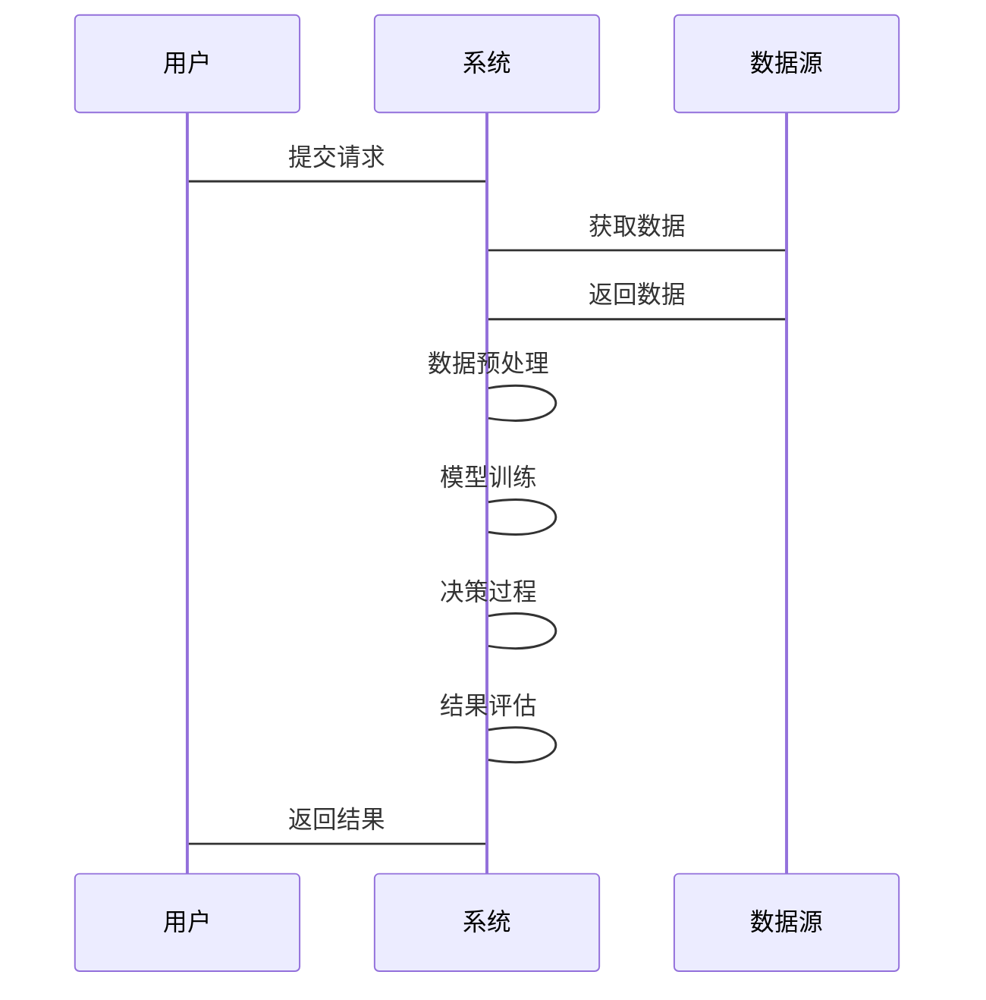

                 


# 构建企业级AI道德决策框架：确保AI系统的公平性与透明度

## 关键词：AI道德决策框架、公平性、透明度、企业级AI系统、伦理决策、AI算法

## 摘要：  
随着人工智能技术的快速发展，企业级AI系统的应用日益广泛。然而，AI系统在决策过程中面临的伦理问题，如公平性和透明度，正成为企业和开发者关注的焦点。本文将详细探讨如何构建企业级AI道德决策框架，确保AI系统的公平性和透明度。通过分析AI技术的现状与挑战、道德决策框架的核心要素、算法原理、系统架构设计以及实际项目案例，本文旨在为企业提供一套可行的解决方案，帮助他们在使用AI技术的同时，确保系统的道德合规性。

---

# 第一部分：企业级AI道德决策框架概述

## 第1章：AI的现状与挑战

### 1.1 AI技术的快速发展

#### 1.1.1 AI技术的演进历程  
人工智能（AI）技术的发展经历了多个阶段，从早期的规则-based系统到现在的深度学习和大模型，AI技术的复杂性和能力有了质的飞跃。近年来，AI在自然语言处理、计算机视觉、机器人技术等领域取得了突破性进展，企业级AI系统的应用也变得更加普遍。

#### 1.1.2 当前AI技术的应用领域  
AI技术已在多个领域得到广泛应用，包括金融、医疗、教育、交通等。例如，在金融领域，AI用于信用评估和欺诈检测；在医疗领域，AI用于疾病诊断和药物研发；在教育领域，AI用于个性化学习和教学辅助。

#### 1.1.3 AI技术对企业的影响  
AI技术的应用为企业带来了显著的效率提升和成本降低，但也带来了新的挑战。企业需要在技术进步与道德合规之间找到平衡，确保AI系统的决策过程符合伦理规范。

---

### 1.2 AI带来的伦理问题

#### 1.2.1 AI决策的不可解释性  
AI系统，尤其是基于深度学习的模型，往往被称为“黑箱”，其决策过程缺乏透明性，使得用户和利益相关者难以理解AI的决策逻辑。

#### 1.2.2 数据偏见与公平性问题  
AI系统的决策依赖于训练数据，而数据中存在的偏见可能导致不公平的结果。例如，在招聘系统中，如果历史数据中女性比例较低，系统可能会无意识地偏好男性候选人。

#### 1.2.3 用户隐私与数据安全  
AI系统通常需要处理大量用户数据，这可能引发隐私泄露和数据滥用的问题。企业需要在数据使用和用户隐私之间找到平衡。

---

### 1.3 道德决策框架的重要性

#### 1.3.1 道德决策框架的定义  
道德决策框架是一套用于指导AI系统在决策过程中遵循伦理原则的规则和方法。它旨在确保AI系统的决策过程透明、公平且符合社会价值观。

#### 1.3.2 道德决策框架的目标  
- 提供公平的决策结果，避免数据偏见的影响。
- 提供透明的决策过程，让用户了解AI的决策依据。
- 遵守法律法规，确保AI系统的合规性。

#### 1.3.3 道德决策框架的必要性  
随着AI技术的广泛应用，企业需要承担更大的社会责任。构建道德决策框架可以帮助企业规避法律风险，提升用户信任，并在竞争中获得优势。

---

### 1.4 本章小结  
本章介绍了AI技术的快速发展及其在企业中的广泛应用，分析了AI带来的伦理问题，强调了构建道德决策框架的必要性。接下来的章节将详细探讨道德决策框架的核心要素和实现方法。

---

## 第2章：公平性与透明度的核心概念

### 2.1 公平性的定义与挑战

#### 2.1.1 公平性的多维度定义  
公平性在AI系统中可以从多个角度定义，包括结果公平性、机会公平性和过程公平性。例如，结果公平性要求不同群体在相同条件下获得相同的结果；机会公平性要求所有群体都有平等的机会参与决策过程。

#### 2.1.2 数据偏见的来源与影响  
数据偏见是导致不公平决策的主要原因之一。偏见可能来源于数据收集过程中的样本选择偏差，或者训练数据中的历史偏见。这些偏见会影响AI模型的预测结果，导致不公平的决策。

#### 2.1.3 公平性评估的指标与方法  
公平性评估的指标包括差分公平性、平均差分公平性和条件公平性等。评估方法包括基于统计的方法和基于模型的方法。

---

### 2.2 透明度的定义与实现

#### 2.2.1 透明度的层次划分  
透明度可以分为数据透明度、模型透明度和决策透明度。数据透明度要求公开数据来源和处理方式；模型透明度要求公开模型的结构和参数；决策透明度要求公开AI系统的决策逻辑。

#### 2.2.2 透明度与用户信任的关系  
透明度是用户信任AI系统的重要基础。用户只有在了解AI系统的决策依据后，才能信任系统的决策结果。

#### 2.2.3 透明度实现的技术挑战  
透明度的实现需要在技术上进行额外的设计，例如通过可解释性模型和可视化工具来展示AI的决策过程。

---

### 2.3 公平性与透明度的联系与区别

#### 2.3.1 公平性与透明度的共同点  
两者都旨在提升AI系统的可信度。公平性关注结果的公正性，透明度关注决策过程的可理解性。

#### 2.3.2 公平性与透明度的不同点  
公平性侧重于结果的公正性，而透明度侧重于过程的可理解性。两者相辅相成，共同构成了AI系统的道德合规性。

---

### 2.4 本章小结  
本章详细探讨了公平性和透明度的核心概念，分析了数据偏见对公平性的影响，以及透明度实现的技术挑战。接下来的章节将介绍道德决策框架的核心要素和实现方法。

---

## 第3章：道德决策框架的核心要素

### 3.1 伦理原则的制定

#### 3.1.1 道德决策框架的伦理基础  
道德决策框架的伦理基础包括尊重、公正、 beneficence 和不伤害（non-maleficence）等原则。这些原则为AI系统的决策提供了道德指导。

#### 3.1.2 道德决策框架的伦理原则  
- 尊重：保护用户的隐私和自主权。
- 公正：确保决策过程的公平性。
- beneficence：最大化利益，减少伤害。
- 非伤害性：避免对任何人造成伤害。

#### 3.1.3 道德决策框架的伦理评估  
伦理评估是道德决策框架的重要组成部分。通过伦理评估，可以识别和解决AI系统中的伦理问题，确保决策过程符合伦理规范。

---

### 3.2 技术实现的考量

#### 3.2.1 技术实现的公平性保障  
公平性保障需要在数据预处理、模型训练和决策过程中采取措施，例如使用公平性算法和调整模型参数。

#### 3.2.2 技术实现的透明度保障  
透明度保障需要在模型设计、数据处理和决策展示过程中采取措施，例如使用可解释性模型和可视化工具。

#### 3.2.3 技术实现的可解释性保障  
可解释性保障需要在模型设计和决策展示过程中采取措施，例如使用线性模型或解释性算法（如SHAP值）。

---

### 3.3 企业目标的平衡

#### 3.3.1 企业目标与道德决策的关系  
企业目标与道德决策密切相关。企业需要在追求商业利益的同时，确保AI系统的决策过程符合伦理规范。

#### 3.3.2 企业目标与公平性的平衡  
企业需要在公平性和商业利益之间找到平衡，例如在招聘系统中，公平性可能会影响招聘效率。

#### 3.3.3 企业目标与透明度的平衡  
企业需要在透明度和商业机密之间找到平衡，例如在金融领域，透明度可能会影响企业的竞争优势。

---

### 3.4 本章小结  
本章介绍了道德决策框架的核心要素，包括伦理原则的制定、技术实现的考量和企业目标的平衡。接下来的章节将详细探讨道德决策框架的算法原理和系统架构设计。

---

## 第4章：道德决策框架的算法原理

### 4.1 公平性评估的算法

#### 4.1.1 偏见检测算法  
偏见检测算法用于识别数据中的偏见，例如基于统计的方法和基于机器学习的方法。

#### 4.1.2 偏见消除算法  
偏见消除算法用于调整数据或模型，以减少偏见的影响，例如重新采样和重新加权。

#### 4.1.3 偏见缓解算法  
偏见缓解算法用于在模型训练和决策过程中引入公平性约束，例如对抗训练和公平性优化。

---

### 4.2 透明度提升的算法

#### 4.2.1 可解释性增强算法  
可解释性增强算法用于提高模型的可解释性，例如使用线性模型和规则模型。

#### 4.2.2 透明度报告生成算法  
透明度报告生成算法用于自动生成决策过程的报告，例如基于模型解释性和数据可视化。

#### 4.2.3 透明度评估算法  
透明度评估算法用于评估AI系统的透明度，例如基于指标的评估和基于用户反馈的评估。

---

### 4.3 算法实现的代码示例

#### 4.3.1 偏见检测代码示例  
```python
def bias_detection(data):
    # 统计不同群体的样本数量
    group_counts = data.groupby('group').size()
    # 计算偏见指标
    bias_metric = group_counts.std() / group_counts.mean()
    return bias_metric
```

#### 4.3.2 可解释性增强代码示例  
```python
from sklearn.linear_model import LinearRegression

model = LinearRegression()
model.fit(X_train, y_train)
```

#### 4.3.3 透明度报告生成代码示例  
```python
import pandas as pd

def generate_transparency_report(model, data):
    # 生成特征重要性报告
    feature_importance = pd.Series(model.feature_importances_, index=data.columns)
    return feature_importance
```

---

### 4.4 本章小结  
本章详细介绍了公平性评估和透明度提升的算法，包括偏见检测、可解释性增强和透明度报告生成。接下来的章节将探讨道德决策框架的系统架构设计。

---

## 第5章：道德决策框架的系统架构

### 5.1 系统功能设计

#### 5.1.1 公平性评估模块  
公平性评估模块用于检测和评估AI系统的公平性，例如通过偏见检测算法和公平性指标。

#### 5.1.2 透明度提升模块  
透明度提升模块用于提高AI系统的透明度，例如通过可解释性增强算法和透明度报告生成算法。

#### 5.1.3 可解释性增强模块  
可解释性增强模块用于增强模型的可解释性，例如通过使用线性模型和解释性算法。

---

### 5.2 系统架构设计


---

### 5.3 系统接口设计

#### 5.3.1 公平性评估接口  
公平性评估接口用于接收数据和模型，返回公平性评估结果。

#### 5.3.2 透明度提升接口  
透明度提升接口用于接收模型和数据，返回增强后的透明度信息。

#### 5.3.3 可解释性增强接口  
可解释性增强接口用于接收模型和数据，返回可解释性增强后的模型。

---

### 5.4 系统交互流程



---

### 5.5 本章小结  
本章详细介绍了道德决策框架的系统架构设计，包括功能设计、架构设计和交互流程。接下来的章节将通过实际案例分析，展示如何构建企业级AI道德决策框架。

---

## 第6章：项目实战

### 6.1 环境安装

#### 6.1.1 安装必要的库  
安装必要的Python库，例如scikit-learn、xgboost和shap。

```bash
pip install scikit-learn xgboost shap
```

---

#### 6.1.2 配置开发环境  
配置开发环境，例如安装Jupyter Notebook和VS Code。

---

### 6.2 系统核心实现

#### 6.2.1 公平性评估实现  
使用shap库评估模型的公平性。

```python
import shap

explainer = shap.TreeExplainer(model)
shap_values = explainer.shap_values(X_test)
```

#### 6.2.2 透明度提升实现  
使用xgboost库提升模型的透明度。

```python
import xgboost

model = xgboost.XGBClassifier()
model.fit(X_train, y_train)
```

#### 6.2.3 可解释性增强实现  
使用线性回归模型增强模型的可解释性。

```python
from sklearn.linear_model import LinearRegression

model = LinearRegression()
model.fit(X_train, y_train)
```

---

### 6.3 代码应用解读与分析

#### 6.3.1 公平性评估代码解读  
通过shap库评估模型的公平性，分析不同特征对决策结果的影响。

#### 6.3.2 透明度提升代码解读  
通过xgboost库提升模型的透明度，分析模型的特征重要性和决策过程。

#### 6.3.3 可解释性增强代码解读  
通过线性回归模型增强模型的可解释性，分析模型的决策逻辑。

---

### 6.4 实际案例分析

#### 6.4.1 案例背景  
以招聘系统为例，构建一个AI道德决策框架，确保招聘过程的公平性和透明度。

#### 6.4.2 案例实现  
使用上述算法和系统架构，构建一个公平且透明的招聘系统。

#### 6.4.3 案例分析  
分析招聘系统中的公平性问题，例如性别偏见，并通过道德决策框架进行解决。

---

### 6.5 本章小结  
本章通过实际案例分析，展示了如何构建企业级AI道德决策框架。接下来的章节将总结最佳实践和注意事项。

---

## 第7章：总结与最佳实践

### 7.1 总结

#### 7.1.1 核心内容回顾  
回顾本文的核心内容，包括AI的现状与挑战、公平性与透明度的核心概念、道德决策框架的核心要素、算法原理和系统架构设计。

#### 7.1.2 本文的主要贡献  
本文提出了一种构建企业级AI道德决策框架的方法，确保AI系统的公平性和透明度。

---

### 7.2 最佳实践

#### 7.2.1 小结  
总结本文的核心观点，强调构建道德决策框架的重要性。

#### 7.2.2 注意事项  
在构建道德决策框架时，需要注意数据偏见、用户隐私和模型透明度等问题。

#### 7.2.3 拓展阅读  
推荐相关的书籍和论文，例如《机器学习实战》和《公平机器学习》。

---

### 7.3 本章小结  
本章总结了本文的核心内容，提出了构建企业级AI道德决策框架的最佳实践。希望本文能为企业提供有价值的参考，帮助他们在使用AI技术的同时，确保系统的道德合规性。

---

通过以上章节的逐步分析和详细阐述，我们构建了一个完整的道德决策框架，确保企业级AI系统的公平性和透明度。

