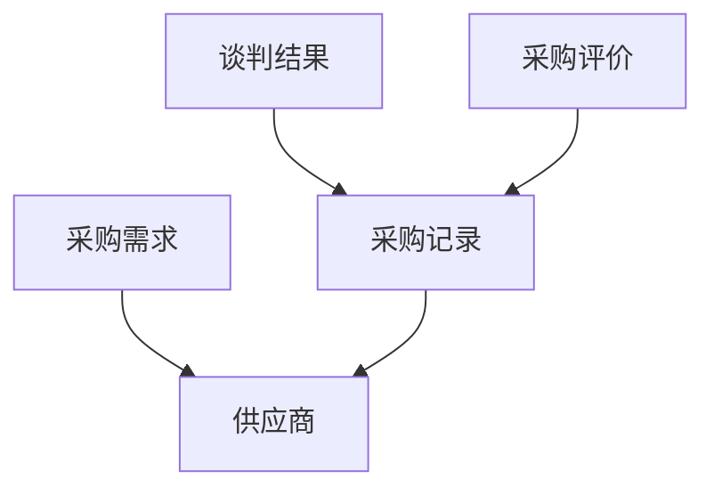
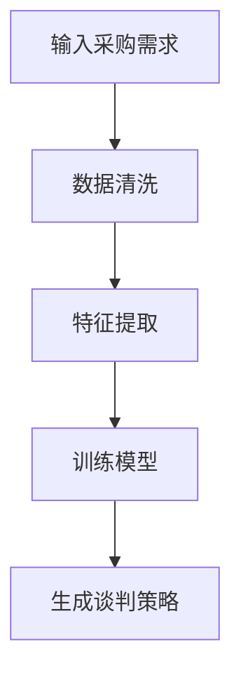
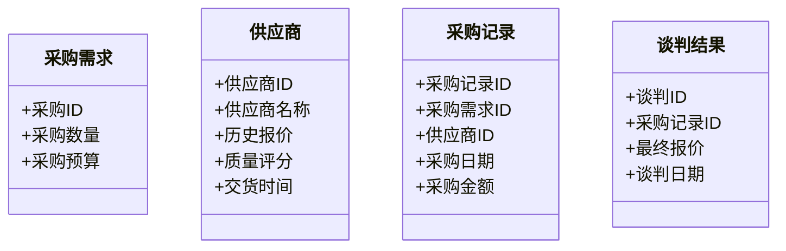
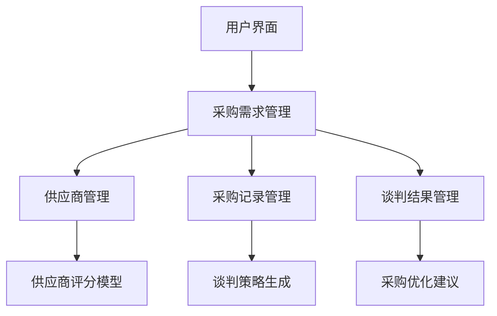
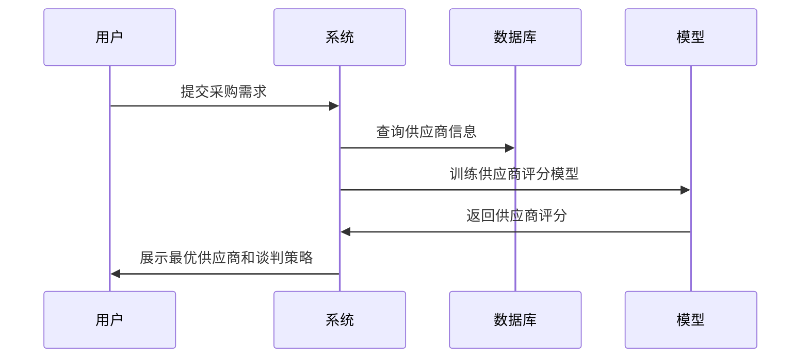

                 


# 构建企业级AI采购助手：优化供应商选择与谈判

> 关键词：AI采购助手，供应商选择，谈判优化，企业采购，人工智能，数据驱动决策

> 摘要：本文详细探讨了如何利用人工智能技术构建企业级AI采购助手，优化供应商选择与谈判流程。通过分析传统采购的痛点，结合AI技术的核心原理，提出了一套完整的系统解决方案，包括算法实现、系统架构设计以及实际案例分析。文章内容涵盖从理论到实践的全过程，旨在为企业采购部门提供高效、智能的决策支持工具。

---

## 第1章: 企业级AI采购助手的背景与意义

### 1.1 问题背景
#### 1.1.1 传统采购流程的痛点
- 供应商选择过程繁琐，涉及多维度评估（如价格、质量、交货时间等）。
- 谈判过程依赖个人经验，缺乏数据支持，结果不确定性高。
- 数据分散，难以快速获取和分析，影响决策效率。

#### 1.1.2 供应商选择的复杂性
- 供应商数量多，筛选耗时耗力。
- 每个供应商的评估维度多样，难以量化比较。
- 市场变化快，供应商信息更新不及时。

#### 1.1.3 采购谈判的关键性
- 谈判结果直接影响成本和利润。
- 谈判策略需灵活应对供应商的反应。
- 如何在有限时间内做出最优决策是核心挑战。

### 1.2 问题描述
#### 1.2.1 供应商选择的多维度评估
- 需要综合考虑质量、成本、交货时间等多个维度。
- 供应商的历史表现和潜在能力需纳入考量。

#### 1.2.2 谈判过程的不确定性
- 供应商的报价可能随时变化。
- 谈判结果受市场波动和供应商关系影响。
- 如何在复杂场景中制定最优谈判策略是关键。

#### 1.2.3 数据驱动决策的重要性
- 数据是优化采购决策的基础。
- 数据分析可以发现潜在的供应商优势和风险。
- 数据驱动的决策能够提高采购效率和降低成本。

### 1.3 问题解决
#### 1.3.1 AI技术在采购中的应用
- 利用机器学习模型分析供应商数据。
- 通过自然语言处理技术提取谈判关键点。
- 使用预测模型模拟谈判结果，优化采购策略。

#### 1.3.2 数据分析优化采购流程
- 数据清洗与特征提取，为模型提供高质量输入。
- 利用聚类分析和分类算法筛选优质供应商。
- 基于历史数据预测供应商表现，辅助决策。

#### 1.3.3 智能谈判辅助工具的实现
- 自动生成谈判策略，提供最佳报价建议。
- 实时分析供应商报价，优化谈判结果。
- 提供多轮谈判模拟，降低决策风险。

### 1.4 边界与外延
#### 1.4.1 AI采购助手的功能边界
- 专注于供应商选择和谈判辅助，不涉及合同签订和执行。
- 依赖于高质量的数据输入，数据不足时效果受限。
- 主要适用于大宗采购，对小规模采购的支持有限。

#### 1.4.2 与企业其他系统的交互
- 与ERP系统集成，获取采购数据。
- 与供应链管理系统对接，优化库存管理。
- 与财务系统整合，提高成本核算效率。

#### 1.4.3 适用场景与限制
- 适用于数据充足、采购量大的企业。
- 对于新兴市场或数据不足的情况，效果有限。
- 无法完全替代人类的判断，仍需专业人员把关。

### 1.5 概念结构与核心要素
#### 1.5.1 核心要素组成
- **采购需求**：包括采购品目、数量、预算等。
- **供应商数据**：包括供应商资质、历史表现、信用记录等。
- **谈判策略**：基于数据分析生成的最优谈判方案。
- **采购结果**：包括供应商选择、谈判结果、采购成本等。

#### 1.5.2 要素之间的关系
- 采购需求驱动供应商数据的收集与分析。
- 供应商数据影响谈判策略的制定。
- 谈判结果反馈优化采购需求和供应商选择。

#### 1.5.3 系统架构的核心模块
- 数据采集模块：负责收集供应商信息和采购需求。
- 数据分析模块：对供应商数据进行清洗和特征提取。
- 模型训练模块：基于历史数据训练供应商评分模型。
- 智能谈判模块：生成谈判策略并模拟谈判过程。

---

## 第2章: AI采购助手的核心概念与联系

### 2.1 核心概念原理
#### 2.1.1 数据驱动的采购决策
- 数据是AI采购助手的核心驱动力。
- 通过数据分析发现供应商的潜在优势和风险。
- 数据驱动的决策能够提高采购的透明度和效率。

#### 2.1.2 智能谈判策略
- 基于供应商的历史数据和市场趋势制定谈判策略。
- 使用预测模型模拟谈判结果，优化采购价格。
- 根据实时数据动态调整谈判策略。

#### 2.1.3 供应商关系管理的AI优化
- 通过AI技术维护供应商关系，提高供应链稳定性。
- 定期评估供应商表现，优化供应商组合。
- 通过数据驱动的方式识别关键供应商，降低采购风险。

### 2.2 概念属性特征对比
#### 2.2.1 传统采购与AI采购的对比
| 特性 | 传统采购 | AI采购 |
|------|-----------|--------|
| 数据来源 | 依赖人工收集和整理 | 利用大数据技术自动采集和分析 |
| 决策方式 | 主观判断为主 | 数据驱动决策为主 |
| 谈判效率 | 低效，依赖经验 | 高效，基于预测和模拟 |

#### 2.2.2 数据分析与AI决策的对比
| 特性 | 数据分析 | AI决策 |
|------|----------|--------|
| 数据处理 | 离线分析 | 实时分析 |
| 决策依据 | 统计分析 | 机器学习模型预测 |
| 输出结果 | 可视化报告 | 智能推荐和策略 |

#### 2.2.3 谈判策略与智能推荐的对比
| 特性 | 传统谈判策略 | AI推荐策略 |
|------|----------------|------------|
| 制定方式 | 依赖经验 | 基于数据和模型 |
| 灵活性 | 较低 | 高 |
| 预测准确性 | 低 | 高 |

### 2.3 ER实体关系图


---

## 第3章: AI采购助手的算法原理

### 3.1 算法原理概述
#### 3.1.1 数据预处理与特征提取
- 数据清洗：去除重复数据、填充缺失值、处理异常值。
- 特征提取：从供应商数据中提取关键特征（如交货时间、质量评分、历史报价）。

#### 3.1.2 供应商评分模型
- 使用机器学习算法（如随机森林、支持向量机）对供应商进行评分。
- 评分公式：
  $$ \text{评分} = \alpha \times \text{质量} + \beta \times \text{成本} + \gamma \times \text{交货时间} $$
  其中，$\alpha + \beta + \gamma = 1$。

#### 3.1.3 智能谈判策略生成
- 基于供应商评分和市场趋势预测谈判结果。
- 使用预测模型模拟谈判过程，生成最优报价建议。

### 3.2 算法流程图


### 3.3 核心算法实现
#### 3.3.1 供应商评分模型
- **输入**：供应商的历史报价、质量评分、交货时间。
- **输出**：供应商综合评分。
- **实现**：
  ```python
  def calculate_supplier_score(quality, cost, delivery_time):
      alpha = 0.5
      beta = 0.3
      gamma = 0.2
      score = alpha * quality + beta * cost + gamma * delivery_time
      return score
  ```

#### 3.3.2 谈判策略生成
- **输入**：供应商评分、市场趋势、采购预算。
- **输出**：最优谈判策略。
- **实现**：
  ```python
  def generate_negotiation_strategy(supplier_score, market_trend, budget):
      if supplier_score > 0.8 and market_trend > 0.7:
          return "建议提高采购量，争取更大折扣"
      elif supplier_score > 0.6 and market_trend < 0.5:
          return "建议降低采购量，寻找替代供应商"
      else:
          return "维持现状，继续谈判"
  ```

---

## 第4章: 系统分析与架构设计

### 4.1 问题场景介绍
#### 4.1.1 企业采购流程的现状
- 采购流程复杂，涉及多个部门和系统。
- 数据分散，难以高效利用。
- 采购决策依赖经验，效率低下。

#### 4.1.2 供应商选择的复杂性
- 供应商数量多，评估维度多样。
- 数据更新不及时，影响决策准确性。
- 缺乏统一的供应商评估标准。

#### 4.1.3 谈判过程的不确定性
- 谈判结果受多种因素影响，难以预测。
- 谈判过程耗时，影响采购效率。
- 缺乏数据支持，谈判策略难以优化。

### 4.2 系统功能设计
#### 4.2.1 领域模型


#### 4.2.2 系统架构设计


#### 4.2.3 系统接口设计
- **输入接口**：采购需求提交、供应商信息录入。
- **输出接口**：供应商评分结果、谈判策略建议、采购优化方案。

#### 4.2.4 系统交互设计


---

## 第5章: 项目实战

### 5.1 项目介绍
#### 5.1.1 项目背景
- 某大型制造企业采购部门希望优化供应商选择和谈判流程。
- 数据来源包括ERP系统和供应商历史记录。

#### 5.1.2 项目目标
- 构建AI采购助手，提高供应商选择的准确性和谈判效率。
- 实现数据驱动的决策支持，降低采购成本。

### 5.2 系统核心实现
#### 5.2.1 环境安装
- **Python版本**：3.8及以上。
- **依赖库**：pandas、scikit-learn、matplotlib。

#### 5.2.2 核心代码实现
```python
import pandas as pd
from sklearn.ensemble import RandomForestRegressor

# 数据加载
data = pd.read_csv('suppliers.csv')

# 特征工程
X = data[['quality', 'cost', 'delivery_time']]
y = data['score']

# 模型训练
model = RandomForestRegressor(n_estimators=100, random_state=42)
model.fit(X, y)

# 谈判策略生成
def generate_strategy(supplier_score):
    if supplier_score > 0.8:
        return "建议增加采购量，争取更大折扣"
    elif supplier_score > 0.6:
        return "建议维持现状，继续谈判"
    else:
        return "建议寻找替代供应商"
```

#### 5.2.3 代码应用解读与分析
- **数据加载**：读取供应商数据，提取关键特征。
- **模型训练**：使用随机森林回归模型预测供应商评分。
- **谈判策略生成**：根据供应商评分生成最优谈判策略。

### 5.3 实际案例分析
#### 5.3.1 案例背景
- 某制造企业需要采购原材料，供应商A和供应商B报价分别为100元和90元。
- 供应商A的历史质量评分为0.8，交货时间为5天。
- 供应商B的历史质量评分为0.7，交货时间为3天。

#### 5.3.2 数据分析
- 使用模型预测供应商评分：
  - 供应商A：$$ \text{评分} = 0.5 \times 0.8 + 0.3 \times 100 + 0.2 \times 5 = 31.9 $$
  - 供应商B：$$ \text{评分} = 0.5 \times 0.7 + 0.3 \times 90 + 0.2 \times 3 = 28.7 $$

#### 5.3.3 谈判策略
- 供应商A评分高于供应商B，但报价较高。
- 建议与供应商B谈判，争取降低交货时间或提高质量评分。

### 5.4 项目小结
- AI采购助手能够有效优化供应商选择和谈判流程。
- 数据质量和模型选择对系统性能影响显著。
- 实际应用中需结合企业实际情况进行调整。

---

## 第6章: 最佳实践、小结、注意事项、拓展阅读

### 6.1 最佳实践
#### 6.1.1 数据管理
- 确保数据的准确性和及时性。
- 定期更新供应商数据，保持模型的有效性。

#### 6.1.2 模型优化
- 根据实际需求调整模型参数。
- 使用交叉验证评估模型性能。

#### 6.1.3 系统集成
- 与企业现有系统（如ERP、CRM）无缝集成。
- 提供良好的用户体验，降低使用门槛。

### 6.2 小结
- 本文详细介绍了AI采购助手的构建过程，从问题分析到算法实现再到系统设计，为企业采购部门提供了高效的决策支持工具。
- AI技术的应用能够显著优化供应商选择和谈判流程，降低采购成本，提高采购效率。

### 6.3 注意事项
- 数据是AI采购助手的核心，需确保数据质量和完整性。
- 模型的选择和调优对系统性能影响重大，需结合实际需求进行调整。
- 系统的安全性和稳定性需重点关注，避免数据泄露和系统崩溃。

### 6.4 拓展阅读
- 推荐阅读《机器学习实战》、《深度学习》等书籍，深入理解AI技术的应用。
- 关注供应链管理领域的最新研究，探索更多AI技术的应用场景。

---

通过本文的详细讲解，读者可以系统地了解如何利用AI技术构建企业级采购助手，优化供应商选择与谈判流程。从理论到实践，本文提供了全面的指导，帮助企业实现高效、智能的采购管理。

