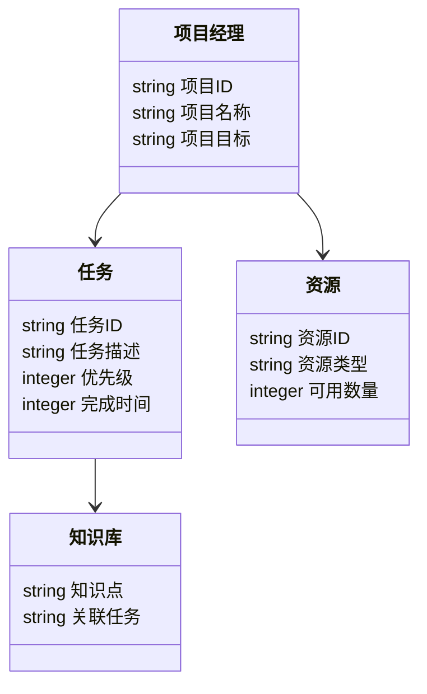

                 


# 构建企业级AI驱动的项目管理助手

---

## 关键词：
企业级项目管理、人工智能、自然语言处理、机器学习、知识图谱、系统架构、任务调度

---

## 摘要：
在现代企业环境中，项目管理的复杂性和不确定性不断增加，传统的项目管理方法逐渐显现出诸多局限性。本文旨在探讨如何通过人工智能技术构建一个智能化的项目管理助手，以提高项目执行效率、降低风险，并实现对项目全过程的智能监控与优化。通过结合自然语言处理（NLP）、机器学习、知识图谱等先进技术，本文将详细阐述构建企业级AI驱动项目管理助手的核心概念、算法原理、系统架构以及实际应用场景，为企业级项目管理的智能化转型提供理论与实践指导。

---

# 第一部分：企业级AI驱动的项目管理助手背景与概述

## 第1章：企业级AI驱动的项目管理助手概述

### 1.1 问题背景与挑战
#### 1.1.1 传统项目管理的痛点
传统项目管理方法依赖人工经验，存在以下痛点：
- **时间管理**：任务优先级难以准确评估，导致时间分配不当。
- **资源分配**：资源分配缺乏数据支持，容易造成资源浪费或不足。
- **风险管理**：风险预测能力有限，难以及时应对突发情况。
- **沟通效率**：跨部门协作困难，信息传递不畅。

#### 1.1.2 企业级项目管理的复杂性
企业级项目管理涉及多个部门、复杂的目标和资源，其复杂性主要体现在：
- 多项目并行管理
- 跨部门协作
- 高度依赖人工经验
- 需要实时数据分析

#### 1.1.3 AI技术在项目管理中的应用潜力
AI技术在项目管理中的应用潜力主要体现在：
- **自动化任务调度**：通过机器学习算法优化任务顺序。
- **智能风险预测**：基于历史数据预测项目风险。
- **自然语言处理**：自动解析项目需求文档，生成任务分解。
- **知识图谱构建**：整合企业知识，辅助决策。

### 1.2 问题描述与目标
#### 1.2.1 项目管理中的关键问题
- 任务优先级排序困难。
- 项目进度预测不准确。
- 跨部门协作效率低下。
- 风险识别与应对能力不足。

#### 1.2.2 构建AI驱动项目管理助手的目标
通过AI技术实现以下目标：
- 提供智能化的任务调度建议。
- 实现项目进度的智能预测与监控。
- 支持跨部门协作，提升沟通效率。
- 提供实时风险预警和应对策略。

#### 1.2.3 边界与外延
- **边界**：仅关注项目管理过程中的任务调度、进度预测和风险控制。
- **外延**：不涉及项目具体实施过程中的技术开发和资源分配。

### 1.3 核心概念与系统架构
#### 1.3.1 核心概念与组成要素
- **任务调度**：基于算法优化任务执行顺序。
- **进度预测**：通过机器学习模型预测项目进度。
- **风险管理**：基于历史数据识别潜在风险。
- **知识管理**：整合企业知识，辅助决策。

#### 1.3.2 系统架构的模块划分
- **数据采集模块**：负责收集项目数据。
- **模型训练模块**：基于数据训练AI模型。
- **任务调度模块**：根据模型结果优化任务执行顺序。
- **风险预警模块**：实时监控项目风险。

#### 1.3.3 核心功能与应用场景
- **任务调度**：应用于多任务并行执行场景。
- **进度预测**：应用于项目进度监控与调整。
- **风险管理**：应用于实时风险预警与应对。

### 1.4 本章小结
本章主要介绍了构建企业级AI驱动项目管理助手的背景、目标和核心概念，为后续章节奠定了基础。

---

# 第二部分：核心概念与技术原理

## 第2章：AI驱动项目管理的核心技术

### 2.1 自然语言处理（NLP）在项目管理中的应用
#### 2.1.1 NLP技术的基本原理
自然语言处理技术通过分析文本数据，提取有用信息。在项目管理中，NLP主要用于：
- **需求分析**：解析项目需求文档，生成任务分解。
- **文本生成**：自动生成项目计划书。

#### 2.1.2 项目需求分析与任务分解的NLP实现
- **需求分析**：使用分词、实体识别等技术提取关键信息。
- **任务分解**：基于NLP生成任务列表和优先级排序。

#### 2.1.3 文本生成在项目文档管理中的应用
- **自动化生成项目计划**：基于NLP技术自动生成项目计划书。
- **实时更新项目文档**：根据项目进展自动更新文档内容。

#### 2.1.4 NLP在跨部门协作中的作用
- **信息自动分发**：将任务信息分发给相关人员。
- **实时沟通记录分析**：分析沟通记录，优化协作效率。

### 2.2 机器学习在项目进度预测中的应用
#### 2.2.1 机器学习的基本原理
机器学习通过训练模型，预测未来趋势。在项目管理中，主要用于：
- **进度预测**：预测项目完成时间。
- **资源分配优化**：优化资源分配方案。

#### 2.2.2 基于历史数据的项目进度预测模型
- **模型选择**：时间序列分析模型、LSTM模型。
- **训练数据**：历史项目数据，包括任务完成时间、资源使用情况。
- **预测流程**：数据清洗、特征提取、模型训练、结果分析。

#### 2.2.3 基于特征工程的任务优先级排序算法
- **特征工程**：提取任务优先级相关特征，如任务复杂度、资源需求。
- **排序算法**：基于特征的排序模型，如基于贪心算法的任务调度。

### 2.3 知识图谱与项目知识管理
#### 2.3.1 知识图谱的基本概念
知识图谱是将结构化数据存储为图结构，用于表示知识间的关系。

#### 2.3.2 项目知识的构建与存储
- **知识抽取**：从项目文档中提取关键信息。
- **知识存储**：构建项目知识图谱，存储任务关系、资源依赖等信息。

#### 2.3.3 知识图谱在项目决策中的应用
- **任务关系分析**：分析任务之间的依赖关系，优化任务调度。
- **风险预测**：基于知识图谱分析潜在风险。

#### 2.3.4 知识图谱构建示例
- 使用图数据库（如Neo4j）构建项目知识图谱。
- 示例场景：分析任务A是否依赖任务B。

### 2.4 核心概念对比与ER实体关系图

#### 2.4.1 核心概念属性对比表
| 核心概念 | 属性 |
|----------|------|
| 任务调度 | 任务优先级、任务依赖关系、资源分配 |
| 进度预测 | 预测准确性、预测范围、预测频率 |
| 风险管理 | 风险识别、风险评估、风险应对 |

#### 2.4.2 系统实体关系图（ER图）
```mermaid
erDiagram
    actor 项目经理 {
        string 项目ID
        string 项目名称
        string 项目目标
    }
    actor 开发团队 {
        string 团队ID
        string 团队名称
        string 团队成员
    }
    entity 任务 {
        string 任务ID
        string 任务描述
        integer 优先级
        integer 完成时间
    }
    entity 资源 {
        string 资源ID
        string 资源类型
        integer 可用数量
    }
    relation 资源分配 {
        项目经理 -> 资源
        项目经理 -> 任务
        任务 -> 资源
    }
```

---

# 第三部分：算法原理与数学模型

## 第3章：任务调度与进度预测算法

### 3.1 任务调度算法原理
#### 3.1.1 基于贪心算法的任务调度
- **贪心算法**：优先执行优先级高的任务。
- **实现步骤**：
  1. 计算任务优先级。
  2. 按优先级顺序执行任务。

#### 3.1.2 基于动态规划的任务调度优化
- **动态规划**：通过分解问题，找到最优解。
- **实现步骤**：
  1. 分解任务为子任务。
  2. 计算子任务的最优执行顺序。
  3. 组合子任务的最优解。

#### 3.1.3 基于强化学习的自适应调度算法
- **强化学习**：通过试错学习优化任务调度。
- **实现步骤**：
  1. 定义状态空间、动作空间和奖励函数。
  2. 训练策略网络，优化任务调度策略。

#### 3.1.4 任务调度算法对比
| 算法类型 | 优点 | 缺点 |
|----------|------|------|
| 贪心算法 | 实现简单 | 忽略任务间的依赖关系 |
| 动态规划 | 找到全局最优 | 计算复杂度高 |
| 强化学习 | 自适应能力强 | 需要大量训练数据 |

### 3.2 项目进度预测模型
#### 3.2.1 时间序列分析模型
- **ARIMA模型**：用于时间序列预测。
- **实现步骤**：
  1. 数据预处理：去除趋势和季节性。
  2. 模型训练：确定参数。
  3. 预测项目完成时间。

#### 3.2.2 基于LSTM的进度预测网络
- **LSTM网络**：擅长处理时间序列数据。
- **实现步骤**：
  1. 数据预处理：归一化数据。
  2. 构建LSTM网络。
  3. 训练网络，预测进度。

#### 3.2.3 模型训练与优化
- **训练数据**：历史项目数据。
- **优化方法**：使用交叉验证优化模型参数。

---

## 第4章：算法实现与数学模型

### 4.1 任务调度算法实现
#### 4.1.1 贪心算法实现
```python
def greedy_scheduling(tasks):
    # 任务优先级排序
    tasks.sort(key=lambda x: x['priority'])
    # 执行任务
    for task in tasks:
        execute_task(task)
```

#### 4.1.2 动态规划实现
```python
def dynamic_programming(tasks):
    n = len(tasks)
    dp = [[0] * n for _ in range(n)]
    # 填充dp表
    for i in range(n):
        dp[i][i] = execute_task(tasks[i])
    for i in range(n-1):
        for j in range(i+1, n):
            dp[i][j] = max(dp[i][j-1], dp[i+1][j])
    # 回溯最优解
    return dp[0][n-1]
```

### 4.2 项目进度预测模型
#### 4.2.1 ARIMA模型实现
```python
from statsmodels.tsa.arima_model import ARIMA
def arima_predict(history_data):
    model = ARIMA(history_data, order=(1,1,0))
    model_fit = model.fit(disp=-1)
    forecast = model_fit.forecast(steps=1)
    return forecast[0]
```

#### 4.2.2 LSTM模型实现
```python
import tensorflow as tf
from tensorflow.keras.layers import LSTM, Dense
def lstm_predict(history_data, time_steps=10):
    model = tf.keras.Sequential([
        LSTM(50, input_shape=(time_steps, 1)),
        Dense(1)
    ])
    model.compile(optimizer='adam', loss='mean_squared_error')
    model.fit(history_data, epochs=50, batch_size=1)
    return model.predict(next_input)
```

---

# 第四部分：系统分析与架构设计

## 第5章：系统分析与架构设计

### 5.1 项目管理助手系统分析
#### 5.1.1 问题场景介绍
- **场景描述**：企业级项目管理中，存在任务调度不优、进度预测不准等问题。
- **目标用户**：项目经理、开发团队。

### 5.2 项目介绍
#### 5.2.1 项目目标
- 构建一个智能化的项目管理助手。
- 实现任务调度、进度预测、风险预警等功能。

### 5.3 系统功能设计
#### 5.3.1 领域模型设计


#### 5.3.2 系统架构设计


#### 5.3.3 系统接口设计
- **数据接口**：与企业资源计划（ERP）系统对接。
- **用户接口**：提供图形化界面，方便用户操作。

#### 5.3.4 系统交互设计
```mermaid
sequenceDiagram
    actor 项目经理
    actor 开发团队
    system 项目管理助手
    项目经理 -> 项目管理助手: 提交项目需求
    项目管理助手 -> 开发团队: 分配任务
    开发团队 -> 项目管理助手: 更新任务进度
    项目管理助手 -> 项目经理: 提供进度报告
```

---

## 第6章：项目实战与优化

### 6.1 项目实战
#### 6.1.1 环境搭建
- **工具安装**：安装Python、TensorFlow、Neo4j等工具。
- **数据准备**：收集历史项目数据。

#### 6.1.2 系统核心实现
```python
def main():
    # 数据采集
    data = load_data()
    # 模型训练
    model = train_model(data)
    # 任务调度
    schedule_tasks(model)
    # 风险预警
    monitor_risk(model)
if __name__ == "__main__":
    main()
```

#### 6.1.3 代码实现与解读
- **数据采集模块**：读取CSV文件，提取项目数据。
- **模型训练模块**：训练任务调度算法和进度预测模型。
- **任务调度模块**：根据模型结果优化任务执行顺序。
- **风险预警模块**：实时监控项目风险，提供预警。

### 6.2 案例分析
#### 6.2.1 案例背景
- **项目名称**：企业级软件开发项目。
- **项目目标**：开发一个在线电商平台。

#### 6.2.2 应用解读
- **任务调度优化**：将核心功能开发任务优先级提高。
- **进度预测结果**：预测项目可能延期两周，及时调整资源分配。

### 6.3 项目优化与总结
#### 6.3.1 优化建议
- **数据质量**：确保历史数据准确无误。
- **模型调优**：通过交叉验证优化模型参数。
- **用户反馈**：根据用户反馈持续改进系统功能。

#### 6.3.2 小结
通过实际案例分析，验证了AI驱动项目管理助手的有效性，为企业级项目管理的智能化转型提供了成功经验。

---

## 第五部分：总结与展望

## 第7章：总结与展望

### 7.1 核心内容回顾
- **核心概念**：任务调度、进度预测、风险管理。
- **技术实现**：NLP、机器学习、知识图谱。
- **系统架构**：模块划分、数据流设计、接口设计。

### 7.2 最佳实践与注意事项
- **数据质量**：确保数据准确性和完整性。
- **模型调优**：通过持续训练优化模型性能。
- **用户反馈**：及时收集用户反馈，改进系统功能。

### 7.3 未来展望
- **技术发展**：探索更先进的AI技术，如大语言模型（LLM）在项目管理中的应用。
- **应用场景扩展**：将AI驱动项目管理助手应用于更多行业和场景。
- **系统优化**：通过云计算和边缘计算提升系统的实时性和扩展性。

---

## 参考文献
（此处列出相关的技术文献和书籍）

---

## 致谢
感谢在本书编写过程中提供帮助和支持的团队成员和朋友。

