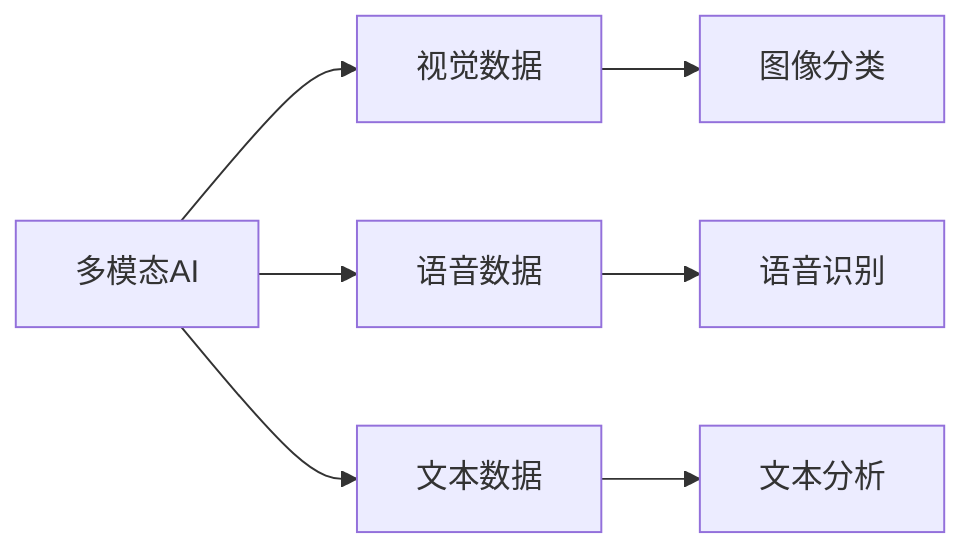
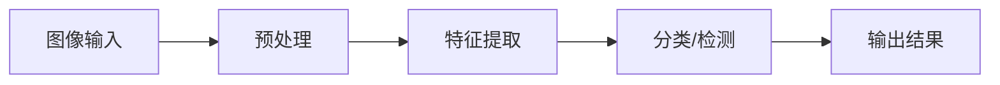
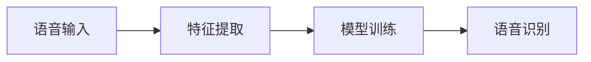
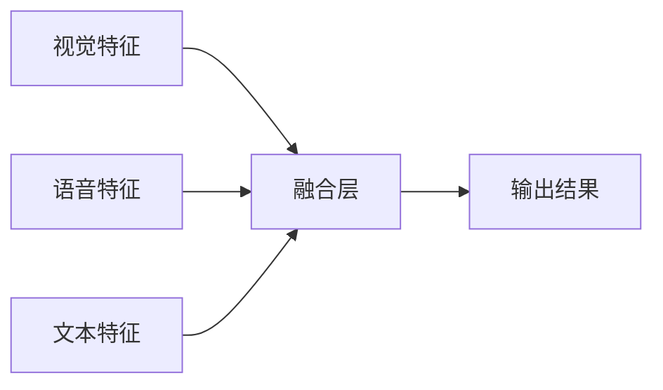
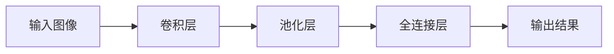
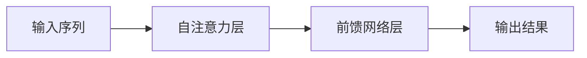
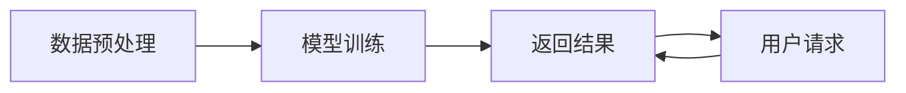

                 


# 构建企业级多模态AI平台：整合视觉、语音与文本的综合分析系统

> 关键词：多模态AI、视觉数据处理、语音数据处理、文本数据处理、模型融合、系统架构设计

> 摘要：本文详细探讨了构建企业级多模态AI平台的理论基础与实践方法。从多模态数据处理的核心技术，到多模态AI平台的系统架构设计，再到实际项目的实现与优化，本文为企业技术团队提供了从理论到实践的全面指导。

---

## 第一章: 多模态AI平台的背景与概念

### 1.1 多模态AI的定义与特点

#### 1.1.1 多模态数据的定义
多模态数据是指来自不同感知渠道（如视觉、听觉、触觉等）的数据形式。在企业级AI平台中，我们主要关注视觉（图像/视频）、语音（音频）和文本（文字）三种模态的数据。

| 模态类型 | 特点 | 常见应用场景 |
|--------|--------|--------|
| 视觉数据 | 高维性、空间性 | 图像分类、目标检测、视频分析 |
| 语音数据 | 时间序列性 | 语音识别、语音合成、语音情感分析 |
| 文本数据 | 结构化、语义丰富 | 文本分类、文本摘要、机器翻译 |

#### 1.1.2 多模态AI的核心特点
- **信息互补性**：不同模态数据能够互补信息，提高分析准确性。
- **复杂性**：多模态数据的异构性和多样性增加了处理难度。
- **融合性**：需要将不同模态的数据进行有效融合，提升系统性能。

#### 1.1.3 多模态AI与传统AI的区别
- **单模态AI**：仅处理单一类型的数据，如图像或文本。
- **多模态AI**：整合多种模态数据，实现更全面的分析。



### 1.2 多模态AI的应用场景

#### 1.2.1 视觉、语音与文本的整合应用
- **智能客服**：整合语音和文本数据，实现多渠道的客户交互分析。
- **智能安防**：结合视觉和语音数据，进行行为识别和异常检测。
- **智能医疗**：整合医学图像、语音和文本数据，辅助诊断和治疗方案制定。

#### 1.2.2 企业级多模态AI的潜在价值
- 提高数据利用率，挖掘潜在价值。
- 提升业务智能化水平，降低运营成本。
- 增强用户体验，提供更个性化的服务。

#### 1.2.3 多模态AI在行业中的应用案例
- 零售行业：通过整合视觉、语音和文本数据，实现客户行为分析和个性化推荐。
- 教育行业：通过整合视觉和文本数据，实现智能辅助教学和学习效果评估。

---

## 第二章: 多模态数据处理技术

### 2.1 视觉数据处理技术

#### 2.1.1 图像处理与计算机视觉基础
- **图像处理**：对图像进行预处理，如去噪、边缘检测等。
- **计算机视觉**：利用深度学习模型（如CNN）进行图像分类、目标检测等任务。



#### 2.1.2 常见图像处理算法
- **卷积神经网络（CNN）**：用于图像分类和目标检测。
- **区域卷积神经网络（R-CNN）**：用于目标检测。

```python
import torch
import torch.nn as nn

# 定义一个简单的CNN模型
class SimpleCNN(nn.Module):
    def __init__(self):
        super(SimpleCNN, self).__init__()
        self.conv1 = nn.Conv2d(3, 6, 5)
        self.pool = nn.MaxPool2d(2, 2)
        self.fc = nn.Linear(6 * 5 * 5, 10)

    def forward(self, x):
        x = self.pool(F.relu(self.conv1(x)))
        x = x.view(-1, 6 * 5 * 5)
        x = self.fc(x)
        return x
```

#### 2.1.3 深度学习在图像识别中的应用
- **ResNet**：残差网络，用于提高模型的训练稳定性。
- **Faster R-CNN**：用于目标检测和实例分割。

---

### 2.2 语音数据处理技术

#### 2.2.1 语音信号处理基础
- **语音信号**：时间序列数据，通常以波形图表示。
- **特征提取**：提取梅尔频谱、MFCC（Mel-Frequency Cepstral Coefficients）等特征。



#### 2.2.2 声学模型与语音识别算法
- **隐马尔可夫模型（HMM）**：传统语音识别方法。
- **深度神经网络（DNN）**：用于语音识别的端到端模型。

```python
import torch
import torch.nn as nn

# 定义一个简单的语音识别模型
class SimpleSpeechRecognizer(nn.Module):
    def __init__(self, input_size, hidden_size, output_size):
        super(SimpleSpeechRecognizer, self).__init__()
        self.rnn = nn.RNN(input_size, hidden_size, batch_first=True)
        self.fc = nn.Linear(hidden_size, output_size)

    def forward(self, x):
        out, _ = self.rnn(x)
        out = self.fc(out[:, -1, :])
        return out
```

---

### 2.3 文本数据处理技术

#### 2.3.1 自然语言处理基础
- **词嵌入**：将词语映射到低维空间，常用Word2Vec、GloVe等方法。
- **文本表示**：利用词嵌入和句嵌入（如BERT）进行文本表示。

#### 2.3.2 常见文本处理算法
- **卷积神经网络（CNN）**：用于文本分类。
- **循环神经网络（RNN）**：用于序列文本处理。
- **Transformer**：用于机器翻译和文本摘要。

---

### 2.4 多模态数据融合技术

#### 2.4.1 多模态数据融合的定义与方法
- **特征融合**：将不同模态的特征向量进行融合，如拼接、加权相加等。
- **模型融合**：将不同模态的模型进行集成，如多任务学习。



---

## 第三章: 多模态AI平台的算法原理

### 3.1 图像处理算法

#### 3.1.1 卷积神经网络（CNN）原理
- **卷积层**：提取局部特征。
- **池化层**：降低维度，提取全局特征。



#### 3.1.2 图像分类与目标检测算法
- **图像分类**：使用CNN进行分类。
- **目标检测**：使用Faster R-CNN等算法进行检测。

---

### 3.2 语音处理算法

#### 3.2.1 语音识别算法
- **端到端语音识别**：使用CTC（Connectionist Temporal Classifcation）损失函数。
- **注意力机制**：用于语音识别中的序列建模。

---

### 3.3 文本处理算法

#### 3.3.1 Transformer模型原理
- **自注意力机制**：计算每个词与其他词的相关性。
- **位置编码**：引入位置信息，弥补模型对顺序信息的丢失。



---

## 第四章: 多模态AI平台的系统架构设计

### 4.1 系统功能设计
- **数据预处理模块**：对输入的多模态数据进行预处理。
- **模型训练模块**：训练多模态融合模型。
- **API接口模块**：提供对外接口，供其他系统调用。



---

## 第五章: 项目实战

### 5.1 环境配置
- **安装必要的库**：如TensorFlow、PyTorch、OpenCV等。
- **配置开发环境**：如Jupyter Notebook、IDE等。

### 5.2 核心代码实现
- **数据加载**：读取图像、语音和文本数据。
- **模型训练**：训练多模态融合模型。
- **结果展示**：展示模型输出结果。

---

## 第六章: 最佳实践与总结

### 6.1 最佳实践
- **数据质量**：确保多模态数据的完整性和一致性。
- **模型可解释性**：提升模型的可解释性，便于调试和优化。
- **模型融合**：合理选择模型融合方法，提升系统性能。

### 6.2 总结
构建企业级多模态AI平台是一项复杂但极具价值的任务。通过整合视觉、语音和文本数据，企业可以实现更全面的分析和更智能的决策。

---

## 参考文献
- [1] LeCun Y, Bengio Y, Hinton G. Deep learning: An overview[J]. Nature, 2015.
- [2]

