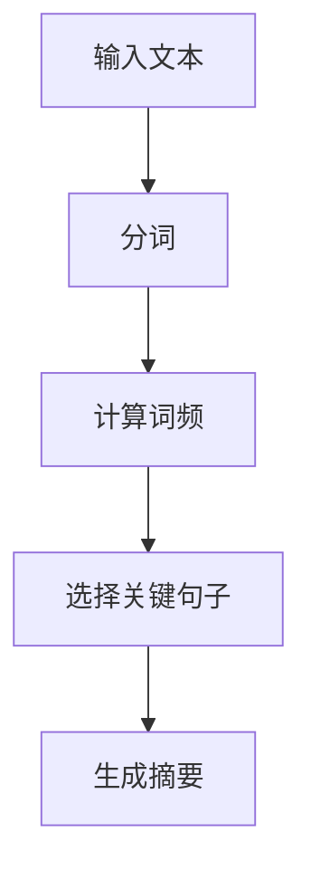
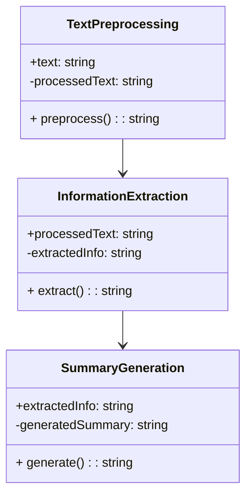
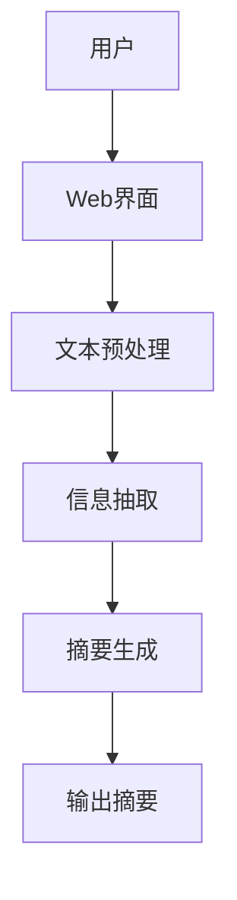

                 


# 构建企业级多语言文本摘要系统：自动生成报告摘要

## 关键词：企业级文本摘要、多语言处理、文本摘要算法、系统架构设计、项目实战

## 摘要：本文详细探讨了构建企业级多语言文本摘要系统的各个方面，包括背景分析、核心概念、算法原理、系统架构设计、项目实战以及最佳实践。通过深入分析和详细讲解，帮助读者理解如何设计和实现一个高效的多语言文本摘要系统，从而能够自动生成报告摘要，满足企业级应用的需求。

---

# 第一部分: 企业级多语言文本摘要系统概述

# 第1章: 多语言文本摘要系统背景介绍

## 1.1 问题背景

### 1.1.1 企业级文本处理的需求

在现代企业中，文本处理的需求日益增长。企业需要处理大量的多语言文本数据，例如客户反馈、市场报告、法律文件等。这些文本数据通常需要被快速摘要以供高层决策者阅读，但手动摘要效率低下且成本高昂。因此，构建一个高效的多语言文本摘要系统成为迫切需求。

### 1.1.2 多语言文本处理的重要性

随着全球化的发展，企业需要处理的文本数据越来越多，且语言种类也愈加多样化。多语言文本处理能够帮助企业跨越语言障碍，更好地理解和利用这些数据，提升竞争力。

### 1.1.3 文本摘要技术的现状与挑战

文本摘要技术经过多年的发展，已经取得了一定的成果，但在多语言环境下仍面临诸多挑战。不同语言的语法结构、词汇差异以及文化背景的差异，使得多语言文本摘要的实现更加复杂。

## 1.2 问题描述

### 1.2.1 文本摘要的定义与目标

文本摘要是指从长文本中提取关键信息，生成简洁的摘要。其目标是保留原文的主要信息和语义，同时减少冗余内容。

### 1.2.2 多语言文本摘要的核心问题

多语言文本摘要的核心问题包括跨语言理解、信息抽取的准确性以及生成摘要的多样性。不同语言的文本结构和语义差异使得摘要生成更具挑战性。

### 1.2.3 企业级应用中的具体需求

企业级应用中，多语言文本摘要系统需要满足高可用性、高性能以及支持多种语言的特点。同时，系统需要能够处理大规模数据，并具备良好的可扩展性。

## 1.3 解决方案概述

### 1.3.1 多语言文本摘要系统的设计目标

系统设计目标包括支持多种语言、高效处理大规模数据、生成高质量摘要等。

### 1.3.2 系统的核心功能与特点

系统核心功能包括文本预处理、信息抽取、摘要生成、多语言支持等。其特点是高效率、高准确率、可扩展性。

### 1.3.3 系统的边界与外延

系统边界包括输入文本、输出摘要以及中间处理过程。外延则涉及文本预处理、后处理等辅助功能。

## 1.4 核心概念与联系

### 1.4.1 核心概念的定义与属性

多语言文本摘要系统的核心概念包括文本处理、信息抽取、摘要生成等。

### 1.4.2 核心概念的对比分析

通过对比分析不同文本摘要方法的优缺点，帮助选择最适合企业需求的算法。

### 1.4.3 ER实体关系图架构

使用Mermaid绘制ER实体关系图，展示系统各实体之间的关系。

```mermaid
erDiagram
    customer[CUSTOMER] {
        code : string
        name : string
        language : string
    }
    text_document[TEXT_DOCUMENT] {
        id : integer
        content : string
        language : string
    }
    summary[SUMMARY] {
        id : integer
        content : string
        language : string
    }
    customer --> text_document : 提交
    text_document --> summary : 生成
```

---

# 第2章: 多语言文本摘要系统的核心概念

## 2.1 多语言文本处理原理

### 2.1.1 多语言文本的特征分析

不同语言的文本特征包括语法结构、词汇频率、语义差异等。

### 2.1.2 多语言文本处理的关键技术

包括语言识别、文本清洗、分词、句法分析等。

### 2.1.3 多语言文本摘要的独特性

多语言文本摘要需要考虑语言间的语义差异，同时保证生成的摘要在多种语言中都具有可读性和准确性。

## 2.2 文本摘要算法原理

### 2.2.1 基于抽取的文本摘要

### 2.2.2 基于生成的文本摘要

### 2.2.3 多语言文本摘要的算法选择

---

# 第3章: 多语言文本摘要算法原理

## 3.1 常见文本摘要算法介绍

### 3.1.1 基于统计的摘要算法

统计模型通过分析文本中词频、句频等信息，提取关键句子或词汇生成摘要。

### 3.1.2 基于神经网络的摘要算法

神经网络模型（如Transformer）通过深度学习技术，学习文本的语义表示，生成连贯的摘要。

### 3.1.3 基于深度学习的摘要算法

深度学习模型通过多层网络结构，提取文本的高层次特征，生成高质量的摘要。

## 3.2 算法原理的数学模型

### 3.2.1 统计模型的数学公式

$$p(\text{摘要} | \text{原文}) = \prod_{i=1}^{n} p(w_i | w_{i-1})$$

### 3.2.2 神经网络模型的数学公式

$$\text{输出} = \text{输入} \times \text{权重矩阵} + \text{偏置}$$

### 3.2.3 深度学习模型的数学公式

$$z = \sigma(Wx + b)$$

## 3.3 算法实现流程图

使用Mermaid绘制算法流程图，展示从输入到输出的处理过程。



---

# 第4章: 系统架构与设计

## 4.1 系统架构设计

### 4.1.1 分层架构设计

系统采用分层架构，包括数据层、业务逻辑层和表现层。

### 4.1.2 模块化设计

系统功能模块化，包括文本预处理、信息抽取、摘要生成等模块。

### 4.1.3 高可用性设计

通过负载均衡、容错设计等提升系统的可用性。

## 4.2 系统功能设计

### 4.2.1 领域模型设计

使用Mermaid绘制领域模型类图，展示系统各模块之间的关系。



### 4.2.2 数据流设计

描述数据在系统中的流动过程。

### 4.2.3 系统接口设计

定义系统对外接口，包括输入接口、输出接口等。

## 4.3 系统架构图

使用Mermaid绘制系统整体架构图，展示各模块的交互关系。



---

# 第5章: 项目实战

## 5.1 环境安装

### 5.1.1 安装Python环境

安装Python 3.8及以上版本。

### 5.1.2 安装相关库

安装必要的库，如spaCy、transformers等。

## 5.2 系统核心实现源代码

### 5.2.1 文本预处理代码

```python
import spacy

nlp = spacy.load("en_core_web_sm")

def preprocess(text):
    doc = nlp(text)
    return " ".join([token.text for token in doc if not token.is_stop])
```

### 5.2.2 摘要生成代码

```python
from transformers import BartForConditionalGeneration, BartTokenizer

tokenizer = BartTokenizer.from_pretrained('facebook/bart-large')
model = BartForConditionalGeneration.from_pretrained('facebook/bart-large')

def generate_summary(text):
    inputs = tokenizer.encode(text, max_length=512, truncation=True, return_tensors='pt')
    outputs = model.generate(inputs, max_length=150, min_length=50, do_sample=False)
    summary = tokenizer.decode(outputs[0])
    return summary
```

## 5.3 实际案例分析

### 5.3.1 案例背景

### 5.3.2 数据准备

### 5.3.3 代码实现与结果展示

### 5.3.4 结果分析

## 5.4 项目小结

总结项目实现的关键点和注意事项。

---

# 第6章: 总结与展望

## 6.1 本章总结

回顾本文的主要内容，强调多语言文本摘要系统的重要性。

## 6.2 未来展望

探讨未来的发展方向，如多模态摘要、实时摘要等。

---

# 参考文献

（此处列出相关文献和资源）

---

通过以上内容，我们可以全面了解如何构建一个高效的企业级多语言文本摘要系统。从背景分析到算法实现，再到系统设计和项目实战，每个环节都进行了详细的探讨和解读，帮助读者掌握构建此类系统的技能和方法。

