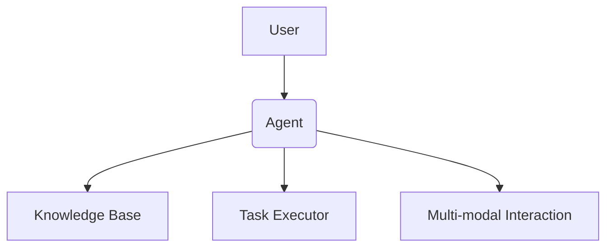

                 


# 构建企业级对话式AI Agent：提升内部沟通效率

## 关键词：企业级AI Agent、对话式AI、内部沟通效率、自然语言处理、系统架构

## 摘要：  
随着企业规模的不断扩大，内部沟通效率成为影响企业运营的关键因素。本文将深入探讨如何利用对话式AI技术构建企业级AI Agent，以提升内部沟通效率。从核心概念到算法实现，再到系统架构设计，本文将全面解析企业级对话式AI Agent的构建过程，为企业在数字化转型中提供新的思路和解决方案。

---

# 第一部分: 背景介绍与核心概念

## 第1章: 对话式AI与企业级AI Agent概述

### 1.1 问题背景与描述

#### 1.1.1 企业内部沟通效率低下现状  
企业在日常运营中，员工之间的沟通效率低下是一个普遍存在的问题。传统的企业内部沟通方式（如邮件、即时通讯工具）存在以下痛点：  
- **信息分散**：员工需要在多个工具中查找信息，效率低。  
- **响应延迟**：员工之间的沟通可能存在时差，导致问题解决速度慢。  
- **信息孤岛**：部门间信息不共享，导致重复劳动和资源浪费。  

#### 1.1.2 对话式AI的出现与应用潜力  
对话式AI（Conversational AI）是一种基于自然语言处理（NLP）技术的智能化交互方式，能够以自然语言形式与用户进行对话。对话式AI的出现为企业内部沟通带来了新的可能性：  
- **实时交互**：用户可以通过对话形式快速获取所需信息或完成任务。  
- **智能化服务**：对话式AI能够理解上下文，并根据用户需求提供个性化服务。  

#### 1.1.3 企业级AI Agent的定义与目标  
企业级AI Agent是一种为企业内部提供智能化服务的代理系统，能够通过对话式交互帮助员工完成任务、解决问题。其目标是：  
- 提高企业内部沟通效率。  
- 实现企业知识库的智能化管理。  
- 提供个性化的员工服务体验。  

---

## 第2章: 对话式AI与企业级AI Agent的核心联系

### 2.1 对话式AI的原理

#### 2.1.1 自然语言处理（NLP）基础  
对话式AI的核心技术是自然语言处理（NLP）。NLP的目标是让计算机能够理解、生成和处理人类语言。以下是NLP的主要技术：  
- **词袋模型（Bag of Words）**：将文本表示为词汇的集合。  
- **词嵌入（Word Embedding）**：通过将词转换为向量表示，捕捉词语之间的语义关系。  
- **序列模型（Sequence Model）**：用于处理序列数据，如RNN（循环神经网络）和Transformer模型。  

#### 2.1.2 生成式AI的实现机制  
生成式AI（Generative AI）是一种能够生成新内容的AI技术，常用于对话式AI中。生成式AI的主要实现机制包括：  
- **解码器（Decoder）**：将输入的序列转换为输出序列。  
- **注意力机制（Attention Mechanism）**：用于捕捉输入序列中的关键信息。  

#### 2.1.3 对话上下文管理  
对话式AI需要管理对话上下文，确保对话的连贯性。以下是常见的上下文管理方法：  
- **基于记忆的上下文管理**：通过记忆网络（Memory Network）记录对话历史。  
- **基于状态的上下文管理**：通过状态机（State Machine）跟踪对话状态。  

### 2.2 企业级AI Agent的架构

#### 2.2.1 知识库构建与管理  
企业级AI Agent需要一个结构化的知识库，用于存储企业内部的知识和信息。知识库的构建与管理包括以下步骤：  
1. 数据收集：从企业内部文档、知识库、历史对话中收集数据。  
2. 数据清洗：去除冗余数据，确保数据质量。  
3. 数据存储：将数据存储到数据库或知识图谱中。  

#### 2.2.2 任务执行与反馈机制  
企业级AI Agent需要能够执行任务并提供反馈。以下是任务执行与反馈机制的关键点：  
- **任务分解**：将复杂任务分解为多个子任务。  
- **任务执行**：通过API调用或其他方式执行任务。  
- **反馈收集**：收集用户对任务执行的反馈，并优化任务执行流程。  

#### 2.2.3 多模态交互能力  
企业级AI Agent需要支持多种交互方式，包括文本、语音和图像等。以下是多模态交互的关键技术：  
- **语音识别（Speech Recognition）**：将语音转换为文本。  
- **图像识别（Image Recognition）**：识别图像中的内容。  
- **多模态融合（Multi-modal Fusion）**：将不同模态的信息融合在一起。  

### 2.3 ER实体关系图

```mermaid
entity User {
  id: string
  name: string
  role: string
}
entity Message {
  id: string
  content: string
  timestamp: datetime
}
entity Agent {
  id: string
  name: string
  knowledge_base: string
}
```

---

# 第二部分: 算法原理与数学模型

## 第3章: 对话式AI的算法原理

### 3.1 生成式AI的算法流程

#### 3.1.1 Transformer模型结构  
Transformer模型是一种基于自注意力机制的深度学习模型，由编码器和解码器组成。以下是Transformer模型的主要组成部分：  
- **编码器**：将输入序列转换为高维向量。  
- **解码器**：将编码器输出的向量转换为目标序列。  

#### 3.1.2 解码器的生成机制  
解码器通过自注意力机制生成对话回复。以下是解码器的生成机制：  
1. 初始化：将输入序列输入解码器。  
2. 自注意力计算：计算输入序列的自注意力权重。  
3. 解码器输出：根据自注意力权重生成对话回复。  

#### 3.1.3 对话策略的优化方法  
对话策略的优化方法包括以下步骤：  
1. 定义目标函数：通常采用交叉熵损失函数。  
2. 参数优化：通过反向传播算法优化模型参数。  
3. 模型评估：通过验证集评估模型性能。  

### 3.2 算法实现代码示例

```python
def generate_response(prompt, model):
    response = model.generate(
        inputs=prompt,
        max_length=50,
        temperature=0.7,
        top_p=0.9
    )
    return response
```

### 3.3 数学模型与公式

#### 3.3.1 Transformer模型的自注意力机制  
自注意力机制的公式如下：  
$$ \text{Attention}(Q,K,V) = \text{softmax}\left(\frac{QK^T}{\sqrt{d_k}}\right)V $$  
其中，\( Q \) 是查询向量，\( K \) 是键向量，\( V \) 是值向量，\( d_k \) 是向量的维度。

---

# 第三部分: 系统分析与架构设计方案

## 第4章: 系统分析与架构设计

### 4.1 系统分析

#### 4.1.1 问题场景介绍  
企业级对话式AI Agent需要解决以下问题：  
- **信息查询**：员工可以通过对话形式快速查询企业内部信息。  
- **任务分配**：AI Agent可以根据员工需求自动分配任务。  
- **内部客服**：员工可以通过对话形式向内部客服咨询问题。  

#### 4.1.2 系统功能设计  
以下是系统功能设计的主要模块：  
1. **知识库管理模块**：负责知识库的构建与管理。  
2. **任务执行模块**：负责任务的分配与执行。  
3. **多模态交互模块**：支持多种交互方式。  

#### 4.1.3 系统架构设计  



---

## 第5章: 项目实战

### 5.1 环境安装

#### 5.1.1 安装Python和深度学习框架  
以下是安装Python和深度学习框架的命令：  
```bash
python --version
pip install numpy
pip install tensorflow
pip install transformers
```

#### 5.1.2 安装对话式AI框架  
以下是安装对话式AI框架的命令：  
```bash
pip install transformers
pip install torch
```

### 5.2 核心代码实现

#### 5.2.1 对话式AI模型实现

```python
from transformers import AutoTokenizer, AutoModelForSeq2Seq
import torch

class ConversationAI:
    def __init__(self, model_name):
        self.tokenizer = AutoTokenizer.from_pretrained(model_name)
        self.model = AutoModelForSeq2Seq.from_pretrained(model_name)
    
    def generate_response(self, prompt):
        inputs = self.tokenizer(prompt, return_tensors="pt")
        outputs = self.model.generate(inputs.input_ids, max_length=50, temperature=0.7, top_p=0.9)
        response = self.tokenizer.decode(outputs[0], skip_special_tokens=True)
        return response
```

#### 5.2.2 企业级AI Agent实现

```python
from conversation_ai import ConversationAI
import json

class EnterpriseAI-Agent:
    def __init__(self, model_name, knowledge_base):
        self.ai = ConversationAI(model_name)
        self.knowledge_base = knowledge_base
    
    def process_query(self, query):
        response = self.ai.generate_response(query)
        return response
```

### 5.3 项目小结

#### 5.3.1 项目成果  
通过本项目，我们成功构建了一个企业级对话式AI Agent，能够帮助企业提升内部沟通效率。

#### 5.3.2 注意事项  
企业在实施对话式AI Agent时需要注意以下几点：  
- 数据安全：确保企业内部数据的安全性。  
- 模型优化：不断优化对话式AI模型，提升用户体验。  
- 用户隐私：保护用户隐私，确保符合相关法律法规。

---

## 第6章: 最佳实践与总结

### 6.1 最佳实践

#### 6.1.1 数据质量管理  
企业需要确保知识库中的数据质量，避免重复和错误。  

#### 6.1.2 模型优化  
企业需要不断优化对话式AI模型，提升模型的准确性和响应速度。  

#### 6.1.3 用户隐私保护  
企业需要重视用户隐私保护，确保符合相关法律法规。  

### 6.2 小结  
通过构建企业级对话式AI Agent，企业可以显著提升内部沟通效率，优化资源配置，提高员工满意度。对话式AI技术的应用前景广阔，值得企业在未来持续投入和探索。

---

## 第7章: 拓展阅读与深入思考

### 7.1 拓展阅读

#### 7.1.1 生成式AI的最新研究  
阅读生成式AI的最新研究论文，了解技术发展趋势。  

#### 7.1.2 对话式AI在其他领域的应用  
探索对话式AI在其他领域的应用，如教育、医疗等。  

### 7.2 深入思考

#### 7.2.1 对话式AI的伦理问题  
思考对话式AI的伦理问题，如隐私保护、数据滥用等。  

#### 7.2.2 对话式AI的未来发展方向  
展望对话式AI的未来发展方向，如多模态交互、自适应学习等。  

---

# 结语

构建企业级对话式AI Agent是一项复杂而富有挑战性的任务，但其带来的好处也是显而易见的。通过本文的系统介绍，我们希望能够为企业在构建对话式AI Agent的过程中提供有价值的参考和指导。未来，随着AI技术的不断发展，企业级对话式AI Agent将在更多领域发挥重要作用，为企业创造更大的价值。

