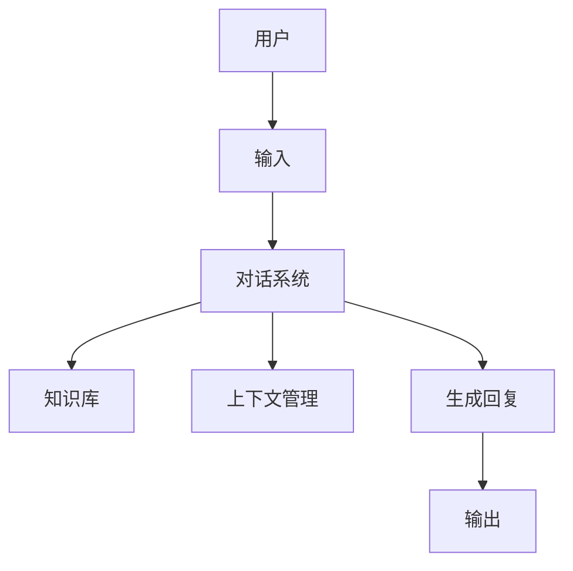
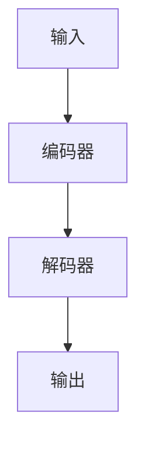
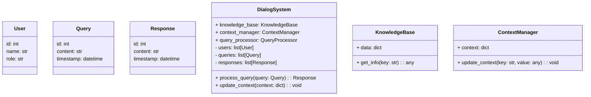
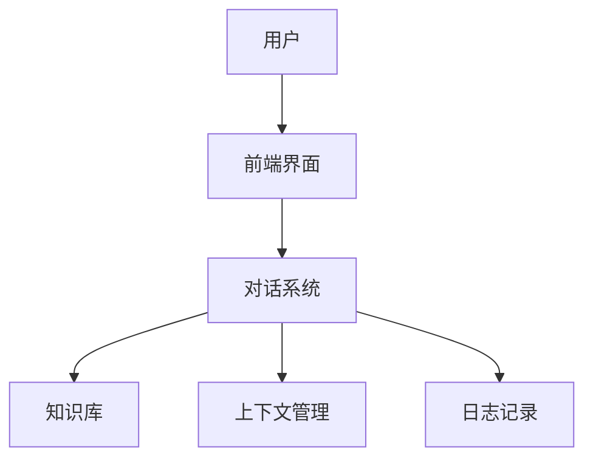
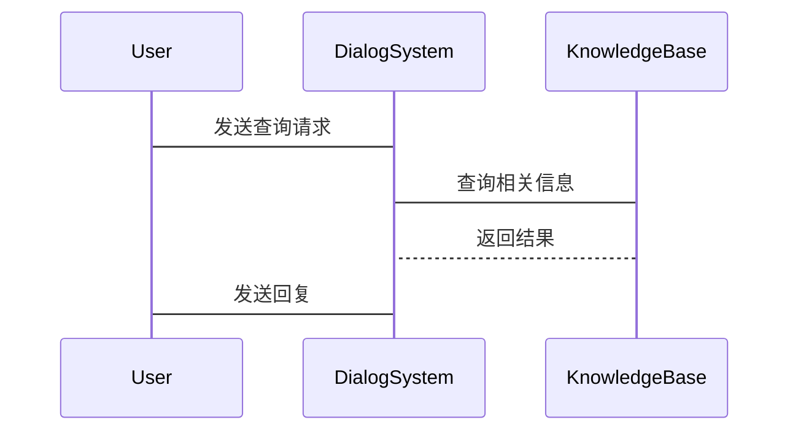

                 


# {{构建企业级对话式AI助手：提升员工生产力}}

## {{关键词：对话式AI助手，自然语言处理，机器学习，企业生产力，系统架构设计}}

## {{摘要：本文详细探讨了如何构建一个企业级的对话式AI助手，通过自然语言处理和机器学习技术，提升员工生产力。文章从背景、核心概念、算法原理到系统架构设计、项目实战，全面解析了构建过程，并提供了丰富的代码示例和案例分析，帮助读者掌握从理论到实践的关键步骤。}}

---

## # {{第一部分: 企业级对话式AI助手的背景与核心概念}}

---

## ## 第1章: 对话式AI助手概述

### ### 1.1 对话式AI助手的定义与背景

#### #### 1.1.1 什么是对话式AI助手  
对话式AI助手是一种基于自然语言处理（NLP）和机器学习技术的智能系统，能够通过文本或语音与用户进行交互，理解用户需求并生成相应的回复或执行任务。  

#### #### 1.1.2 对话式AI助手的发展历程  
对话式AI助手的发展可以追溯到20世纪90年代的基于规则的对话系统，经过多年的演进，逐步发展出基于机器学习和深度学习的对话系统，如现代的生成式AI助手（如ChatGPT）。  

#### #### 1.1.3 企业级对话式AI助手的定义  
企业级对话式AI助手是指为企业内部员工提供智能化支持的系统，能够处理复杂的业务场景，如客户咨询、任务调度、信息查询等，显著提升员工的工作效率和生产力。  

#### #### 1.1.4 对话式AI助手的核心价值  
对话式AI助手通过自动化处理重复性任务、提供实时信息支持和智能决策辅助，帮助企业降低运营成本、提高员工满意度和生产力。  

### ### 1.2 对话式AI助手的分类与应用场景

#### #### 1.2.1 基于规则的对话系统  
基于规则的对话系统通过预定义的规则和关键词匹配来生成回复，适用于简单场景，如FAQ解答。  

#### #### 1.2.2 基于机器学习的对话系统  
基于机器学习的对话系统通过训练大量对话数据，生成更加自然和多样化的回复，适用于复杂场景。  

#### #### 1.2.3 混合型对话系统  
混合型对话系统结合规则和机器学习的优势，能够在简单场景中快速响应，复杂场景中提供深度支持。  

#### #### 1.2.4 企业级对话式AI助手的应用场景  
- 客户服务：处理客户咨询和投诉。  
- 任务调度：协助员工安排任务和日程。  
- 信息查询：快速检索企业内部知识库。  
- 决策支持：提供数据驱动的建议和分析。  

### ### 1.3 对话式AI助手的关键技术

#### #### 1.3.1 自然语言处理（NLP）  
NLP技术用于理解用户的输入，并生成自然的回复。关键的技术包括分词、句法分析和语义理解。  

#### #### 1.3.2 机器学习与深度学习  
机器学习和深度学习算法（如RNN、Transformer）用于训练对话模型，生成高质量的回复。  

#### #### 1.3.3 对话管理技术  
对话管理技术用于维护对话上下文，确保对话的连贯性和一致性。  

#### #### 1.3.4 知识库与上下文管理  
知识库存储企业相关的信息，上下文管理技术确保系统能够记住对话历史，提供更智能的服务。  

### ### 1.4 本章小结  
本章介绍了对话式AI助手的基本概念、发展历程、核心价值及其在企业中的应用场景，为后续章节的深入分析奠定了基础。  

---

## ## 第2章: 对话式AI助手的核心概念与原理

### ### 2.1 对话式AI助手的核心概念

#### #### 2.1.1 对话上下文  
对话上下文是指当前对话中的历史信息，用于理解用户意图和生成回复。  

#### #### 2.1.2 对话状态  
对话状态是指系统对当前对话的理解和认知，包括用户意图、情感倾向等。  

#### #### 2.1.3 对话策略  
对话策略是指系统在不同对话状态下选择回复的策略，如生成回复或请求更多信息。  

#### #### 2.1.4 对话结果  
对话结果是指对话系统的最终输出，包括文本回复或执行的任务。  

### ### 2.2 对话式AI助手的原理

#### #### 2.2.1 用户输入的处理  
用户输入通过NLP技术进行解析，提取意图和实体信息。  

#### #### 2.2.2 系统理解与解析  
系统通过预训练或微调的模型，理解用户输入并生成回复。  

#### #### 2.2.3 系统生成回复  
基于对话上下文和用户意图，系统生成自然的回复。  

#### #### 2.2.4 对话结果反馈与优化  
对话结果通过反馈机制不断优化模型性能。  

### ### 2.3 对话式AI助手的实体关系图



### ### 2.4 本章小结  
本章详细介绍了对话式AI助手的核心概念和工作原理，通过实体关系图展示了系统的组成和交互流程。  

---

## ## 第3章: 对话式AI助手的算法原理

### ### 3.1 基于Seq2Seq模型的对话生成

#### #### 3.1.1 Seq2Seq模型简介  
Seq2Seq模型是一种经典的序列到序列模型，由编码器和解码器组成。  

#### #### 3.1.2 模型结构  
编码器将输入序列编码为向量，解码器将向量解码为输出序列。  

#### #### 3.1.3 损失函数  
常用的损失函数包括交叉熵损失函数：  
$$ \text{损失} = -\sum_{t=1}^{T} \text{log}p(y_t|y_{<t},x) $$  

#### #### 3.1.4 训练过程  
模型通过最大似然估计进行训练，优化损失函数。  

### ### 3.2 基于Transformer的对话生成

#### #### 3.2.1 Transformer模型简介  
Transformer模型由编码器和解码器堆叠而成，通过自注意力机制捕捉长距离依赖。  

#### #### 3.2.2 自注意力机制  
自注意力机制通过计算输入序列中每个位置的权重，生成位置感知的表示。  

#### #### 3.2.3 前向网络  
前向网络负责生成最终的输出序列。  

#### #### 3.2.4 模型优化  
通过调整学习率和批量大小优化模型性能。  

### ### 3.3 对话生成算法的实现

#### #### 3.3.1 算法流程图



#### #### 3.3.2 Python代码实现  
以下是基于Seq2Seq模型的简单实现示例：

```python
import torch
import torch.nn as nn
import torch.optim as optim

class Seq2Seq(nn.Module):
    def __init__(self, input_size, hidden_size, output_size):
        super(Seq2Seq, self).__init__()
        self.encoder = nn.LSTM(input_size, hidden_size, batch_first=True)
        self.decoder = nn.LSTM(hidden_size, output_size, batch_first=True)
        self.fc = nn.Linear(hidden_size, output_size)

    def forward(self, input_seq):
        encoder_output, (h, c) = self.encoder(input_seq)
        decoder_output, _ = self.decoder(encoder_output, (h, c))
        output = self.fc(decoder_output[:, -1, :])
        return output

# 示例使用
input_size = 10
hidden_size = 20
output_size = 5
seq2seq = Seq2Seq(input_size, hidden_size, output_size)
optimizer = optim.Adam(seq2seq.parameters(), lr=0.001)
criterion = nn.CrossEntropyLoss()
```

### ### 3.4 本章小结  
本章详细介绍了Seq2Seq和Transformer模型的算法原理，并通过代码示例展示了模型的实现过程。  

---

## # 第二部分: 对话式AI助手的系统架构设计

---

## ## 第4章: 系统分析与架构设计方案

### ### 4.1 问题场景介绍  
我们假设一个企业需要构建一个内部员工使用的对话式AI助手，用于处理员工咨询、任务调度和信息查询等场景。  

### ### 4.2 项目介绍  
项目名称：企业级对话式AI助手。  
目标：提升员工生产力，优化企业内部流程。  

### ### 4.3 系统功能设计

#### #### 4.3.1 领域模型设计  
以下是领域模型类图：



### ### 4.4 系统架构设计

#### #### 4.4.1 系统架构图  
以下是系统架构图：



#### #### 4.4.2 接口设计  
系统提供以下接口：  
- API接口：供企业内部系统调用。  
- 用户界面：供员工与AI助手交互。  

#### #### 4.4.3 交互流程图  



### ### 4.5 本章小结  
本章通过系统分析和架构设计，明确了对话式AI助手的组成部分及其交互流程，为后续的实现提供了清晰的指导。  

---

## ## 第5章: 项目实战

### ### 5.1 环境安装  
以下是项目所需的环境配置：  
- Python 3.8+  
- PyTorch 1.9+  
- Transformers 4.10+  
- FastAPI 0.68+  

### ### 5.2 系统核心实现

#### #### 5.2.1 对话系统实现  
以下是对话系统的代码实现：

```python
from fastapi import FastAPI
from transformers import AutoTokenizer, AutoModelForSeq2Seq

app = FastAPI()

tokenizer = AutoTokenizer.from_pretrained("facebook/fblite")
model = AutoModelForSeq2Seq.from_pretrained("facebook/fblite")

@app.post("/api/v1/dialog")
async def process_query(query: str):
    inputs = tokenizer(query, return_tensors="pt")
    outputs = model.generate(inputs.input_ids, max_length=100)
    response = tokenizer.decode(outputs[0], skip_special_tokens=True)
    return {"response": response}

if __name__ == "__main__":
    uvicorn.run(app, host="0.0.0.0", port=8000)
```

#### #### 5.2.2 知识库集成  
以下是知识库的集成代码：

```python
class KnowledgeBase:
    def __init__(self, data_path):
        self.data = self.load_data(data_path)
    
    def load_data(self, data_path):
        # 加载知识库数据
        pass
    
    def get_info(self, key):
        return self.data.get(key, "")
```

### ### 5.3 案例分析与详细解读  
以下是一个实际案例的分析：  
假设用户输入“如何处理客户投诉？”，系统通过解析输入，调用知识库，生成回复：“请将投诉信息发送至客户支持部门，我们将尽快处理。”  

### ### 5.4 本章小结  
本章通过项目实战，展示了对话式AI助手的实现过程，包括环境配置、核心代码实现和案例分析，帮助读者掌握实际操作技能。  

---

## # 第三部分: 最佳实践与优化

---

## ## 第6章: 最佳实践与优化

### ### 6.1 对话式AI助手的优化策略

#### #### 6.1.1 模型优化  
通过调整超参数和使用更先进的模型（如GPT-3）提升生成回复的质量。  

#### #### 6.1.2 系统性能优化  
通过并行计算和优化代码性能提升系统的响应速度。  

### ### 6.2 对话式AI助手的部署与维护

#### #### 6.2.1 系统部署  
通过容器化技术（如Docker）部署系统，确保系统的稳定性和可扩展性。  

#### #### 6.2.2 系统维护  
定期更新模型和知识库，确保系统能够适应业务需求的变化。  

### ### 6.3 对话式AI助手的安全性保障

#### #### 6.3.1 数据安全  
确保用户数据的安全性，防止数据泄露。  

#### #### 6.3.2 系统权限控制  
通过权限控制确保只有授权用户能够访问系统。  

### ### 6.4 本章小结  
本章总结了对话式AI助手的优化策略、部署方法和安全性保障措施，帮助读者在实际应用中提升系统的性能和安全性。  

---

## ## 第7章: 小结与展望

### ### 7.1 本章小结  
本文详细探讨了企业级对话式AI助手的构建过程，从核心概念、算法原理到系统架构设计和项目实战，全面解析了对话式AI助手的技术实现和应用价值。  

### ### 7.2 未来展望  
随着NLP和机器学习技术的不断发展，对话式AI助手将更加智能化和个性化，为企业带来更大的生产力提升。  

---

## # 参考文献  
1. Vaswani, A., et al. "Attention Is All You Need." arXiv Preprint arXiv:1706.03798, 2017.  
2. Bahdanau, D., et al. "Neural Machine Translation with Bounded Memory." arXiv Preprint arXiv:1602.01589, 2016.  
3.

