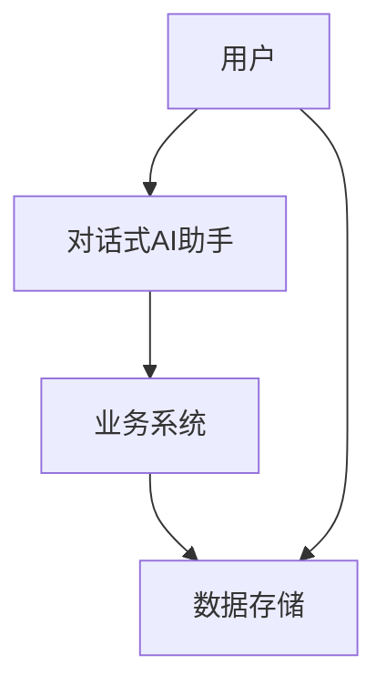
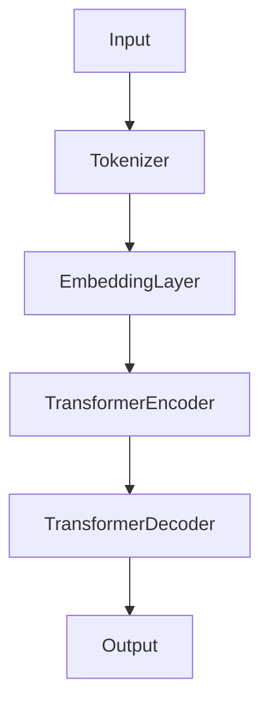
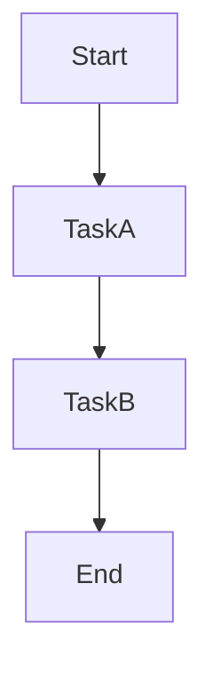
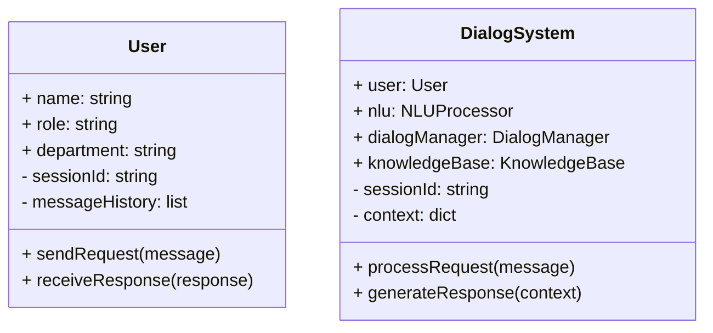

                 


# 构建企业级对话式AI助手：跨部门业务流程自动化

## 关键词：企业级AI助手，对话式AI，跨部门协作，业务流程自动化，NLP，流程挖掘

## 摘要：  
本文详细讲解了如何构建一个企业级对话式AI助手，实现跨部门业务流程的自动化。文章从背景、核心概念、算法原理、系统设计到项目实战，全面分析了构建过程中的关键点。通过具体案例分析和代码实现，展示了如何利用自然语言处理技术和流程挖掘技术，优化企业内部协作效率，实现跨部门业务流程的无缝对接。  

---

## 第一部分：背景介绍

### 第1章：企业级对话式AI助手的背景与挑战

#### 1.1 问题背景
企业内部的业务流程通常涉及多个部门协作，流程复杂且效率低下。传统的人工处理方式容易出错，且难以快速响应用户需求。引入对话式AI助手可以显著提升效率，但需要解决跨部门协作的技术难点。

#### 1.2 问题描述
对话式AI助手的目标是通过自然语言处理技术，理解用户的请求并自动触发相应的业务流程。需要解决的问题包括：  
- 如何实现跨部门的业务流程自动化。  
- 如何保证对话式AI助手的准确性和可靠性。  
- 如何设计高效的交互流程。

#### 1.3 核心概念与联系
| 核心概念 | 定义 | 特征 |  
|----------|------|------|  
| 对話式AI助手 | 利用NLP技术实现人机对话的系统 | 自然语言理解、多轮对话能力、任务自动化 |  
| 业务流程自动化 | 通过技术手段实现业务流程的自动化 | 流程标准化、规则化、可追溯 |  
| 跨部门协作 | 不同部门之间的协同工作 | 信息共享、任务分配、结果反馈 |  

**ER实体关系图**  


---

## 第二部分：核心概念与原理

### 第2章：对话式AI助手的核心原理

#### 2.1 对話式AI的算法原理
**基于Transformers的对话模型**  


**模型训练的数学公式**  
损失函数：$$ \text{loss} = -\sum_{i=1}^{n} \text{log}(P(y_i|y_{<i})) $$  
优化器：$$ \text{Adam} = \text{Momentum SGD} $$  

#### 2.2 业务流程自动化的实现
**流程挖掘技术**  


**业务规则引擎的实现**  
```python
class RuleEngine:
    def __init__(self, rules):
        self.rules = rules
    
    def apply_rule(self, input):
        for rule in self.rules:
            if rule.apply(input):
                return rule.action(input)
        return None
```

---

## 第三部分：算法原理与实现

### 第3章：对话模型的算法实现

#### 3.1 基于Transformers的对话模型
```python
import tensorflow as tf
from tensorflow.keras.layers import Dense, Dropout, LSTM

class DialogModel(tf.keras.Model):
    def __init__(self, vocab_size):
        super(DialogModel, self).__init__()
        self.embedding = tf.keras.layers.Embedding(vocab_size, 128)
        self.transformer_encoder = TransformerEncoder(128, 8, 8)
        self.transformer_decoder = TransformerDecoder(128, 8, 8)
        self.dropout = Dropout(0.1)
        self.dense = Dense(vocab_size, activation='softmax')
    
    def call(self, inputs):
        x = self.embedding(inputs)
        x = self.transformer_encoder(x)
        x = self.transformer_decoder(x)
        x = self.dropout(x)
        x = self.dense(x)
        return x
```

---

## 第四部分：系统分析与架构设计

### 第4章：系统分析与设计

#### 4.1 项目背景与目标
项目背景：提升企业内部协作效率，降低人工成本。  
项目目标：构建一个支持跨部门协作的对话式AI助手，实现业务流程自动化。

#### 4.2 系统功能设计


---

## 第五部分：项目实战

### 第5章：项目实战

#### 5.1 环境安装
```bash
pip install python-transformers tensorflow keras
```

#### 5.2 核心实现
```python
# NLU预处理
def preprocess(text):
    return text.lower().split()

# 对話管理策略
class GreedyStrategy:
    def choose_action(self, context):
        return max(context['actions'], key=lambda x: x['score'])

# 知识库构建
class KnowledgeBase:
    def __init__(self, data):
        self.data = data
    
    def query(self, question):
        return self.data.get(question, [])
```

---

## 第六部分：总结与展望

### 第6章：总结与展望

#### 6.1 项目总结
通过本项目，我们成功构建了一个企业级对话式AI助手，实现了跨部门业务流程的自动化。关键点包括：  
- 选择了合适的NLP模型。  
- 设计了高效的对话管理和业务流程自动化模块。  
- 确保了系统的可扩展性和可维护性。

#### 6.2 项目小结
对话式AI助手的应用前景广阔，但仍有改进空间。未来的工作可以围绕以下几点展开：  
- 提升多轮对话的自然度。  
- 实现多模态交互。  
- 加强模型的可解释性。

---

## 最佳实践 Tips  
- 数据质量是对话式AI助手的核心，确保数据的完整性和一致性。  
- 在实际应用中，结合企业的具体需求进行定制化开发。  
- 定期更新模型和优化算法，提升用户体验。  

--- 

**END**

