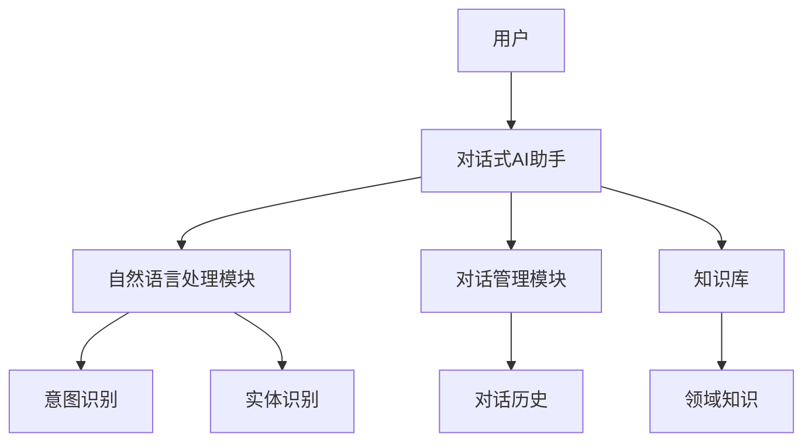
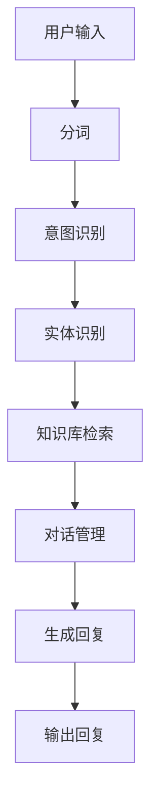
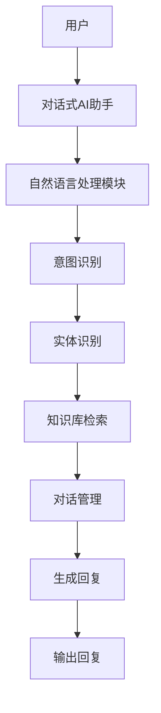

                 


# {{构建企业级对话式AI助手：跨部门业务流程自动化与协同}}

> 关键词：企业级AI助手，对话式AI，跨部门协作，业务流程自动化，NLP技术

> 摘要：本文将详细探讨如何构建一个企业级的对话式AI助手，以实现跨部门的业务流程自动化与协同。通过分析对话式AI的核心技术、系统架构设计、跨部门协作的实际应用案例，以及项目实施的最佳实践，本文将为读者提供一个全面的视角，帮助企业在数字化转型中更高效地实现业务目标。

---

# 第1章: 对话式AI助手的背景与核心概念

## 1.1 对话式AI助手的定义与核心概念

### 1.1.1 对话式AI助手的定义
对话式AI助手是一种基于自然语言处理（NLP）技术的智能系统，能够通过文本或语音与用户进行交互，理解用户意图并提供相应的信息或执行操作。它能够模拟人类的对话方式，帮助用户完成多种任务。

### 1.1.2 对话式AI助手的核心要素
- **自然语言处理（NLP）**：实现对用户输入的文本理解和生成。
- **对话管理**：跟踪对话上下文，确保对话的连贯性和逻辑性。
- **知识库**：存储领域知识和业务规则，用于回答用户问题和执行任务。
- **意图识别**：识别用户的意图和需求，匹配相应的服务或操作。

### 1.1.3 对话式AI助手的边界与外延
对话式AI助手的边界包括用户输入、对话历史和知识库的访问范围。外延则涉及与企业现有系统的集成，如CRM、ERP等。

## 1.2 企业级对话式AI助手的应用场景

### 1.2.1 企业内部协作场景
- 信息查询与共享：员工可以通过对话式AI助手快速获取企业内部知识库的信息。
- 任务分配与跟踪：AI助手可以协助HR部门进行任务分配和进度跟踪。

### 1.2.2 客户服务与支持场景
- 客户咨询与问题解决：AI助手可以为客户提供7x24小时的在线支持。
- 客户反馈收集：通过对话式交互收集客户意见，优化服务质量。

### 1.2.3 业务流程自动化场景
- 自动化审批流程：AI助手可以协助员工完成审批流程的自动化操作。
- 数据录入与处理：AI助手可以自动录入和处理业务数据，减少人工操作。

## 1.3 问题背景与挑战

### 1.3.1 传统业务流程中的痛点
- 信息孤岛：各部门之间信息不共享，导致效率低下。
- 人工成本高：传统业务流程依赖大量人工操作，效率低下且容易出错。
- 用户体验差：传统系统操作复杂，用户难以快速获取所需信息。

### 1.3.2 对话式AI助手的解决思路
- 提供统一的交互界面：通过对话式AI助手实现跨部门的统一入口。
- 实现自动化与智能化：利用AI技术优化业务流程，减少人工干预。
- 提升用户体验：通过自然语言交互，让用户更便捷地获取信息和服务。

### 1.3.3 实施中的主要挑战
- 数据孤岛问题：如何整合各部门的数据，建立统一的知识库。
- 对话管理的复杂性：如何处理多轮对话中的上下文和意图。
- 系统集成与兼容性：如何与现有企业系统（如ERP、CRM）无缝集成。

## 1.4 本章小结
本章介绍了对话式AI助手的定义、核心要素和应用场景，并分析了企业在实施对话式AI助手时可能面临的挑战。接下来的章节将详细探讨对话式AI的技术基础和系统实现。

---

# 第2章: 对话式AI助手的核心概念与联系

## 2.1 对话式AI助手的核心概念

### 2.1.1 自然语言处理（NLP）
NLP是对话式AI的核心技术之一，负责理解和生成自然语言文本。主要技术包括分词、句法分析、语义理解等。

### 2.1.2 对话管理
对话管理负责跟踪对话的上下文，理解用户意图，并根据业务规则生成回复。常用的技术包括基于规则的对话管理和基于深度学习的对话管理。

### 2.1.3 知识库与意图识别
知识库存储了对话式AI助手所需的知识和业务规则，意图识别则是通过分析用户输入来确定用户的意图。

## 2.2 核心概念的属性特征对比

### 2.2.1 NLP与传统文本处理的对比
| 特性         | NLP处理         | 传统文本处理   |
|--------------|----------------|----------------|
| 输入          | 自然语言文本     | 结构化数据       |
| 输出          | 理解与生成       | 简单文本操作     |
| 技术复杂度    | 高             | 低             |

### 2.2.2 对话管理与规则引擎的对比
| 特性         | 对话管理         | 规则引擎         |
|--------------|----------------|----------------|
| 输入          | 对话历史和上下文   | 结构化数据规则     |
| 输出          | 自然语言回复     | 结构化数据结果     |
| 灵活性        | 高             | 低             |

### 2.2.3 知识库与搜索引擎的对比
| 特性         | 知识库         | 搜索引擎         |
|--------------|----------------|----------------|
| 数据存储方式 | 结构化知识库     | 非结构化数据       |
| 查询方式     | 基于意图和实体   | 基于关键词       |
| 检索效率     | 高             | 中等           |

## 2.3 实体关系图（ER图）


## 2.4 本章小结
本章详细介绍了对话式AI助手的核心概念，并通过对比和ER图展示了这些概念之间的关系。下一章将深入探讨对话式AI助手的算法原理。

---

# 第3章: 对话式AI助手的算法原理

## 3.1 自然语言处理（NLP）算法

### 3.1.1 分词算法
分词算法将连续的文本分割成有意义的词语或短语。常用算法包括基于规则的分词和基于统计的分词。

### 3.1.2 意图识别算法
意图识别算法通过分析用户输入的文本，确定用户的意图。常用算法包括基于模板的意图识别和基于机器学习的意图识别。

### 3.1.3 实体识别算法
实体识别算法从文本中提取出具有特定意义的实体，如人名、地名、组织名等。常用算法包括基于规则的实体识别和基于深度学习的实体识别。

## 3.2 对话管理算法

### 3.2.1 基于规则的对话管理
基于规则的对话管理通过预定义的规则来决定对话的下一步操作。规则可以基于对话历史、用户意图和系统状态。

### 3.2.2 基于深度学习的对话管理
基于深度学习的对话管理使用神经网络模型来学习对话的模式和上下文，生成更自然的回复。

### 3.2.3 对话状态转移矩阵
对话状态转移矩阵是一种基于马尔可夫链的对话管理方法，通过状态转移概率来决定对话的下一步操作。

## 3.3 知识库检索算法

### 3.3.1 基于关键词的检索
基于关键词的检索通过匹配用户输入中的关键词，在知识库中查找相关的信息。

### 3.3.2 基于向量的检索
基于向量的检索将文本转换为向量表示，通过计算向量的相似度来检索最相关的知识。

### 3.3.3 基于上下文的检索
基于上下文的检索考虑了对话历史和上下文信息，结合意图和实体进行知识检索。

## 3.4 算法流程图


## 3.5 本章小结
本章详细介绍了对话式AI助手的算法原理，包括NLP算法、对话管理算法和知识库检索算法。下一章将讨论系统分析与架构设计。

---

# 第4章: 对话式AI助手的系统分析与架构设计

## 4.1 系统功能设计

### 4.1.1 用户交互界面
用户交互界面是用户与对话式AI助手的接口，包括文本输入框和显示结果的区域。

### 4.1.2 后台处理逻辑
后台处理逻辑包括NLP处理、对话管理、知识库检索等模块。

### 4.1.3 知识库管理
知识库管理包括知识的录入、更新和维护，确保知识库的内容准确性和及时性。

## 4.2 系统架构设计

### 4.2.1 面向服务架构（SOA）
面向服务架构将系统功能划分为多个服务，通过服务总线进行通信。

### 4.2.2 微服务架构
微服务架构将系统功能分解为多个独立的服务，每个服务负责特定的功能模块。

### 4.2.3 分层架构
分层架构将系统分为表示层、业务逻辑层和数据访问层，每一层负责不同的功能。

## 4.3 系统接口设计

### 4.3.1 对外接口
对外接口包括API接口和WebSocket接口，用于与其他系统的集成。

### 4.3.2 对内接口
对内接口包括模块之间的通信接口和数据库访问接口。

## 4.4 系统交互流程图


## 4.5 本章小结
本章讨论了对话式AI助手的系统功能设计、架构设计和接口设计，并通过流程图展示了系统的交互流程。下一章将介绍项目的实战案例和最佳实践。

---

# 第5章: 项目实战与最佳实践

## 5.1 环境安装与配置

### 5.1.1 开发环境
开发环境包括操作系统、编程语言和开发工具的安装与配置。

### 5.1.2 依赖管理
依赖管理包括安装所需的第三方库和工具，如Python的NLTK库和深度学习框架。

## 5.2 系统核心实现

### 5.2.1 NLP模块实现
NLP模块实现包括分词、意图识别和实体识别的代码实现。

### 5.2.2 对话管理模块实现
对话管理模块实现包括基于规则和基于深度学习的对话管理代码。

### 5.2.3 知识库检索模块实现
知识库检索模块实现包括基于关键词和基于向量的检索算法代码。

## 5.3 代码应用与解读

### 5.3.1 核心代码示例
```python
def intent_recognition(text):
    # 实现意图识别算法
    pass

def entity_recognition(text):
    # 实体识别算法实现
    pass

class DialogManager:
    def __init__(self):
        self.dialog_history = []
    
    def process_input(self, input_text):
        # 处理输入文本
        pass
```

### 5.3.2 代码解读
通过对核心代码的解读，详细分析了对话式AI助手的实现过程。

## 5.4 实际案例分析

### 5.4.1 跨部门协作案例
通过一个跨部门协作的案例，展示了对话式AI助手在实际应用中的效果。

### 5.4.2 项目管理经验
分享了项目实施中的经验和教训，提出了改进建议。

## 5.5 本章小结
本章通过项目实战和代码解读，展示了对话式AI助手的实现过程和实际应用案例。最后一章将总结全书内容并展望未来发展方向。

---

# 第6章: 总结与展望

## 6.1 全书总结
总结了对话式AI助手的核心概念、算法原理和系统实现，回顾了项目实战中的经验和教训。

## 6.2 未来展望
展望了对话式AI助手的发展趋势，提出了未来的研究方向和应用场景。

## 6.3 最佳实践Tips
给出了在实施对话式AI助手项目时的最佳实践建议。

## 6.4 本章小结
本章总结了全书内容，并对未来的发展进行了展望，提出了读者在实际项目中需要注意的事项。

---

通过以上目录结构，我们可以清晰地看到构建企业级对话式AI助手的完整过程，从理论到实践，从技术到应用，层层深入，确保读者能够全面掌握相关知识和技能。

