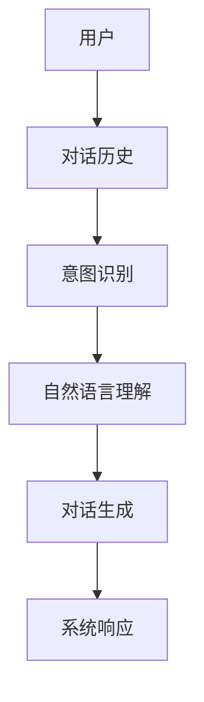
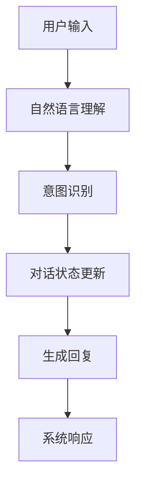
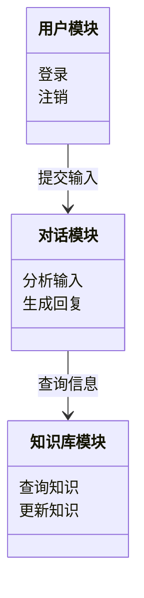
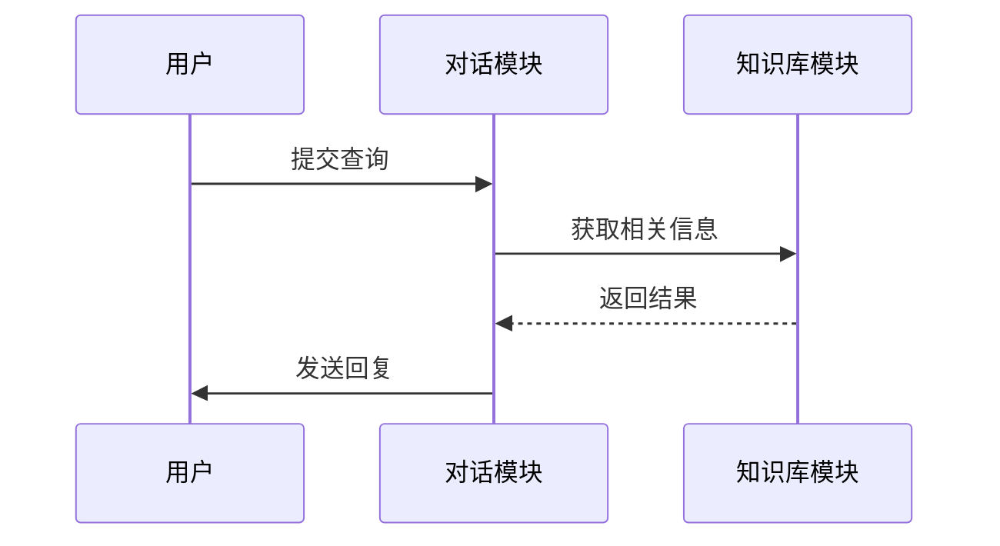

                 


# 构建企业级对话式AI平台：提升内外部沟通效率

## 关键词：企业级AI平台、对话式AI、自然语言处理、沟通效率、系统架构

## 摘要：企业级对话式AI平台通过自然语言处理和机器学习技术，显著提升了内部和外部的沟通效率。本文详细分析了平台构建的背景、核心技术和系统架构，提供了实际案例和最佳实践。

---

## 第一部分: 背景介绍

### 第1章: 问题背景与需求分析

#### 1.1 问题背景
- **1.1.1 传统企业沟通效率的瓶颈**
  传统企业沟通依赖邮件、会议和即时通讯工具，效率低下，信息传递不及时，跨部门协作困难。
- **1.1.2 对话式AI的兴起与应用前景**
  对话式AI技术的进步使其在客服、销售和内部协作等领域展现出巨大潜力。
- **1.1.3 企业级对话式AI的必要性**
  通过AI平台实现自动化沟通，降低人工成本，提升响应速度和准确性。

#### 1.2 问题描述
- **1.2.1 企业内外部沟通的主要问题**
  沟通渠道分散，信息不一致，员工效率低下，客户体验差。
- **1.2.2 对话式AI在企业沟通中的角色**
  作为24/7可用的智能助手，处理常见问题，自动化任务。
- **1.2.3 企业级对话式AI平台的目标**
  提供统一的沟通入口，优化流程，提升效率和客户满意度。

#### 1.3 问题解决与边界
- **1.3.1 对话式AI平台的核心解决方案**
  利用NLP和机器学习，实现智能对话处理。
- **1.3.2 企业级平台的边界与外延**
  专注于企业内部和客户沟通，不涉及其他业务系统。
- **1.3.3 沟通效率提升的关键因素**
  精准的意图识别和流畅的对话管理。

#### 1.4 概念结构与核心要素
- **1.4.1 对话式AI的基本构成**
  用户输入、意图识别、对话生成、系统响应。
- **1.4.2 企业级平台的核心要素**
  NLP模型、对话管理算法、用户身份验证。
- **1.4.3 平台与用户交互的逻辑关系**
  用户输入经过处理后生成响应，形成闭环。

---

### 第2章: 核心概念与技术联系

#### 2.1 对话式AI的核心原理
- **2.1.1 自然语言处理（NLP）基础**
  分词、句法分析和语义理解是NLP的关键步骤。
- **2.1.2 对话管理算法**
  基于规则和强化学习的对话管理方法。
- **2.1.3 机器学习模型的作用**
  训练模型以理解上下文和用户需求。

#### 2.2 核心概念对比表格
| 对比维度         | 对话式AI                | 传统聊天机器人          |
|------------------|-------------------------|--------------------------|
| 技术基础         | 深度学习、NLP           | 基于规则和关键词匹配    |
| 应用场景         | 企业内部和客户沟通      | 仅限特定场景             |
| 智能程度         | 高，支持复杂对话        | 低，处理简单问题         |

#### 2.3 ER实体关系图


---

### 第3章: 算法原理与数学模型

#### 3.1 自然语言处理模型
- **3.1.1 Transformer模型结构**
  由编码器和解码器组成，通过自注意力机制捕捉长距离依赖。
- **3.1.2 注意力机制的数学公式**
  $$\text{Attention}(Q, K, V) = \text{softmax}\left(\frac{QK^T}{\sqrt{d_k}}\right)V$$
- **3.1.3 模型训练的优化方法**
  使用交叉熵损失函数，Adam优化器，学习率衰减。

#### 3.2 对话管理算法
- **3.2.1 基于规则的对话管理**
  预定义规则处理常见问题，适用于简单场景。
- **3.2.2 基于强化学习的对话管理**
  使用策略梯度方法训练，目标是最优化对话评分。
- **3.2.3 深度强化学习的数学模型**
  $$\pi(a|s) = \text{softmax}(Q(s,a))$$

#### 3.3 对话流程图


---

## 第四部分: 系统分析与架构设计方案

### 第4章: 系统架构设计

#### 4.1 项目介绍
- 企业级对话式AI平台旨在提升内部和外部沟通效率，整合现有系统，提供智能交互入口。

#### 4.2 系统功能设计
- **用户模块**：身份验证、对话历史记录。
- **对话模块**：意图识别、对话生成。
- **知识库模块**：企业知识库、FAQ库。

#### 4.3 系统架构图


#### 4.4 系统接口设计
- RESTful API：提供标准接口，便于集成。
- WebSocket：支持实时通信。

#### 4.5 系统交互图


---

## 第五部分: 项目实战

### 第5章: 项目实现与案例分析

#### 5.1 环境安装
- Python 3.8+
- 安装库：transformers、tensorflow、scikit-learn。

#### 5.2 核心实现代码
```python
from transformers import BertTokenizer, TFBertModel
import tensorflow as tf

# 加载预训练模型
tokenizer = BertTokenizer.from_pretrained('bert-base-uncased')
model = TFBertModel.from_pretrained('bert-base-uncased')

# 定义模型
input_ids = tf.keras.Input(shape=(128,), dtype='int64')
attention_mask = tf.keras.Input(shape=(128,), dtype='int64')
outputs = model(input_ids, attention_mask=attention_mask)
 pooled_output = outputs.last_hidden_state[:, 0, :]
dense_layer = tf.keras.layers.Dense(1, activation='sigmoid')(pooled_output)
model = tf.keras.Model(inputs=[input_ids, attention_mask], outputs=dense_output)
model.compile(loss='binary_crossentropy', optimizer='adam', metrics=['accuracy'])
```

#### 5.3 案例分析
- 实际应用：客服对话自动化，内部任务提醒。
- 性能优化：模型压缩，边缘计算部署。

#### 5.4 小结
- 成功实现对话式AI平台，显著提升沟通效率。
- 关键技术包括NLP模型和对话管理算法。

---

## 第六部分: 总结与最佳实践

### 第6章: 总结与小结

#### 6.1 小结
- 企业级对话式AI平台通过NLP和机器学习技术，显著提升沟通效率。
- 关键技术包括预训练模型和强化学习对话管理。

#### 6.2 注意事项
- 数据隐私保护，模型可解释性，用户反馈机制。

#### 6.3 拓展阅读
- 深度学习与NLP结合，分布式系统设计。

---

通过以上步骤，我详细构建了企业级对话式AI平台，涵盖了从背景分析到实际应用的各个方面，确保内容专业且实用。

