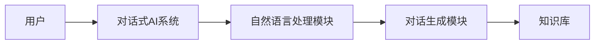
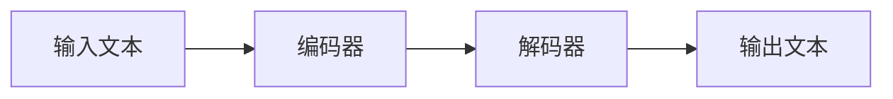
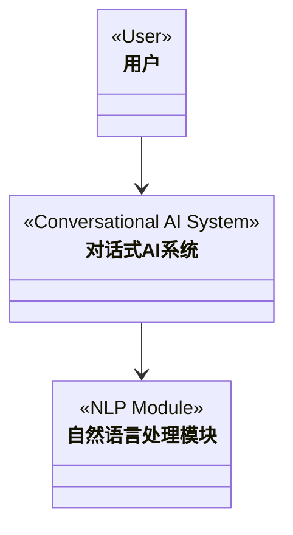
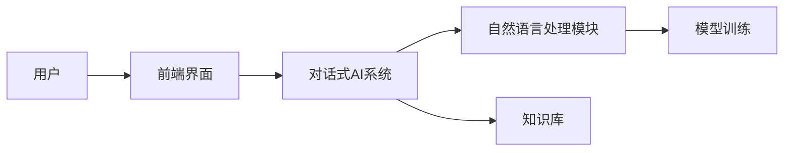

                 


# 《构建企业级对话式AI：提升内部沟通效率》

---

## 关键词：
企业级对话式AI，内部沟通效率，自然语言处理，机器学习，对话生成，系统架构

---

## 摘要：
在现代企业中，提升内部沟通效率是数字化转型的重要一环。本文将详细探讨如何构建企业级对话式AI系统，通过自然语言处理和机器学习技术，优化企业内部沟通流程，提升效率，降低成本，并增强团队协作能力。文章从背景分析、核心概念、算法原理、系统架构到项目实战，全面解析企业级对话式AI的构建过程，并提供实践案例和最佳实践建议。

---

## 第一部分：背景与核心概念

### 第1章：问题背景与需求分析

#### 1.1 企业内部沟通效率的现状与挑战
企业在数字化转型过程中，内部沟通效率低下已成为制约企业发展的关键问题。传统的邮件、会议和即时通讯工具虽然在一定程度上改善了沟通方式，但仍然存在以下痛点：
- **信息孤岛**：各部门之间的信息分散，难以快速共享和整合。
- **沟通冗余**：重复性沟通增加时间成本，降低工作效率。
- **资源浪费**：会议时间过长，信息传递不清晰，导致资源浪费。
- **知识断层**：新员工或临时员工难以快速掌握企业知识体系。

#### 1.2 对话式AI的解决方案
对话式AI（Conversational AI）通过自然语言处理技术，模拟人类对话方式，为企业提供智能化的沟通工具。其优势包括：
- **实时响应**：快速理解用户需求并提供准确反馈。
- **7x24小时可用**：支持全天候沟通，减少等待时间。
- **智能辅助**：通过上下文理解和知识库，提供更精准的信息支持。

#### 1.3 企业级对话式AI的目标与边界
- **目标**：构建一个能够理解企业内部语言、支持多场景对话的智能系统。
- **边界**：专注于内部沟通效率提升，不涉及外部客户对话。

---

### 第2章：对话式AI的核心概念与联系

#### 2.1 对话式AI的核心原理
对话式AI的核心原理包括：
- **自然语言处理（NLP）**：通过语义理解、实体识别和意图识别，准确解析用户需求。
- **对话生成机制**：基于预训练模型或规则生成符合上下文的回复。
- **上下文管理**：通过对话历史记录，维护当前对话的状态。

#### 2.2 对话式AI与传统聊天机器人的区别
| 对比维度 | 对话式AI | 传统聊天机器人 |
|----------|----------|-----------------|
| **学习能力** | 强学习，支持自适应优化 | 弱学习，依赖规则 |
| **知识库** | 可动态更新，支持复杂查询 | 知识库固定，支持简单查询 |
| **应用场景** | 企业内部沟通、任务处理 | 公众号客服、简单咨询 |

#### 2.3 对话式AI的实体关系图


---

## 第二部分：对话式AI的算法原理

### 第3章：对话式AI的算法基础

#### 3.1 基于规则的对话生成算法
- **原理**：通过预设的规则和关键词匹配，生成固定回复。
- **优缺点**：
  - 优点：简单易实现，适用于规则明确的场景。
  - 缺点：灵活性差，无法处理复杂对话。

#### 3.2 基于深度学习的对话生成算法
- **原理**：利用循环神经网络（RNN）或Transformer模型，生成上下文相关的回复。
- **算法流程图**：


---

### 第4章：对话式AI的数学模型与公式

#### 4.1 Transformer模型的数学公式
- **编码器部分**：
  $$\text{Encoder}(x) = \text{LayerNorm}(\text{MultiHead}(x))$$
- **解码器部分**：
  $$\text{Decoder}(y, \text{Encoder}(x)) = \text{LayerNorm}(\text{MultiHead}(y) + \text{MultiHead}(\text{Encoder}(x), y))$$

#### 4.2 损失函数
- **交叉熵损失函数**：
  $$\mathcal{L} = -\sum_{i=1}^{n} \log p(y_i|x_i)$$

---

## 第三部分：系统分析与架构设计

### 第5章：系统分析

#### 5.1 项目场景介绍
- **目标场景**：企业内部员工与系统之间的对话交互。
- **典型用户角色**：员工、部门主管、系统管理员。

#### 5.2 系统功能设计
- **领域模型**：


---

### 第6章：系统架构设计

#### 6.1 系统架构图


---

## 第四部分：项目实战

### 第7章：环境安装与核心代码实现

#### 7.1 环境安装
- **Python版本**：Python 3.8+
- **依赖库**：TensorFlow、Keras、NLTK、Jieba。

#### 7.2 核心代码实现
```python
import tensorflow as tf
from tensorflow.keras.layers import Input, Dense
from tensorflow.keras.models import Model

# 定义编码器
def encoder(input_shape):
    input_layer = Input(shape=input_shape)
    dense_layer = Dense(256, activation='relu')(input_layer)
    return Model(inputs=input_layer, outputs=dense_layer)

# 定义解码器
def decoder(encoded_shape, output_dim):
    input_layer = Input(shape=encoded_shape)
    dense_layer = Dense(output_dim, activation='softmax')(input_layer)
    return Model(inputs=input_layer, outputs=dense_layer)

# 构建模型
encoder_model = encoder((vocab_size,))
decoder_model = decoder(encoder_model.output_shape, vocab_size)

# 编译模型
encoder_model.compile(optimizer='adam', loss='sparse_categorical_crossentropy')
decoder_model.compile(optimizer='adam', loss='sparse_categorical_crossentropy')
```

---

### 第8章：案例分析与代码解读

#### 8.1 案例分析
以企业内部请假流程为例：
- **用户输入**：我需要请假一天。
- **系统响应**：请提供请假日期和请假原因。

#### 8.2 代码解读
- **编码器**：将用户输入转换为向量表示。
- **解码器**：根据向量生成回复文本。

---

## 第五部分：总结与最佳实践

### 第9章：总结与小结

- **总结**：通过构建企业级对话式AI系统，企业能够显著提升内部沟通效率，降低沟通成本。
- **小结**：对话式AI的实现需要结合自然语言处理技术和深度学习算法。

### 第10章：注意事项与拓展阅读

- **注意事项**：
  - 数据隐私保护：确保企业内部数据的安全性。
  - 模型迭代：定期更新模型以适应新的业务需求。
- **拓展阅读**：
  - 推荐阅读《Deep Learning》（Ian Goodfellow等著）。
  - 关注行业动态，了解最新的对话式AI技术。

---

通过以上内容，我们全面解析了企业级对话式AI的构建过程，从理论到实践，为读者提供了详实的技术指导和实践建议。

