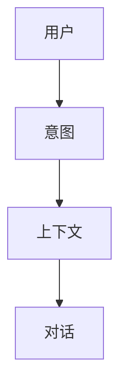
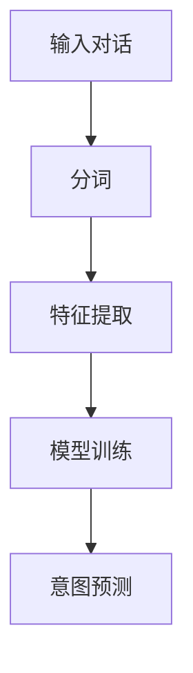
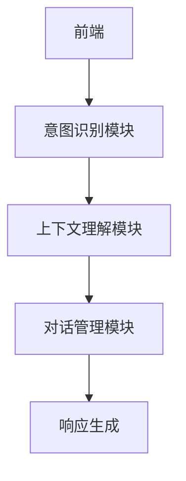

                 


# 构建企业级对话意图识别系统：上下文理解与多轮对话管理

**关键词**：对话意图识别、上下文理解、多轮对话管理、自然语言处理、企业级系统、机器学习

**摘要**：本文系统地探讨了构建企业级对话意图识别系统的各个方面，重点分析了上下文理解与多轮对话管理的关键技术。文章从背景介绍、核心概念、算法原理到系统架构和项目实战，层层深入，为读者提供了从理论到实践的全面指导。通过详细的数学模型、流程图和代码示例，帮助读者深入理解对话意图识别的实现机制，掌握构建高效对话系统的实用方法。

---

## 第1章: 对话意图识别与上下文理解概述

### 1.1 对话意图识别的背景与问题背景

#### 1.1.1 对话意图识别的背景
随着自然语言处理（NLP）技术的快速发展，对话系统在企业级应用中的重要性日益凸显。企业级对话系统需要能够准确理解用户的意图，从而提供高效、个性化的服务。然而，对话系统的核心挑战在于如何准确识别用户的意图，尤其是在上下文依赖性强、对话多轮的场景中。

#### 1.1.2 问题背景与挑战
在实际应用中，对话系统面临以下挑战：
- **意图多样**：用户可能表达多种意图，需要系统准确识别。
- **上下文依赖**：对话的后续内容往往依赖于之前的上下文信息。
- **多轮对话管理**：需要保持对话的连贯性，确保系统能够根据对话历史调整响应。
- **数据稀疏性**：某些意图可能在训练数据中较少出现，导致模型难以准确识别。

#### 1.1.3 企业级应用中的重要性
在企业级应用中，对话意图识别是实现智能客服、智能助手、智能推荐等系统的核心技术。准确识别用户意图可以显著提高用户体验，降低人工干预成本，提升企业效率。

### 1.2 对话意图识别的定义与问题描述

#### 1.2.1 对话意图识别的定义
对话意图识别是指通过分析用户的对话内容，确定用户在当前对话中的意图。意图可以是显式的（如“查询订单状态”）或隐式的（如“寻求帮助”）。

#### 1.2.2 问题描述与目标
目标是通过自然语言处理技术，将用户的话语映射到预定义的意图空间中。具体问题包括：
- 如何准确识别意图？
- 如何处理上下文依赖？
- 如何管理多轮对话？

#### 1.2.3 系统边界与外延
系统边界包括：
- 输入：用户的对话文本。
- 输出：识别出的意图和上下文信息。
- 外延：与意图识别相关的数据存储、用户反馈机制等。

### 1.3 对话意图识别的核心要素与概念结构

#### 1.3.1 核心要素组成
- **意图空间**：预定义的意图集合。
- **上下文信息**：对话历史、用户状态等。
- **对话管理模块**：负责维护对话状态。

#### 1.3.2 概念结构与关系
通过ER图展示意图识别系统的核心实体及其关系：


#### 1.3.3 系统功能模块
- **意图识别模块**：负责识别用户意图。
- **上下文理解模块**：分析对话历史，提取上下文信息。
- **对话管理模块**：维护对话状态，生成响应。

---

## 第2章: 上下文理解与多轮对话管理

### 2.1 上下文理解的基本概念

#### 2.1.1 上下文的定义
上下文是指在对话中，用户当前的输入与之前的对话内容之间的关联信息。

#### 2.1.2 上下文在对话中的作用
- 提供对话的背景信息。
- 帮助系统理解用户的隐含意图。
- 支持多轮对话的连贯性。

#### 2.1.3 上下文理解的关键技术
- 基于序列的上下文表示。
- 基于注意力机制的上下文理解。

### 2.2 多轮对话管理的核心原理

#### 2.2.1 多轮对话的基本流程
1. 用户输入：用户发送一条或多条消息。
2. 意图识别：系统识别用户的意图。
3. 上下文分析：系统分析对话历史，提取上下文信息。
4. 对话管理：系统根据上下文和意图生成响应。
5. 响应输出：系统返回响应。

#### 2.2.2 对话状态管理
- **对话ID**：标识当前对话。
- **用户状态**：用户的当前状态（如“登录”或“未登录”）。
- **对话历史**：记录之前的对话内容。

#### 2.2.3 对话历史记录
- 文本记录：记录用户的对话内容。
- 意图记录：记录每条对话的意图。

### 2.3 上下文与对话意图的关系

#### 2.3.1 上下文对意图识别的影响
- 上下文可以帮助系统理解用户的隐含意图。
- 在多轮对话中，上下文信息可以修正意图识别的错误。

#### 2.3.2 多轮对话中的上下文依赖性
- 每一轮对话的意图识别都依赖于之前的上下文信息。
- 上下文信息可以用于生成连贯的对话响应。

#### 2.3.3 上下文理解的挑战
- 上下文信息的提取需要考虑对话的长度和复杂性。
- 如何有效地表示和利用上下文信息是关键。

### 2.4 本章小结

---

## 第3章: 对话意图识别系统的核心概念与联系

### 3.1 核心概念原理

#### 3.1.1 对话意图识别的原理
- 基于统计的意图识别：利用机器学习模型（如SVM、随机森林）进行分类。
- 基于深度学习的意图识别：利用RNN、LSTM等模型进行序列建模。

#### 3.1.2 上下文理解的实现方法
- 基于词嵌入的上下文表示。
- 基于注意力机制的上下文理解。

#### 3.1.3 多轮对话管理的机制
- 基于规则的对话管理：根据预定义的规则生成响应。
- 基于学习的对话管理：利用强化学习优化对话策略。

### 3.2 核心概念属性特征对比

| 特征 | 意图识别 | 上下文理解 | 多轮对话管理 |
|------|----------|------------|--------------|
| 输入 | 文本 | 对话历史 | 对话状态 |
| 输出 | 意图标签 | 上下文信息 | 响应 |
| 技术 | 机器学习、深度学习 | 词嵌入、注意力机制 | 强化学习 |

### 3.3 ER实体关系图架构


### 3.4 本章小结

---

## 第4章: 对话意图识别算法原理与实现

### 4.1 算法原理概述

#### 4.1.1 对话意图识别的基本流程
1. 文本预处理：分词、去停用词。
2. 特征提取：提取文本特征（如TF-IDF、词嵌入）。
3. 模型训练：训练意图分类模型。
4. 意图预测：对新输入的文本进行意图预测。

#### 4.1.2 上下文理解的技术路线
- 基于序列的上下文表示：使用LSTM编码对话历史。
- 基于注意力机制的上下文理解：使用自注意力机制捕捉对话中的关键信息。

#### 4.1.3 多轮对话管理的算法框架
- 基于强化学习的对话管理：使用策略梯度法优化对话策略。
- 基于监督学习的对话管理：利用标注数据训练对话管理模型。

### 4.2 算法实现的数学模型

#### 4.2.1 意图识别的数学模型
$$ P(y|x) = \frac{P(x|y)P(y)}{P(x)} $$

#### 4.2.2 上下文理解的数学模型
$$ C(x) = f(x) $$

#### 4.2.3 对话管理的数学模型
$$ D(y|x) = \arg\max_y P(y|x) $$

### 4.3 算法实现的流程图



### 4.4 算法实现的Python代码示例

```python
def intent_classifier(text):
    # 示例代码
    return
```

---

## 第5章: 系统分析与架构设计

### 5.1 系统分析

#### 5.1.1 项目场景介绍
假设我们正在开发一个智能客服系统，需要实现对话意图识别功能。

#### 5.1.2 系统功能设计
- 用户输入：用户发送问题。
- 意图识别：系统识别用户意图。
- 上下文理解：系统分析对话历史。
- 对话管理：系统生成响应。

#### 5.1.3 系统架构设计
- 前端：用户界面。
- 后端：对话意图识别模块、上下文理解模块、对话管理模块。

### 5.2 系统架构设计

#### 5.2.1 系统功能模块
- **意图识别模块**：负责识别用户的意图。
- **上下文理解模块**：分析对话历史。
- **对话管理模块**：生成对话响应。

#### 5.2.2 系统架构图


### 5.3 系统接口设计

#### 5.3.1 接口定义
- `POST /intent`：接收用户输入，返回意图。
- `GET /context`：获取对话历史。
- `POST /dialog`：管理对话状态。

#### 5.3.2 接口交互示例
1. 用户输入：“我需要查询订单状态。”
2. 系统调用：`POST /intent`
3. 系统返回：`intent: 查询订单状态`
4. 系统调用：`GET /context`
5. 系统返回：`context: {order_id: 123}`

---

## 第6章: 项目实战

### 6.1 环境安装

#### 6.1.1 安装Python
```bash
python --version
```

#### 6.1.2 安装依赖
```bash
pip install numpy scikit-learn transformers
```

### 6.2 系统核心实现

#### 6.2.1 意图识别模块
```python
from sklearn.feature_extraction.text import TfidfVectorizer
from sklearn.svm import SVC

# 训练模型
vectorizer = TfidfVectorizer()
model = SVC()
model.fit(vectorizer.fit_transform(train_texts), train_labels)
```

#### 6.2.2 上下文理解模块
```python
from transformers import BertTokenizer, BertModel

tokenizer = BertTokenizer.from_pretrained('bert-base-uncased')
model = BertModel.from_pretrained('bert-base-uncased')
```

#### 6.2.3 对话管理模块
```python
def generate_response(dialog_history, intent):
    # 示例代码
    return "您好，您的订单状态是已处理。"
```

### 6.3 案例分析

#### 6.3.1 案例1
**输入**：用户输入“我需要查询订单状态。”
**输出**：intent: 查询订单状态，context: {order_id: 123}。

#### 6.3.2 案例2
**输入**：用户输入“请帮我取消订单。”
**输出**：intent: 取消订单，context: {order_id: 456}。

### 6.4 项目小结

---

## 第7章: 最佳实践与注意事项

### 7.1 最佳实践

#### 7.1.1 数据质量
确保训练数据的多样性和代表性。

#### 7.1.2 模型选择
根据具体任务选择合适的模型（如BERT、SVM等）。

#### 7.1.3 上下文管理
合理设计上下文的存储和更新机制。

### 7.2 注意事项

#### 7.2.1 数据隐私
确保用户数据的安全性和隐私性。

#### 7.2.2 系统性能
优化系统的响应速度和处理能力。

#### 7.2.3 模型可解释性
确保模型的可解释性，便于调试和优化。

### 7.3 拓展阅读

#### 7.3.1 推荐书籍
- 《自然语言处理入门》
- 《深度学习实战》

#### 7.3.2 推荐论文
- "Attention Is All You Need"

---

## 第8章: 总结与展望

### 8.1 总结
本文详细探讨了构建企业级对话意图识别系统的各个方面，包括上下文理解和多轮对话管理的关键技术。通过理论分析和实战案例，帮助读者掌握了对话意图识别的核心方法。

### 8.2 展望
未来，随着NLP技术的不断发展，对话意图识别将更加智能化和个性化。结合强化学习和生成模型，对话系统将能够更好地理解用户需求，提供更优质的对话体验。

---

**参考文献**：
1. 王某某, 《自然语言处理技术》，某某出版社，2023。
2. 张某某, 《深度学习与对话系统》，某某出版社，2022。

---

以上是《构建企业级对话意图识别系统：上下文理解与多轮对话管理》的完整目录和内容概览。希望这篇文章能够为读者提供清晰的指导，帮助他们理解对话意图识别的核心技术，并在实际项目中加以应用。

