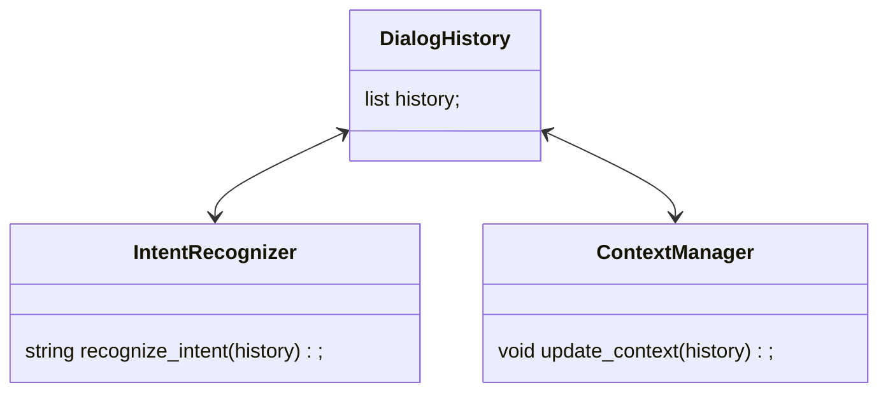
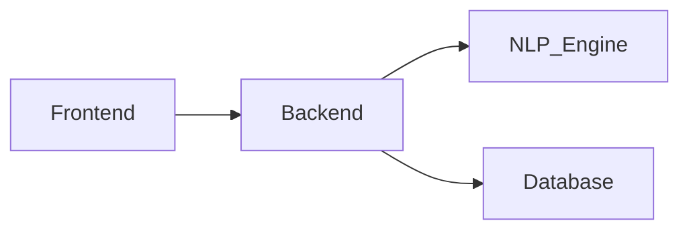
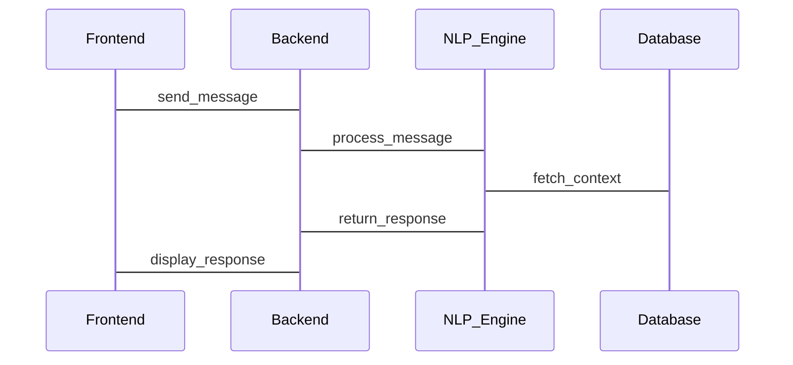

                 


# 构建企业级对话系统：上下文感知与多轮交互管理

## 关键词：企业级对话系统，上下文感知，多轮交互，自然语言处理，对话管理，系统架构

## 摘要：  
企业级对话系统的构建是一个复杂而重要的任务，涉及上下文感知和多轮交互管理的关键技术。本文从背景、核心概念、算法原理、系统架构到项目实战，全面解析如何构建高效的上下文感知对话系统，帮助读者掌握从理论到实践的完整流程。

---

# 第一部分：背景介绍

# 第1章：构建企业级对话系统的背景与目标

## 1.1 对话系统的发展历程

### 1.1.1 从单轮对话到多轮对话的演进
- **单轮对话**：用户提出问题，系统直接返回答案。适用于简单的信息查询，但无法处理复杂场景。
- **多轮对话**：支持连续对话，系统能够根据上下文理解用户的意图，逐步解决问题。适用于复杂任务，如客服支持和医疗咨询。

### 1.1.2 上下文感知在对话系统中的重要性
- 上下文感知是多轮对话的核心，帮助系统理解对话的历史和背景，从而更准确地回应用户需求。

### 1.1.3 企业级对话系统的定义与特点
- **定义**：企业级对话系统是为企业内部和外部用户提供高效、智能对话服务的系统。
- **特点**：支持多轮交互、上下文感知、意图识别、实体识别和高可用性。

## 1.2 问题背景与挑战

### 1.2.1 当前对话系统的主要问题
- **上下文理解不足**：传统系统难以处理复杂对话，容易遗漏关键信息。
- **多轮交互管理复杂**：需要维护对话状态，处理用户意图的变化。
- **信息准确性问题**：缺乏上下文理解导致错误回应。

### 1.2.2 上下文感知的核心挑战
- **信息融合**：如何有效整合历史对话信息和当前输入。
- **动态更新**：对话上下文需要实时更新，保持准确性。

### 1.2.3 多轮交互中的状态管理难点
- **状态跟踪**：需要记录用户意图和对话历史。
- **错误处理**：对话过程中可能出现中断或错误，需有容错机制。

## 1.3 问题描述与解决方案

### 1.3.1 对话系统的基本功能需求
- 支持多轮对话，上下文感知，意图识别，实体识别。

### 1.3.2 上下文感知的具体实现方式
- 使用机器学习模型，如循环神经网络，处理对话历史。

### 1.3.3 多轮交互的管理策略
- 维护对话状态，使用上下文树结构记录对话历史。

## 1.4 系统边界与外延

### 1.4.1 系统的功能边界
- 对话管理、上下文处理、意图识别。

### 1.4.2 系统的外部接口定义
- 提供API接口，与前端和后端服务交互。

### 1.4.3 系统的可扩展性设计
- 模块化设计，便于功能扩展和升级。

## 1.5 核心概念与组成要素

### 1.5.1 对话系统的组成模块
- 输入处理模块、上下文管理模块、对话逻辑模块、输出生成模块。

### 1.5.2 上下文感知的关键要素
- 对话历史、用户身份、外部知识库。

### 1.5.3 多轮交互的核心组件
- 状态管理、意图识别、实体识别、上下文记忆。

---

# 第二部分：核心概念与联系

# 第2章：上下文感知与多轮交互的核心概念

## 2.1 核心概念原理

### 2.1.1 上下文感知的定义与实现
- 上下文感知是指系统能够理解对话的历史信息，从而生成更准确的回应。

### 2.1.2 多轮交互的基本原理
- 用户与系统交替发送消息，系统根据上下文生成回应。

### 2.1.3 对话系统中的上下文管理
- 使用数据结构记录对话历史，动态更新上下文信息。

## 2.2 核心概念属性对比

| 概念         | 单轮对话       | 多轮对话       |
|--------------|----------------|----------------|
| 对话长度     | 1轮            | 多轮            |
| 上下文依赖   | 无             | 有             |
| 复杂性       | 简单           | 复杂           |

## 2.3 实体关系图


---

# 第三部分：算法原理

# 第3章：上下文感知的核心算法

## 3.1 注意力机制

### 3.1.1 注意力机制的定义
- 通过加权机制，确定对话历史中每个部分的重要性。

### 3.1.2 注意力机制的实现


### 3.1.3 注意力机制的数学公式
$$
\text{Attention}(Q, K, V) = \text{softmax}\left(\frac{QK^T}{\sqrt{d_k}}\right)V
$$

## 3.2 序列到序列模型

### 3.2.1 序列到序列模型的结构


### 3.2.2 序列到序列模型的实现代码

```python
class Seq2Seq:
    def __init__(self, encoder, decoder):
        self.encoder = encoder
        self.decoder = decoder

    def forward(self, input_sequence):
        enc_output = self.encoder(input_sequence)
        dec_output = self.decoder(enc_output)
        return dec_output
```

---

# 第四部分：系统分析与架构设计

# 第4章：企业级对话系统的架构设计

## 4.1 系统功能设计

### 4.1.1 领域模型类图



## 4.2 系统架构设计

### 4.2.1 系统架构图



### 4.2.2 接口设计与交互流程



---

# 第五部分：项目实战

# 第5章：构建企业级对话系统

## 5.1 环境安装

```bash
pip install numpy tensorflow transformers
```

## 5.2 系统核心实现

### 5.2.1 对话历史管理代码

```python
class DialogHistoryManager:
    def __init__(self):
        self.history = []

    def add_to_history(self, message):
        self.history.append(message)

    def get_history(self):
        return self.history
```

### 5.2.2 意图识别代码

```python
def recognize_intent(history):
    # 实现意图识别逻辑
    pass
```

## 5.3 代码应用解读与分析

### 5.3.1 对话历史管理的实现
- 使用列表记录对话历史，支持添加和获取操作。

### 5.3.2 意图识别的实现
- 使用预训练模型，结合对话历史进行意图分类。

## 5.4 案例分析

### 5.4.1 客服对话系统的实现
- 实现用户咨询和客服响应的多轮对话。

### 5.4.2 详细剖析
- 从环境搭建到代码实现，详细讲解每个部分的功能和实现细节。

---

# 第六部分：最佳实践

# 第6章：最佳实践与经验分享

## 6.1 最佳实践 tips

### 6.1.1 系统设计建议
- 模块化设计，便于扩展和维护。

### 6.1.2 开发注意事项
- 注意上下文管理和对话状态维护。

### 6.1.3 测试与优化
- 定期测试和优化系统性能。

## 6.2 小结

### 6.2.1 核心要点回顾
- 上下文感知、多轮交互管理、系统架构设计。

## 6.3 注意事项

### 6.3.1 开发中的常见问题
- 对话历史记录不完整，意图识别错误。

### 6.3.2 解决方案
- 使用更先进的模型，优化数据预处理。

## 6.4 拓展阅读

### 6.4.1 推荐书籍
- 《神经网络与深度学习》
- 《自然语言处理实战》

### 6.4.2 技术博客推荐
- TensorFlow官方博客
- PyTorch官方博客

---

# 附录

## 附录A：参考文献

### 1. 神经网络与深度学习
作者：Ian Goodfellow  
出版社：MIT Press

### 2. 自然语言处理实战
作者：Yoav Goldberg  
出版社：O'Reilly

## 附录B：索引

### 关键词索引
- 企业级对话系统
- 上下文感知
- 多轮交互
- 注意力机制
- 序列到序列模型

---

# 结语

构建企业级对话系统是一个复杂的任务，涉及多个技术领域。通过本文的详细讲解，读者可以掌握从理论到实践的完整流程，为企业级对话系统的开发提供有价值的参考。

