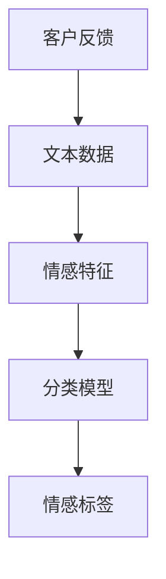
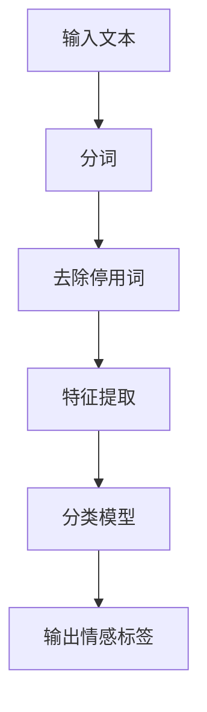
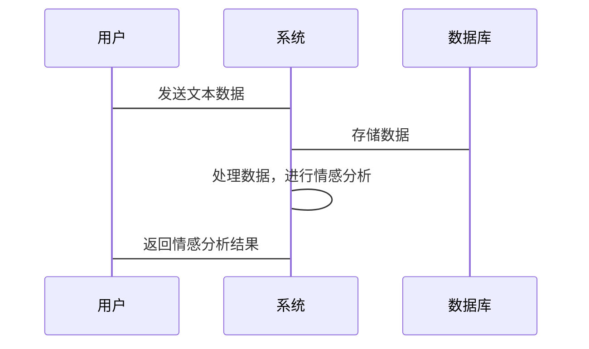

                 


# 构建企业级情感分析平台：深入理解客户与员工

> **关键词**：企业级情感分析、客户满意度、员工反馈、自然语言处理、深度学习、情感分类、数据挖掘  
> **摘要**：企业级情感分析平台通过分析客户和员工的文本数据，提取情感信息，帮助企业优化客户体验和内部管理。本文从背景、原理、算法、架构到实战，全面解析情感分析平台的构建过程，结合传统机器学习与深度学习技术，提供实践指导。

---

## 第1章：情感分析平台的背景与需求

### 1.1 情感分析的定义与核心概念

情感分析是一种自然语言处理技术，用于识别和分类文本中的情感倾向。它通过分析文本数据，判断作者的情感态度（如正面、负面或中性）。情感分析的核心在于理解文本中的情感特征，并将其转化为可量化的信息。

#### 1.1.1 情感分析的定义
情感分析是对文本数据进行情感分类的过程，旨在识别文本中的情感倾向。情感分析可以应用于多种场景，如社交媒体评论、客户反馈、员工评价等。

#### 1.1.2 情感分析的核心要素
- **文本数据**：输入的文本数据，如客户评论、员工反馈等。
- **情感特征**：文本中反映情感的关键特征，如关键词、句式结构等。
- **分类模型**：用于情感分类的算法，如机器学习模型或深度学习模型。

#### 1.1.3 情感分析的边界与外延
- **边界**：情感分析主要关注文本中的情感信息，不涉及其他非情感信息。
- **外延**：情感分析可以扩展到情感强度分析、情感原因分析等更复杂的应用。

### 1.2 企业级情感分析的需求背景

#### 1.2.1 企业客户关系管理的痛点
- 客户反馈的及时性：企业需要快速响应客户的情感诉求。
- 情感数据的复杂性：客户反馈可能包含多种情感倾向。
- 情感数据的多样性：客户反馈可能来自多种渠道，如社交媒体、电话、邮件等。

#### 1.2.2 员工反馈与企业文化的关联
- 员工反馈反映企业内部管理的问题。
- 情感分析可以帮助企业识别员工满意度，优化内部管理。

#### 1.2.3 情感分析在企业中的应用场景
- 客户满意度分析：通过分析客户评论，识别客户对产品或服务的情感倾向。
- 员工满意度分析：通过分析员工反馈，识别员工对工作环境或管理的情感倾向。
- 品牌声誉管理：通过分析社交媒体评论，监控品牌声誉。

### 1.3 问题描述与解决思路

#### 1.3.1 企业级情感分析的核心问题
- 如何准确提取文本中的情感特征？
- 如何构建高效的分类模型？
- 如何处理大规模数据？

#### 1.3.2 情感分析的技术挑战
- 数据标注成本高：需要大量人工标注数据。
- 情感特征提取难：情感特征可能隐含在文本中，难以直接提取。
- 情感分析的多样性：情感信息可能受到语境、语气等多种因素的影响。

#### 1.3.3 解决方案的初步思路
- 数据预处理：清洗、分词、去除停用词等。
- 特征提取：提取文本中的情感特征，如关键词、句式结构等。
- 模型训练：使用机器学习或深度学习模型进行情感分类。
- 结果分析：对分类结果进行解释和应用。

---

## 第2章：情感分析的核心概念与原理

### 2.1 情感分析的基本原理

#### 2.1.1 文本预处理
- **分词**：将文本分割成词语或短语，如中文分词。
- **去除停用词**：移除常见词汇，如“的”、“是”等。
- **词干提取**：将词语转换为词干，如“running”转换为“run”。

#### 2.1.2 特征提取
- **关键词提取**：识别文本中的情感关键词，如“满意”、“不满意”。
- **句式分析**：分析句式结构，识别情感倾向。
- **情感强度分析**：分析情感的强度，如“非常喜欢”与“喜欢”的区别。

#### 2.1.3 情感分析模型
- **基于规则的方法**：通过预定义规则进行情感分类。
- **基于统计的方法**：使用机器学习算法，如朴素贝叶斯、支持向量机（SVM）。
- **基于深度学习的方法**：使用神经网络模型，如LSTM、BERT。

### 2.2 情感分析的分类与特征对比

#### 2.2.1 情感分析的分类
- **二分类**：正面与负面情感分类。
- **多分类**：正面、中性、负面情感分类。
- **情感强度分类**：情感强度的量化，如从1到5分。

#### 2.2.2 情感分析的特征对比表格
| 特征               | 二分类       | 多分类         | 情感强度分类 |
|--------------------|--------------|----------------|--------------|
| 数据需求           | 较小         | 较大           | 数据需求较大 |
| 分类结果           | 二值标签     | 多值标签       | 连续值标签   |
| 应用场景           | 简单场景     | 复杂场景       | 高精度需求   |

### 2.3 情感分析的实体关系图

#### 2.3.1 Mermaid流程图：情感分析的实体关系


#### 2.3.2 Mermaid图：情感分析的核心流程


---

## 第3章：情感分析的算法原理

### 3.1 基于传统机器学习的算法

#### 3.1.1 TF-IDF与词袋模型

- **TF-IDF**：Term Frequency-Inverse Document Frequency，用于衡量词语的重要性。
  - 公式：$$TF-IDF(t, d) = TF(t, d) \times \log\left(\frac{N}{DF(t)}\right)$$
  - 其中，$TF(t, d)$是词语$t$在文档$d$中的词频，$DF(t)$是词语$t$在所有文档中的文档频次，$N$是文档总数。

- **词袋模型**：将文本表示为词语的集合，不考虑词语顺序。
  - 示例：文本“我非常喜欢这本书”可以表示为$\{我, 非常, 喜欢, 这本书\}$。

#### 3.1.2 词嵌入模型（如Word2Vec、GloVe）

- **Word2Vec**：通过神经网络模型，将词语映射到低维向量空间。
  - 使用CBOW（Context-Bow）或Skip-Gram模型。
  - 示例：词语“喜欢”的向量表示为$[0.2, 0.5, -0.1]$。

- **GloVe**：全局向量词嵌入，通过全局语料库训练词向量。
  - 使用矩阵分解方法，训练词向量。
  - 示例：词语“满意”的向量表示为$[0.3, 0.8, -0.4]$。

#### 3.1.3 情感分析的数学模型与公式

- **朴素贝叶斯分类器**：
  - 概率公式：$$P(y|x) = \frac{P(x|y)P(y)}{P(x)}$$
  - 使用拉普拉斯平滑，避免零概率问题。
  - 示例：计算文本属于正面或负面的概率。

### 3.2 基于深度学习的算法

#### 3.2.1 LSTM（长短期记忆网络）

- **LSTM结构**：
  - 包含输入门、遗忘门、输出门。
  - 公式：
    - 遗忘门：$$f_t = \sigma(W_f \cdot [h_{t-1}, x_t])$$
    - 输入门：$$i_t = \sigma(W_i \cdot [h_{t-1}, x_t])$$
    - 输出门：$$o_t = \sigma(W_o \cdot [h_{t-1}, x_t])$$
    - 新状态：$$c_t = f_t \cdot c_{t-1} + i_t \cdot tanh(W_c \cdot [h_{t-1}, x_t])$$
    - 新输出：$$h_t = o_t \cdot tanh(c_t)$$

- **LSTM应用于情感分析**：
  - 将文本输入LSTM网络，提取序列特征。
  - 使用全连接层进行情感分类。

#### 3.2.2 BERT（双向Transformer）

- **BERT结构**：
  - 基于Transformer的双向编码器。
  - 使用Mask-LM任务预训练。
  - 示例：文本“这本书很好看”经过BERT编码后得到一个固定长度的向量。

- **BERT应用于情感分析**：
  - 将文本输入BERT模型，获取隐藏层的输出。
  - 使用全连接层进行情感分类。

---

## 第4章：系统分析与架构设计

### 4.1 系统功能设计

#### 4.1.1 领域模型

- **领域模型**：
  - 客户反馈模块：处理客户评论数据。
  - 员工反馈模块：处理员工反馈数据。
  - 情感分析模块：对反馈数据进行情感分类。
  - 结果展示模块：可视化分析结果。

#### 4.1.2 系统架构设计

- **分层架构**：
  - 数据层：存储原始数据。
  - 业务逻辑层：处理数据预处理、特征提取、模型训练。
  - 表现层：展示分析结果。

#### 4.1.3 系统接口设计

- **API接口**：
  - POST /api/text/process：处理文本数据。
  - GET /api/results：获取情感分析结果。

#### 4.1.4 系统交互流程

- **Mermaid序列图**：


---

## 第5章：项目实战

### 5.1 环境安装与配置

- **安装Python环境**：
  - 使用Anaconda或虚拟环境。
- **安装依赖库**：
  - `pip install numpy pandas scikit-learn tensorflow keras`

### 5.2 核心代码实现

#### 5.2.1 数据预处理

```python
import pandas as pd
from sklearn.feature_extraction.text import TfidfVectorizer

# 数据预处理
def preprocess(text):
    # 分词（假设已经完成分词）
    words = text.split()
    # 去除停用词
    stop_words = set(["的", "是", "了"])
    filtered_words = [word for word in words if word not in stop_words]
    return ' '.join(filtered_words)

# 使用TF-IDF提取特征
vectorizer = TfidfVectorizer()
X = vectorizer.fit_transform(df['text'])
```

#### 5.2.2 模型训练与评估

```python
from sklearn.model

