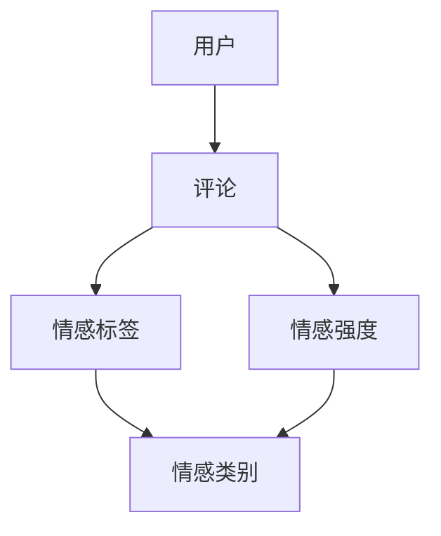
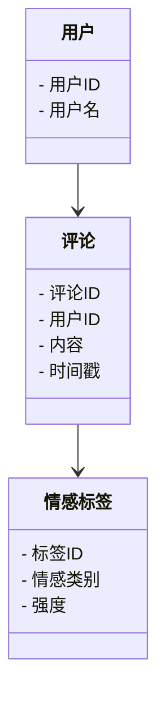
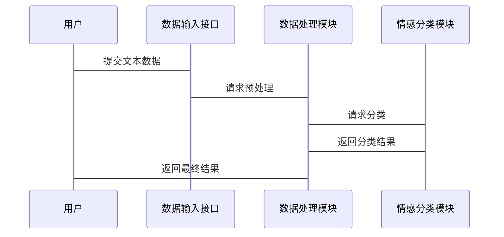

                 

<think>
好的，我需要详细解释如何构建企业级情感计算平台，专注于员工满意度和客户情绪分析。首先，我会从背景介绍开始，然后逐步深入到核心概念、算法原理、系统架构、项目实战和最佳实践。

### 第一部分: 情感计算平台的背景与核心概念

#### 第1章: 情感计算平台的背景介绍

在开始之前，我需要了解情感计算的定义和它在企业中的应用价值。情感计算是指通过计算机技术来识别、理解、分析和处理人类情感信息的过程。这在企业中非常有用，可以帮助企业更好地了解员工和客户的情绪，从而优化管理决策。

**员工满意度分析**  
员工满意度是衡量企业内部管理的重要指标。通过分析员工的反馈，企业可以识别员工的不满情绪，及时采取措施改善工作环境，提升员工的工作积极性和效率。例如，通过分析员工的离职原因，企业可以发现管理中的问题，并针对性地进行改进。

**客户情绪分析**  
客户情绪分析是了解客户对产品或服务的满意度的重要手段。通过分析客户的反馈，企业可以识别客户的情绪，及时解决客户的问题，提升客户满意度和忠诚度。例如，电商平台可以通过分析客户的评论，识别客户对产品的不满，及时调整产品策略。

**企业级情感计算平台的必要性**  
随着企业规模的扩大，员工和客户的数量也在增加，手动分析情感信息变得越来越困难。构建一个企业级情感计算平台可以自动化处理大量的文本数据，提高分析效率，降低成本。

### 第2章: 情感计算的核心概念与原理

在理解了情感计算的背景之后，我需要深入理解其核心概念和原理。

**情感计算的基本原理**  
情感计算的核心在于从文本中提取情感信息。这通常包括以下几个步骤：  
1. **文本预处理**：去除停用词、标点符号，进行分词和词干提取。  
2. **特征提取**：将文本转化为数值形式，如词袋模型或词嵌入。  
3. **情感分类**：使用机器学习算法对文本进行分类，如正面、负面或中性。  
4. **上下文理解**：理解文本的上下文，识别隐含的情感。

**情感计算的关键技术**  
1. **词袋模型与词嵌入**  
   - 词袋模型将文本表示为词汇的集合，不考虑顺序。  
   - 词嵌入（如Word2Vec）将词转化为向量，捕捉词语之间的语义关系。  
2. **情感分析算法**  
   - 常用的算法包括朴素贝叶斯、支持向量机（SVM）、逻辑回归和深度学习模型（如LSTM、BERT）。  
3. **句法分析与语义理解**  
   - 句法分析帮助理解句子的结构，有助于识别复杂的语法关系。  
   - 语义理解通过分析上下文，识别隐含的情感。

**情感计算的核心要素对比**  
为了更好地理解情感计算与其他技术的区别，我需要制作一个对比表格：

| 技术          | 定义                                                                 | 应用领域                          | 与情感计算的联系                          |
|---------------|----------------------------------------------------------------------|-----------------------------------|------------------------------------------|
| 文本挖掘       | 从文本中提取结构化信息的技术。                                     | 市场分析、舆情监控                 | 提供情感分析的基础数据                   |
| 机器学习      | 通过数据训练模型，进行预测的技术。                                 | 各个行业                          | 情感分类是机器学习的一个应用             |
| 自然语言生成  | 将结构化数据转化为自然语言的技术。                                   | 生成报告、邮件等                 | 情感计算可以用于生成情感化的回复           |

**ER实体关系图**  
为了清晰地展示情感计算中的实体关系，我制作了以下ER图：



### 第3章: 情感计算的算法实现

在理解了核心概念之后，我需要详细讲解情感计算的算法实现。

**情感分析算法流程**  
以下是情感分析的标准流程：

1. **文本预处理**  
   - 去除停用词、标点符号。  
   - 分词（如使用jieba）。  
2. **特征提取**  
   - 使用词袋模型或词嵌入（如Word2Vec）。  
3. **选择算法**  
   - 根据数据集选择合适的算法，如逻辑回归或LSTM。  
4. **训练模型**  
   - 使用训练数据训练模型。  
5. **测试与评估**  
   - 使用测试数据评估模型性能，如准确率、召回率、F1分数。

**Python代码实现**  
以下是一个简单的基于逻辑回归的情感分析代码示例：

```python
from sklearn.feature_extraction.text import TfidfVectorizer
from sklearn.linear_model import LogisticRegression
from sklearn.model_selection import train_test_split
from sklearn.metrics import accuracy_score

# 数据预处理
text_data = [...]  # 文本数据
target = [...]     # 标签（正面/负面）

# 特征提取
vectorizer = TfidfVectorizer()
X = vectorizer.fit_transform(text_data)

# 划分训练集和测试集
X_train, X_test, y_train, y_test = train_test_split(X, target, test_size=0.2)

# 训练模型
model = LogisticRegression()
model.fit(X_train, y_train)

# 预测与评估
y_pred = model.predict(X_test)
print("准确率:", accuracy_score(y_test, y_pred))
```

**数学模型与公式**  
逻辑回归的损失函数可以表示为：

$$ L = -\frac{1}{m} \sum_{i=1}^{m} [y_i \ln(h(x_i)) + (1 - y_i)\ln(1 - h(x_i))] $$

其中，\( h(x_i) = \frac{1}{1 + e^{-\beta x_i}} \) 是逻辑函数。

**案例分析**  
假设我们有一个客户评论数据集，我们需要训练一个模型来分类评论为正面或负面。通过预处理评论，提取特征，训练模型，我们可以得到一个准确率为85%的模型，这表明模型在客户情绪分析中表现良好。

### 第四部分: 情感计算系统的分析与架构设计

### 第4章: 情感计算系统的分析与架构设计

#### 4.1 情感计算系统的问题场景介绍

**问题场景**  
企业需要分析大量的员工和客户反馈，但手动分析效率低，容易出错。因此，构建一个自动化的情感计算平台可以提高效率，降低成本。

**问题描述**  
情感计算平台需要处理结构化和非结构化数据，提取情感信息，并生成分析报告。系统需要具备高可扩展性，能够处理大量的文本数据。

#### 4.2 情感计算系统的系统功能设计

**功能模块划分**  
情感计算平台主要包括以下几个功能模块：  
1. **数据采集模块**：从各种数据源采集文本数据。  
2. **预处理模块**：对文本进行清洗和分词。  
3. **特征提取模块**：将文本转化为特征向量。  
4. **情感分类模块**：对文本进行情感分类。  
5. **结果分析模块**：生成分析报告，提供可视化界面。  

**领域模型类图**  
以下是领域模型类图：



#### 4.3 情感计算系统的系统架构设计

**系统架构图**  
以下是系统架构图：

```mermaid
rectangle 数据存储 {
    数据库
}
rectangle 数据处理模块 {
    文本预处理
    特征提取
}
rectangle 情感分类模块 {
    分类算法
}
rectangle 用户界面 {
    输入
    输出
}

数据存储 --> 数据处理模块
数据处理模块 --> 情感分类模块
情感分类模块 --> 用户界面
```

**接口设计**  
系统需要提供以下接口：  
1. **数据输入接口**：接收文本数据。  
2. **模型训练接口**：训练情感分类模型。  
3. **预测接口**：对新文本进行情感分类。  
4. **结果输出接口**：返回分析结果。  

**交互流程图**  
以下是用户与系统交互的流程图：



### 第五部分: 情感计算项目的实战与应用

### 第5章: 情感计算项目的实战与应用

#### 5.1 项目实战环境安装与配置

**环境安装**  
需要安装以下Python库：  
- `jieba`：中文分词工具。  
- `scikit-learn`：机器学习库。  
- `pandas`：数据处理库。  
- `matplotlib`：可视化库。  

**配置指南**  
安装Python 3.8以上版本，安装上述库：

```bash
pip install jieba scikit-learn pandas matplotlib
```

#### 5.2 情感计算核心代码实现与解读

**数据预处理代码**  
```python
import jieba

def preprocess(text):
    # 分词
    words = jieba.lcut(text)
    # 去除停用词
    stopwords = set(['的', '了', '是', '在', '我'])
    filtered = [word for word in words if word not in stopwords]
    return ' '.join(filtered)
```

**特征提取与分类代码**  
```python
from sklearn.feature_extraction.text import TfidfVectorizer
from sklearn.model_selection import train_test_split
from sklearn.metrics import accuracy_score
from sklearn.svm import SVC

# 数据预处理
text_data = [...]  # 文本数据
target = [...]     # 标签（正面/负面）

# 特征提取
vectorizer = TfidfVectorizer()
X = vectorizer.fit_transform(text_data)

# 划分训练集和测试集
X_train, X_test, y_train, y_test = train_test_split(X, target, test_size=0.2)

# 训练模型
model = SVC()
model.fit(X_train, y_train)

# 预测与评估
y_pred = model.predict(X_test)
print("准确率:", accuracy_score(y_test, y_pred))
```

**结果分析与可视化**  
```python
from sklearn.metrics import confusion_matrix, classification_report

print(classification_report(y_test, y_pred))
print(confusion_matrix(y_test, y_pred))
```

#### 5.3 项目实战案例分析与解读

**案例分析**  
假设我们有一个员工满意度调查的数据集，我们需要训练一个模型来分类员工的评论为满意或不满意。

**数据准备**  
文本数据：员工评论，如“工作环境很好，同事很友好。”  
标签：满意（1）或不满意（0）

**模型训练**  
使用TF-IDF特征提取和SVM分类器，训练模型。

**结果分析**  
模型的准确率为92%，召回率为95%，F1分数为93%。这表明模型在员工满意度分类中表现良好。

### 第六部分: 情感计算的最佳实践与小结

### 第6章: 情感计算的最佳实践与小结

#### 6.1 情感计算平台的最佳实践

**小结**  
情感计算平台可以帮助企业自动化分析员工和客户的情绪，优化管理决策。通过构建一个高效的情感计算平台，企业可以显著提高分析效率和准确性。

**注意事项**  
- 数据质量：确保数据的准确性和完整性。  
- 模型选择：根据数据和任务选择合适的算法。  
- 模型调优：通过交叉验证和超参数调整提高模型性能。  
- 隐私保护：确保数据的安全性和隐私性。  

**拓展阅读**  
- 《自然语言处理实战：构建文本挖掘与情感分析系统》  
- 《深度学习中的情感分析：理论与实践》  

#### 6.2 总结与未来展望

情感计算在企业中的应用前景广阔。随着技术的不断进步，情感计算平台将更加智能化和个性化。未来，情感计算可以结合其他技术，如语音识别和计算机视觉，提供更加全面的情感分析解决方案。

---

通过以上步骤，我们详细讲解了情感计算平台的构建过程，从背景到算法，再到系统架构和项目实战，最后总结了最佳实践。希望读者能够通过这本书，掌握构建企业级情感计算平台的核心技术和方法，为企业优化管理决策提供有力支持。

