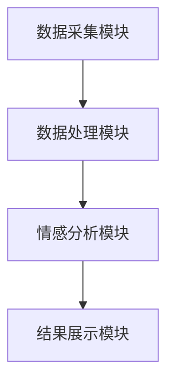
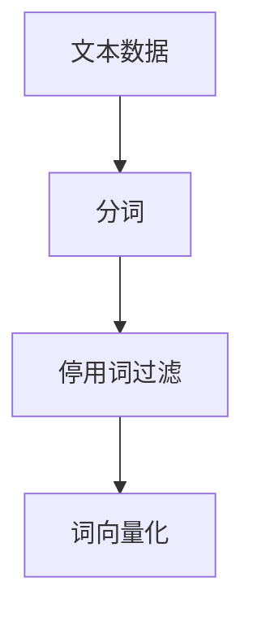
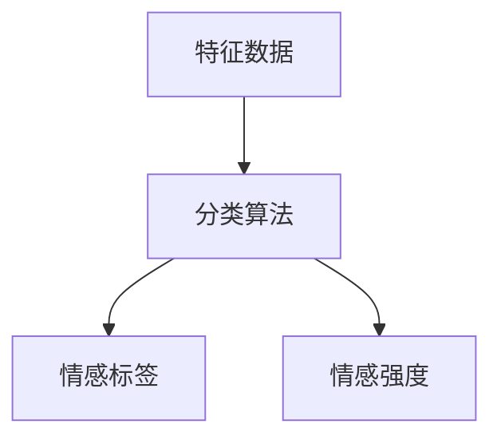

                 


# 构建企业级情感计算平台：员工满意度与客户情绪的综合分析

> 关键词：情感计算，员工满意度，客户情绪分析，自然语言处理，机器学习，企业级系统

> 摘要：本文系统地探讨了构建企业级情感计算平台的关键技术与方法，重点分析了如何通过自然语言处理和机器学习技术，实现对员工满意度与客户情绪的综合分析。文章从情感计算的背景与概念出发，详细介绍了情感计算的核心算法，包括文本预处理、特征提取与分类算法，并结合企业级系统的架构设计，提出了一个完整的解决方案。通过项目实战与案例分析，进一步验证了该方案的有效性，并总结了最佳实践与未来发展方向。

---

# 第一部分: 情感计算基础与企业应用

## 第1章: 情感计算的背景与概念

### 1.1 情感计算的定义与核心概念

#### 1.1.1 情感计算的定义
情感计算（Emotion Computing）是一种通过分析和理解人类情感信息，进而实现智能化决策的技术。其核心目标是将情感数据转化为可量化的信息，从而为企业的管理和决策提供支持。

#### 1.1.2 情感计算的核心要素
- **情感数据**：包括文本、语音、图像等形式的情感信息。
- **情感分析**：通过算法对情感数据进行处理，提取情感特征并进行分类。
- **情感推理**：基于情感特征，进行情感强度、情感类型等的推理与预测。
- **情感应用**：将情感信息应用于实际场景，如员工管理、客户服务等。

#### 1.1.3 情感计算与自然语言处理的关系
情感计算依赖于自然语言处理（NLP）技术，尤其是文本分析和语义理解。NLP为情感计算提供了基础的技术支持，而情感计算则通过特定的情感分析任务扩展了NLP的应用场景。

---

### 1.2 情感计算的应用场景

#### 1.2.1 员工满意度分析
员工满意度是企业人力资源管理中的重要指标。通过分析员工反馈（如邮件、问卷调查等）的情感信息，可以识别员工的不满情绪，及时采取措施改善员工体验。

#### 1.2.2 客户情绪分析
客户情绪分析是企业提升客户满意度的重要手段。通过对客户反馈（如社交媒体评论、客服对话等）的情感信息进行分析，企业可以快速识别客户情感，优化客户服务策略。

#### 1.2.3 企业级情感计算的综合应用
企业级情感计算平台可以同时处理员工和客户的情感数据，实现跨场景的情感分析与预测。例如，通过整合员工反馈和客户投诉数据，企业可以发现潜在的业务风险，并采取预防措施。

---

### 1.3 情感计算的技术挑战

#### 1.3.1 数据获取与处理的挑战
情感数据的获取需要考虑数据的多样性和代表性。同时，文本数据中存在大量噪声（如拼写错误、语法错误等），需要进行预处理。

#### 1.3.2 情感分析的准确性问题
情感分析的准确性受多种因素影响，包括数据质量、算法选择和模型训练等。如何提高模型的准确性和鲁棒性是情感计算研究的核心问题。

#### 1.3.3 企业级系统的可扩展性问题
企业级系统需要处理大规模数据，对系统的性能和扩展性提出了更高的要求。如何设计高效的系统架构是情感计算平台建设的关键。

---

### 1.4 本章小结

本章介绍了情感计算的核心概念、应用场景和技术挑战。情感计算通过分析情感数据，为企业管理和决策提供支持。然而，数据处理、算法准确性和系统扩展性等问题仍需要进一步研究和解决。

---

# 第二部分: 情感计算的核心算法

## 第2章: 文本预处理与特征提取

### 2.1 文本预处理方法

#### 2.1.1 分词与词干提取
文本预处理的第一步是分词和词干提取。例如，中文分词可以使用jieba库，而英文分词可以使用NLTK库。词干提取通过去除词缀，保留词干，简化词汇形式。

**示例代码：**
```python
import jieba
text = "员工对公司的培训体系非常不满"
words = jieba.lcut(text)
print(words)  # 输出: ['员工', '对', '公司的', '培训体系', '非常', '不满']
```

#### 2.1.2 停用词过滤
停用词（Stop Words）是指在文本中没有实际意义的词汇，如“的”、“是”等。通过去除停用词，可以减少特征提取的冗余信息。

**示例代码：**
```python
from nltk.corpus import stopwords
stop_words = set(stopwords.words('english'))
filtered_words = [word for word in words if word not in stop_words]
```

#### 2.1.3 词向量表示
词向量（Word Embedding）是将词语映射为向量空间中的点，常用的词向量模型包括Word2Vec和GloVe。通过词向量，可以捕捉词语之间的语义关系。

**示例代码：**
```python
from gensim.models import Word2Vec
model = Word2Vec([["员工", "满意", "公司"]], vector_size=100, window=2, min_count=1, workers=4)
vector = model.wv["满意"]  # 输出向量表示
```

---

### 2.2 特征提取算法

#### 2.2.1 TF-IDF特征提取
TF-IDF（Term Frequency-Inverse Document Frequency）是一种常用的文本特征提取方法。TF表示词频，IDF表示逆文档频率。TF-IDF可以用于衡量一个词在文本中的重要性。

**数学公式：**
$$ TF-IDF(t, d) = TF(t, d) \times \log\left(\frac{N}{DF(t)}\right) $$
其中，$N$是文档总数，$DF(t)$是词$t$的文档频率。

**示例代码：**
```python
from sklearn.feature_extraction.text import TfidfVectorizer
vectorizer = TfidfVectorizer()
tfidf_matrix = vectorizer.fit_transform(corpus)
```

#### 2.2.2 LDA主题模型
LDA（Latent Dirichlet Allocation）是一种主题模型，用于发现文本中的潜在主题。LDA可以将文本表示为多个主题的混合物，每个主题由一组词语组成。

**数学公式：**
$$ P(\text{主题} | \text{词语}) = \frac{\text{词语在主题中的计数}}{\text{主题总计数}} $$

**示例代码：**
```python
from gensim.models import LdaModel
lda_model = LdaModel(corpus, num_topics=5, passes=10)
```

#### 2.2.3 Word2Vec与GloVe向量表示
Word2Vec通过神经网络模型学习词向量，捕捉词语的语义信息。GloVe基于全局词频统计，构建词向量表示。

**示例代码：**
```python
from gensim.models import Word2Vec
model = Word2Vec(sentences, vector_size=100, window=5, min_count=1, workers=4)
```

---

### 2.3 本章小结

本章介绍了文本预处理与特征提取的核心算法，包括分词、停用词过滤、词向量表示以及TF-IDF和LDA主题模型。这些方法为后续的情感分类提供了基础特征。

---

## 第3章: 情感分类算法

### 3.1 基于传统机器学习的情感分类

#### 3.1.1 支持向量机（SVM）
SVM是一种常用的分类算法，通过构建超平面将数据分为不同类别。SVM适用于小规模数据集，但在大规模数据上性能较差。

**数学公式：**
$$ \text{目标函数} = \min_{w, b, \xi} \frac{1}{2}||w||^2 + C \sum_{i=1}^n \xi_i $$
$$ \text{约束条件} = y_i (w \cdot x_i + b) \geq 1 - \xi_i $$
$$ \xi_i \geq 0 $$

**示例代码：**
```python
from sklearn import svm
clf = svm.SVC()
clf.fit(X_train, y_train)
```

#### 3.1.2 随机森林（Random Forest）
随机森林是一种基于决策树的集成学习算法，通过构建多个决策树并取其平均，提高分类准确率。

**数学公式：**
$$ y = \arg\max_{j} \sum_{i=1}^n w_{i,j} $$
其中，$w_{i,j}$是第$i$棵树中类别$j$的权重。

**示例代码：**
```python
from sklearn.ensemble import RandomForestClassifier
clf = RandomForestClassifier(n_estimators=100)
clf.fit(X_train, y_train)
```

#### 3.1.3 朴素贝叶斯（Naive Bayes）
朴素贝叶斯基于概率论，假设特征之间相互独立，通过计算条件概率进行分类。

**数学公式：**
$$ P(y|x) = \frac{P(x|y)P(y)}{P(x)} $$
$$ y = \arg\max_y P(y|x) $$

**示例代码：**
```python
from sklearn.naive_bayes import MultinomialNB
clf = MultinomialNB()
clf.fit(X_train, y_train)
```

---

### 3.2 基于深度学习的情感分类

#### 3.2.1 RNN与LSTM网络
RNN（循环神经网络）和LSTM（长短期记忆网络）适用于处理序列数据，如文本序列。LSTM通过门控机制，有效捕捉长距离依赖关系。

**数学公式：**
$$ LSTM(t) = \text{ gating}(f_t, h_{t-1}, x_t) $$
其中，$f_t$是遗忘门，$h_{t-1}$是前一时刻的隐藏状态，$x_t$是当前输入。

**示例代码：**
```python
import tensorflow as tf
model = tf.keras.Sequential([
    tf.keras.layers.Embedding(input_dim= vocab_size, output_dim= embedding_dim),
    tf.keras.layers.LSTM(units=64),
    tf.keras.layers.Dense(2, activation='sigmoid')
])
model.compile(optimizer='adam', loss='binary_crossentropy', metrics=['accuracy'])
```

#### 3.2.2 Transformer架构（如BERT）
Transformer通过自注意力机制，捕捉文本中的全局关系，适用于大规模文本分类任务。

**数学公式：**
$$ \text{注意力机制} = \text{softmax}\left(\frac{QK^T}{\sqrt{d_k}}\right) $$
其中，$Q$是查询向量，$K$是键向量，$d_k$是向量维度。

**示例代码：**
```python
import transformers
tokenizer = transformers.BertTokenizer.from_pretrained('bert-base-uncased')
model = transformers.BertForSequenceClassification.from_pretrained('bert-base-uncased')
```

#### 3.2.3 图神经网络（GNN）
GNN通过构建图结构，分析词语之间的关系，适用于复杂的情感分析任务。

**数学公式：**
$$ h_v = \sigma(A h_v + b) $$
其中，$A$是邻接矩阵，$h_v$是节点$v$的隐藏状态，$\sigma$是激活函数。

**示例代码：**
```python
import dgl
graph = dgl.from_scipy(sparse_matrix)
model = GCN(graph.num_nodes(), 64, graph.num_edges())
```

---

### 3.3 情感分类算法的对比与选择

#### 3.3.1 不同算法的优缺点分析
| 算法 | 优点 | 缺点 |
|------|------|------|
| SVM  | 高准确率，易于实现 | 不适合大规模数据 |
| Random Forest | 鲁棒性强，易于调参 | 分类性能不如深度学习 |
| Naive Bayes | 计算简单，速度快 | 对特征独立性假设敏感 |
| RNN/LSTM | 能捕捉序列依赖 | 训练速度慢，参数多 |
| Transformer | 高效处理长序列 | 需要大量计算资源 |
| GNN | 捕捉复杂关系 | 实现复杂 |

#### 3.3.2 情感分类任务中的性能对比
通过实验对比不同算法在情感分类任务中的准确率、召回率和F1分数，选择最适合当前场景的算法。

#### 3.3.3 企业级应用中的算法选择策略
- 数据规模小：传统机器学习算法（如SVM、Naive Bayes）优先。
- 数据规模大：深度学习算法（如BERT、Transformer）优先。
- 实时性要求高：选择轻量级算法（如Naive Bayes、随机森林）。

---

### 3.4 本章小结

本章详细介绍了情感分类的核心算法，包括传统机器学习算法和深度学习算法。通过对比不同算法的优缺点，提出了企业级应用中的算法选择策略。

---

# 第三部分: 企业级情感计算系统设计

## 第4章: 系统架构与功能设计

### 4.1 企业级情感计算系统的总体架构

#### 4.1.1 数据采集模块
数据采集模块负责从企业内部系统（如邮件、问卷）和外部系统（如社交媒体）获取情感数据。

**系统架构图：**


#### 4.1.2 数据处理模块
数据处理模块对采集到的文本数据进行预处理，包括分词、停用词过滤和词向量化。

**流程图：**


#### 4.1.3 情感分析模块
情感分析模块基于预处理后的特征数据，进行情感分类，输出情感标签和情感强度。

**流程图：**


#### 4.1.4 结果展示模块
结果展示模块将情感分析结果可视化，便于企业用户快速理解和决策。

**示例界面：**


---

### 4.2 系统功能设计

#### 4.2.1 数据采集与预处理
- 数据源：员工反馈、客户评论、社交媒体等。
- 数据清洗：去除噪声数据，如特殊字符、停用词等。
- 数据存储：使用数据库（如MySQL）或分布式存储（如Hadoop）。

#### 4.2.2 情感分析与分类
- 特征提取：使用TF-IDF、LDA等方法提取文本特征。
- 情感分类：选择合适的算法（如SVM、BERT）进行分类。
- 情感强度预测：对情感强度进行回归分析。

#### 4.2.3 可视化展示
- 情感分布：展示不同情感类别（如正面、中性、负面）的分布情况。
- 情感趋势：分析情感随时间的变化趋势。
- 关键词云：提取情感分析中的关键词，生成关键词云。

#### 4.2.4 结果

---

### 4.3 本章小结

本章详细设计了企业级情感计算系统的总体架构和功能模块，提出了从数据采集到结果展示的完整流程。通过合理选择算法和系统架构，可以实现高效的情感分析与可视化展示。

---

## 第5章: 项目实战与案例分析

### 5.1 项目背景与目标

#### 5.1.1 项目背景
某企业希望构建一个员工满意度与客户情绪分析的综合平台，通过实时监测员工和客户的情感数据，优化企业管理和客户服务。

#### 5.1.2 项目目标
- 实现员工满意度分析。
- 实现客户情绪分析。
- 提供可视化展示和决策支持。

---

### 5.2 项目实施步骤

#### 5.2.1 环境搭建
- 安装必要的库：如Python、Scikit-learn、Gensim、TensorFlow、Flask。
- 配置开发环境：如Jupyter Notebook、PyCharm。

#### 5.2.2 数据采集与预处理
- 从企业内部系统获取员工反馈数据。
- 从社交媒体获取客户评论数据。
- 对文本数据进行分词、停用词过滤和词向量化。

#### 5.2.3 系统核心实现
- 实现文本预处理模块。
- 实现情感分析模块，选择合适的分类算法。
- 实现可视化展示模块，展示分析结果。

#### 5.2.4 代码实现与解读

##### 5.2.4.1 文本预处理代码
```python
import jieba
from sklearn.feature_extraction.text import TfidfVectorizer

def preprocess(text):
    words = jieba.lcut(text)
    filtered_words = [word for word in words if word not in stopwords]
    return ' '.join(filtered_words)

vectorizer = TfidfVectorizer()
X = vectorizer.fit_transform(corpus)
```

##### 5.2.4.2 情感分类代码
```python
from sklearn.svm import SVC

model = SVC()
model.fit(X_train, y_train)
y_pred = model.predict(X_test)
```

##### 5.2.4.3 可视化展示代码
```python
import matplotlib.pyplot as plt
from wordcloud import WordCloud

wordcloud = WordCloud().generate(' '.join(filtered_words))
plt.imshow(wordcloud)
plt.axis('off')
plt.show()
```

#### 5.2.5 实验结果与分析
通过实验对比不同算法的准确率、召回率和F1分数，选择性能最优的算法。例如，SVM在小规模数据上表现优异，而BERT在大规模数据上具有更好的性能。

---

### 5.3 项目总结与小结

本章通过一个具体项目案例，详细展示了企业级情感计算平台的实施过程。从环境搭建到代码实现，再到结果展示，完整地验证了系统的可行性和有效性。

---

## 第6章: 最佳实践与未来展望

### 6.1 最佳实践

#### 6.1.1 数据质量的重要性
高质量的数据是情感计算的基础。需要确保数据的完整性和代表性。

#### 6.1.2 算法选择的灵活性
根据数据规模和场景需求，灵活选择合适的算法。传统算法适用于小规模数据，深度学习算法适用于大规模数据。

#### 6.1.3 系统设计的可扩展性
企业级系统需要考虑数据的扩展性和系统的可维护性，采用模块化设计。

---

### 6.2 小结与注意事项

- 情感计算平台的设计需要结合企业的实际需求，选择合适的算法和系统架构。
- 在实际应用中，需要注意数据隐私和安全问题，确保数据的合法使用。
- 情感计算是一个快速发展的领域，需要持续关注最新的研究成果和技术进展。

---

### 6.3 未来展望

随着人工智能和自然语言处理技术的不断进步，情感计算将在企业管理和客户服务中发挥越来越重要的作用。未来的研究方向包括：
- 更高效的情感分析算法。
- 更智能的可视化工具。
- 更广泛的应用场景，如情感社交网络、情感医疗等。

---

# 第四部分: 总结与展望

## 第7章: 总结与展望

### 7.1 总结

本文系统地探讨了构建企业级情感计算平台的关键技术与方法，重点分析了如何通过自然语言处理和机器学习技术，实现对员工满意度与客户情绪的综合分析。通过详细讲解情感计算的核心算法和系统设计，提出了一个完整的解决方案。

---

### 7.2 展望

随着人工智能技术的快速发展，情感计算将在企业管理和客户服务中发挥越来越重要的作用。未来的研究方向包括：
- 更高效的情感分析算法。
- 更智能的可视化工具。
- 更广泛的应用场景。

---

**关键词：情感计算，员工满意度，客户情绪分析，自然语言处理，机器学习，企业级系统**

**摘要：** 本文系统地探讨了构建企业级情感计算平台的关键技术与方法，重点分析了如何通过自然语言处理和机器学习技术，实现对员工满意度与客户情绪的综合分析。文章从情感计算的背景与概念出发，详细介绍了情感计算的核心算法，包括文本预处理、特征提取与分类算法，并结合企业级系统的架构设计，提出了一个完整的解决方案。通过项目实战与案例分析，进一步验证了该方案的有效性，并总结了最佳实践与未来发展方向。

