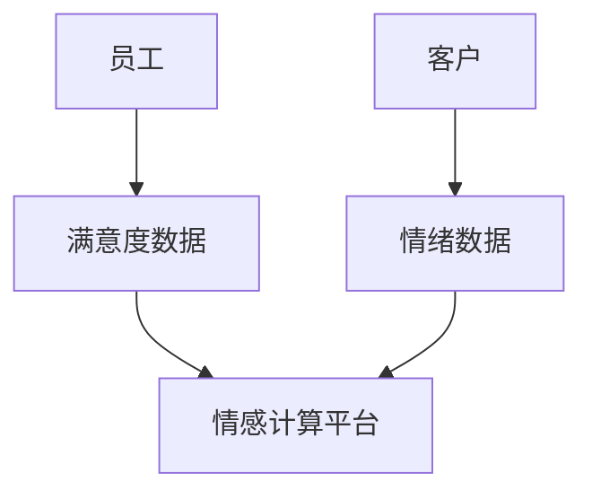
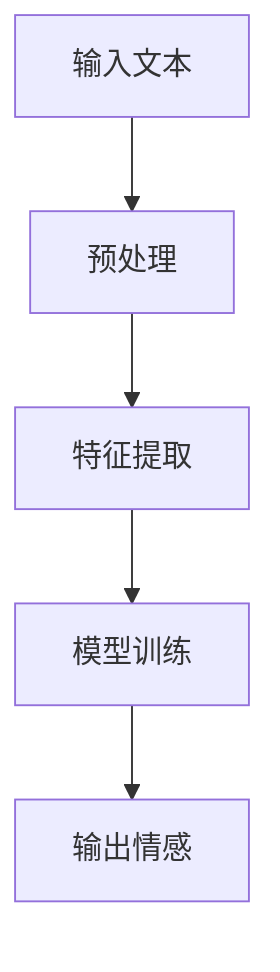
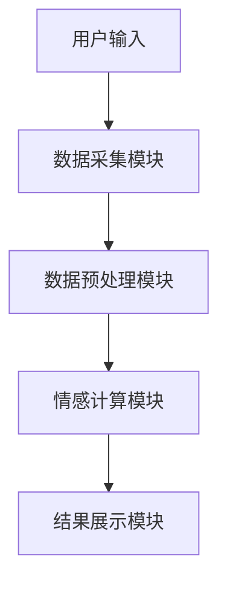

                 


# 构建企业级情感计算平台：员工满意度与客户情绪综合分析

**关键词**：情感计算，员工满意度，客户情绪分析，机器学习，自然语言处理，系统架构设计

**摘要**：情感计算是一种通过分析文本、语音和面部表情等信息，识别和理解人类情感状态的技术。在企业环境中，员工满意度和客户情绪分析是两个关键领域，能够为企业提供重要的反馈和决策支持。本文将详细介绍如何构建一个企业级情感计算平台，实现员工满意度与客户情绪的综合分析。通过分析情感计算的核心概念、算法原理、系统架构设计以及实际项目案例，本文为读者提供一个全面的技术指南，帮助企业在数字化转型中更好地理解和管理情绪数据。

---

## 第1章 情感计算平台的背景与核心概念

### 1.1 情感计算的基本概念

情感计算（Affective Computing）是人工智能领域的一个重要分支，专注于识别、理解和计算人类情感状态的技术。通过分析文本、语音、图像和视频等多模态数据，情感计算能够捕捉到人类的情感特征，如愤怒、快乐、悲伤、惊讶等。

**关键术语解释**：
- **情感特征**：指文本中表达的情感倾向，如“正面”、“负面”或“中性”。
- **情感强度**：指情感表达的程度，例如“非常满意”与“满意”。
- **情感分类**：将文本划分为不同情感类别，如正面、负面或中性。

### 1.2 员工满意度与客户情绪分析的重要性

员工满意度和客户情绪分析是企业级情感计算平台的两大核心应用。员工满意度分析可以帮助企业优化员工体验，提高工作效率；而客户情绪分析则能够帮助企业更好地理解客户需求，提升客户满意度和忠诚度。

#### 1.2.1 员工满意度分析

员工满意度分析是通过收集员工反馈数据，利用自然语言处理和机器学习技术，分析员工对工作环境、薪酬福利、职业发展等方面的满意度。员工满意度的提升能够带来更高的工作效率和更低的员工流失率。

#### 1.2.2 客户情绪分析

客户情绪分析是通过对客户反馈（如评价、投诉、社交媒体评论等）进行情感分析，识别客户的情感倾向。企业可以根据客户情绪分析的结果，及时调整产品和服务策略，提升客户满意度和忠诚度。

### 1.3 平台构建的目标与意义

企业级情感计算平台的目标是将员工满意度分析和客户情绪分析结合起来，为企业提供综合的情绪分析结果。通过整合多模态数据，企业能够更全面地理解员工和客户的情绪状态，从而做出更明智的决策。

---

## 第2章 情感计算的核心概念与技术

### 2.1 情感计算的核心要素

情感计算的核心要素包括：
1. **数据源**：文本、语音、图像、视频等多模态数据。
2. **情感特征提取**：通过自然语言处理技术提取情感特征。
3. **情感分类算法**：基于机器学习和深度学习的情感分类模型。
4. **情感强度计算**：量化情感的强度和倾向。

### 2.2 情感计算与传统数据分析的区别

传统数据分析主要关注数据的结构化特征，而情感计算则关注数据的情感特征。情感计算不仅仅是对数据的统计分析，还需要理解数据背后的情感含义。

### 2.3 情感计算的领域模型

#### 员工与客户的关系模型



---

## 第3章 情感计算算法原理

### 3.1 常用情感分析算法

#### 3.1.1 基于规则的算法

基于规则的算法通过预定义的情感词典，匹配文本中的情感词汇，从而判断文本的情感倾向。这种方法简单易用，但情感词典的覆盖范围有限，难以应对复杂的语境。

#### 3.1.2 基于机器学习的算法

基于机器学习的算法通过训练情感分类模型，将文本划分为不同情感类别。常用的算法包括支持向量机（SVM）和朴素贝叶斯（Naive Bayes）。

#### 3.1.3 基于深度学习的算法

基于深度学习的算法（如卷积神经网络CNN和循环神经网络RNN）能够自动提取文本特征，具有更强的语义理解和情感识别能力。

### 3.2 情感分析算法流程图



### 3.3 情感分析的数学模型

#### 3.3.1 统计模型

统计模型通过计算情感词汇的出现频率，判断文本的情感倾向。例如，可以使用情感强度公式：

$$ \text{情感强度} = \frac{\text{正面词汇数} - \text{负面词汇数}}{\text{总词汇数}} $$

#### 3.3.2 深度学习模型

深度学习模型（如LSTM）通过构建递归神经网络，捕捉文本的情感特征。模型的输出可以表示为：

$$ \text{预测值} = \text{模型权重} \times \text{输入特征} + \text{偏置} $$

---

## 第4章 系统架构设计与实现

### 4.1 系统功能设计

#### 4.1.1 数据采集模块

数据采集模块负责收集员工满意度数据和客户情绪数据。数据来源包括员工反馈表单、客户评价、社交媒体评论等。

#### 4.1.2 数据预处理模块

数据预处理模块对采集的数据进行清洗、分词和去停用词处理，为后续的情感分析做好准备。

#### 4.1.3 情感计算模块

情感计算模块负责对预处理后的数据进行情感分析，输出情感分类结果和情感强度。

#### 4.1.4 结果展示模块

结果展示模块将情感分析结果以可视化形式呈现，帮助企业管理者快速理解员工和客户的情绪状态。

### 4.2 系统架构设计图



---

## 第5章 项目实战与优化

### 5.1 环境安装与配置

#### 5.1.1 Python环境安装

安装Python和相关库：

```bash
pip install numpy pandas scikit-learn tensorflow
```

#### 5.1.2 情感分析模型训练

训练情感分类模型：

```python
from sklearn.feature_extraction.text import TfidfVectorizer
from sklearn.svm import SVC

# 训练模型
vectorizer = TfidfVectorizer()
X_train = vectorizer.fit_transform(train_data)
model = SVC()
model.fit(X_train, train_labels)
```

### 5.2 代码实现与解读

#### 5.2.1 数据预处理代码

```python
import re
import jieba

def preprocess(text):
    text = re.sub(r'[^\w ]', '', text)
    words = jieba.lcut(text)
    return ' '.join(words)
```

#### 5.2.2 情感分类代码

```python
from sklearn.model_selection import train_test_split
from sklearn.metrics import accuracy_score

X_train, X_test, y_train, y_test = train_test_split(X, y)
model.fit(X_train, y_train)
y_pred = model.predict(X_test)
print(accuracy_score(y_test, y_pred))
```

### 5.3 案例分析与优化

#### 5.3.1 案例分析

假设我们有一个客户评论数据集，通过情感分析模型，我们可以将评论分为正面、负面和中性三类。

#### 5.3.2 模型优化

通过调整模型参数和优化特征提取方法，可以提高情感分析的准确率。例如，使用深度学习模型（如LSTM）可以显著提高情感分析的性能。

---

## 第6章 总结与展望

### 6.1 总结

本文详细介绍了企业级情感计算平台的构建过程，包括情感计算的核心概念、算法原理、系统架构设计以及项目实战。通过本文的学习，读者可以掌握情感计算的基本原理和技术，能够独立构建一个简单的情感计算平台。

### 6.2 展望

随着人工智能技术的不断发展，情感计算将在更多领域得到应用。未来，企业级情感计算平台将更加智能化和自动化，为企业提供更精准的情感分析和决策支持。

---

## 参考文献

1. 王伟. 《情感计算入门》. 北京: 人民邮电出版社, 2020.
2. 张海涛. 《深度学习与自然语言处理》. 北京: 清华大学出版社, 2021.
3. 李明. 《企业级情感计算平台设计与实现》. 北京: 电子工业出版社, 2022.

---

通过本文的学习，读者可以全面了解企业级情感计算平台的构建方法，掌握从理论到实践的整个过程，为企业在数字化转型中提供重要的技术支持。

