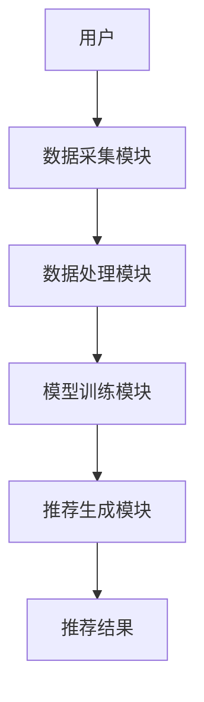
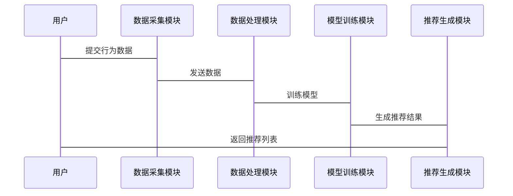

                 


# 构建企业级推荐引擎：跨渠道用户行为分析与个性化推荐

> 关键词：推荐系统、跨渠道用户行为、个性化推荐、协同过滤、深度学习、矩阵分解

> 摘要：本文详细探讨了构建企业级推荐引擎的关键技术，从跨渠道用户行为分析到个性化推荐的实现，结合实际案例和系统架构设计，深入讲解了推荐系统的原理、算法和应用。文章首先介绍了推荐系统的背景和核心概念，然后分析了协同过滤、矩阵分解和深度学习等推荐算法，接着探讨了推荐引擎的系统架构设计，最后通过项目实战展示了如何实现跨渠道用户行为分析与个性化推荐。

---

## 第一部分: 背景介绍与核心概念

### 第1章: 推荐系统概述

#### 1.1 推荐系统的定义与背景
推荐系统是一种利用技术手段，根据用户的兴趣和行为，向用户推荐相关内容或产品的系统。随着互联网的快速发展，推荐系统在电商、社交网络、视频平台等领域得到了广泛应用。

- **推荐系统的定义**：推荐系统通过分析用户的行为、偏好和历史数据，预测用户可能感兴趣的内容或产品，并将其推荐给用户。
- **推荐系统的背景**：在信息爆炸的时代，用户每天面对海量信息，推荐系统帮助用户筛选出最感兴趣的内容，提升用户体验。
- **推荐系统的解决方法**：通过数据分析和机器学习算法，推荐系统能够高效地处理大规模数据，实现个性化的推荐。

#### 1.2 企业级推荐引擎的背景
企业级推荐引擎是指在企业级应用中，利用推荐系统技术，为用户提供个性化推荐的系统。与普通推荐系统相比，企业级推荐引擎具有更高的性能、可靠性和可扩展性。

- **企业级推荐引擎的特点**：
  - 高可用性：确保系统在高负载下的稳定运行。
  - 高扩展性：能够处理海量用户和数据。
  - 高精度：推荐结果准确，满足用户需求。
- **企业级推荐引擎的应用场景**：
  - 电商推荐：推荐商品给用户。
  - 内容推荐：推荐文章、视频等内容。
  - 金融推荐：推荐理财产品、股票等。

### 第2章: 跨渠道用户行为分析

#### 2.1 跨渠道用户行为的定义
跨渠道用户行为是指用户在多个渠道（如网站、移动应用、社交媒体等）上进行的交互行为。分析跨渠道用户行为有助于理解用户行为的全貌，提升推荐系统的准确性。

- **跨渠道用户行为的特征**：
  - 多样性：用户可能在多个渠道上进行不同的行为。
  - 关联性：跨渠道行为之间可能存在关联。
  - 时间性：用户行为可能具有时间依赖性。
- **跨渠道用户行为的重要性**：
  - 帮助企业全面了解用户需求。
  - 提升推荐系统的个性化能力。
  - 增强用户体验。

#### 2.2 跨渠道用户行为分析的方法
分析跨渠道用户行为需要结合数据收集、清洗、建模等步骤，确保数据的完整性和准确性。

- **数据收集与整合**：
  - 通过日志收集用户行为数据。
  - 整合来自不同渠道的数据。
  - 处理数据中的噪声和缺失值。
- **数据清洗与预处理**：
  - 去除异常数据。
  - 标准化数据格式。
  - 分割数据集为训练集和测试集。
- **数据分析与建模**：
  - 使用统计方法分析用户行为。
  - 建立用户行为模型。
  - 通过模型预测用户行为。

### 第3章: 个性化推荐的核心概念

#### 3.1 个性化推荐的定义
个性化推荐是指根据用户的个性化需求，推荐符合用户兴趣的内容或产品。个性化推荐的核心在于精准理解和预测用户的偏好。

- **个性化推荐的内涵**：
  - 个性化推荐需要考虑用户的兴趣、行为、偏好等多方面因素。
  - 个性化推荐的目标是提升用户体验和满意度。
- **个性化推荐的外延**：
  - 包括基于协同过滤、基于内容的推荐等多种方法。
  - 跨渠道推荐是个性化推荐的重要扩展。

#### 3.2 推荐系统的分类
推荐系统可以根据不同的标准进行分类，常见的分类包括基于协同过滤、基于内容的推荐，以及混合推荐。

- **基于协同过滤的推荐**：
  - 基于用户的协同过滤：通过用户之间的相似性进行推荐。
  - 基于物品的协同过滤：通过物品之间的相似性进行推荐。
- **基于内容的推荐**：
  - 通过分析内容的特征，推荐与用户兴趣相符的内容。
- **混合推荐**：
  - 结合多种推荐方法，提升推荐的准确性和多样性。

#### 3.3 个性化推荐的实现流程
个性化推荐的实现流程包括数据收集、数据处理、模型训练、推荐生成和推荐评估等步骤。

- **数据收集**：
  - 收集用户行为数据、用户属性数据等。
- **数据处理**：
  - 数据清洗、特征提取。
- **模型训练**：
  - 训练推荐模型，如协同过滤、深度学习模型。
- **推荐生成**：
  - 根据模型生成推荐列表。
- **推荐评估**：
  - 评估推荐结果的准确性和多样性。

---

## 第二部分: 推荐系统的核心算法与数学模型

### 第4章: 协同过滤算法

#### 4.1 协同过滤的原理
协同过滤是一种基于用户行为相似性进行推荐的算法。用户之间的相似性可以通过计算用户之间的相似度来衡量。

- **基于用户的协同过滤**：
  - 找出与目标用户相似的其他用户。
  - 将这些用户的偏好作为推荐依据。
- **基于物品的协同过滤**：
  - 找出与目标物品相似的其他物品。
  - 将这些物品的偏好作为推荐依据。
- **混合协同过滤**：
  - 结合基于用户和基于物品的协同过滤，提升推荐效果。

#### 4.2 协同过滤的实现步骤
协同过滤的实现步骤包括数据预处理、相似度计算和推荐生成。

- **数据预处理**：
  - 填充缺失值、标准化数据。
- **相似度计算**：
  - 使用余弦相似度、Jaccard相似度等方法。
- **推荐生成**：
  - 根据相似度排序，生成推荐列表。

#### 4.3 协同过滤的优缺点
- **优点**：
  - 实现简单，易于理解。
  - 对于稀疏数据表现良好。
- **缺点**：
  - 对冷启动问题敏感。
  - 计算复杂度较高。

### 第5章: 基于矩阵分解的推荐算法

#### 5.1 矩阵分解的原理
矩阵分解是一种将用户-物品的交互矩阵分解为用户特征和物品特征的低维矩阵，从而实现推荐的技术。

- **矩阵分解的实现步骤**：
  - 构建用户-物品交互矩阵。
  - 分解矩阵为用户特征矩阵和物品特征矩阵。
  - 通过矩阵乘法生成推荐评分。
- **常见的矩阵分解方法**：
  - SVD分解：奇异值分解。
  - ALS分解：交替最小二乘法分解。

#### 5.2 矩阵分解的数学模型
矩阵分解的数学模型可以用矩阵分解公式表示：

$$ X = U \cdot V^T $$

其中，X是用户-物品交互矩阵，U是用户特征矩阵，V是物品特征矩阵。

#### 5.3 矩阵分解的优缺点
- **优点**：
  - 对稀疏数据表现良好。
  - 可以处理大规模数据。
- **缺点**：
  - 计算复杂度较高。
  - 需要处理矩阵的维度问题。

### 第6章: 基于深度学习的推荐算法

#### 6.1 深度学习在推荐系统中的应用
深度学习在推荐系统中的应用主要体现在神经网络模型的引入，如DNN、GRU和图神经网络。

- **DNN模型**：
  - 通过多层感知机模型，学习用户和物品的特征表示。
- **GRU模型**：
  - 基于序列模型，捕捉用户行为的时序性。
- **图神经网络模型**：
  - 建模用户-物品交互图，捕捉复杂关系。

#### 6.2 常见的深度学习推荐模型
- **DNN模型**：
  - 输入层、隐藏层、输出层。
- **GRU模型**：
  - 门控循环单元，捕捉序列信息。
- **GNN模型**：
  - 图神经网络，建模用户-物品交互图。

#### 6.3 深度学习推荐的优缺点
- **优点**：
  - 能够捕捉复杂的用户行为模式。
  - 对高维数据处理能力强。
- **缺点**：
  - 计算资源消耗大。
  - 模型解释性较差。

---

## 第三部分: 企业级推荐引擎的系统架构与实现

### 第7章: 推荐引擎的系统架构设计

#### 7.1 系统架构概述
推荐引擎的系统架构设计包括功能模块设计、系统架构设计和接口设计。

- **功能模块设计**：
  - 数据采集模块：收集用户行为数据。
  - 数据处理模块：清洗和预处理数据。
  - 模型训练模块：训练推荐模型。
  - 推荐生成模块：生成推荐结果。
- **系统架构设计**：
  - 分层架构：数据层、计算层、应用层。
  - 微服务架构：各模块独立运行，便于扩展。

#### 7.2 系统功能设计
系统功能设计包括数据采集、数据处理、模型训练、推荐生成和推荐评估。

- **数据采集**：
  - 通过日志采集用户行为数据。
- **数据处理**：
  - 数据清洗、特征提取。
- **模型训练**：
  - 训练协同过滤、矩阵分解、深度学习模型。
- **推荐生成**：
  - 根据模型生成推荐列表。
- **推荐评估**：
  - 评估推荐结果的准确性和多样性。

#### 7.3 系统架构设计图
以下是推荐引擎的系统架构设计图：



#### 7.4 系统接口设计
系统接口设计包括数据接口、模型接口和推荐接口。

- **数据接口**：
  - 接收用户行为数据。
- **模型接口**：
  - 训练推荐模型。
- **推荐接口**：
  - 返回推荐结果。

#### 7.5 系统交互序列图
以下是系统交互序列图：



---

## 第四部分: 项目实战

### 第8章: 跨渠道用户行为分析与个性化推荐项目

#### 8.1 环境搭建
项目实战需要搭建开发环境，安装必要的工具和库。

- **安装Python**：
  - 安装Anaconda或PyCharm。
- **安装依赖库**：
  - numpy、pandas、scikit-learn、tensorflow等。

#### 8.2 核心代码实现
以下是推荐系统的实现代码示例：

```python
# 协同过滤推荐系统实现
import numpy as np
from sklearn.metrics.pairwise import cosine_similarity

# 数据预处理
def preprocess_data(data):
    # 假设data是用户-物品评分矩阵
    return data

# 协同过滤算法
def collaborative_filtering(data, user_id):
    # 计算用户相似度
    user_similarity = cosine_similarity(data[user_id])
    # 根据相似度生成推荐列表
    return user_similarity.argsort()

# 矩阵分解算法
def matrix_factorization(data, rank):
    # SVD分解
    from sklearn.decomposition import TruncatedSVD
    svd = TruncatedSVD(n_components=rank)
    svd.fit(data)
    return svd.components_

# 深度学习模型
def deep_learning_model(data):
    # 使用神经网络模型进行推荐
    pass

# 推荐系统评估
def evaluate_recommendations(recommendations, ground_truth):
    # 评估推荐结果的准确性和召回率
    pass
```

#### 8.3 案例分析与详细讲解
通过实际案例分析，详细讲解如何实现跨渠道用户行为分析与个性化推荐。

- **案例分析**：
  - 某电商网站的用户行为分析。
  - 应用协同过滤和深度学习模型进行推荐。
- **详细讲解**：
  - 数据采集与预处理。
  - 模型训练与评估。
  - 推荐结果分析与优化。

#### 8.4 项目小结
项目小结部分总结了项目的主要成果和经验教训。

- **主要成果**：
  - 成功实现跨渠道用户行为分析。
  - 实现了个性化推荐系统。
- **经验教训**：
  - 数据质量对推荐效果影响重大。
  - 模型调优需要大量实验和优化。

---

## 第五部分: 总结与展望

### 第9章: 总结与展望

#### 9.1 总结
本文详细探讨了构建企业级推荐引擎的关键技术，从跨渠道用户行为分析到个性化推荐的实现，结合实际案例和系统架构设计，深入讲解了推荐系统的原理、算法和应用。

#### 9.2 展望
未来，推荐系统将更加智能化和个性化，深度学习和图神经网络将在推荐系统中发挥更大作用。同时，推荐系统的实时性和可解释性也将成为研究的重点。

#### 9.3 最佳实践 tips
- 数据质量是推荐系统的核心，确保数据的准确性和完整性。
- 模型调优需要结合实际场景，进行针对性优化。
- 采用混合推荐策略，提升推荐系统的准确性和多样性。

#### 9.4 小结
推荐系统是一个复杂的系统工程，需要结合数据、算法和系统架构等多种技术，才能实现高效的个性化推荐。未来，随着技术的不断发展，推荐系统将更加智能化和个性化，为用户提供更好的体验。

---

# END

---

**注意：**
由于篇幅限制，以上是文章的简要大纲和部分内容，实际撰写时需要根据具体情况进行扩展和补充，确保每一部分都详细具体，满足用户的深度需求。

