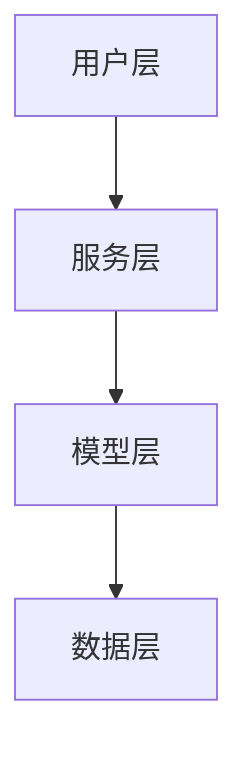
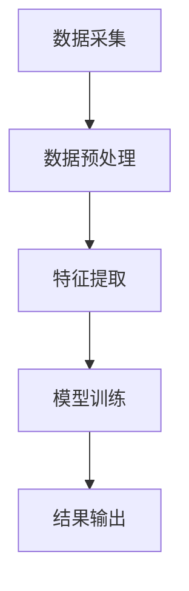
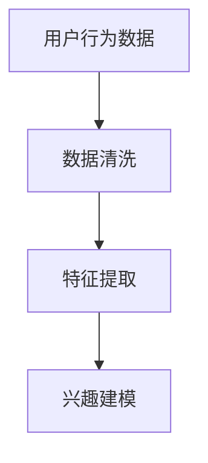
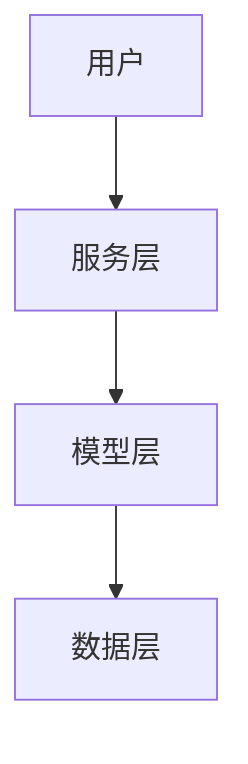

                 


# 构建企业级推荐系统：个性化产品与服务推荐

> 关键词：推荐系统、个性化推荐、企业级架构、协同过滤、深度学习、系统架构、算法实现

> 摘要：  
本文详细探讨了构建企业级推荐系统的核心概念、算法原理、系统架构设计及项目实战。从推荐系统的背景与概述出发，逐步深入分析个性化推荐的重要性与挑战，详细阐述了协同过滤、基于内容的推荐及深度学习在推荐系统中的应用。通过系统架构设计与项目实战，展示了如何将推荐系统应用于实际场景，并总结了最佳实践与注意事项。本文适合技术从业者、架构师及数据科学家阅读，帮助读者全面掌握企业级推荐系统的构建方法。

---

# 第1章: 推荐系统的背景与概述

## 1.1 推荐系统的基本概念

### 1.1.1 什么是推荐系统
推荐系统是一种基于用户行为、偏好和数据挖掘技术，为用户提供个性化的产品和服务推荐的系统。它通过分析用户的历史行为、交互数据及内容特征，预测用户的兴趣，从而生成个性化推荐结果。

### 1.1.2 推荐系统的分类
推荐系统主要分为以下几类：
- **协同过滤推荐**：基于用户与用户之间的相似性或物品与物品之间的相似性进行推荐。
- **基于内容的推荐**：通过分析物品（如产品、视频、文章）的特征，生成与用户兴趣匹配的推荐。
- **混合推荐**：结合协同过滤和基于内容的推荐方法，综合利用用户的交互数据和物品特征进行推荐。
- **基于深度学习的推荐**：利用神经网络模型（如DNN、RNN、GCN等）对用户行为序列和物品特征进行建模，生成推荐结果。

### 1.1.3 推荐系统的应用场景
推荐系统广泛应用于多个领域：
- **电商推荐**：个性化商品推荐、购物车推荐、相似商品推荐。
- **视频推荐**：短视频平台的个性化内容推荐。
- **新闻推荐**：个性化新闻推送。
- **音乐推荐**：个性化音乐播放列表推荐。
- **教育推荐**：个性化课程推荐。

## 1.2 个性化推荐的重要性

### 1.2.1 用户需求的多样性
用户的行为和偏好具有高度的个性化和多样性。同一类型的产品可能满足不同用户的需求，推荐系统需要捕捉用户的细微偏好。

### 1.2.2 个性化推荐的核心价值
个性化推荐能够显著提升用户体验，增加用户满意度和粘性。通过精准匹配用户需求，推荐系统能够提高产品的转化率和销售额。

### 1.2.3 个性化推荐的实现方式
个性化推荐的实现方式包括：
- **基于用户行为的推荐**：分析用户的点击、收藏、购买等行为，预测用户的兴趣。
- **基于用户属性的推荐**：利用用户的年龄、性别、职业等属性进行推荐。
- **基于时间的推荐**：结合用户行为的时间特征，动态调整推荐结果。

## 1.3 企业级推荐系统的挑战

### 1.3.1 数据规模与复杂性
企业级推荐系统需要处理海量数据，包括用户行为数据、物品特征数据等。数据的规模和复杂性对推荐系统的性能提出了更高的要求。

### 1.3.2 算法的实时性与准确性
推荐系统需要在实时场景下快速生成推荐结果，同时保证推荐的准确性。算法的实时性和准确性是企业级推荐系统的核心挑战。

### 1.3.3 系统的可扩展性与稳定性
企业级推荐系统需要具备良好的扩展性和稳定性，能够应对用户规模和数据规模的快速增长。

## 1.4 本章小结
本章从推荐系统的背景出发，介绍了推荐系统的分类、个性化推荐的重要性以及企业级推荐系统的挑战。接下来的章节将深入探讨推荐系统的核心概念与算法原理，帮助读者更好地理解推荐系统的实现过程。

---

# 第2章: 推荐系统的核心概念与原理

## 2.1 推荐系统的核心概念

### 2.1.1 用户-物品交互矩阵
用户-物品交互矩阵（User-Item Interaction Matrix）是一个二维矩阵，其中行表示用户，列表示物品，矩阵中的值表示用户对物品的偏好程度（如评分、点击次数等）。

### 2.1.2 特征提取与表示
特征提取与表示是推荐系统的重要步骤，通过对用户和物品的特征进行提取，能够更好地捕捉用户的兴趣和物品的属性。常用的特征提取方法包括协同过滤、基于内容的特征提取和深度学习特征提取。

### 2.1.3 推荐系统的评价指标
推荐系统的评价指标包括：
- **精确率（Precision）**：推荐结果中实际是正向的占总推荐数的比例。
- **召回率（Recall）**：推荐结果中被正确推荐的正向结果的比例。
- **F1值（F1-Score）**：精确率和召回率的调和平均值。
- **均值平均评分（Mean Average Precision, MAP）**：综合考虑精确率和召回率的指标。
- **归一化折扣哈尔系数（Normalized Discounted Cumulative Gain, NDCG）**：衡量推荐结果的排序质量。

## 2.2 推荐系统的算法原理

### 2.2.1 协同过滤算法
协同过滤是一种基于用户相似性或物品相似性的推荐算法。常见的协同过滤算法包括基于用户的协同过滤和基于物品的协同过滤。

#### 基于用户的协同过滤
基于用户的协同过滤算法通过计算用户之间的相似性，将相似用户的偏好用于推荐。相似性计算通常采用余弦相似度、皮尔逊相关系数等方法。

#### 基于物品的协同过滤
基于物品的协同过滤算法通过计算物品之间的相似性，将相似物品推荐给用户。物品相似性的计算方法包括余弦相似度、协同过滤等。

#### 混合推荐算法
混合推荐算法结合基于用户的协同过滤和基于物品的协同过滤，综合利用用户和物品的特征进行推荐。

### 2.2.2 基于内容的推荐
基于内容的推荐算法通过分析物品的特征（如文本、图像、视频等），生成与用户兴趣匹配的推荐结果。常见的基于内容的推荐算法包括TF-IDF、BM25、Word2Vec等。

### 2.2.3 深度学习在推荐中的应用
深度学习在推荐系统中的应用越来越广泛，常用的深度学习模型包括神经协同过滤（Neural Collaborative Filtering, NCF）、序列推荐模型（如GRU、Transformer）、图神经网络（Graph Neural Network, GNN）等。

## 2.3 推荐系统的数学模型

### 2.3.1 协同过滤的矩阵分解
协同过滤的矩阵分解是一种基于矩阵分解的推荐算法。通过将用户-物品交互矩阵分解为两个低维矩阵（用户特征矩阵和物品特征矩阵），能够有效地捕捉用户和物品的潜在特征。

矩阵分解的数学模型如下：
$$
R = U \cdot V^T
$$
其中，$R$是用户-物品交互矩阵，$U$是用户特征矩阵，$V$是物品特征矩阵。

### 2.3.2 基于深度学习的推荐模型
基于深度学习的推荐模型通过构建神经网络，对用户行为序列和物品特征进行建模，生成推荐结果。常用的深度学习推荐模型包括：

#### 神经协同过滤（NCF）
NCF模型通过构建多层感知机（MLP）网络，对用户和物品的交互进行建模。模型的数学表达如下：
$$
P(u, i) = g(u) \cdot h(i)
$$
其中，$g(u)$和$h(i)$是用户和物品的特征向量，$*$表示逐元素乘法。

#### 序列推荐模型（Transformer）
序列推荐模型通过注意力机制（Attention）对用户行为序列进行建模，捕捉用户的兴趣变化。Transformer模型的注意力机制公式如下：
$$
\alpha_i = \text{softmax}(\frac{q \cdot k_i}{d})
$$
其中，$q$是查询向量，$k_i$是物品$i$的键向量，$d$是向量的维度。

### 2.3.3 模型的评估与优化
模型的评估与优化是推荐系统的重要步骤，常用的评估指标包括精确率、召回率、F1值、MAP和NDCG。模型优化可以通过参数调优、正则化、数据增强等方法实现。

## 2.4 本章小结
本章详细介绍了推荐系统的核心概念与算法原理，包括协同过滤、基于内容的推荐和深度学习在推荐中的应用。接下来的章节将从系统架构设计和项目实战的角度，深入探讨推荐系统的实现过程。

---

# 第3章: 推荐系统的系统架构设计

## 3.1 系统架构概述

### 3.1.1 推荐系统的整体架构
推荐系统的整体架构包括数据层、模型层、服务层和用户层。数据层负责存储和管理用户行为数据和物品特征数据；模型层负责构建推荐模型；服务层负责接收用户请求并返回推荐结果；用户层是最终的用户交互界面。

#### 系统架构图


### 3.1.2 数据流设计
数据流设计包括数据采集、数据预处理、特征提取、模型训练和结果输出。数据采集负责收集用户行为数据和物品特征数据；数据预处理负责清洗和转换数据；特征提取负责提取用户和物品的特征；模型训练负责构建推荐模型；结果输出负责生成推荐结果。

#### 数据流图


### 3.1.3 推荐引擎实现
推荐引擎是推荐系统的核心组件，负责接收用户请求并返回推荐结果。推荐引擎可以通过RESTful API的方式提供服务。

## 3.2 系统功能设计

### 3.2.1 用户行为分析
用户行为分析是推荐系统的重要步骤，通过分析用户的点击、收藏、购买等行为，提取用户的兴趣特征。

#### 用户行为分析流程图


### 3.2.2 特征提取与建模
特征提取与建模是推荐系统的核心步骤，通过提取用户和物品的特征，构建推荐模型。常用的特征提取方法包括TF-IDF、Word2Vec等。

### 3.2.3 推荐结果输出
推荐结果输出是推荐系统的最终步骤，通过将推荐结果返回给用户，提升用户体验。

## 3.3 系统接口设计

### 3.3.1 接口定义
推荐系统的接口包括用户请求接口和推荐结果返回接口。用户请求接口通常采用RESTful API的方式，推荐结果返回接口负责返回推荐结果。

### 3.3.2 接口实现
推荐系统的接口实现需要考虑系统的扩展性和稳定性，通常采用微服务架构，通过API网关对外提供服务。

### 3.3.3 接口测试
接口测试是推荐系统开发的重要步骤，通过测试用例验证接口的正确性和稳定性。

## 3.4 系统交互流程

### 3.4.1 用户请求处理
用户请求处理包括接收用户请求、解析用户请求、调用推荐引擎并返回推荐结果。

#### 系统交互流程图


### 3.4.2 推荐结果生成
推荐结果生成包括模型调用、结果排序和结果返回。

### 3.4.3 推荐结果输出
推荐结果输出是推荐系统的最终步骤，通过将推荐结果返回给用户，提升用户体验。

## 3.5 本章小结
本章从系统架构设计的角度，详细介绍了推荐系统的整体架构、数据流设计、推荐引擎实现、系统功能设计、接口设计和系统交互流程。接下来的章节将从项目实战的角度，深入探讨推荐系统的实现过程。

---

# 第4章: 推荐系统的项目实战

## 4.1 环境搭建

### 4.1.1 安装依赖
推荐系统的开发需要安装以下依赖：
- Python
- PyTorch
- scikit-learn
- numpy
- pandas
- Flask

#### 安装命令
```bash
pip install python python-torch scikit-learn numpy pandas flask
```

### 4.1.2 数据准备
数据准备包括数据清洗、数据预处理和数据分割。数据清洗负责去除异常数据；数据预处理负责转换数据格式；数据分割负责将数据分为训练集和测试集。

#### 数据清洗示例
```python
import pandas as pd
import numpy as np

# 读取数据
data = pd.read_csv('user_item.csv')

# 去除缺失值
data = data.dropna()

# 去除重复值
data = data.drop_duplicates()
```

### 4.1.3 特征提取
特征提取是推荐系统的重要步骤，通过提取用户和物品的特征，构建推荐模型。常用的特征提取方法包括TF-IDF、Word2Vec等。

#### TF-IDF特征提取示例
```python
from sklearn.feature_extraction.text import TfidfVectorizer

# 初始化TF-IDF模型
vectorizer = TfidfVectorizer()

# 提取特征
tfidf_matrix = vectorizer.fit_transform(corpus)
```

## 4.2 系统核心实现

### 4.2.1 协同过滤算法实现
协同过滤算法是推荐系统的核心算法之一，通过计算用户和物品的相似性，生成推荐结果。

#### 协同过滤算法实现示例
```python
import numpy as np
from sklearn.metrics.pairwise import cosine_similarity

# 计算用户相似性
user_similarity = cosine_similarity(user_features)

# 基于用户的协同过滤推荐
def recommend_users(user_id, user_similarity, k=3):
    similar_users = np.argsort(user_similarity[user_id])[::-1][:k]
    recommended_items = []
    for user in similar_users:
        recommended_items.extend(users[user]['items'])
    return recommended_items
```

### 4.2.2 基于内容的推荐实现
基于内容的推荐算法通过分析物品的特征，生成与用户兴趣匹配的推荐结果。

#### 基于内容的推荐实现示例
```python
from sklearn.feature_extraction.text import TfidfVectorizer

# 初始化TF-IDF模型
vectorizer = TfidfVectorizer()

# 提取物品特征
item_features = vectorizer.fit_transform(items).toarray()

# 计算物品相似性
item_similarity = cosine_similarity(item_features)

# 基于物品的协同过滤推荐
def recommend_items(user_id, item_similarity, k=3):
    similar_items = np.argsort(item_similarity[user_id])[::-1][:k]
    recommended_items = []
    for item in similar_items:
        recommended_items.append(items[item])
    return recommended_items
```

### 4.2.3 深度学习模型实现
深度学习模型是推荐系统的高级实现，通过构建神经网络模型，对用户行为序列和物品特征进行建模，生成推荐结果。

#### 深度学习模型实现示例
```python
import torch
import torch.nn as nn

# 定义神经协同过滤模型
class NCF(nn.Module):
    def __init__(self, user_dim, item_dim, hidden_dim):
        super(NCF, self).__init__()
        self.user_layer = nn.Linear(user_dim, hidden_dim)
        self.item_layer = nn.Linear(item_dim, hidden_dim)
        self.predict_layer = nn.Linear(hidden_dim, 1)
    
    def forward(self, user_features, item_features):
        user_embeddings = self.user_layer(user_features)
        item_embeddings = self.item_layer(item_features)
        interactions = user_embeddings * item_embeddings
        predictions = self.predict_layer(interactions)
        return predictions

# 初始化模型
model = NCF(user_dim, item_dim, hidden_dim)

# 定义损失函数
criterion = nn.MSELoss()

# 定义优化器
optimizer = torch.optim.Adam(model.parameters(), lr=0.001)

# 训练模型
for epoch in range(num_epochs):
    for batch in batches:
        inputs, targets = batch['user_features'], batch['item_features'], batch['targets']
        outputs = model(inputs['user_features'], inputs['item_features'])
        loss = criterion(outputs, targets)
        optimizer.zero_grad()
        loss.backward()
        optimizer.step()
```

## 4.3 项目实战

### 4.3.1 电商推荐系统
电商推荐系统是一个典型的推荐系统应用，通过分析用户的购买历史、浏览记录等行为，推荐与用户兴趣匹配的商品。

#### 电商推荐系统实现示例
```python
import pandas as pd
from sklearn.feature_extraction.text import TfidfVectorizer
from sklearn.metrics.pairwise import cosine_similarity

# 数据准备
data = pd.read_csv('ecommerce_data.csv')

# 特征提取
vectorizer = TfidfVectorizer()
tfidf_matrix = vectorizer.fit_transform(data['item_description'])

# 计算物品相似性
item_similarity = cosine_similarity(tfidf_matrix)

# 基于物品的协同过滤推荐
def recommend_products(user_id, item_similarity, k=3):
    similar_items = np.argsort(item_similarity[user_id])[::-1][:k]
    recommended_products = []
    for item in similar_items:
        recommended_products.append(data['item_name'][item])
    return recommended_products
```

### 4.3.2 视频推荐系统
视频推荐系统通过分析用户的观看历史、点赞、评论等行为，推荐与用户兴趣匹配的视频内容。

#### 视频推荐系统实现示例
```python
import torch
import torch.nn as nn
from transformers import AutoTokenizer, AutoModel

# 初始化分词器和模型
tokenizer = AutoTokenizer.from_pretrained('bert-base-uncased')
model = AutoModel.from_pretrained('bert-base-uncased')

# 提取视频特征
def extract_features(text):
    inputs = tokenizer(text, return_tensors='np')
    with torch.no_grad():
        outputs = model(**inputs)
    return outputs.last_hidden_state.numpy()

# 定义推荐模型
class VideoRecommend(nn.Module):
    def __init__(self, input_dim, hidden_dim):
        super(VideoRecommend, self).__init__()
        self.fc1 = nn.Linear(input_dim, hidden_dim)
        self.fc2 = nn.Linear(hidden_dim, 1)
    
    def forward(self, features):
        x = self.fc1(features)
        x = self.fc2(x)
        return x

# 初始化模型
model = VideoRecommend(input_dim, hidden_dim)

# 定义损失函数和优化器
criterion = nn.BCEWithLogitsLoss()
optimizer = torch.optim.Adam(model.parameters(), lr=0.001)

# 训练模型
for epoch in range(num_epochs):
    for batch in batches:
        inputs, targets = batch['features'], batch['targets']
        outputs = model(inputs)
        loss = criterion(outputs, targets)
        optimizer.zero_grad()
        loss.backward()
        optimizer.step()
```

### 4.3.3 推荐结果分析
推荐结果分析是推荐系统的重要步骤，通过分析推荐结果的精确率、召回率等指标，评估推荐系统的性能。

#### 推荐结果分析示例
```python
from sklearn.metrics import precision_score, recall_score, f1_score

# 计算精确率
precision = precision_score(true_labels, predicted_labels)

# 计算召回率
recall = recall_score(true_labels, predicted_labels)

# 计算F1值
f1 = f1_score(true_labels, predicted_labels)

print(f'Precision: {precision:.4f}')
print(f'Recall: {recall:.4f}')
print(f'F1: {f1:.4f}')
```

## 4.4 本章小结
本章通过项目实战，详细介绍了推荐系统的环境搭建、核心实现和实际案例分析。通过电商推荐系统和视频推荐系统的实现，展示了推荐系统在实际场景中的应用。接下来的章节将从总结与展望的角度，总结推荐系统的最佳实践和未来发展。

---

# 第5章: 总结与展望

## 5.1 总结
推荐系统是一种基于用户行为和数据挖掘技术，为用户提供个性化产品和服务推荐的系统。本文从推荐系统的背景与概述出发，详细探讨了推荐系统的核心概念、算法原理、系统架构设计及项目实战。通过协同过滤、基于内容的推荐和深度学习在推荐中的应用，帮助读者全面掌握推荐系统的实现方法。

## 5.2 最佳实践 tips
- **数据预处理**：推荐系统的核心是数据，数据预处理是推荐系统成功的关键。
- **模型选择**：根据具体场景选择合适的推荐算法，如协同过滤、基于内容的推荐或深度学习模型。
- **系统优化**：推荐系统的性能优化是永恒的主题，需要从算法优化、系统架构优化和数据优化等多个方面入手。
- **用户体验**：推荐系统的最终目标是提升用户体验，需要关注推荐结果的实时性、准确性和多样性。

## 5.3 小结
推荐系统的构建是一个复杂而有趣的过程，需要结合理论与实践，不断优化和改进。随着深度学习和大数据技术的不断发展，推荐系统将更加智能化和个性化，为用户提供更加精准和贴心的服务。

## 5.4 注意事项
- 推荐系统的数据隐私问题需要高度重视，确保用户数据的安全性和隐私性。
- 推荐系统的实时性要求较高，需要优化算法和系统架构，确保推荐结果的快速生成。
- 推荐系统的模型需要定期更新和优化，以适应用户需求的变化和数据的变化。

## 5.5 拓展阅读
- 《推荐系统实践》：深入探讨推荐系统的实现方法和最佳实践。
- 《深度学习推荐系统》：详细讲解深度学习在推荐系统中的应用。
- 《协同过滤算法与应用》：系统介绍协同过滤算法及其应用。

---

# 附录

## 附录A: 推荐系统相关工具与库
- **Python**：Python是推荐系统开发的主要语言，提供了丰富的第三方库。
- **scikit-learn**：scikit-learn是一个强大的机器学习库，提供了多种特征提取和模型训练方法。
- **TensorFlow/PyTorch**：TensorFlow和PyTorch是深度学习框架，广泛应用于推荐系统的深度学习模型开发。
- **Flask/Django**：Flask和Django是Python的Web框架，用于构建推荐系统的Web服务。
- **Elasticsearch**：Elasticsearch是一个分布式搜索引擎，广泛应用于推荐系统的实时搜索和特征提取。

## 附录B: 推荐系统相关论文与书籍
- **《Collaborative Filtering for recommender systems》**：介绍协同过滤在推荐系统中的应用。
- **《Deep Learning for Recommender Systems》**：探讨深度学习在推荐系统中的应用。
- **《Recommender Systems: Algorithms and Evaluation》**：系统介绍推荐系统的算法和评估方法。

---

# 结语
构建企业级推荐系统是一个复杂而有趣的过程，需要结合理论与实践，不断优化和改进。通过本文的学习，读者将能够掌握推荐系统的构建方法，并在实际场景中应用推荐系统，为用户提供更加精准和贴心的服务。

