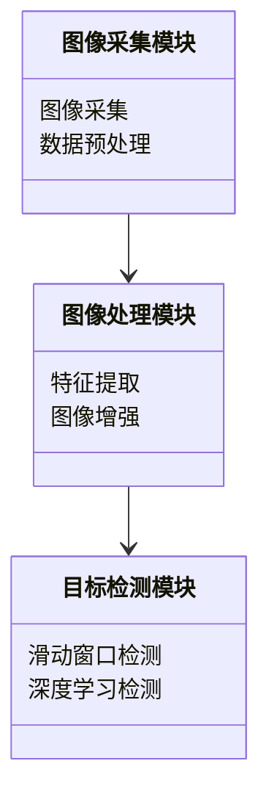
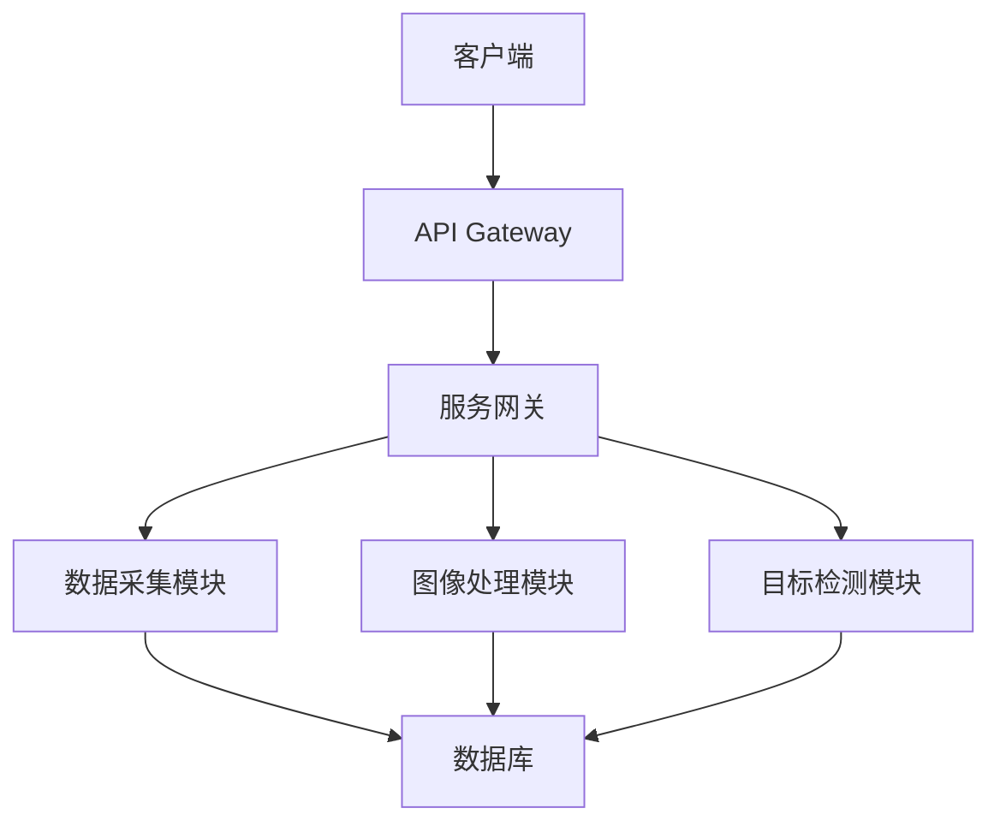
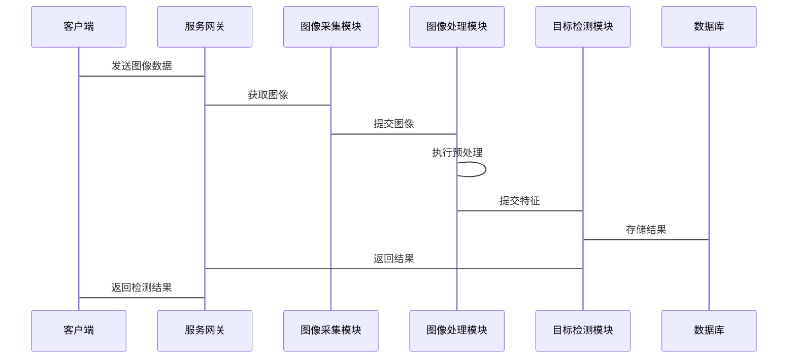

                 


# 构建企业级机器视觉平台：质量控制与安全监测

> 关键词：机器视觉、企业级平台、质量控制、安全监测、深度学习、图像处理、系统架构

> 摘要：本文将详细探讨构建企业级机器视觉平台的核心技术与系统架构，重点分析质量控制与安全监测两大应用场景。通过深入解析机器视觉的核心算法原理、系统设计以及实际项目案例，为读者提供从理论到实践的全面指导。

---

# 第一部分: 企业级机器视觉平台概述

# 第1章: 机器视觉的基本概念与应用背景

## 1.1 机器视觉的定义与核心概念

### 1.1.1 机器视觉的定义
机器视觉（Machine Vision）是利用计算机模拟人类视觉系统的技术，通过图像采集、处理和分析，实现对目标物体的识别、检测和测量。其核心目标是让计算机“看懂”图像，并做出相应的决策或反馈。

### 1.1.2 机器视觉的核心概念
- **图像采集**：通过摄像头或其他传感器获取图像数据。
- **图像处理**：对图像进行增强、滤波、边缘检测等操作，提取有用特征。
- **目标检测**：识别图像中的特定目标（如缺陷、物体等）。
- **模式识别**：通过算法识别图像中的模式，如分类、识别等。
- **深度学习**：基于神经网络的图像分析技术，用于复杂场景的识别与理解。

### 1.1.3 机器视觉与计算机视觉的区别
| 项目 | 机器视觉 | 计算机视觉 |
|------|----------|------------|
| 定义 | 专注于工业应用，解决特定问题 | 更广泛，涵盖学术研究与应用 |
| 技术 | 偏向工程化，注重实时性和可靠性 | 偏向算法研究，注重理论深度 |

## 1.2 机器视觉在企业中的应用背景

### 1.2.1 企业级应用的定义
企业级应用是指在企业内部或企业服务中使用的软件或系统，具有高可用性、可靠性和扩展性。机器视觉在企业级应用中的价值在于通过自动化技术提升效率、降低成本。

### 1.2.2 机器视觉在企业中的应用场景
- **制造业**：产品质量检测、缺陷识别、尺寸测量。
- **物流行业**：物品分拣、条码识别、路径规划。
- **安防领域**：人脸识别、行为分析、异常检测。
- **医疗行业**：医学图像分析、辅助诊断。

### 1.2.3 机器视觉在质量控制与安全监测中的作用
- **质量控制**：通过图像分析检测产品缺陷，减少人工检查的误差。
- **安全监测**：实时监控工作环境，预防安全事故的发生。

## 1.3 机器视觉平台的构建目标与价值

### 1.3.1 机器视觉平台的构建目标
- 提供高效的图像采集和处理能力。
- 实现高精度的目标检测和识别。
- 支持多种应用场景，具备良好的扩展性。

### 1.3.2 机器视觉平台对企业价值的影响
- 提升生产效率，降低人工成本。
- 提高产品质量，减少缺陷率。
- 增强企业安全能力，预防事故的发生。

### 1.3.3 机器视觉平台的边界与外延
- **边界**：专注于图像处理和目标检测，不涉及其他业务逻辑。
- **外延**：可与其他系统（如ERP、MES）集成，提供完整的解决方案。

## 1.4 本章小结
本章介绍了机器视觉的基本概念、核心技术和应用场景，重点分析了其在质量控制与安全监测中的作用。通过构建企业级机器视觉平台，企业可以显著提升效率和安全性。

---

# 第二部分: 机器视觉的核心技术与算法原理

# 第2章: 机器视觉的核心技术

## 2.1 图像处理技术

### 2.1.1 图像采集与预处理
- **图像采集**：使用摄像头或传感器获取图像。
- **预处理**：包括灰度化、二值化、平滑等操作，改善图像质量。

### 2.1.2 图像增强与特征提取
- **图像增强**：通过调整亮度、对比度等提升图像可辨识性。
- **特征提取**：提取边缘、纹理等特征，为后续识别提供基础。

### 2.1.3 图像分割与边缘检测
- **图像分割**：将图像分割为多个区域，便于后续处理。
- **边缘检测**：通过算法提取图像的边缘信息，常用Canny算法。

## 2.2 目标检测与识别技术

### 2.2.1 基于传统算法的目标检测
- **Haar特征检测**：通过特征匹配实现目标检测。
- **SIFT算法**：基于尺度不变特征的检测方法。

### 2.2.2 基于深度学习的目标检测
- **CNN（卷积神经网络）**：通过多层卷积提取特征，用于目标检测。
- **YOLO算法**：实时目标检测算法，适用于工业场景。

### 2.2.3 目标识别的实现原理
- **图像分类**：基于深度学习的图像分类模型，如ResNet、VGG。
- **目标定位**：在图像中定位目标的位置，并进行分类。

## 2.3 模式识别与图像分类

### 2.3.1 图像分类的基本概念
- **分类任务**：将图像分为多个类别。
- **分类模型**：基于深度学习的分类模型，如AlexNet、ResNet。

### 2.3.2 常见的图像分类算法
- **K-近邻（KNN）**：基于特征相似度的分类方法。
- **支持向量机（SVM）**：基于最大-margin的分类方法。

### 2.3.3 模式识别的应用场景
- **OCR识别**：光学字符识别，应用于文档扫描。
- **车牌识别**：通过图像处理和模式识别实现车牌识别。

## 2.4 机器视觉中的深度学习技术

### 2.4.1 深度学习在机器视觉中的应用
- **图像生成**：使用GAN生成图像，应用于图像修复。
- **图像分割**：使用U-Net等模型进行图像分割。

### 2.4.2 常见的深度学习模型
- **CNN（卷积神经网络）**：适用于图像分类和目标检测。
- **RNN（循环神经网络）**：适用于序列图像处理。

### 2.4.3 深度学习在质量控制与安全监测中的应用
- **缺陷检测**：通过深度学习模型识别产品中的缺陷。
- **行为分析**：通过深度学习模型分析人员行为，预防安全事故。

---

# 第3章: 机器视觉算法的数学模型与公式

## 3.1 图像处理中的数学模型

### 3.1.1 常见图像变换的数学公式
- **傅里叶变换**：用于图像频域分析，公式为：
  $$ F(k) = \sum_{n=-\infty}^{\infty} f(n)e^{-jkn} $$

### 3.1.2 图像增强的数学模型
- **对比度增强**：通过调整灰度值范围提升对比度。
- **直方图均衡化**：通过概率分布调整图像亮度。

## 3.2 目标检测与识别的算法原理

### 3.2.1 基于滑动窗口的目标检测
- **滑动窗口技术**：通过遍历图像中的所有可能位置，检测目标是否存在。

### 3.2.2 基于深度学习的目标检测
- **CNN的前向传播**：输入图像经过卷积、池化等操作，最终输出目标概率。

## 3.3 深度学习中的数学公式

### 3.3.1 卷积神经网络的数学模型
- **卷积操作**：对输入图像进行卷积操作，公式为：
  $$ (f * g)(i, j) = \sum_{k,l} f(i+k, j+l)g(k,l) $$

### 3.3.2 激活函数与损失函数的数学表达
- **ReLU激活函数**：$f(x) = \max(0, x)$
- **交叉熵损失函数**：$L = -\sum_{i} y_i \log p_i + (1 - y_i)\log(1 - p_i)$

### 3.3.3 优化算法的数学推导
- **梯度下降**：通过计算损失函数的梯度，更新模型参数，公式为：
  $$ \theta = \theta - \eta \frac{\partial L}{\partial \theta} $$

---

# 第三部分: 企业级机器视觉平台的系统架构与设计

# 第4章: 机器视觉平台的系统架构设计

## 4.1 系统功能模块划分

### 4.1.1 数据采集模块
- **功能**：通过摄像头采集图像数据。
- **流程**：图像采集 → 数据预处理 → 数据存储。

### 4.1.2 数据处理模块
- **功能**：对图像进行增强、特征提取等处理。
- **流程**：图像预处理 → 特征提取 → 数据分析。

## 4.2 系统功能设计

### 4.2.1 领域模型设计


### 4.2.2 系统架构设计


### 4.2.3 系统接口设计
- **API接口**：提供RESTful接口，供其他系统调用。
- **数据接口**：与数据库交互，存储图像数据和检测结果。

### 4.2.4 系统交互流程图


---

# 第5章: 项目实战与优化

## 5.1 项目实战

### 5.1.1 环境安装
- **Python环境**：安装Python 3.8及以上版本。
- **深度学习框架**：安装TensorFlow或PyTorch。
- **图像处理库**：安装OpenCV、 Pillow。

### 5.1.2 核心代码实现

#### 5.1.2.1 图像采集与预处理
```python
import cv2

# 图像采集
cap = cv2.VideoCapture(0)
while True:
    ret, frame = cap.read()
    if not ret:
        break
    # 图像预处理
    gray = cv2.cvtColor(frame, cv2.COLOR_BGR2GRAY)
    cv2.imshow('Gray Image', gray)
    if cv2.waitKey(1) & 0xFF == ord('q'):
        break
cap.release()
cv2.destroyAllWindows()
```

#### 5.1.2.2 目标检测与识别
```python
import tensorflow as tf
from tensorflow import keras

# 加载预训练模型
model = keras.models.load_model('model.h5')
# 图像分类
def predict_image(image):
    prediction = model.predict(image)
    return prediction.argmax(axis=1)
```

### 5.1.3 代码解读与分析
- **图像采集**：通过OpenCV读取摄像头数据。
- **图像预处理**：将图像转换为灰度图，便于后续处理。
- **目标检测**：使用预训练模型进行图像分类，返回检测结果。

### 5.1.4 实际案例分析
- **案例1**：制造业中的缺陷检测。
- **案例2**：安防领域中的行为分析。

## 5.2 项目优化

### 5.2.1 性能优化
- **并行计算**：使用GPU加速模型推理。
- **模型优化**：通过剪枝、量化等技术优化模型大小和推理速度。

### 5.2.2 可靠性优化
- **错误检测**：通过多模型融合提升检测准确率。
- **容错设计**：设计冗余机制，确保系统稳定性。

## 5.3 本章小结
本章通过实际项目案例，详细讲解了企业级机器视觉平台的构建过程，从环境搭建到代码实现，再到案例分析，为读者提供了从理论到实践的完整指导。

---

# 第6章: 最佳实践与未来展望

## 6.1 最佳实践

### 6.1.1 系统设计
- **模块化设计**：确保系统模块清晰，便于维护和扩展。
- **高可用性设计**：通过负载均衡、集群部署提升系统可用性。

### 6.1.2 算法优化
- **模型选择**：根据具体场景选择合适的算法，避免过度复杂。
- **数据优化**：通过数据增强、迁移学习提升模型性能。

### 6.1.3 安全与隐私
- **数据加密**：保护图像数据的安全性。
- **隐私保护**：避免隐私泄露，遵守相关法律法规。

## 6.2 小结与展望

### 6.2.1 小结
- 机器视觉在企业级应用中的价值显著，能够显著提升效率和安全性。
- 通过构建高效的机器视觉平台，企业可以实现智能化转型。

### 6.2.2 未来展望
- **AI芯片**：随着AI芯片的发展，机器视觉将更加高效。
- **5G技术**：5G的普及将推动实时机器视觉应用的发展。
- **边缘计算**：边缘计算的兴起将推动机器视觉的分布式部署。

---

# 第四部分: 总结

# 结语
通过本文的详细讲解，读者可以全面了解企业级机器视觉平台的构建过程，从核心算法到系统架构，再到实际应用。未来，随着技术的不断发展，机器视觉将在更多领域发挥重要作用，帮助企业实现更高效的生产和更安全的环境。

