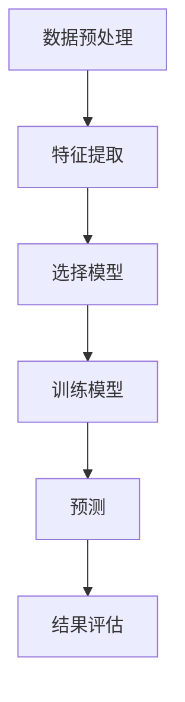
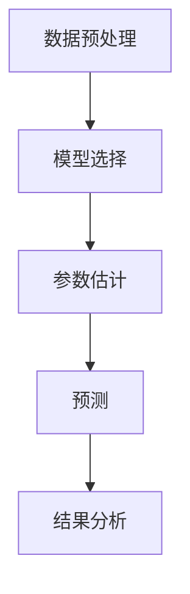
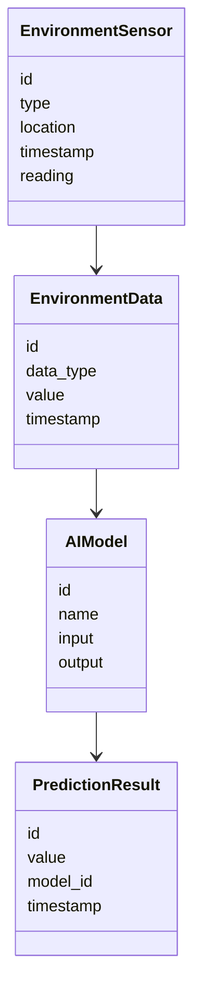
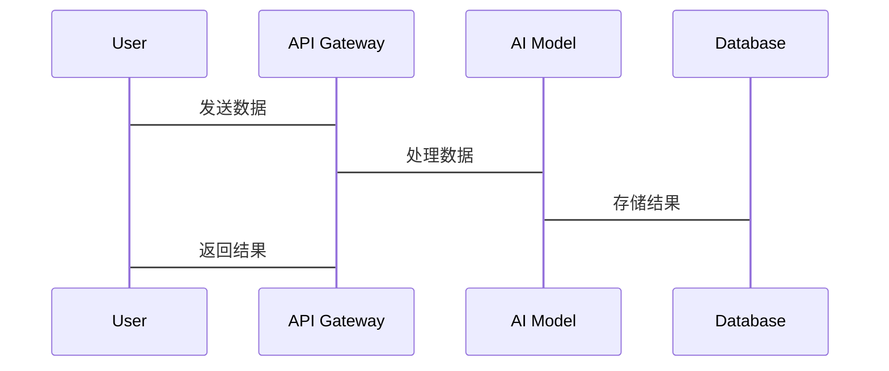

                 


# 构建企业级环境监测AI：助力合规与可持续发展

## 关键词：
企业级AI、环境监测、数据处理、深度学习、时间序列分析、系统架构、可持续发展

## 摘要：
随着全球对环境问题的关注日益增加，企业级环境监测AI系统成为实现合规与可持续发展的关键工具。本文从背景、核心概念、算法原理、系统架构、项目实战和合规与可持续发展等方面，详细阐述如何构建高效、可靠的环境监测AI系统。通过实际案例和最佳实践，为读者提供全面的技术指导。

---

## 第一部分：背景与挑战

### 章节1：环境监测的背景

#### 1.1 问题背景
环境监测是保护地球生态系统的重要手段，涉及空气、水、土壤等多个方面。传统方法依赖人工检测，效率低、成本高且覆盖面有限。

#### 1.2 问题描述
企业级环境监测需要实时、准确的数据，以应对复杂的环境问题。传统方法难以满足企业对高效率、高精度的需求。

#### 1.3 问题解决思路
引入AI技术，利用深度学习和时间序列分析，构建实时、智能的环境监测系统，提升数据处理效率和准确性。

#### 1.4 边界条件
系统需处理多种环境数据，支持多平台接入，确保数据隐私和合规性。

#### 1.5 概念结构
环境监测AI系统由数据采集、处理、分析、可视化和反馈模块组成，形成闭环。

---

### 章节2：企业级AI的挑战与机遇

#### 2.1 问题背景
企业级AI需要处理海量数据，确保系统稳定性和扩展性。

#### 2.2 技术挑战
数据异构性、模型复杂性、计算资源需求高。

#### 2.3 业务挑战
合规要求高、数据隐私保护、系统可靠性。

#### 2.4 机遇
提升效率、降低成本、推动可持续发展。

---

### 章节3：数据处理的重要性

#### 3.1 数据采集与预处理
确保数据质量，清洗、标准化和归一化处理。

#### 3.2 数据流分析
实时处理与历史数据分析结合，支持预测和决策。

#### 3.3 数据安全与隐私
数据加密、访问控制，确保合规性。

---

## 第二部分：核心概念与联系

### 章节4：AI与环境监测的核心概念

#### 4.1 核心概念定义
AI：模拟人类学习能力的技术；环境监测：实时检测环境参数。

#### 4.2 核心概念特征对比
| 特征 | AI | 环境监测 |
|------|----|----------|
| 数据 | 大数据 | 多源异构 | 
| 模型 | 自适应 | 预测性 | 
| 速度 | 实时 | 高效 | 

#### 4.3 ER实体关系图
```mermaid
er
    %%{name: Entity Relation Diagram for Environment Monitoring AI}
    class EnvironmentSensor {
        id: int
        sensor_type: String
        location: String
        timestamp: DateTime
        reading: float
    }
    class EnvironmentData {
        id: int
        data_type: String
        value: float
        timestamp: DateTime
    }
    class AIModel {
        id: int
        model_name: String
        input_type: String
        output_type: String
    }
    class PredictionResult {
        id: int
        prediction_value: float
        model_id: int
        timestamp: DateTime
    }
    EnvironmentSensor --> EnvironmentData: 采集
    EnvironmentData --> AIModel: 输入
    AIModel --> PredictionResult: 输出
```

---

## 第三部分：算法原理讲解

### 章节5：数学模型与深度学习

#### 5.1 算法原理
深度学习用于特征提取，时间序列分析用于预测。

#### 5.2 深度学习模型
多层感知机（MLP）和长短期记忆网络（LSTM）。

#### 5.3 时间序列分析
ARIMA模型。

#### 5.4 算法流程


#### 5.5 代码实现
```python
import numpy as np
from sklearn.metrics import mean_squared_error

# 示例数据
X_train = np.random.rand(100, 10)
y_train = np.random.rand(100, 1)

# 训练模型
model = MLPRegressor(hidden_layer_sizes=(10, 5))
model.fit(X_train, y_train)

# 预测
X_test = np.random.rand(20, 10)
y_pred = model.predict(X_test)

# 评估
mse = mean_squared_error(y_test, y_pred)
print(f"均方误差: {mse}")
```

---

### 章节6：时间序列分析

#### 6.1 ARIMA模型
用于预测时间序列数据。

#### 6.2 算法流程


#### 6.3 代码实现
```python
from statsmodels.tsa.arima_model import ARIMA

# 示例数据
data = [1, 2, 3, 4, 5, 6, 7, 8, 9, 10]

# 训练模型
model = ARIMA(data, order=(1, 1, 1))
model_fit = model.fit(disp=0)

# 预测
 forecast = model_fit.forecast(steps=5)
 print(forecast)
```

---

## 第四部分：系统架构设计方案

### 章节7：系统设计与架构

#### 7.1 领域模型设计


#### 7.2 系统架构设计


#### 7.3 接口设计
API：数据采集接口、模型训练接口、结果查询接口。

#### 7.4 交互流程


---

## 第五部分：项目实战

### 章节8：数据处理实战

#### 8.1 环境安装
安装Python、NumPy、Pandas、TensorFlow、Keras、Scikit-learn、statsmodels。

#### 8.2 数据处理实现
```python
import pandas as pd
import numpy as np

# 示例数据
data = {'location': ['A', 'A', 'B', 'B'],
        'time': ['2023-01-01', '2023-01-02', '2023-01-01', '2023-01-02'],
        'value': [10, 20, 30, 40]}
df = pd.DataFrame(data)

# 数据清洗
df.dropna()
df['value'] = df['value'].astype(float)

# 数据转换
df['log_value'] = np.log(df['value'])
```

#### 8.3 代码解读
数据清洗、转换和特征工程。

---

### 章节9：模型实现与案例分析

#### 9.1 模型实现
```python
from keras.models import Sequential
from keras.layers import Dense

# 模型定义
model = Sequential()
model.add(Dense(64, activation='relu', input_dim=10))
model.add(Dense(1, activation='sigmoid'))

# 编译
model.compile(optimizer='adam', loss='binary_crossentropy', metrics=['accuracy'])

# 训练
model.fit(X_train, y_train, epochs=10, batch_size=32)
```

#### 9.2 案例分析
以空气质量监测为例，展示模型训练和预测过程。

---

## 第六部分：合规与可持续发展

### 章节10：合规挑战与可持续策略

#### 10.1 合规挑战
数据隐私、模型透明性、算法公平性。

#### 10.2 可持续策略
优化计算资源、减少碳足迹、提升数据利用效率。

---

## 总结

构建企业级环境监测AI系统是一项复杂的任务，需要结合先进的算法、系统架构设计和最佳实践。通过合规与可持续发展的策略，企业可以有效利用AI技术，推动环境保护和可持续发展。

---

## 相关资料

1. 《深度学习实战》：深入理解深度学习原理与应用。
2. 《时间序列分析》：掌握时间序列分析方法。
3. 《系统架构设计》：学习企业级系统架构设计技巧。

---

通过本文的详细阐述，读者可以系统地了解如何构建企业级环境监测AI系统，助力合规与可持续发展。

