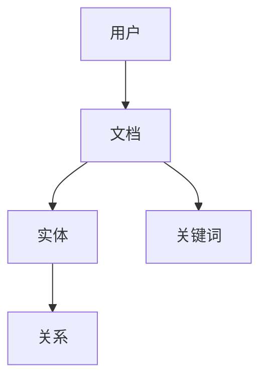
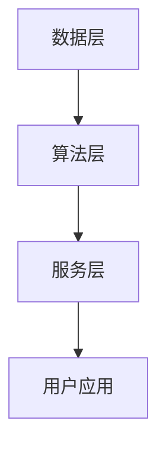
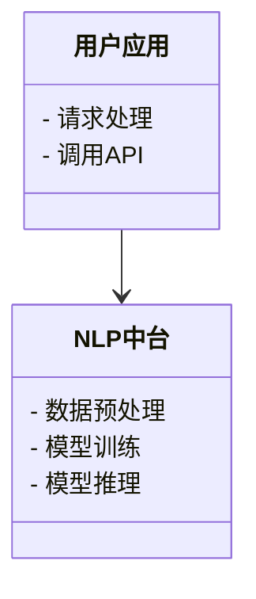

                 


# 构建企业级自然语言处理中台：多语言、多领域支持

## 关键词：自然语言处理，中台架构，多语言，多领域，微服务，机器学习，深度学习

## 摘要：  
随着人工智能技术的快速发展，自然语言处理（NLP）在企业中的应用越来越广泛。然而，如何高效地构建一个支持多语言和多领域的企业级NLP中台，成为企业在数字化转型中面临的重要挑战。本文从NLP中台的背景与需求出发，详细探讨了其核心概念、多语言与多领域支持的技术实现，以及系统架构与设计方案。通过实际项目实战，本文展示了如何从环境搭建、系统设计到代码实现，构建一个功能强大的NLP中台。最后，本文还对当前的技术前沿和未来发展趋势进行了展望。

---

## 第一部分: 自然语言处理中台概述

### 第1章: 自然语言处理中台的背景与需求

#### 1.1 自然语言处理中台的背景介绍

自然语言处理（NLP）是人工智能领域的重要分支，致力于让计算机能够理解、生成和处理人类语言。随着深度学习技术的快速发展，NLP技术已经在机器翻译、情感分析、信息提取等领域取得了显著成果。然而，企业在实际应用中，往往需要面对多语言、多领域的复杂场景，如何高效地构建一个支持这些场景的NLP中台，成为一项重要挑战。

#### 1.2 企业级NLP中台的需求分析

企业级NLP中台需要满足以下需求：
- **多语言支持**：企业可能需要处理多种语言的数据，例如中文、英文、日语等。
- **多领域适配**：不同业务领域（如金融、医疗、法律等）对NLP的需求各不相同，中台需要能够快速适配不同领域。
- **可扩展性**：随着业务需求的变化，中台需要支持快速扩展和定制化开发。
- **高效性与准确性**：在大规模数据处理中，中台需要保证处理效率和结果准确性。

#### 1.3 多语言与多领域支持的重要性

在企业应用场景中，多语言和多领域支持是NLP中台的核心能力：
- **多语言支持**：帮助企业在全球化业务中高效处理多种语言的数据，降低语言障碍。
- **多领域支持**：满足不同业务领域的特定需求，例如医疗领域的病历分析、金融领域的风险评估等。

---

### 第2章: 自然语言处理中台的核心概念

#### 2.1 NLP中台的架构设计

NLP中台的架构设计通常包括以下部分：
- **数据层**：存储和管理多语言、多领域的数据。
- **算法层**：实现各种NLP算法和模型，支持多种任务（如分词、句法分析、实体识别等）。
- **服务层**：提供API接口，供上层应用调用NLP服务。
- **管理层**：对模型和数据进行监控、管理，支持动态扩展。

#### 2.2 核心概念与联系

在NLP中台中，核心概念包括：
- **实体关系图（ER图）**：描述数据之间的关系，例如用户、文档、实体等。
- **领域模型类图**：描述不同业务领域中的实体和关系。

以下是ER实体关系图的Mermaid示例：



#### 2.3 多语言与多领域支持的技术挑战

- **多语言支持**：需要处理不同语言的语法和语义差异，例如中文分词与英文分词的差异。
- **多领域支持**：不同领域的数据和语义规则不同，需要动态调整模型参数。

---

### 第3章: 企业级NLP中台的系统架构设计

#### 3.1 系统架构概述

NLP中台的系统架构通常采用分层设计：
1. **数据层**：包括数据存储、数据预处理等功能。
2. **算法层**：包括NLP模型训练、推理等。
3. **服务层**：提供API接口，供外部应用调用。

以下是系统架构的Mermaid图：



#### 3.2 系统功能设计

系统功能设计需要考虑以下方面：
- **数据预处理**：包括分词、停用词处理、词干提取等。
- **模型训练**：支持多种NLP任务（如分类、命名实体识别等）。
- **模型推理**：提供API接口，供外部应用调用。

以下是系统功能设计的Mermaid类图：



#### 3.3 系统接口设计

系统接口设计需要考虑以下方面：
- **RESTful API**：提供HTTP接口，供外部应用调用。
- **WebSocket**：支持实时通信，适用于需要实时反馈的场景。

---

### 第4章: 项目实战

#### 4.1 环境安装

以下是项目实战的环境安装步骤：
1. 安装Python 3.8以上版本。
2. 安装必要的Python库（如TensorFlow、Keras、spaCy等）。
3. 安装Jupyter Notebook用于开发和调试。

#### 4.2 核心代码实现

以下是NLP中台的核心代码实现示例：

```python
import tensorflow as tf
from tensorflow.keras import layers

# 数据预处理
def preprocess(text):
    # 分词
    words = tokenize(text)
    # 转换为数值表示
    word_embeddings = get_word_embeddings(words)
    return word_embeddings

# 模型训练
def train_model(train_data, train_labels):
    model = tf.keras.Sequential([
        layers.Embedding(input_dim= vocabulary_size, output_dim= embedding_dim),
        layers.Conv1D(filters=64, kernel_size=3, padding='valid'),
        layers.MaxPooling1D(pool_size=2),
        layers.Dense(128, activation='relu'),
        layers.Dense(1, activation='sigmoid')
    ])
    model.compile(optimizer='adam', loss='binary_crossentropy', metrics=['accuracy'])
    model.fit(train_data, train_labels, epochs=10, batch_size=32)
    return model

# 模型推理
def inference(model, text):
    processed_input = preprocess(text)
    prediction = model.predict(processed_input)
    return prediction
```

#### 4.3 实际案例分析

以中文情感分析为例：
1. 数据预处理：将中文文本进行分词和词性标注。
2. 模型训练：使用深度学习模型（如LSTM）进行训练。
3. 模型推理：对新的中文文本进行情感分析，输出结果。

---

### 第5章: 扩展与展望

#### 5.1 技术前沿

当前，NLP技术的前沿包括：
- **大模型**：如GPT-3、GPT-4等。
- **小样本学习**：在数据量有限的情况下，提升模型性能。

#### 5.2 未来发展趋势

未来，NLP中台将更加智能化和自动化，支持更多语言和领域，同时更加注重模型的可解释性和实时性。

#### 5.3 最佳实践

- **数据质量管理**：确保数据的准确性和完整性。
- **模型优化**：定期更新模型，提升性能。
- **安全与隐私保护**：在数据处理和模型训练中，注重隐私保护。

---

## 总结

构建企业级自然语言处理中台是一项复杂的系统工程，需要从多个方面进行综合考虑。本文从背景介绍到系统设计，再到项目实战，详细探讨了NLP中台的构建过程。通过实际案例分析，展示了如何在实际应用中构建一个高效、可靠的NLP中台。未来，随着技术的不断发展，NLP中台将更加智能化和多样化，为企业带来更大的价值。

