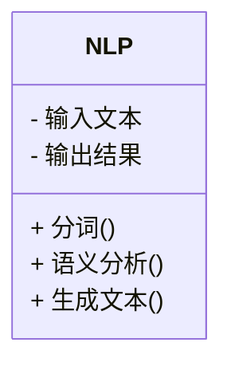
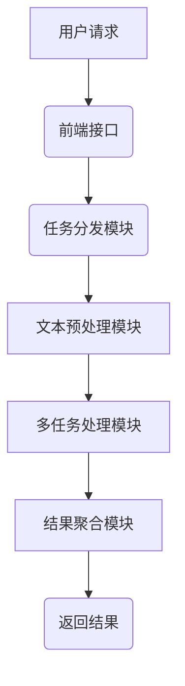
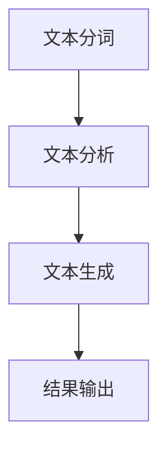
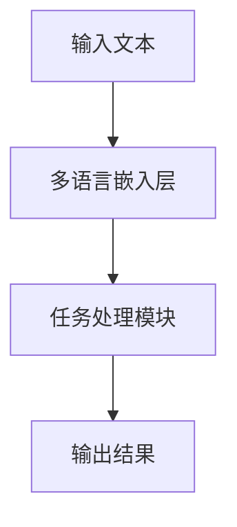
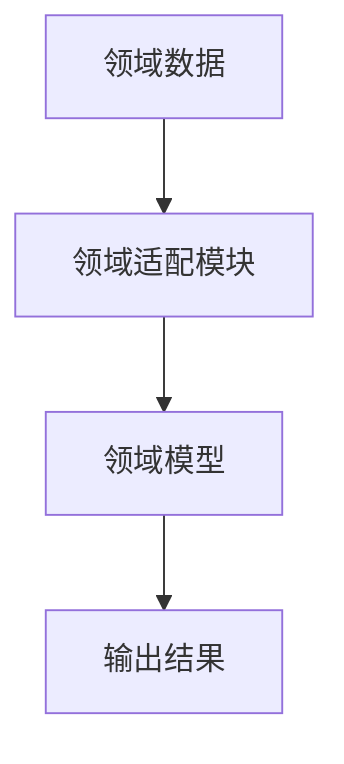
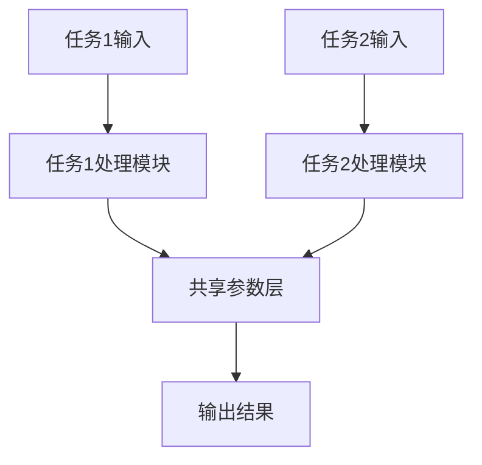

                 


# 构建企业级自然语言处理平台：多语言、多领域、多任务集成

> 关键词：自然语言处理，企业级平台，多语言，多领域，多任务集成

> 摘要：  
本文旨在探讨如何构建一个企业级的自然语言处理平台，涵盖多语言、多领域和多任务集成的关键技术。文章首先介绍自然语言处理的核心概念和企业级平台的背景需求，然后深入分析多语言支持的技术挑战、多领域的实现方法以及多任务集成的算法原理。通过具体的技术实现和案例分析，本文详细阐述了构建这样一个平台的系统架构设计、算法实现、项目实战和最佳实践，最后总结了未来的发展趋势。

---

## 第一部分: 自然语言处理平台概述

### 第1章: 自然语言处理的背景与挑战

#### 1.1 自然语言处理的定义与核心概念

自然语言处理（Natural Language Processing, NLP）是人工智能领域的重要分支，致力于研究如何让计算机理解和生成人类语言。NLP的核心目标是解决人与计算机之间的语言交互问题，使得计算机能够像人类一样理解和处理自然语言。

**核心概念：**

- **文本处理**：对文本数据进行预处理、分词、句法分析等操作。
- **语义理解**：通过上下文理解文本的含义，包括实体识别、关系抽取、情感分析等。
- **生成任务**：生成符合语义的文本，如文本摘要、机器翻译、对话生成等。

**类图说明：**



#### 1.2 企业级NLP平台的背景与需求

随着企业数字化转型的深入，NLP技术在企业中的应用越来越广泛。企业级NLP平台需要满足以下核心需求：

- **高可用性**：支持大规模数据处理和高并发请求。
- **多语言支持**：能够处理多种语言的文本，满足全球化的业务需求。
- **多领域适应性**：适用于金融、医疗、教育等多个领域。
- **多任务集成**：支持多种NLP任务的协同处理。

**系统架构图：**



#### 1.3 多语言、多领域、多任务集成的挑战

- **多语言处理**：不同语言的语法、语义差异较大，需要设计灵活的语言适配机制。
- **多领域应用**：不同领域的文本特征差异显著，需要领域模型的迁移和适配。
- **多任务集成**：多个NLP任务需要协同工作，任务间可能存在依赖关系，需要复杂的协调机制。

**任务依赖关系图：**



---

## 第二部分: 自然语言处理技术基础

### 第2章: 预训练模型与多语言支持

#### 2.1 预训练模型的原理与特点

预训练模型通过在大规模数据上进行无监督学习，提取通用的语言特征，具有以下特点：

- **大规模数据训练**：利用海量数据进行模型优化。
- **通用性**：适用于多种下游任务。
- **可扩展性**：支持多种语言和领域。

**数学公式：**

预训练模型的核心是通过语言模型目标函数优化词嵌入：

$$ L = -\sum_{i=1}^{n} \log p(w_i | w_{i-1}, w_{i-2}) $$

#### 2.2 多语言NLP的实现原理

多语言NLP通过共享语言特征，实现跨语言的任务处理。常见的实现方法包括：

- **多语言模型训练**：在同一模型中训练多种语言的数据。
- **跨语言迁移学习**：利用一种语言的模型参数初始化其他语言模型。

**模型结构图：**



---

## 第三部分: 多领域与多任务集成技术

### 第3章: 多领域NLP的实现与应用

#### 3.1 多领域NLP的定义与特点

多领域NLP是指模型能够处理不同领域（如金融、医疗）的文本数据，具有领域适应性和迁移能力。

**领域适配流程图：**



#### 3.2 多任务学习与集成

多任务学习通过共享模型参数，同时优化多个任务的目标函数，提高模型的泛化能力。

**多任务学习公式：**

$$ L = \lambda_1 L_1 + \lambda_2 L_2 + \cdots + \lambda_n L_n $$

其中，$\lambda_i$为任务权重。

**多任务学习流程图：**



---

## 第四部分: 项目实战与总结

### 第4章: 项目实战

#### 4.1 环境安装与配置

```bash
pip install transformers
pip install torch
pip install mermaid
```

#### 4.2 核心代码实现

```python
from transformers import AutoTokenizer, AutoModelForMaskedLM
import torch

# 加载预训练模型
tokenizer = AutoTokenizer.from_pretrained("bert-base-multilingual")
model = AutoModelForMaskedLM.from_pretrained("bert-base-multilingual")

# 多任务处理
def process_text(text):
    inputs = tokenizer(text, return_tensors="pt")
    outputs = model(**inputs)
    return outputs

# 示例
text = "This is a test sentence."
result = process_text(text)
print(result)
```

---

## 第五部分: 总结与展望

### 第5章: 总结

本文详细探讨了构建企业级自然语言处理平台的关键技术，包括多语言支持、多领域适应性和多任务集成的实现方法。通过理论分析和项目实战，我们展示了如何设计和实现一个高效、灵活的NLP平台。

### 5.2 未来展望

未来，随着大语言模型的发展，企业级NLP平台将更加智能化和多样化。多语言、多领域和多任务集成的技术将更加成熟，支持更复杂的场景和应用。

---

## 参考文献

1.《Deep Learning for NLP》
2.《Natural Language Processing with PyTorch》
3.《Multi-Language NLP: Theory and Practice》

---

以上是文章的详细目录和内容框架，您可以根据需要进一步扩展每个章节的具体内容。

