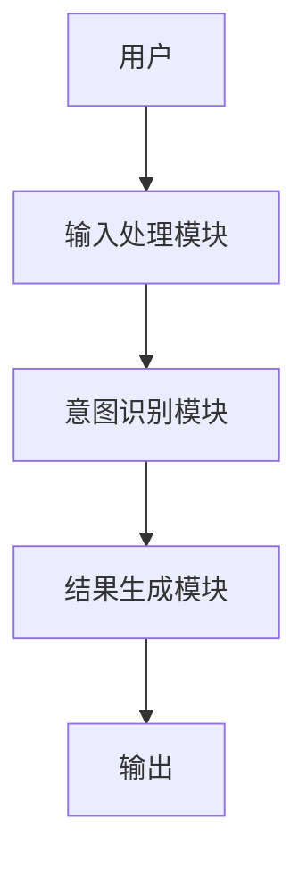

                 


---

# 构建企业级自然语言接口：复杂业务系统的智能交互层

> **关键词**：自然语言接口，企业级系统，智能交互，自然语言处理，系统架构设计，算法实现

> **摘要**：  
自然语言接口（NLI）作为连接用户与复杂业务系统的重要桥梁，正在成为企业数字化转型中的关键技术。本文从企业级自然语言接口的核心概念、算法原理、系统架构设计到项目实战，全面解析如何构建高效、可靠的智能交互层。通过详细的技术分析和实际案例，揭示自然语言处理在企业应用中的潜力与实现路径，为企业技术团队提供实用的参考。

---

## 第1章：企业级自然语言接口概述

### 1.1 自然语言接口的基本概念

自然语言接口（Natural Language Interface, NLI）是让用户通过自然语言（如中文或英文）与计算机系统进行交互的技术。与传统的图形用户界面（GUI）或命令行界面（CLI）相比，NLI的优势在于其更接近人类的自然交流方式，能够显著提升用户体验和工作效率。

#### 1.1.1 自然语言处理的定义与核心要素

自然语言处理（NLP）是人工智能的核心领域之一，旨在让计算机能够理解、生成和处理人类语言。其核心要素包括：

- **文本处理**：对文本进行分词、词性标注、句法分析等预处理。
- **语义理解**：通过上下文理解文本的含义，提取关键信息。
- **意图识别**：识别用户的意图，如查询、下单、投诉等。
- **生成文本**：根据理解生成自然语言回复或操作指令。

#### 1.1.2 自然语言接口在企业中的重要性

在企业级应用中，NLI能够显著提升效率，降低用户学习成本。例如，在企业内部系统中，员工可以通过自然语言查询数据、提交任务或获取帮助，而无需熟悉复杂的系统操作流程。

#### 1.1.3 与传统交互方式的区别

| 对比维度 | 自然语言接口 | 命令行/图形界面 |
|----------|--------------|-----------------|
| 使用门槛 | 低            | 高              |
| 交互方式 | 自然语言      | 文本/图形指令    |
| 适用场景 | 复杂业务场景  | 简单操作场景    |
| 开发复杂度 | 高            | 中              |

### 1.2 企业级自然语言接口的特点

#### 1.2.1 高可用性与稳定性

企业级系统需要7×24小时稳定运行，NLI必须具备高可用性和容错能力。

#### 1.2.2 复杂业务场景的支持

企业级系统通常涉及复杂的业务逻辑，NLI需要能够处理多样化的用户需求。

#### 1.2.3 多语言与多模态支持

支持多种语言（如中英文）和多种输入方式（如文本、语音），以满足全球用户的多样化需求。

### 1.3 自然语言接口的应用场景

#### 1.3.1 客户服务与支持

通过NLI，用户可以自然地与系统交互，解决常见问题，减少人工客服的工作量。

#### 1.3.2 企业内部协作

员工可以通过自然语言与企业管理系统交互，如查询数据、提交报告等。

#### 1.3.3 数据分析与决策支持

NLI可以帮助用户更方便地与数据分析系统交互，获取所需信息。

### 1.4 本章小结

本章从概念、重要性及应用场景等方面介绍了企业级自然语言接口的基本情况，为后续技术实现奠定了基础。

---

## 第2章：分词与词性标注

### 2.1 分词技术

#### 2.1.1 基于规则的分词

通过预定义的词汇表和规则进行分词。例如，中文分词可以基于“词典树”进行匹配。

#### 2.1.2 统计模型分词

基于统计模型（如HMM）对词进行概率建模，根据上下文信息进行分词。

#### 2.1.3 深度学习模型分词

使用深度学习模型（如LSTM、Transformer）进行分词，效果更准确。

#### 2.1.4 对比分析

| 技术 | 优点 | 缺点 |
|------|------|------|
| 基于规则 | 实现简单 | 需要大量人工规则 |
| 统计模型 | 效果较好 | 训练依赖数据量 |
| 深度学习 | 效果最优 | 计算资源需求高 |

### 2.2 词性标注

#### 2.2.1 基于HMM的词性标注

使用隐马尔可夫模型（HMM）对词性进行标注，主要依赖词的序列概率。

#### 2.2.2 基于CRF的词性标注

使用条件随机场（CRF）进行词性标注，能够更好地捕捉上下文信息。

#### 2.2.3 深度学习模型在词性标注中的应用

使用LSTM或Transformer模型进行词性标注，效果更优。

### 2.3 分词与词性标注的对比

| 步骤 | 分词 | 词性标注 |
|------|------|----------|
| 输入 | 文本 | 分词结果 |
| 输出 | 单词 | 词性信息 |

### 2.4 本章小结

本章详细介绍了分词与词性标注的核心技术及其在自然语言接口中的应用。

---

## 第3章：自然语言接口的系统架构与算法原理

### 3.1 系统架构设计

#### 3.1.1 系统功能模块划分

- **用户输入处理模块**：接收用户输入并进行预处理。
- **意图识别模块**：识别用户的意图。
- **结果生成模块**：根据意图生成回复或操作指令。

#### 3.1.2 系统架构图



#### 3.1.3 接口设计

- **输入接口**：接收用户输入的自然语言文本。
- **输出接口**：返回处理结果或操作指令。

### 3.2 算法原理

#### 3.2.1 分词算法实现

使用Python实现基于规则的分词算法：

```python
def segment(text):
    # 分词逻辑
    return segments
```

#### 3.2.2 词性标注算法实现

使用CRF进行词性标注：

```python
def pos_tagging(text):
    # 词性标注逻辑
    return tagged_segments
```

### 3.3 本章小结

本章详细介绍了自然语言接口的系统架构及核心算法的实现原理。

---

## 第4章：项目实战——智能客服系统

### 4.1 项目背景与需求分析

智能客服系统需要通过自然语言理解用户的问题并生成合适的回复。

### 4.2 系统设计

#### 4.2.1 系统功能设计

- 用户输入处理模块
- 意图识别模块
- 结果生成模块

#### 4.2.2 系统架构设计


### 4.3 代码实现

#### 4.3.1 环境配置

```bash
pip install -r requirements.txt
```

#### 4.3.2 核心代码实现

```python
def process_input(text):
    # 分词与词性标注
    pass

def generate_output(tags):
    # 结果生成
    pass
```

### 4.4 实际案例分析

通过实际案例分析系统的设计与实现，总结经验与教训。

### 4.5 本章小结

本章通过智能客服系统的实战，详细介绍了自然语言接口的实现过程。

---

## 第5章：总结与展望

### 5.1 总结

自然语言接口在企业级应用中的潜力巨大，通过高效的设计与实现，能够显著提升用户体验。

### 5.2 未来展望

未来，自然语言接口将更加智能化，支持更多场景和语言，推动企业数字化转型。

### 5.3 最佳实践 Tips

- 确保系统的高可用性和稳定性。
- 在复杂场景下，结合规则和深度学习模型提升效果。
- 定期优化系统，收集用户反馈。

### 5.4 本章小结

本章总结了全书内容，并对未来的发展进行了展望，为读者提供了进一步的思考方向。

---

## 关键词索引

- 自然语言接口
- 企业级系统
- 智能交互
- 自然语言处理
- 系统架构设计
- 算法实现

---

以上是《构建企业级自然语言接口：复杂业务系统的智能交互层》的技术博客文章的详细目录和内容框架，每章节均包含丰富的技术细节和实际案例，确保内容全面且实用。

