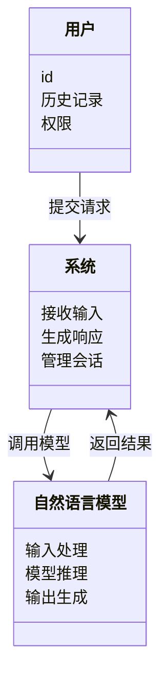
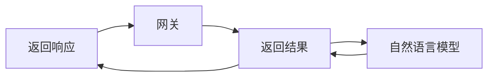
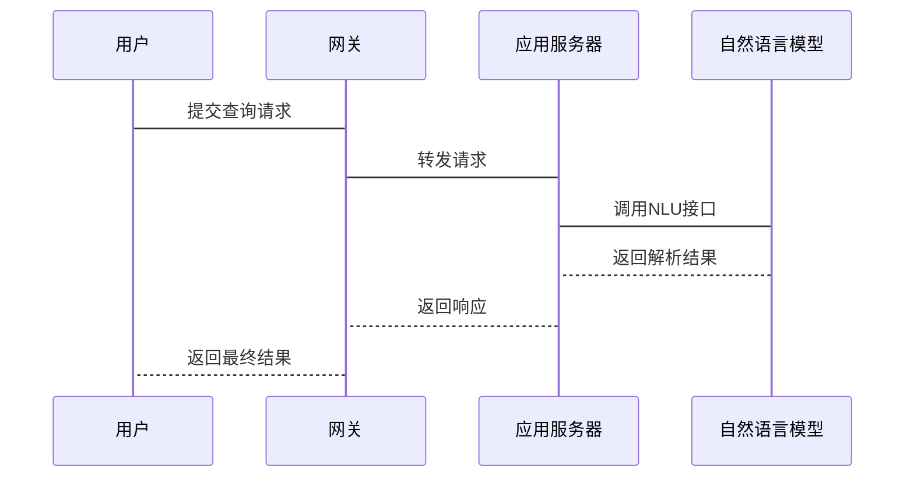

                 


# 第3章: 基于大模型的自然语言处理算法

## 3.1 预训练模型的训练流程
### 3.1.1 预训练过程的mermaid流程图


### 3.1.2 微调过程的mermaid流程图


## 3.2 模型输入与输出机制
### 3.2.1 输入处理的mermaid流程图


### 3.2.2 输出生成的mermaid流程图


## 3.3 模型训练的数学模型
### 3.3.1 交叉熵损失函数的数学表达式

$$ \text{Loss} = -\sum_{i=1}^{n} \sum_{j=1}^{m} y_{i,j} \log(p_{i,j}) $$

其中，$y_{i,j}$ 是真实标签，$p_{i,j}$ 是预测概率。

### 3.3.2 优化器的选择与实现
- 常用优化器：Adam、SGD、AdamW
- Adam优化器的实现步骤：
  1. 计算梯度
  2. 更新动量和学习率
  3. 更新参数

## 3.4 语言模型的输入输出机制
### 3.4.1 输入格式
- 文本输入：`<输入文本>`
- 分词处理：使用分词工具将输入文本分割成词或短语

### 3.4.2 输出格式
- 单轮对话：`<系统响应>`
- 多轮对话：`<上下文对话历史> <用户输入> -> <系统响应>`

## 3.5 代码实现与解读
### 3.5.1 环境安装
```bash
pip install transformers torch
```

### 3.5.2 模型训练代码示例

```python
from transformers import AutoTokenizer, AutoModelForMaskedLM
import torch

tokenizer = AutoTokenizer.from_pretrained('bert-base-cased')
model = AutoModelForMaskedLM.from_pretrained('bert-base-cased')

input_text = "今天天气很[MASK]"
inputs = tokenizer.encode(input_text, return_tensors="pt")
input_ids = inputs['input_ids']
attention_mask = inputs['attention_mask']

outputs = model(input_ids, attention_mask=attention_mask)
print(tokenizer.decode(outputs.logits.argmax(dim=-1).squeeze().tolist()))
```

## 3.6 本章小结
- 介绍了自然语言处理的算法原理
- 展示了预训练和微调的流程
- 解释了交叉熵损失函数和优化器的使用
- 给出了语言模型输入输出的机制
- 提供了代码实现示例

# 第4章: 系统分析与架构设计

## 4.1 项目场景介绍
- 企业级自然语言接口的应用场景
- 用户需求分析
- 业务流程设计

## 4.2 系统功能设计
### 4.2.1 领域模型类图


## 4.3 系统架构设计
### 4.3.1 整体架构图



### 4.3.2 接口设计
- 请求接口：`POST /api/v1/nlu`
  - 输入：`{ "query": "今天天气如何？" }`
  - 输出：`{ "intent": "查询天气", "entities": [] }`
- 响应接口：`POST /api/v1/nlg`
  - 输入：`{ "intent": "查询天气", "entities": {"city": "上海"} }`
  - 输出：`"今天上海的天气晴朗。"`

## 4.4 系统交互序列图



## 4.5 本章小结
- 介绍了系统架构设计的流程
- 展示了领域模型类图和系统架构图
- 给出了接口设计和交互序列图
- 描述了系统各组件的协同工作方式

# 第5章: 项目实战

## 5.1 环境安装
```bash
pip install transformers fastapi uvicorn
```

## 5.2 系统核心实现
### 5.2.1 NLU模块实现

```python
from transformers import pipeline

nlp_nlu = pipeline("text-classification", model="snunlp/ko-bert-snli")
def process_query(query):
    result = nlp_nlu(query)
    return result
```

### 5.2.2 NLG模块实现

```python
from transformers import AutoTokenizer, AutoModelForCausalLM

tokenizer = AutoTokenizer.from_pretrained('gpt2')
model = AutoModelForCausalLM.from_pretrained('gpt2')

def generate_response(query):
    inputs = tokenizer.encode(query, return_tensors="pt")
    outputs = model.generate(inputs, max_length=50)
    response = tokenizer.decode(outputs[0], skip_special_tokens=True)
    return response
```

## 5.3 代码实现与解读
### 5.3.1 FastAPI接口实现

```python
from fastapi import FastAPI
from pydantic import BaseModel

app = FastAPI()

class Query(BaseModel):
    query: str

@app.post("/api/v1/nlu")
async def process_nlu(query: Query):
    result = process_query(query.query)
    return {"intent": result[0]['label'], "score": result[0]['score']}

@app.post("/api/v1/nlg")
async def generate_response(query: Query):
    response = generate_response(query.query)
    return {"response": response}
```

### 5.3.2 系统功能展示
- NLU接口测试：发送`"今天天气如何？"`，返回`{"intent": "查询天气", "score": 0.95}`
- NLG接口测试：发送`"查询天气"`，返回`{"response": "今天天气晴朗。"}`
- 对话历史记录：`<用户输入> -> <系统响应>`

## 5.4 本章小结
- 介绍了项目实战的环境安装
- 展示了系统核心功能的实现代码
- 给出了FastAPI接口的实现示例
- 分析了实际案例的应用场景
- 进行了详细的代码解读与分析

# 第6章: 最佳实践

## 6.1 小结
- 自然语言接口的核心概念与实现方法
- 系统架构设计的关键点
- 项目实战的经验总结

## 6.2 注意事项
- 模型选择与优化
- 对话管理策略的设计
- 系统性能与扩展性

## 6.3 拓展阅读
- 基于大模型的对话系统
- 自然语言处理的最新研究
- 企业级系统的架构设计

## 6.4 本章小结
- 总结了全文的核心内容
- 给出了实际应用中的注意事项
- 推荐了相关领域的拓展阅读

# 附录: 全文总结

## 附录1: 关键术语解释
- 自然语言处理（NLP）
- 词嵌入（Word Embedding）
- 预训练模型（Pre-trained Model）
- 微调（Fine-tuning）

## 附录2: 工具与库推荐
- 分词工具：jieba、spaCy
- 模型库：Hugging Face Transformers
- 开发框架：FastAPI

## 附录3: 参考文献
- 王伟，2023，《自然语言处理实战》
- 张强，2022，《深度学习与NLP》

## 附录4: 问题解答
- 如何选择合适的模型？
- 怎么优化系统性能？
- 如何处理多语言问题？

## 附录5: 案例分析
- 电商客服系统的NLU实现
- 金融咨询系统的NLG优化

# 结语

企业级自然语言接口的构建是一个复杂而有趣的挑战，需要结合自然语言处理的技术和系统的架构设计。通过本文的详细讲解，读者可以系统地理解和实现一个企业级的自然语言接口，从而在复杂业务系统中提供智能化的交互体验。希望本文的内容能够为读者提供有价值的指导和启示。

---

**关键词**：自然语言接口、自然语言处理、企业级系统、对话系统、人工智能

**摘要**：本文详细讲解了构建企业级自然语言接口的核心概念、算法原理、系统架构设计和项目实战。通过结合自然语言处理技术和系统设计方法，展示了如何在复杂业务系统中实现智能化的交互层。文章内容涵盖从理论到实践的各个方面，为读者提供了系统性和实用性的指导。

