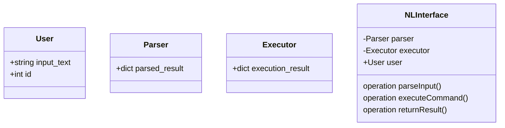
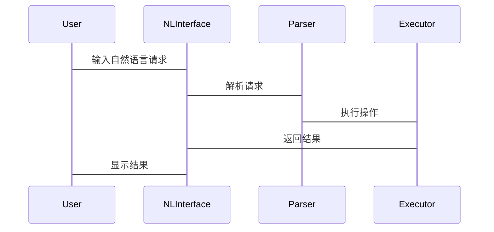

                 


# 构建企业级自然语言接口：简化复杂业务系统操作

> 关键词：自然语言处理，企业系统，自然语言接口，业务简化，人工智能

> 摘要：本文详细探讨了构建企业级自然语言接口的方法，旨在通过自然语言处理技术简化复杂业务系统的操作。文章从背景、核心概念、算法原理、系统架构、项目实战到最佳实践，全面解析了如何实现高效的企业级自然语言接口。

---

## 第1章 自然语言接口的背景与概念

### 1.1 自然语言处理的基本概念

自然语言处理（Natural Language Processing, NLP）是人工智能领域的重要分支，专注于让计算机理解和处理人类语言。它结合了语言学、计算机科学和机器学习技术，致力于解决如何让计算机有效处理和生成自然语言文本的问题。

#### 1.1.1 自然语言处理的定义

自然语言处理（NLP）是研究如何让计算机理解、生成和操作人类语言的科学。NLP的目标是实现人与计算机之间的自然语言交流，使计算机能够像人类一样理解和处理语言。

#### 1.1.2 自然语言理解与生成的区别

- **自然语言理解（NLU）**：将自然语言文本转换为计算机可理解的结构化信息，例如解析用户的问题并生成对应的查询条件。
- **自然语言生成（NLG）**：将结构化信息转换为自然语言文本，例如根据数据库信息生成回答。

### 1.2 企业级系统操作的复杂性

企业级系统通常涉及复杂的业务逻辑和多层结构，用户在与这些系统交互时需要面对繁琐的操作步骤，容易产生操作错误和效率低下。

#### 1.2.1 传统企业系统操作的特点

传统企业系统通常基于命令行或图形界面，用户需要通过输入特定的命令或点击多个按钮来完成操作。这种方式虽然直观，但对于非技术用户来说，仍然存在较高的学习门槛。

#### 1.2.2 用户与复杂系统之间的交互障碍

- 用户需要记忆复杂的命令语法。
- 需要理解系统的术语和操作逻辑。
- 需要多次操作才能完成简单的任务。

#### 1.2.3 自然语言接口如何简化操作

自然语言接口（NLI）通过将自然语言输入转换为系统可执行的操作，大大简化了用户与复杂系统之间的交互。用户只需使用日常语言表达需求，系统即可自动解析并执行相应的操作。

### 1.3 自然语言接口的应用场景

自然语言接口在企业级系统中有广泛的应用场景，能够显著提升用户体验和效率。

#### 1.3.1 客户服务与支持

通过自然语言接口，客户可以使用日常语言描述问题，系统自动解析并提供解决方案。例如，客户可以输入“我的订单状态是什么？”系统会自动查询订单信息并返回结果。

#### 1.3.2 业务流程自动化

自然语言接口可以自动化处理复杂的业务流程。例如，用户可以通过输入“生成月度销售报告”来触发系统自动生成报告。

#### 1.3.3 企业内部信息查询

员工可以通过自然语言查询企业内部信息，例如输入“2022年第四季度的销售数据”来获取相关数据。

---

## 第2章 自然语言接口的核心概念

### 2.1 自然语言接口的构成要素

自然语言接口由多个关键部分组成，包括输入处理、语言模型、解析器、执行引擎和输出生成。

#### 2.1.1 语言模型

语言模型用于理解和生成语言，是自然语言接口的核心。主流的语言模型包括BERT、GPT等。

#### 2.1.2 分析器与解释器

分析器负责将输入的自然语言文本解析为结构化的信息，解释器则根据解析结果生成相应的操作指令。

#### 2.1.3 执行引擎

执行引擎负责根据解释器生成的操作指令，调用后端系统完成任务。

### 2.2 自然语言处理的关键技术

自然语言处理技术是构建自然语言接口的基础，包括词法分析、句法分析和语义理解。

#### 2.2.1 词法分析

词法分析将输入文本分解为单词或短语，并识别每个词的词性（名词、动词、形容词等）。

#### 2.2.2 句法分析

句法分析研究句子的结构，确定词语之间的关系和句子的语法框架。

#### 2.2.3 语义理解

语义理解是自然语言处理的核心，旨在理解文本的含义和意图。

### 2.3 自然语言接口与相关技术的对比

自然语言接口与其他技术如语音识别和对话系统有显著区别。

#### 2.3.1 与传统搜索的区别

传统搜索需要用户输入精确的查询关键词，而自然语言接口能够理解用户的自然语言表达，并生成更智能的搜索结果。

#### 2.3.2 与语音识别的区别

语音识别将语音信号转换为文本，而自然语言接口则负责理解文本的含义。

#### 2.3.3 与对话系统的关系

对话系统通常涉及多轮交互，而自然语言接口更注重单次交互的高效处理。

### 2.4 自然语言接口的核心算法

自然语言接口的核心算法包括基于规则的算法、统计学习算法和深度学习算法。

#### 2.4.1 基于规则的算法

基于规则的算法通过预定义的规则来处理自然语言输入，适用于简单的任务。

#### 2.4.2 统计学习算法

统计学习算法通过分析大量数据，学习语言模式和用户意图，适用于复杂任务。

#### 2.4.3 深度学习算法

深度学习算法通过训练大型神经网络，自动学习语言表示和用户意图，目前是主流的算法。

---

## 第3章 基于深度学习的自然语言接口

### 3.1 预训练语言模型简介

预训练语言模型如BERT和GPT在自然语言处理任务中表现出色。

#### 3.1.1 BERT模型的原理

BERT（Bidirectional Encoder Representations from Transformers）是一种双向Transformer模型，通过预训练在大规模语料库上学习语言表示。

#### 3.1.2 GPT模型的特点

GPT（Generative Pre-trained Transformer）是一种单向语言模型，擅长生成自然语言文本。

#### 3.1.3 其他主流模型的对比

除了BERT和GPT，还有其他模型如RoBERTa、ALBERT等，各有优缺点。

### 3.2 自然语言接口的算法流程

自然语言接口的算法流程包括输入处理、模型推理和输出生成。

#### 3.2.1 输入处理

将用户的自然语言输入进行清洗、分词和向量化处理。

#### 3.2.2 模型推理

将处理后的输入输入预训练模型，生成结构化的解析结果。

#### 3.2.3 输出生成

根据解析结果生成自然语言输出，或执行相应的操作指令。

### 3.3 自然语言接口的数学模型

自然语言接口的数学模型包括词嵌入、注意力机制和解码器。

#### 3.3.1 词嵌入的表示方法

词嵌入将词语映射为高维向量，常用的方法有Word2Vec和GloVe。

#### 3.3.2 注意力机制的数学公式

注意力机制通过计算词与词之间的相关性，生成注意力权重矩阵。

$$
\text{Attention}(Q, K, V) = \text{softmax}\left(\frac{QK^T}{\sqrt{d_k}}\right)V
$$

#### 3.3.3 解码器的实现原理

解码器通过自注意力机制生成输出序列，常用在生成任务如NLG。

### 3.4 算法实现的Python代码示例

以下是基于BERT模型的自然语言接口实现示例代码。

#### 3.4.1 数据预处理代码

```python
import transformers
from transformers import BertTokenizer, BertModel
import torch

tokenizer = BertTokenizer.from_pretrained('bert-base-uncased')
model = BertModel.from_pretrained('bert-base-uncased')

def preprocess(text):
    inputs = tokenizer(text, return_tensors='pt', padding=True, truncation=True)
    return inputs
```

#### 3.4.2 模型训练代码

```python
def train_model(model, optimizer, criterion, train_loader, val_loader, num_epochs=3):
    for epoch in range(num_epochs):
        model.train()
        for batch in train_loader:
            optimizer.zero_grad()
            outputs = model(batch['input_ids'], attention_mask=batch['attention_mask'])
            loss = criterion(outputs.last_hidden_state, batch['labels'])
            loss.backward()
            optimizer.step()
    return model
```

#### 3.4.3 接口调用代码

```python
def process_request(text):
    inputs = preprocess(text)
    with torch.no_grad():
        outputs = model(**inputs)
    return outputs
```

---

## 第4章 自然语言接口的系统架构设计

### 4.1 系统功能设计

自然语言接口系统的功能包括用户输入处理、解析、执行和反馈。

#### 4.1.1 领域模型设计

领域模型定义了系统的功能模块和数据关系，如下图所示：



#### 4.1.2 系统架构设计

系统架构采用分层设计，包括用户界面层、业务逻辑层和数据访问层。



---

## 第5章 项目实战：构建一个简单的自然语言接口

### 5.1 环境搭建

安装必要的库：

```bash
pip install transformers torch
```

### 5.2 核心代码实现

#### 5.2.1 数据预处理

```python
def preprocess(text):
    inputs = tokenizer(text, return_tensors='pt', padding=True, truncation=True)
    return inputs
```

#### 5.2.2 模型初始化

```python
model = BertModel.from_pretrained('bert-base-uncased')
tokenizer = BertTokenizer.from_pretrained('bert-base-uncased')
```

#### 5.2.3 接口实现

```python
def process_request(text):
    inputs = preprocess(text)
    with torch.no_grad():
        outputs = model(**inputs)
    return outputs.last_hidden_state
```

### 5.3 案例分析

#### 5.3.1 数据准备

准备训练数据，包括输入文本和对应的标签。

#### 5.3.2 模型训练

训练模型，优化参数，提高模型的准确性。

#### 5.3.3 接口调用

通过接口调用模型，处理用户输入并返回结果。

### 5.4 总结

通过本节的学习，读者可以掌握自然语言接口的基本实现方法，为后续复杂系统的开发奠定基础。

---

## 第6章 最佳实践与注意事项

### 6.1 最佳实践

- **数据质量**：确保训练数据多样化且覆盖所有可能的用户输入。
- **模型调优**：通过交叉验证和超参数优化提高模型性能。
- **错误处理**：设计完善的错误处理机制，提升用户体验。

### 6.2 小结

本文详细讲解了构建企业级自然语言接口的方法，从背景、概念、算法到系统设计和项目实战，全面覆盖了实现自然语言接口的各个方面。

### 6.3 注意事项

- **性能优化**：在实际应用中，需要考虑模型的推理速度和资源消耗。
- **安全性**：确保用户输入的安全性，防止恶意攻击。
- **可扩展性**：设计灵活的系统架构，方便后续功能扩展。

### 6.4 拓展阅读

- 《Deep Learning for NLP》
- 《BERT: Pre-training of Deep Bidirectional Transformers for NLP》
- 《Transformers: State-of-the-art NLP》

---

## 总结

通过本文的学习，读者可以全面了解如何构建企业级自然语言接口，掌握从理论到实践的整个过程。自然语言接口的应用将显著简化复杂业务系统的操作，提升用户体验和效率。

