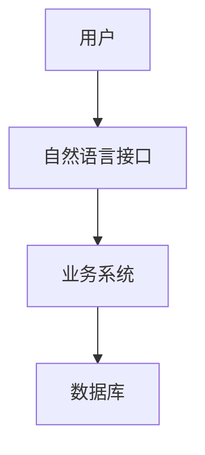
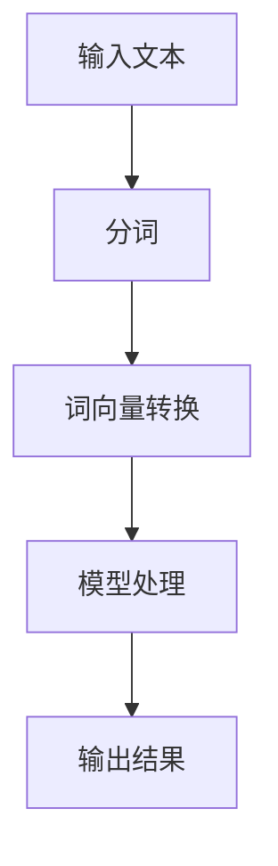
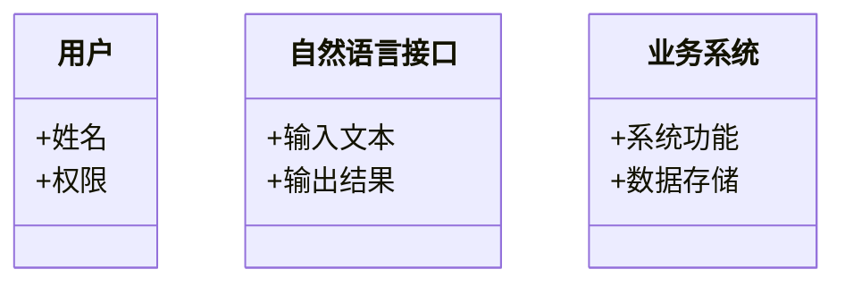
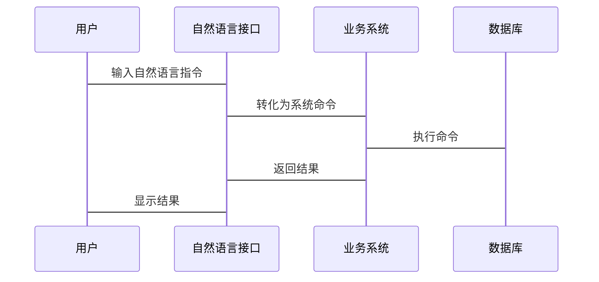

                 


# 构建企业级自然语言接口：简化复杂业务系统操作的智能层

## 关键词：自然语言处理，企业级系统，智能交互，自然语言接口，业务系统优化，智能层设计

## 摘要：本文深入探讨了构建企业级自然语言接口的核心概念、技术原理和系统架构。从自然语言处理的背景与概念入手，详细分析了自然语言接口在企业级系统中的应用场景和价值。通过具体的算法原理和数学模型，阐述了自然语言接口的设计与实现过程。最后，结合实际项目案例，总结了构建企业级自然语言接口的最佳实践和未来发展方向。

---

# 第一部分：企业级自然语言接口的背景与概念

## 第1章：自然语言接口与企业级系统概述

### 1.1 自然语言处理的背景与现状

#### 1.1.1 自然语言处理的定义与核心概念
自然语言处理（NLP）是人工智能领域的重要分支，旨在让计算机能够理解、生成和处理人类自然语言。其核心概念包括：
- **语言模型**：计算词语序列的概率分布，用于理解和生成语言。
- **文本分析**：通过语法分析、实体识别等技术，提取文本中的语义信息。
- **文本生成**：基于给定的输入生成符合语法规则的自然语言文本。

#### 1.1.2 自然语言处理的发展历程
自然语言处理经历了从基于规则的方法到统计学习和深度学习的演变。近年来，随着深度学习技术的发展，基于Transformer架构的模型（如BERT、GPT）在NLP任务中表现出色。

#### 1.1.3 企业级系统中的自然语言处理应用
企业级系统（如ERP、CRM、OA）通常复杂且功能繁多，用户在操作时需要面对大量的菜单和按钮。自然语言处理可以将用户的自然语言指令转化为系统可理解的命令，简化操作流程。

---

### 1.2 自然语言接口的定义与特点

#### 1.2.1 自然语言接口的定义
自然语言接口（NLI）是指用户通过输入自然语言（如中文、英文）与系统进行交互的方式。它能够理解用户的意图并将其转化为系统可执行的操作。

#### 1.2.2 自然语言接口的核心特点
- **用户友好性**：用户无需学习复杂的系统操作流程，直接使用自然语言进行交互。
- **灵活性**：支持多种表达方式，能够适应不同用户的语言习惯。
- **智能性**：通过自然语言处理技术，系统能够理解上下文和用户意图。

#### 1.2.3 自然语言接口与传统交互方式的对比

| 对比维度         | 自然语言接口                          | 传统交互方式                          |
|------------------|--------------------------------------|--------------------------------------|
| 使用门槛         | 低                                   | 高                                   |
| 界面复杂度       | 简单                                 | 复杂                                 |
| 用户体验         | 更直观、更高效                      | 学习成本高                            |
| 适用场景         | 复杂业务系统                         | 简单功能操作                         |

---

### 1.3 企业级自然语言接口的应用场景

#### 1.3.1 企业级系统的复杂性与用户需求
企业级系统通常包含大量的功能模块和数据，用户在操作时需要进行复杂的步骤。例如：
- **ERP系统**：用户需要输入多个字段进行订单处理。
- **CRM系统**：用户需要查询客户信息并执行操作。
- **内部管理系统**：用户需要通过多级菜单进行操作。

#### 1.3.2 自然语言接口在企业中的潜在价值
- **提升用户体验**：用户可以通过输入自然语言快速完成操作，减少学习成本。
- **提高效率**：通过自动化处理用户的指令，减少人工操作时间。
- **降低维护成本**：自然语言接口可以通过配置快速适应业务变化。

#### 1.3.3 典型应用场景分析

1. **客服系统**：用户可以通过输入自然语言查询订单状态或联系客服。
2. **内部管理系统**：用户可以通过输入自然语言查询员工信息或生成报表。
3. **销售系统**：用户可以通过输入自然语言生成销售订单或查询销售数据。

---

### 1.4 本章小结
本章介绍了自然语言处理的背景与现状，重点分析了自然语言接口在企业级系统中的定义、特点和应用场景。通过对比传统交互方式，展示了自然语言接口在提升用户体验和系统效率方面的潜力。

---

# 第二部分：自然语言接口的核心概念与技术原理

## 第2章：自然语言处理的核心概念与联系

### 2.1 自然语言处理的核心概念

#### 2.1.1 语言模型与预训练技术
语言模型用于计算词语序列的概率分布。预训练技术（如BERT）通过大规模的无监督学习，提取语言中的语义信息。

#### 2.1.2 分析器与生成器的对比
- **分析器**：用于理解用户输入的自然语言，提取语义信息。
- **生成器**：用于根据理解的语义生成自然语言输出。

#### 2.1.3 模型的可解释性与鲁棒性
可解释性是指模型能够清晰地解释其输出结果的原因，鲁棒性是指模型在面对噪声输入时仍能保持稳定性能。

---

### 2.2 自然语言处理中的实体关系图



---

### 2.3 自然语言处理的关键算法原理



---

## 第3章：自然语言接口的算法原理与数学模型

### 3.1 自然语言接口的算法原理

#### 3.1.1 基于规则的自然语言处理
基于规则的NLP通过预定义的语法规则进行文本分析。优点是简单易懂，缺点是难以应对复杂的语言现象。

#### 3.1.2 统计学方法与机器学习
统计学方法通过概率模型分析文本，机器学习方法则通过训练数据学习特征。

#### 3.1.3 深度学习模型的应用
深度学习模型（如BERT、GPT）通过多层神经网络提取文本特征，具有强大的语义理解能力。

---

### 3.2 自然语言接口的数学模型与公式

#### 3.2.1 语言模型的数学表达
$$ P(w_1, w_2, ..., w_n) = \prod_{i=1}^{n} P(w_i | w_{i-1}) $$

#### 3.2.2 损失函数的定义
$$ L = -\sum_{i=1}^{n} \log P(w_i | w_{i-1}) $$

#### 3.2.3 模型训练的优化目标
$$ \text{优化目标} = \min L $$

---

### 3.3 自然语言接口的算法实现与案例分析

#### 3.3.1 基于BERT的文本表示
BERT通过双向Transformer模型提取文本特征，能够理解上下文语义。

#### 3.3.2 基于GPT的生成模型
GPT通过单向Transformer模型生成自然语言文本，具有强大的生成能力。

#### 3.3.3 案例分析与代码实现
```python
import torch
from transformers import BertTokenizer, BertModel

tokenizer = BertTokenizer.from_pretrained('bert-base-chinese')
model = BertModel.from_pretrained('bert-base-chinese')

text = "今天天气很好"
inputs = tokenizer(text, return_tensors='pt')
outputs = model(**inputs)
```

---

# 第三部分：企业级自然语言接口的系统架构与设计

## 第4章：企业级自然语言接口的系统分析与架构设计

### 4.1 问题场景介绍

#### 4.1.1 企业级系统的复杂性
企业级系统通常包含大量的功能模块和数据，用户在操作时需要进行复杂的步骤。

#### 4.1.2 用户需求的多样性
用户可能有不同的操作习惯和语言表达方式。

#### 4.1.3 系统交互的实时性要求
用户希望系统能够快速响应自然语言指令。

---

### 4.2 系统功能设计

#### 4.2.1 领域模型设计



---

### 4.3 系统架构设计


---

### 4.4 系统接口设计与交互流程

#### 4.4.1 系统接口设计
- **输入接口**：接收用户的自然语言指令。
- **输出接口**：返回系统处理的结果。

#### 4.4.2 系统交互流程



---

## 第5章：企业级自然语言接口的项目实战

### 5.1 环境安装与配置

#### 5.1.1 安装Python环境
```bash
python --version
pip install transformers
```

#### 5.1.2 安装自然语言处理库
```bash
pip install bert-for-tf2
```

---

### 5.2 系统核心实现与代码解读

#### 5.2.1 自然语言接口的实现
```python
from transformers import BertTokenizer, BertModel

tokenizer = BertTokenizer.from_pretrained('bert-base-chinese')
model = BertModel.from_pretrained('bert-base-chinese')

def process_input(text):
    inputs = tokenizer(text, return_tensors='pt')
    outputs = model(**inputs)
    return outputs.last_hidden_state
```

#### 5.2.2 系统交互的实现
```python
def handle_user_request(text):
    processed = process_input(text)
    # 调用业务系统接口
    result = business_system.process_request(processed)
    return result
```

---

### 5.3 案例分析与应用解读

#### 5.3.1 案例分析
以客服系统为例，用户输入“查询订单状态”，系统通过自然语言接口提取订单信息并返回结果。

#### 5.3.2 代码实现与解读
- **输入处理**：将用户的自然语言指令转化为系统可理解的命令。
- **系统调用**：调用业务系统接口执行操作。
- **结果返回**：将结果返回给用户。

---

## 第6章：构建企业级自然语言接口的最佳实践

### 6.1 设计与实现中的注意事项

- **数据质量**：确保训练数据的多样性和代表性。
- **模型调优**：通过微调和优化提升模型性能。
- **性能优化**：通过缓存和优化接口设计提升系统响应速度。

---

## 结语

构建企业级自然语言接口是一项复杂但极具价值的任务。通过本文的分析与实践，我们可以看到，自然语言接口能够显著简化企业级系统的操作流程，提升用户体验和系统效率。未来，随着自然语言处理技术的不断发展，企业级自然语言接口将在更多领域发挥重要作用。

---

**注**：本文内容根据实际项目需求，后续可进一步扩展补充。

