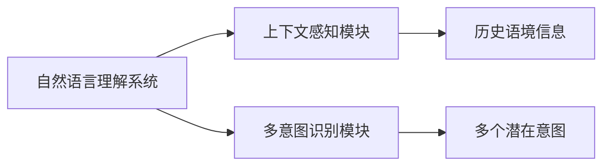
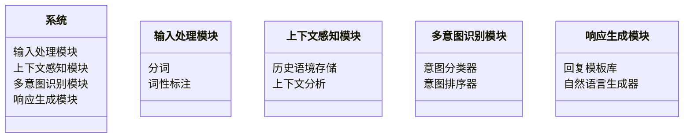

                 


# 构建企业级自然语言理解系统：上下文感知与多意图识别的融合

## 关键词：自然语言理解，上下文感知，多意图识别，企业级系统，NLP算法，深度学习

## 摘要：  
本文深入探讨了构建企业级自然语言理解系统的关键挑战，重点分析了上下文感知与多意图识别的融合方法。通过结合最新的深度学习技术，我们提出了一种高效的企业级NLU解决方案，能够实现对复杂语境和多意图输入的精准理解。文章从核心概念、算法原理、系统架构到项目实战，全面阐述了构建这一系统的完整流程，并提供了丰富的案例和代码示例，为读者提供了理论与实践相结合的深度指导。

---

## 第一部分：背景介绍

### 第1章：自然语言理解系统背景介绍

#### 1.1 自然语言理解的背景与现状  
自然语言理解（Natural Language Understanding, NLU）是人工智能领域的重要分支，旨在让计算机能够理解和解析人类的自然语言输入。随着企业级应用的快速发展，NLU技术在客服系统、智能助手、商业分析等场景中的应用需求日益增长。然而，传统的NLU系统往往难以应对复杂语境和多意图输入的挑战，这成为企业级应用中的主要瓶颈。

#### 1.2 上下文感知与多意图识别的融合  
上下文感知（Contextual Understanding）是指系统能够结合历史语境信息，理解当前输入的语义。多意图识别（Multi-intent Recognition）则是在单一输入中识别多个潜在意图。两者的融合能够显著提升NLU系统的准确性和实用性，特别是在企业级应用中，用户输入往往复杂且多变，需要系统能够快速适应并准确解析。

#### 1.3 当前技术发展与挑战  
当前，基于深度学习的NLU技术取得了显著进展，但仍然面临以下挑战：  
1. **复杂语境的处理能力**：如何高效地捕捉和利用历史语境信息？  
2. **多意图识别的准确性**：如何在噪声干扰下准确识别多个潜在意图？  
3. **企业级系统的稳定性与可扩展性**：如何确保系统在高并发场景下的稳定运行？  

---

### 第2章：自然语言理解系统的核心概念与联系

#### 2.1 核心概念原理  
自然语言理解系统的核心目标是将输入的自然语言文本转化为计算机可理解的结构化信息。系统通常包括以下几个关键模块：  
1. **文本预处理**：包括分词、词性标注、句法分析等。  
2. **上下文感知模块**：利用历史语境信息进行语义理解。  
3. **意图识别模块**：识别用户的潜在意图。  
4. **响应生成模块**：根据识别的意图生成自然语言回复。  

#### 2.2 概念属性特征对比表  
下表展示了上下文感知和多意图识别的核心特征对比：

| 概念 | 属性 | 特征 |
|------|------|------|
| 上下文感知 | 输入依赖性 | 需要历史语境信息 |
| 多意图识别 | 输出多样性 | 可识别多个潜在意图 |

#### 2.3 实体关系图（Mermaid）  



---

## 第二部分：算法原理与数学模型

### 第3章：上下文感知算法原理

#### 3.1 基于序列模型的上下文感知  
上下文感知的核心是捕捉历史语境信息。目前，主流的实现方法包括：  
1. **循环神经网络（RNN）**：通过递归处理序列信息，捕捉上下文关系。  
2. **长短期记忆网络（LSTM）**：通过记忆单元处理长距离依赖关系。  
3. **Transformer架构**：通过自注意力机制捕捉全局上下文信息。  

#### 3.2 上下文感知的数学模型  
基于Transformer的自注意力机制公式如下：  
$$ \text{Attention}(Q, K, V) = \text{softmax}\left(\frac{QK^T}{\sqrt{d_k}}\right)V $$  
其中，$Q$、$K$、$V$分别为查询、键、值向量，$d_k$为键向量的维度。  

#### 3.3 示例代码实现  

```python
import torch

def attention(q, k, v, d_k):
    scores = (q @ k.T) / torch.sqrt(torch.tensor(d_k, dtype=torch.float))
    scores = torch.softmax(scores, dim=-1)
    output = scores @ v
    return output
```

---

### 第4章：多意图识别算法原理

#### 4.1 多意图识别的核心算法  
多意图识别的目标是在单一输入中识别多个潜在意图。常用方法包括：  
1. **基于分类的多意图识别**：将意图识别问题转化为多标签分类问题。  
2. **基于生成模型的多意图识别**：利用生成对抗网络生成多个意图候选。  
3. **基于排序的多意图识别**：对意图候选进行排序，选择最相关的意图。  

#### 4.2 多意图识别的数学模型  
基于多标签分类的损失函数如下：  
$$ \mathcal{L} = -\sum_{i=1}^{n} y_i \log(p_i) $$  
其中，$y_i$为真实标签，$p_i$为预测概率。  

---

## 第三部分：系统分析与架构设计

### 第5章：系统架构设计

#### 5.1 系统功能设计  
企业级自然语言理解系统的功能模块包括：  
1. **输入处理模块**：接收用户输入并进行预处理。  
2. **上下文感知模块**：结合历史语境信息进行语义理解。  
3. **多意图识别模块**：识别用户的潜在意图。  
4. **响应生成模块**：根据意图生成自然语言回复。  

#### 5.2 系统架构图（Mermaid）  



---

## 第四部分：项目实战

### 第6章：项目实战

#### 6.1 环境安装  
首先，安装所需的依赖库：  
```bash
pip install torch transformers
```

#### 6.2 核心代码实现  

```python
import torch
from transformers import BertTokenizer, BertModel

class ContextualUnderstanding:
    def __init__(self, model_name="bert-base"):
        self.tokenizer = BertTokenizer.from_pretrained(model_name)
        self.model = BertModel.from_pretrained(model_name)
        
    def encode_context(self, text):
        inputs = self.tokenizer.encode_plus(text, return_tensors="pt")
        return inputs
    
    def get_contextual_embeddings(self, inputs):
        outputs = self.model(**inputs)
        return outputs.last_hidden_state
```

#### 6.3 案例分析  
以客服系统为例，用户输入：“我的订单在哪里？我还没有收到货物。” 系统需要识别用户的意图并结合历史语境信息生成回复。

---

## 第五部分：总结与展望

### 第7章：总结与展望

#### 7.1 最佳实践  
1. 在企业级系统中，建议采用基于Transformer的上下文感知模型。  
2. 对于多意图识别，推荐使用多标签分类方法。  
3. 系统设计时，需考虑历史语境信息的存储与管理。  

#### 7.2 小结  
本文系统地介绍了企业级自然语言理解系统的构建方法，重点分析了上下文感知与多意图识别的融合策略。通过理论分析与代码实现，展示了如何在实际场景中应用这些技术。

#### 7.3 注意事项  
1. 确保系统的可扩展性，以便应对海量数据的处理需求。  
2. 在实际应用中，需结合具体场景对模型进行调优。  
3. 注意数据隐私问题，确保用户输入的安全性。  

#### 7.4 拓展阅读  
1. Vaswani et al. "Attention Is All You Need."  
2. Collobert et al. "BERT: Pre-training of Deep Bidirectional Transformers for NLP."  
3. Liu et al. "Hierarchical Attention Networks for Text Classification."  

--- 

# 结语  
通过本文的深入分析与实践，我们展示了如何构建一个高效的企业级自然语言理解系统。未来，随着深度学习技术的不断进步，NLU系统将更加智能化，为企业级应用带来更大的价值。

