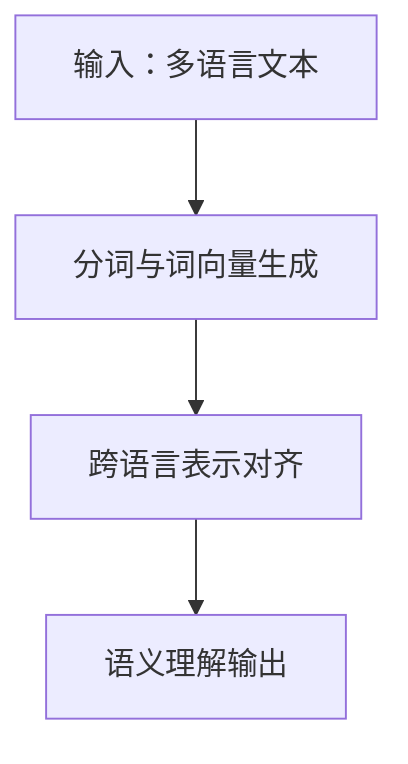
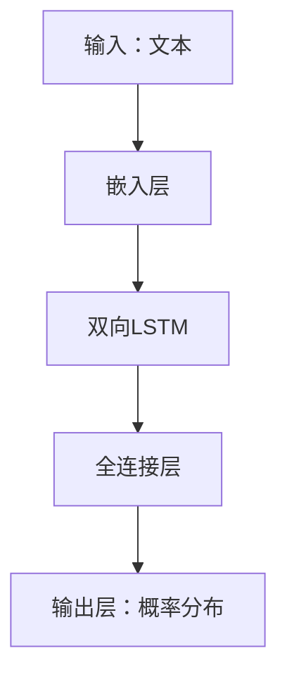
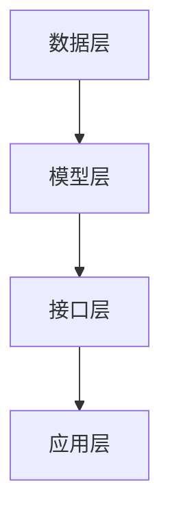
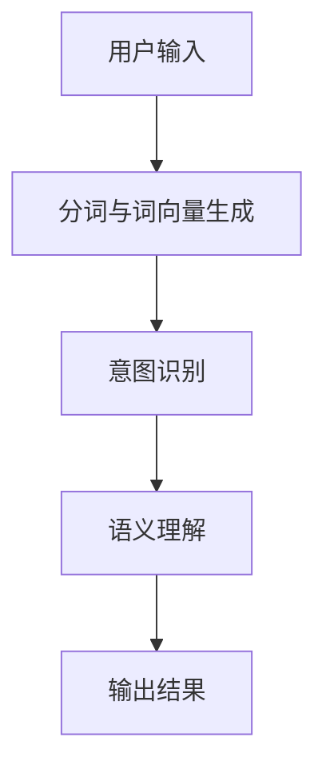

                 


# 构建企业级自然语言理解系统：跨语言语义理解与意图识别

## 关键词：企业级NLU、跨语言语义理解、意图识别、自然语言处理、深度学习

## 摘要：  
本文将详细探讨如何构建企业级自然语言理解系统，重点聚焦于跨语言语义理解与意图识别两大核心任务。通过分析NLU技术在企业场景中的应用背景，阐述跨语言语义理解的挑战与解决方案，深入解读意图识别的算法原理与实现方法。同时，本文将从系统架构设计、接口交互优化、项目实战开发等多维度展开，为企业级NLU系统的构建提供全面的技术指导和实践参考。

---

# 第一部分：企业级自然语言理解系统概述

## 第1章：自然语言理解与企业应用背景

### 1.1 自然语言理解的核心概念

#### 1.1.1 自然语言处理的发展历程

- **符号主义NLP**：基于规则的NLP方法，如句法分析和语义分析的早期尝试。
- **统计学习NLP**：基于机器学习的NLP方法，如袋模型（Bag-of-Words）和词袋模型（TF-IDF）。
- **深度学习NLP**：基于深度神经网络的NLP方法，如循环神经网络（RNN）、Transformer和BERT等大模型。

#### 1.1.2 企业级NLU的定义与特点

- **企业级NLU**：面向企业应用场景的自然语言理解系统，强调高可用性、可扩展性和定制化需求。
- **特点**：
  - 高精度：需要在企业场景中达到较高的准确率。
  - 高可用性：支持7×24小时运行，具备容错和恢复能力。
  - 可扩展性：能够处理大规模数据和复杂场景。

#### 1.1.3 跨语言语义理解的背景与意义

- **背景**：全球化背景下，企业需要处理多语言、多文化的数据和用户请求。
- **意义**：通过跨语言语义理解，企业可以实现跨语言的统一理解与响应，提升用户体验和业务效率。

### 1.2 企业级NLU的应用场景

#### 1.2.1 客户服务与支持

- **智能客服**：通过NLU技术实现自动问答、意图识别和情绪分析，提升客户满意度。
- **多语言支持**：支持多种语言的客户咨询，满足全球化企业的需求。

#### 1.2.2 企业内部流程自动化

- **文档处理**：自动解析合同、报告等文档，提取关键信息并生成结构化数据。
- **流程审批**：通过NLU技术实现自动化审批流程中的自然语言指令处理。

#### 1.2.3 数据分析与决策支持

- **数据挖掘**：从海量文本数据中提取有价值的信息，支持企业决策。
- **实时监控**：实时分析社交媒体、市场反馈等数据，为企业提供实时洞察。

### 1.3 本章小结

- 本章介绍了自然语言理解的核心概念，重点阐述了企业级NLU的定义、特点及其应用场景，为后续章节的深入探讨奠定了基础。

---

# 第二部分：跨语言语义理解与意图识别的核心技术

## 第2章：跨语言语义理解基础

### 2.1 跨语言语义理解的挑战

#### 2.1.1 多语言数据的处理难点

- **数据稀疏性**：小语种数据量少，导致模型训练不足。
- **语义差异**：不同语言之间的语义表达存在差异，增加了理解的难度。
- **计算资源限制**：多语言模型的训练需要大量的计算资源。

#### 2.1.2 跨语言语义差异的应对策略

- **跨语言表示学习**：通过构建跨语言嵌入空间，实现不同语言之间的语义对齐。
- **多语言预训练模型**：利用大规模多语言预训练模型（如mBert、XLM）进行迁移学习。

### 2.2 多语言模型的构建与训练

#### 2.2.1 多语言模型的训练方法

- **多任务学习**：在不同语言的任务中共享参数，提升模型的跨语言理解能力。
- **对比学习**：通过对比不同语言的表示，优化模型的跨语言对齐能力。

#### 2.2.2 跨语言迁移学习的原理

- **迁移学习框架**：将一个语言的模型迁移到其他语言，通过参数调整和微调实现适应。
- **语言适配器**：在预训练模型的基础上，添加语言适配器层，专门处理特定语言的特征。

#### 2.2.3 预训练模型的适配与优化

- **模型选择**：选择适合企业需求的多语言预训练模型，如BERT、mBert、XLM等。
- **模型优化**：通过微调和参数调整，提升模型在特定任务中的性能。

### 2.3 跨语言语义理解的实现流程



---

## 第3章：意图识别的核心原理

### 3.1 意图识别的定义与分类

#### 3.1.1 意图识别的定义

- **意图识别**：通过分析用户的自然语言输入，识别用户的意图或目标。
- **意图分类**：将用户的输入映射到预定义的意图类别。

#### 3.1.2 意图识别的分类标准

- **基于规则的意图识别**：通过预定义的规则和模式匹配用户的输入。
- **基于模型的意图识别**：利用机器学习模型（如SVM、随机森林、神经网络）进行意图分类。
- **混合模型的意图识别**：结合规则和模型的优势，提升意图识别的准确率。

#### 3.1.3 意图识别的任务分类

- **槽位填充（Slot Filling）**：识别用户输入中的关键实体（如时间、地点、人物等）。
- **意图分类（Intent Classification）**：将用户的输入映射到预定义的意图类别。

### 3.2 意图识别的算法实现

#### 3.2.1 基于深度学习的意图识别模型



- **模型结构**：使用双向LSTM（长短期记忆网络）提取文本的上下文信息，通过全连接层和softmax输出意图概率分布。
- **损失函数**：使用交叉熵损失函数，优化模型的分类性能。

#### 3.2.2 基于强化学习的意图识别优化

- **强化学习框架**：通过强化学习算法（如DQN）优化意图识别模型的决策过程。
- **奖励机制**：根据模型的预测结果与真实意图的匹配程度，调整模型的奖励函数。

#### 3.2.3 混合模型的意图识别方案

- **混合模型的优势**：结合规则和模型的优势，提升意图识别的准确率和鲁棒性。
- **实现流程**：首先通过规则进行初步分类，再通过模型进行精分类，最终输出意图结果。

---

# 第三部分：企业级NLU系统的架构与实现

## 第4章：企业级NLU系统的架构设计

### 4.1 系统架构的设计原则

#### 4.1.1 可扩展性与灵活性

- **模块化设计**：系统模块化设计，便于功能扩展和维护。
- **接口标准化**：通过标准化接口实现模块之间的通信，提升系统的灵活性。

#### 4.1.2 高可用性与容错性

- **容错设计**：通过冗余设计和错误处理机制，提升系统的容错能力。
- **负载均衡**：通过负载均衡技术，分担系统压力，提升系统的可用性。

#### 4.1.3 高性能与资源优化

- **优化算法**：通过优化算法和数据结构，提升系统的处理效率。
- **资源分配**：合理分配计算资源，提升系统的整体性能。

### 4.2 系统架构的分层设计



- **数据层**：负责数据的存储、管理与预处理。
- **模型层**：负责模型的训练、推理与优化。
- **接口层**：负责系统的对外接口设计与通信。
- **应用层**：负责系统的具体应用与功能实现。

---

## 第5章：系统接口与交互设计

### 5.1 系统接口的设计规范

#### 5.1.1 API设计原则

- **RESTful API**：遵循RESTful设计原则，确保API的简洁性和易用性。
- **版本控制**：通过版本控制确保API的兼容性和可维护性。

#### 5.1.2 接口协议的选择

- **HTTP协议**：通过HTTP协议实现API的通信。
- **WebSocket协议**：通过WebSocket协议实现实时通信。

#### 5.1.3 接口安全与权限管理

- **身份验证**：通过JWT（JSON Web Token）实现身份验证。
- **权限控制**：通过RBAC（基于角色的访问控制）实现权限管理。

### 5.2 系统交互的流程设计

#### 5.2.1 用户输入的处理流程



---

# 第四部分：项目实战与优化

## 第6章：企业级NLU系统的实战开发

### 6.1 环境搭建与工具安装

#### 6.1.1 开发环境的选择

- **操作系统**：推荐使用Linux或macOS作为开发环境。
- **编程语言**：推荐使用Python作为开发语言。
- **开发工具**：推荐使用PyCharm、VS Code等IDE。

#### 6.1.2 必需工具的安装与配置

- **Python库**：安装必要的Python库，如TensorFlow、Keras、spaCy、NLTK等。
- **深度学习框架**：安装TensorFlow或PyTorch框架。

### 6.2 系统核心模块的实现

#### 6.2.1 数据预处理模块

- **数据清洗**：去除噪音数据，确保数据质量。
- **文本分词**：使用spaCy或NLTK进行文本分词。
- **向量化**：将文本转换为向量表示，如Word2Vec、GloVe等。

#### 6.2.2 模型训练模块

- **数据划分**：将数据划分为训练集、验证集和测试集。
- **模型训练**：使用深度学习框架进行模型训练，优化模型参数。
- **模型保存**：保存训练好的模型，便于后续使用。

#### 6.2.3 意图识别模块

- **模型加载**：加载预训练好的意图识别模型。
- **文本输入**：接收用户的输入文本，进行意图识别。
- **结果输出**：输出识别的意图结果。

### 6.3 系统核心模块的实现代码示例

```python
import tensorflow as tf
from tensorflow.keras import layers

# 模型定义
def intent_classifier_model(max_sequence_length, vocab_size, num_classes):
    model = tf.keras.Sequential()
    model.add(layers.Embedding(vocab_size, 100, input_length=max_sequence_length))
    model.add(layers.Bidirectional(layers.LSTM(64, return_sequences=True)))
    model.add(layers.GlobalMaxPool1D())
    model.add(layers.Dense(num_classes, activation='softmax'))
    return model

# 模型训练
def train_model(model, train_data, train_labels, val_data, val_labels, epochs=10):
    model.compile(loss='sparse_categorical_crossentropy', optimizer='adam', metrics=['accuracy'])
    history = model.fit(train_data, train_labels, epochs=epochs, batch_size=32, validation_data=(val_data, val_labels))
    return history

# 模型保存
def save_model(model, model_path):
    model.save(model_path)
```

---

## 第7章：系统优化与性能提升

### 7.1 系统性能的优化策略

#### 7.1.1 模型压缩与轻量化

- **模型剪枝**：通过剪枝技术去除冗余的神经网络层，减少模型的计算量。
- **知识蒸馏**：通过教师模型指导学生模型的学习，减少模型的复杂度。

#### 7.1.2 并行计算

- **GPU加速**：通过GPU并行计算加速模型的训练和推理过程。
- **多线程优化**：通过多线程优化模型的推理性能。

### 7.2 系统优化的实现代码示例

```python
import tensorflow as tf
from tensorflow.keras import layers

# 模型优化
def optimize_model(model):
    # 使用模型优化技术，如剪枝和蒸馏
    # 这里仅示例剪枝操作
    prune_model = tf.keras.Sequential()
    prune_model.add(layers.Embedding(10000, 64, input_length=50))
    prune_model.add(layers.Bidirectional(layers.LSTM(32, return_sequences=True)))
    prune_model.add(layers.GlobalMaxPool1D())
    prune_model.add(layers.Dense(num_classes, activation='softmax'))
    return prune_model

# 并行计算
def parallel_execute(func, inputs, num_workers=4):
    import multiprocessing
    with multiprocessing.Pool(num_workers) as pool:
        results = pool.map(func, inputs)
    return results
```

---

# 附录：参考文献与工具资源

- **参考文献**：
  - 《自然语言处理入门》
  - 《深度学习》
  - 《机器学习实战》

- **工具资源**：
  - TensorFlow官方文档：https://tensorflow.org
  - PyTorch官方文档：https://pytorch.org
  - spaCy官方文档：https://spacy.io

---

# 作者简介

- **作者**：[您的姓名]
- **职位**：[您的职位]
- **简介**：[您的专业领域和著作经验]
- **联系方式**：[邮箱或其他联系方式]

---

通过以上目录结构和内容安排，您可以逐步展开每个章节的内容，详细阐述每部分的技术细节和实现方法，最终完成一篇完整且有深度的企业级自然语言理解系统的技术博客文章。

