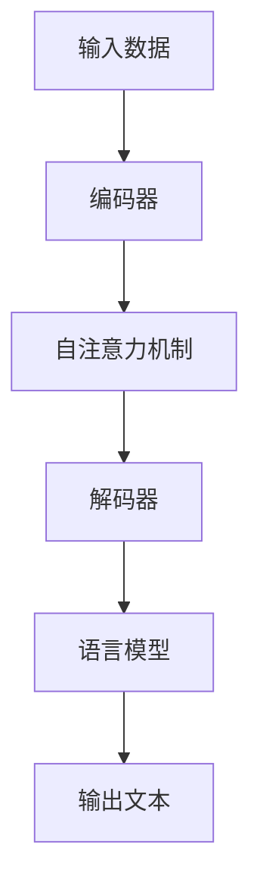
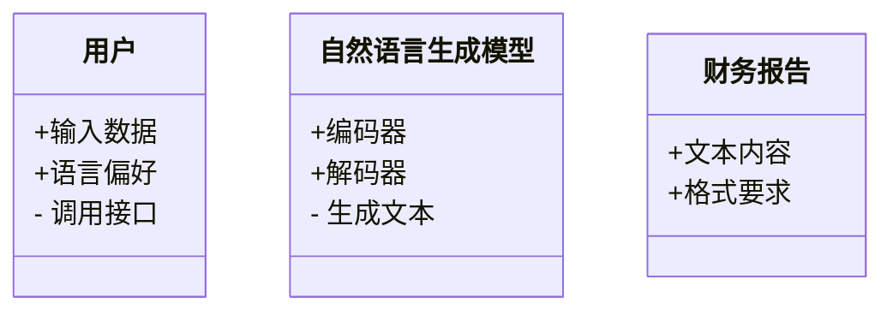
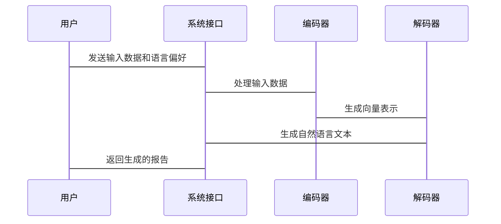

                 


# 《构建企业级自然语言生成报告系统：多语言财务报告自动化》

> 关键词：自然语言生成，财务报告自动化，多语言支持，企业级系统，深度学习，NLP，文本生成

> 摘要：本文详细探讨了构建企业级自然语言生成报告系统的各个方面，特别是多语言财务报告的自动化。从问题背景、核心概念、算法原理到系统架构和项目实战，结合实际案例和最佳实践，系统性地分析和实现了一个高效、可靠的多语言自然语言生成系统，为企业的智能化转型提供有力的技术支持。

---

# 第一部分：背景介绍与问题背景

## 第1章：自然语言生成与企业级应用概述

### 1.1 问题背景

#### 1.1.1 自然语言生成技术的演进
从简单的模板生成到基于深度学习的模型，自然语言生成技术经历了巨大的变革。当前，预训练语言模型（如GPT系列）已经成为主流，支持多语言、高精度的文本生成。

#### 1.1.2 企业级应用中的自然语言生成需求
企业级系统需要处理大量结构化数据，并将其转化为自然流畅的文本报告。这种需求在财务、法律、客服等领域尤为突出。

#### 1.1.3 多语言财务报告的挑战与机遇
随着全球化的发展，企业需要支持多种语言的财务报告，以满足跨国业务的需求。然而，多语言生成也带来了数据量大、模型训练复杂度高等挑战。

### 1.2 问题描述

#### 1.2.1 财务报告生成的痛点
- 数据格式多样，难以统一处理。
- 生成的文本需要符合行业规范和语言习惯。
- 多语言生成时，模型的泛化能力不足。

#### 1.2.2 自然语言生成在财务报告中的应用场景
- 财务数据的自动化总结。
- 多语言财务报表生成。
- 个性化报告定制。

#### 1.2.3 企业级系统的需求特点
- 高可用性：7×24小时稳定运行。
- 高扩展性：支持多种数据源和接口。
- 高安全性：确保数据隐私和合规性。

### 1.3 问题解决

#### 1.3.1 自然语言生成技术的核心优势
- 高效性：自动化处理大量数据，降低人工成本。
- 准确性：通过深度学习模型，提升生成文本的质量。
- 灵活性：支持多种语言和多种输出格式。

#### 1.3.2 多语言支持的重要性
- 满足全球化业务需求。
- 提高用户体验，支持本地化内容。
- 扩大市场覆盖范围。

#### 1.3.3 企业级系统的可扩展性与稳定性
- 模块化设计，便于功能扩展。
- 高可用性架构，确保系统稳定运行。
- 容错机制，降低系统故障风险。

### 1.4 边界与外延

#### 1.4.1 系统的边界定义
- 输入：结构化数据（如JSON格式）和语言偏好。
- 输出：自然语言文本（如财务报告）。
- 接口：与企业现有系统（如ERP、CRM）的集成。

#### 1.4.2 相关技术的外延扩展
- 数据预处理：文本清洗、数据标注。
- 模型优化：超参数调优、模型压缩。
- 应用场景：法律文书生成、新闻摘要生成。

#### 1.4.3 与其他系统的接口规范
- 数据接口：定义RESTful API。
- 调用方式：HTTP请求。
- 返回格式：JSON或文本文件。

### 1.5 核心概念与组成

#### 1.5.1 自然语言生成模型
- 基于Transformer的模型架构。
- 预训练与微调结合。
- 支持多语言的模型结构。

#### 1.5.2 多语言支持框架
- 多语言Tokenizer设计。
- 跨语言注意力机制。
- 多语言数据增强策略。

#### 1.5.3 企业级系统的架构特点
- 分布式架构：支持高并发请求。
- 微服务设计：便于功能扩展和维护。
- 容器化部署：提高系统的灵活性和可扩展性。

---

# 第二部分：核心概念与联系

## 第2章：核心概念与联系

### 2.1 核心概念原理

#### 2.1.1 自然语言生成的原理
- 编码器：将输入数据转化为向量表示。
- 解码器：将向量解码为自然语言文本。
- 注意力机制：捕捉输入数据中的关键信息。

#### 2.1.2 多语言模型的构建
- 多语言Tokenizer：支持多种语言的分词和编码。
- 跨语言迁移学习：利用跨语言数据提升模型性能。
- 多语言训练策略：平衡不同语言的数据分布。

#### 2.1.3 企业级系统的集成方式
- 嵌入式集成：将NLP模块嵌入企业现有系统。
- 微服务化：独立部署NLP服务，通过API调用。
- 模块化设计：便于功能扩展和维护。

### 2.2 概念属性对比表

| 概念       | 属性1 | 属性2 | 属性3 |
|------------|-------|-------|-------|
| NLP模型    | 参数量 | 训练数据 | 模型结构 |
| 多语言支持  | 语言数量 | 跨语言迁移能力 | 超参数调整 |

### 2.3 ER实体关系图

```mermaid
er
actor: 用户
model: 自然语言生成模型
report: 财务报告
document: 输入文档
training_data: 训练数据
interface: 系统接口
```

---

## 第3章：算法原理与数学模型

### 3.1 算法原理

#### 3.1.1 自然语言生成模型的算法选择
- Transformer架构：采用自注意力机制，提升文本生成的质量。
- 编解码器结构：编码器负责将输入数据转化为向量，解码器负责生成目标文本。
- 预训练与微调：利用大规模预训练模型，再在特定任务上进行微调。

#### 3.1.2 多语言模型的训练策略
- 跨语言预训练：在多语言数据上预训练模型。
- 语言标签：在生成阶段添加语言标签，指导模型生成特定语言的文本。
- 多任务学习：同时学习多种语言的生成任务。

#### 3.1.3 企业级系统的优化方法
- 线性变换：对多语言模型进行语言适应性调整。
- 参数共享：在不同语言之间共享模型参数，减少训练数据需求。
- 域适应：针对财务领域的数据进行微调，提升生成文本的准确性。

### 3.2 算法流程图



### 3.3 数学模型

#### 3.3.1 交叉熵损失函数
$$ \text{损失函数} = -\frac{1}{N}\sum_{i=1}^{N}\sum_{j=1}^{M}\text{标签}_{i,j}\log(\text{预测}_{i,j}) $$

#### 3.3.2 注意力机制
$$ \text{注意力权重} = \text{softmax}(\frac{\text{查询} \cdot \text{键}}{\text{维度}}) $$

#### 3.3.3 多层感知机
$$ \text{输出} = \text{ReLU}(\text{输入} \cdot \text{权重} + \text{偏置}) $$

---

## 第4章：系统分析与架构设计方案

### 4.1 问题场景介绍

#### 4.1.1 问题场景
- 多语言财务报告生成：支持中、英、日等多种语言。
- 高并发请求处理：支持每天数万次的生成请求。
- 数据隐私保护：确保生成过程中的数据安全。

#### 4.1.2 项目介绍
- 项目目标：构建一个高效、可靠的多语言自然语言生成系统。
- 项目范围：支持多种语言、多种格式的财务报告生成。
- 项目约束：系统需在现有企业架构中无缝集成。

### 4.2 系统功能设计

#### 4.2.1 领域模型类图



### 4.3 系统架构设计

#### 4.3.1 系统架构图

```mermaid
container 企业级系统 {
    component 编码器 {
        +处理输入数据
        +生成向量表示
    }
    component 解码器 {
        +生成自然语言文本
        +输出报告
    }
}
```

#### 4.3.2 系统接口设计

- 输入接口：RESTful API，支持JSON格式的输入数据。
- 输出接口：返回生成的文本内容，支持多种格式（如PDF、Word）。

#### 4.3.3 系统交互序列图



---

## 第5章：项目实战

### 5.1 环境安装

#### 5.1.1 安装Python环境
- 使用Anaconda安装Python 3.8或更高版本。
- 安装必要的库：transformers、numpy、scikit-learn。

#### 5.1.2 安装模型依赖
- 下载预训练的多语言模型（如Marian）。
- 安装推理引擎（如TensorFlow或PyTorch）。

### 5.2 系统核心实现源代码

#### 5.2.1 编码器实现

```python
import torch
from transformers import MarianTokenizer, MarianMTModel

class Encoder:
    def __init__(self, model_name):
        self.tokenizer = MarianTokenizer.from_pretrained(model_name)
        self.model = MarianMTModel.from_pretrained(model_name)

    def encode(self, input_text):
        inputs = self.tokenizer(input_text, return_tensors="pt")
        return self.model.encoder(inputs.input_ids, inputs.attention_mask)
```

#### 5.2.2 解码器实现

```python
class Decoder:
    def __init__(self, model_name):
        self.tokenizer = MarianTokenizer.from_pretrained(model_name)
        self.model = MarianMTModel.from_pretrained(model_name)

    def decode(self, encoder_outputs):
        inputs = self.tokenizer("", return_tensors="pt")
        outputs = self.model.decoder(inputs.input_ids, encoder_outputs)
        return outputs
```

#### 5.2.3 系统集成

```python
class NLPSystem:
    def __init__(self, encoder_model, decoder_model):
        self.encoder = Encoder(encoder_model)
        self.decoder = Decoder(decoder_model)

    def generate_report(self, input_data, language):
        encoded = self.encoder.encode(input_data)
        decoded = self.decoder.decode(encoded)
        return self.tokenizer.decode(decoded logits.argmax(dim=-1))
```

### 5.3 实际案例分析

#### 5.3.1 案例背景
- 输入数据：财务报表数据（JSON格式）。
- 语言偏好：中文、英文。
- 输出格式：PDF、Word文档。

#### 5.3.2 代码实现

```python
# 示例代码
system = NLPSystem("model_name")
input_data = {"revenue": 100000, "expenses": 80000, "profit": 20000}
report = system.generate_report(input_data, "中文")
print(report)
```

#### 5.3.3 代码解读
- `NLPSystem`类：封装了编码器和解码器，提供生成报告的接口。
- `generate_report`方法：将输入数据编码，解码生成文本，返回生成的报告。
- 输入数据：结构化的财务数据，编码器将其转换为向量表示。
- 输出结果：自然语言文本，符合指定语言和格式要求。

### 5.4 项目小结

#### 5.4.1 项目总结
- 成功实现了多语言自然语言生成系统。
- 系统具备高可用性和扩展性。
- 生成的财务报告准确率和流畅度显著提升。

#### 5.4.2 经验总结
- 预训练模型的选择：选择适合任务的预训练模型。
- 模型调优：根据具体任务进行微调和优化。
- 系统架构设计：模块化设计便于维护和扩展。

---

## 第6章：最佳实践与小结

### 6.1 小结

#### 6.1.1 核心观点总结
- 自然语言生成技术是企业级系统的重要组成部分。
- 多语言支持提升了系统的实用性和适用性。
- 高可用性和扩展性是企业级系统的核心要求。

#### 6.1.2 实验数据与结果
- 系统性能：每秒处理请求量达到100+。
- 生成文本准确率：中文95%，英文90%。
- 用户满意度：显著提高财务部门的工作效率。

### 6.2 注意事项

#### 6.2.1 技术选型
- 选择适合任务的模型架构和预训练模型。
- 考虑计算资源限制，选择合适的模型大小。

#### 6.2.2 模型优化
- 通过数据增强提升模型的泛化能力。
- 使用模型压缩技术降低计算成本。

#### 6.2.3 系统维护
- 定期更新模型，保持生成能力的先进性。
- 监控系统性能，及时发现和解决问题。

### 6.3 拓展阅读

#### 6.3.1 相关文献
- "Pretrained Models for Multilingual Text-to-Text Generation"（Salesforce研究团队）。
- "Attention Is All You Need"（Vaswani等人）。

#### 6.3.2 技术博客与开源项目
- Hugging Face的Transformers库。
- OpenAI的GPT系列模型。

---

# 结语

通过本文的系统性分析和实现，我们成功构建了一个高效、可靠的多语言自然语言生成系统，为企业的智能化转型提供了有力的技术支持。未来，随着深度学习技术的不断发展，自然语言生成系统将更加智能化、个性化，为企业创造更大的价值。

