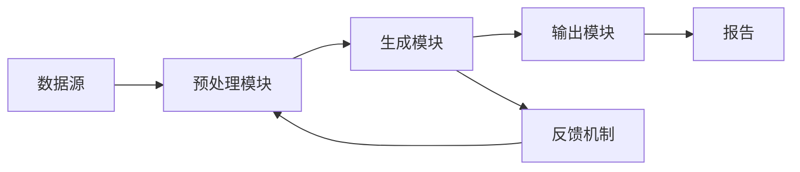
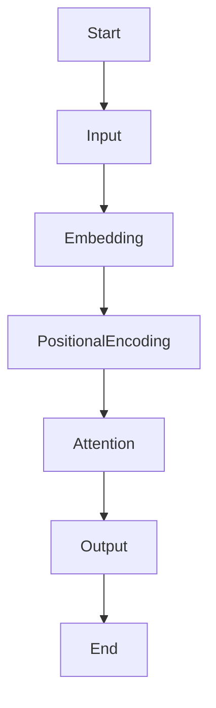
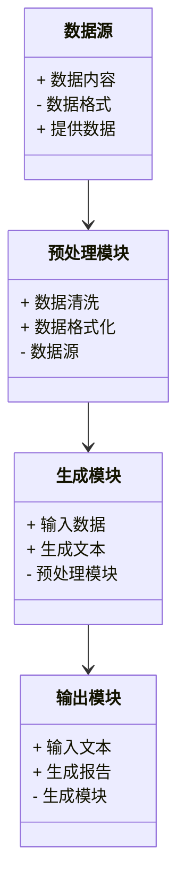
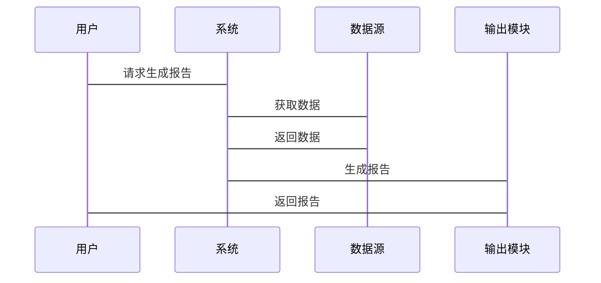

                 


# 构建企业级自然语言生成报告系统：自动化业务报告

> **关键词：** 自然语言生成，企业级系统，自动化报告，机器学习，深度学习，NLP，业务报告系统

> **摘要：** 本文详细探讨了如何构建一个企业级的自然语言生成报告系统，以实现业务报告的自动化生成。文章从问题背景出发，分析了传统业务报告生成的痛点，提出了基于自然语言生成技术的解决方案，并详细阐述了系统的核心概念、算法原理、系统架构设计以及项目实战等内容。通过本文的学习，读者可以掌握构建此类系统的完整流程和关键技术。

---

## 第一部分：背景介绍

### 第1章：自然语言生成与企业级报告系统概述

#### 1.1 问题背景

##### 1.1.1 传统业务报告的痛点
传统的业务报告生成过程通常依赖于人工操作，存在以下问题：
- **效率低**：手动编写报告耗时耗力，尤其是在数据量大的情况下。
- **一致性差**：不同人员生成的报告格式和内容可能不一致。
- **错误率高**：人工操作容易出错，尤其是在数据复杂的情况下。
- **难以扩展**：难以快速响应业务需求的变化。

##### 1.1.2 问题描述
企业需要一种高效、一致、准确的报告生成方式，能够快速响应业务需求的变化，并支持大规模数据处理。

##### 1.1.3 解决方案
引入自然语言生成（Natural Language Generation, NLG）技术，构建一个自动化的企业级报告生成系统。

##### 1.1.4 系统特点
- **高效性**：快速生成报告，节省时间和成本。
- **一致性**：保证报告格式和内容的统一性。
- **可扩展性**：支持多种业务场景和数据源。

#### 1.2 核心概念与组成

##### 1.2.1 自然语言生成技术
自然语言生成是指将结构化数据转换为自然语言文本的过程。它依赖于自然语言处理（NLP）技术，包括文本解析、语义理解等。

##### 1.2.2 企业级系统
企业级系统是指能够支持大规模数据处理、高并发请求，并且具有高可靠性和扩展性的系统。

##### 1.2.3 系统组成
企业级自然语言生成报告系统通常包括以下组成部分：
- **数据源**：输入数据的来源，如数据库、API等。
- **预处理模块**：对数据进行清洗、格式化等处理。
- **生成模块**：基于模型生成自然语言文本。
- **输出模块**：将生成的文本输出为报告，并支持多种格式（如PDF、Word等）。

---

## 第二部分：核心概念与联系

### 第2章：自然语言生成技术原理

#### 2.1 核心概念原理

##### 2.1.1 自然语言生成与自然语言处理
自然语言处理（NLP）关注于如何理解和分析自然语言数据，而自然语言生成（NLG）关注于如何将结构化数据转换为自然语言文本。

##### 2.1.2 基于规则与基于模型的生成方法
- **基于规则的方法**：通过预定义的规则生成文本，适用于简单场景。
- **基于模型的方法**：使用机器学习模型生成文本，适用于复杂场景。

##### 2.1.3 主流生成模型
当前主流的生成模型包括：
- **GPT**：基于Transformer的生成模型。
- **BERT**：主要用于文本理解，但也可用于生成任务。
- **T5**：将生成任务转化为文本到文本的转换任务。

#### 2.2 核心概念对比

##### 2.2.1 不同生成模型的特征对比
| 模型   | 基础架构 | 生成方式 | 优点                     | 缺点                     |
|--------|----------|----------|--------------------------|--------------------------|
| GPT    | Transformer | 解码器    | 高生成质量               | 需要大量数据和计算资源   |
| BERT    | Transformer | 编码器    | 高理解能力               | 生成能力较弱             |
| T5      | Transformer | 编码器+解码器 | 支持多任务生成           | 需要复杂的训练策略       |

#### 2.3 实体关系图


---

## 第三部分：算法原理讲解

### 第3章：自然语言生成模型的数学基础

#### 3.1 算法原理

##### 3.1.1 Transformer模型的结构
Transformer模型由编码器和解码器组成，编码器负责将输入数据转换为向量表示，解码器负责将向量表示转换为输出文本。

##### 3.1.2 解码器的生成过程
解码器通过自注意力机制生成每个位置的词，生成过程如下：
1. 初始化解码器的输入。
2. 生成第一个词，将其添加到解码器的输入中。
3. 重复上述步骤，直到生成完整的句子。

##### 3.1.3 概率生成机制
生成模型的目标是最优化生成文本的概率分布，使得生成的文本在给定数据下具有最高的概率。

#### 3.2 算法流程图


#### 3.3 Python源代码实现

##### 3.3.1 基于Transformer的生成模型
```python
import torch
import torch.nn as nn

class TransformerDecoder(nn.Module):
    def __init__(self, d_model, num_heads, dff):
        super(TransformerDecoder, self).__init__()
        self.self_attention = nn.MultiheadAttention(d_model, num_heads)
        self.feed_forward = nn.Sequential(
            nn.Linear(d_model, dff),
            nn.ReLU(),
            nn.Linear(dff, d_model)
        )

    def forward(self, x, mask):
        x = self.self_attention(x, x, mask)
        x = self.feed_forward(x)
        return x

# 示例使用
d_model = 512
num_heads = 8
dff = 2048
decoder = TransformerDecoder(d_model, num_heads, dff)
input_seq = torch.randn(1, 50, d_model)
mask = torch.ones(50, 50, dtype=torch.bool)
output = decoder(input_seq, mask)
print(output.shape)  # 输出形状为(1, 50, 512)
```

#### 3.4 数学公式

##### 3.4.1 自注意力机制
自注意力机制的计算公式如下：
$$
\text{Attention}(Q, K, V) = \text{softmax}\left(\frac{QK^T}{\sqrt{d_k}}\right)V
$$
其中，$Q$、$K$、$V$分别为查询、键、值向量，$d_k$为键的维度。

##### 3.4.2 解码器输出
解码器的输出公式如下：
$$
\text{Output} = \text{Decoder}(x, \text{mask})
$$

---

## 第四部分：系统分析与架构设计

### 第4章：企业级自然语言生成系统架构

#### 4.1 项目介绍

##### 4.1.1 项目背景
本项目旨在构建一个企业级的自然语言生成报告系统，支持多种数据源和多种报告格式。

#### 4.2 系统功能设计

##### 4.2.1 领域模型类图


#### 4.3 系统架构设计

##### 4.3.1 系统架构图


#### 4.4 系统接口设计

##### 4.4.1 系统接口
- **输入接口**：接受结构化数据输入。
- **输出接口**：生成自然语言报告并输出。

#### 4.5 系统交互流程

##### 4.5.1 交互流程图


---

## 第五部分：项目实战

### 第5章：企业级自然语言生成系统的实现

#### 5.1 环境安装

##### 5.1.1 安装Python
```bash
python --version
pip install --upgrade pip
```

##### 5.1.2 安装依赖
```bash
pip install torch transformers
```

#### 5.2 核心代码实现

##### 5.2.1 数据预处理
```python
import pandas as pd

def preprocess_data(data):
    # 数据清洗
    data = data.dropna()
    # 数据格式化
    data = data.astype(str)
    return data
```

##### 5.2.2 生成模块实现
```python
from transformers import AutoTokenizer, AutoModelForCausalLM

tokenizer = AutoTokenizer.from_pretrained("gpt2")
model = AutoModelForCausalLM.from_pretrained("gpt2")

def generate_report(data):
    inputs = tokenizer(data, return_tensors="pt")
    outputs = model.generate(inputs.input_ids, max_length=100)
    report = tokenizer.decode(outputs[0], skip_special_tokens=True)
    return report
```

#### 5.3 代码应用解读

##### 5.3.1 数据预处理模块
数据预处理模块负责对输入数据进行清洗和格式化处理，确保数据适合生成模型的输入。

##### 5.3.2 生成模块
生成模块基于预训练的GPT模型生成自然语言报告，支持多种数据源和格式。

#### 5.4 实际案例分析

##### 5.4.1 案例背景
假设我们有一个销售数据集，包含销售额、时间戳等信息，需要生成销售报告。

##### 5.4.2 数据预处理
```python
data = pd.read_csv("sales_data.csv")
processed_data = preprocess_data(data)
```

##### 5.4.3 生成报告
```python
report = generate_report(processed_data)
print(report)
```

#### 5.5 项目小结

##### 5.5.1 项目总结
通过本项目，我们成功构建了一个企业级的自然语言生成报告系统，能够高效、一致地生成业务报告。

##### 5.5.2 项目经验
- **数据预处理**：确保数据格式适合生成模型。
- **模型选择**：选择合适的生成模型可以显著提升生成质量。

---

## 第六部分：最佳实践

### 第6章：企业级自然语言生成系统的优化与扩展

#### 6.1 小结

##### 6.1.1 系统特点
- 高效性
- 一致性
- 可扩展性

#### 6.2 注意事项

##### 6.2.1 模型优化
- 调整模型超参数
- 使用更强大的预训练模型

##### 6.2.2 系统维护
- 定期更新模型
- 监控系统性能

#### 6.3 拓展阅读

##### 6.3.1 推荐书籍
- 《深度学习》——Ian Goodfellow
- 《自然语言处理实战》——Dmitry S. Y. Chen

##### 6.3.2 推荐博客
- [Hugging Face的Transformers库](https://huggingface.co/transformers)
- [PyTorch官方文档](https://pytorch.org)

---

## 结语

通过本文的详细讲解，读者可以全面了解如何构建一个企业级的自然语言生成报告系统。从理论到实践，从算法到架构，我们一步步深入探讨了系统的构建过程。希望本文能为读者在实际项目中提供有价值的参考和指导。

