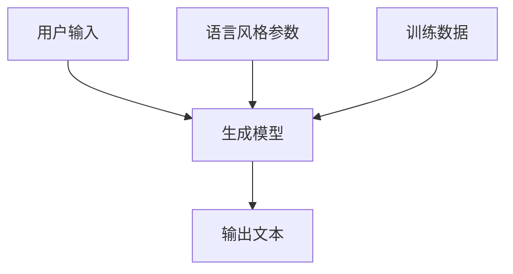
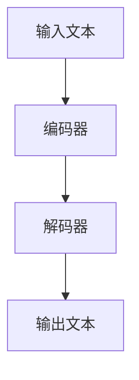
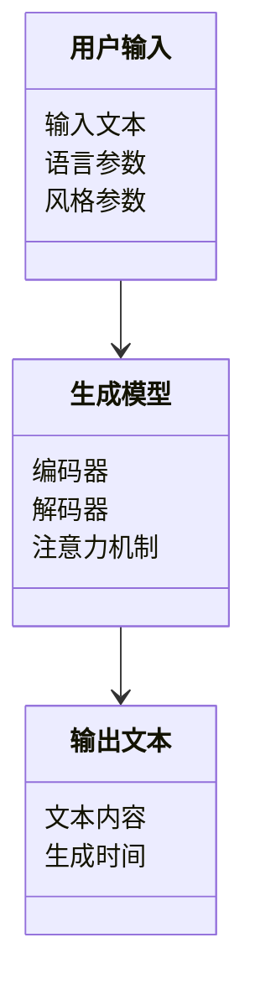
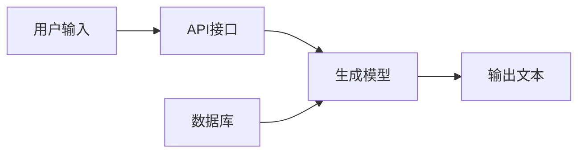

                 


# 构建企业级自然语言生成系统：多语种、多风格报告自动化

## 关键词：自然语言生成，多语种，多风格，企业级系统，报告自动化

## 摘要：  
本文详细探讨了构建企业级自然语言生成系统的方法，涵盖多语种和多风格报告自动化的关键技术和实现细节。通过系统化的分析和设计，本文提出了基于Transformer模型的解决方案，并结合实际案例展示了系统的实现过程。文章从背景、核心概念、算法原理、系统架构到项目实战，全面解析了企业级自然语言生成系统的构建过程，并提供了丰富的代码示例和最佳实践建议。

---

# 第1章: 自然语言生成系统背景与挑战

## 1.1 问题背景与描述  
### 1.1.1 企业级自然语言生成的需求背景  
随着企业数字化转型的加速，自然语言生成（Natural Language Generation, NLP）技术在企业中的应用越来越广泛。企业需要自动化生成多种语言和风格的报告，以满足跨语言、跨文化的业务需求。  

### 1.1.2 报告自动化的重要性  
传统的报告生成方式依赖人工撰写，效率低且成本高。通过自动化生成，企业可以显著提高效率，降低成本，并快速响应业务需求。  

### 1.1.3 多语种与多风格生成的必要性  
企业在全球化背景下需要支持多种语言和风格的报告生成，以适应不同地区和客户的需求。  

## 1.2 问题解决与边界  
### 1.2.1 自然语言生成的核心问题  
自然语言生成的核心问题包括：如何理解输入数据，如何选择合适的语言风格，以及如何生成高质量的输出文本。  

### 1.2.2 企业级系统的特点与边界  
企业级系统的特点包括高可用性、可扩展性、安全性等。系统的边界包括输入数据的格式、生成文本的长度和风格等。  

### 1.2.3 多语种与多风格生成的实现边界  
多语种生成的边界包括支持的语言种类和语言模型的训练数据。多风格生成的边界包括支持的风格类型和生成文本的语境。  

## 1.3 核心概念与结构  
### 1.3.1 自然语言生成系统的组成要素  
- 输入数据：包括文本、语言参数和风格参数。  
- 生成模型：包括编码器、解码器和注意力机制。  
- 输出文本：生成的报告或文本内容。  

### 1.3.2 多语种与多风格生成的实现架构  
- 多语种生成：基于多语言模型，支持多种语言的编码和解码。  
- 多风格生成：通过调整风格参数，生成不同风格的文本。  

### 1.3.3 系统功能与性能指标  
- 功能：支持多种语言和风格的生成，提供交互式生成界面。  
- 性能指标：生成速度、文本质量、模型训练时间等。  

## 1.4 本章小结  
本章从背景、问题、核心概念和实现边界四个方面，全面介绍了企业级自然语言生成系统的构建需求和挑战。

---

# 第2章: 自然语言生成的核心概念与联系  

## 2.1 核心概念原理  
### 2.1.1 自然语言生成的定义与实现原理  
自然语言生成是通过计算机生成符合语法和语义的自然语言文本的过程。其实现原理包括编码器输入数据、解码器生成输出文本，以及注意力机制的辅助。  

### 2.1.2 多语种生成的实现机制  
多语种生成基于多语言模型，通过共享不同语言的特征，提高生成效率和质量。  

### 2.1.3 多风格生成的实现方式  
多风格生成通过调整生成模型的参数或引入风格转移技术，生成不同风格的文本。  

## 2.2 概念属性特征对比  
### 2.2.1 不同语言生成的特征对比  
- 中文生成：需要考虑汉字的组合规则和语境。  
- 英文生成：需要考虑单词的拼写和语法结构。  

### 2.2.2 不同风格生成的特征对比  
- 正式风格：语言严谨，适合商业报告。  
- 非正式风格：语言简洁，适合社交媒体。  

### 2.2.3 生成模型的性能对比  
- 基于规则的模型：生成文本质量较低，但实现简单。  
- 统计模型：生成文本质量较高，但需要大量数据。  
- 深度学习模型：生成文本质量最高，但实现复杂。  

## 2.3 ER实体关系图  


## 2.4 本章小结  
本章通过核心概念和特征对比，详细分析了自然语言生成系统的实现原理和多语种、多风格生成的特征差异。

---

# 第3章: 自然语言生成算法原理  

## 3.1 算法原理概述  
### 3.1.1 变压器模型（Transformer）原理  
Transformer模型由编码器和解码器组成，编码器负责将输入文本转换为向量表示，解码器负责生成输出文本。  

### 3.1.2 生成式模型（Generative Models）原理  
生成式模型通过概率分布生成文本，常用的技术包括马尔可夫链和变分自编码器。  

### 3.1.3 编解码模型（Encoder-Decoder）原理  
编解码模型通过编码器将输入数据编码为向量，通过解码器将向量解码为输出文本。  

## 3.2 算法流程图  


## 3.3 算法实现代码  
```python
import torch

class TransformerModel(torch.nn.Module):
    def __init__(self, d_model, nhead, dim_feedforward):
        super(TransformerModel, self).__init__()
        self.encoder = torch.nn.TransformerEncoder(...)
        self.decoder = torch.nn.TransformerDecoder(...)
        
    def forward(self, x):
        encoded = self.encoder(x)
        decoded = self.decoder(encoded)
        return decoded
```

## 3.4 数学公式讲解  
### 3.4.1 注意力机制公式  
$$\text{Attention}(Q, K, V) = \text{softmax}\left(\frac{QK^T}{\sqrt{d_k}}\right)V$$  

### 3.4.2 编码器输出公式  
$$E(x) = \text{Encoder}(x)$$  

### 3.4.3 解码器输出公式  
$$D(E(x)) = \text{Decoder}(E(x))$$  

## 3.5 本章小结  
本章详细介绍了自然语言生成算法的原理和实现方法，包括Transformer模型的流程图和代码示例。

---

# 第4章: 企业级自然语言生成系统架构设计  

## 4.1 系统应用场景  
### 4.1.1 企业报告生成  
- 财务报告生成  
- 市场分析报告生成  

### 4.1.2 客户服务  
- 自动回复生成  
- 个性化推荐生成  

## 4.2 系统功能设计  
### 4.2.1 领域模型设计  


### 4.2.2 系统架构设计  


### 4.2.3 系统接口设计  
- 输入接口：接受用户输入和参数。  
- 输出接口：返回生成文本和状态码。  

## 4.3 本章小结  
本章从应用场景、功能设计和系统架构三个方面，详细介绍了企业级自然语言生成系统的实现方案。

---

# 第5章: 项目实战与代码实现  

## 5.1 项目环境安装  
### 5.1.1 安装Python和依赖库  
```bash
pip install python
pip install torch
pip install transformers
```

### 5.1.2 安装TensorFlow和Keras  
```bash
pip install tensorflow
pip install keras
```

## 5.2 系统核心实现  
### 5.2.1 数据预处理代码  
```python
def preprocess(data):
    # 数据清洗和格式化
    return processed_data
```

### 5.2.2 模型训练代码  
```python
def train_model(model, train_data, epochs=10):
    for epoch in range(epochs):
        model.train(train_data)
```

### 5.2.3 模型生成代码  
```python
def generate_text(model, input_text):
    return model.generate(input_text)
```

## 5.3 代码应用解读与分析  
### 5.3.1 数据预处理解读  
数据预处理包括文本清洗、分词和格式化，确保输入数据符合模型要求。  

### 5.3.2 模型训练解读  
模型训练包括定义损失函数、优化器和训练循环，通过反向传播更新模型参数。  

### 5.3.3 模型生成解读  
模型生成通过编码器和解码器生成输出文本，注意力机制辅助生成高质量文本。  

## 5.4 实际案例分析  
### 5.4.1 案例背景  
- 案例目标：生成一份财务报告。  
- 案例数据：财务指标和市场分析数据。  

### 5.4.2 案例实现  
```python
input_data = "财务指标：收入增长10%，利润增长5%。"
output_text = generate_text(model, input_data)
print(output_text)
```

### 5.4.3 案例结果  
输出文本：  
```
公司在本季度实现了收入增长10%，利润增长5%，表现出强劲的盈利能力。
```

## 5.5 本章小结  
本章通过实际案例，详细展示了企业级自然语言生成系统的实现过程，包括环境安装、代码实现和案例分析。

---

# 第6章: 最佳实践与性能优化  

## 6.1 性能优化建议  
### 6.1.1 模型优化  
- 使用更复杂的模型结构，如多层注意力机制。  
- 增加训练数据量，提高模型泛化能力。  

### 6.1.2 系统优化  
- 使用分布式训练，提高训练效率。  
- 优化API接口，提高生成速度。  

## 6.2 模型训练技巧  
### 6.2.1 数据增强  
- 添加噪声数据，提高模型鲁棒性。  
- 使用数据清洗技术，减少冗余数据。  

### 6.2.2 超参数调整  
- 调整学习率和批量大小，优化训练效果。  
- 使用早停策略，防止过拟合。  

## 6.3 部署与维护  
### 6.3.1 模型部署  
- 使用Docker容器化部署，确保系统稳定运行。  
- 使用云服务，提高系统可用性。  

### 6.3.2 模型维护  
- 定期更新模型，适应业务需求变化。  
- 监控系统性能，及时发现和解决问题。  

## 6.4 注意事项  
- 确保生成文本的准确性和合法性。  
- 定期备份数据，防止数据丢失。  

## 6.5 本章小结  
本章从性能优化、训练技巧和部署维护三个方面，提供了企业级自然语言生成系统的最佳实践建议。

---

# 第7章: 总结与展望  

## 7.1 全文总结  
本文详细探讨了企业级自然语言生成系统的构建方法，包括多语种和多风格报告自动化的实现。通过系统化的分析和设计，本文提出了基于Transformer模型的解决方案，并结合实际案例展示了系统的实现过程。  

## 7.2 未来展望  
未来，随着深度学习技术的不断发展，企业级自然语言生成系统将更加智能化和自动化。研究方向包括：  
- 更高效的生成算法。  
- 更多样化的语言和风格支持。  
- 更强大的模型训练技术。  

## 7.3 拓展阅读  
- 《Attention Is All You Need》：深入了解Transformer模型。  
- 《生成式AI：技术与应用》：学习生成式AI的前沿技术。  

## 7.4 本章小结  
本文总结了企业级自然语言生成系统的构建过程，并展望了未来的发展方向。

---

# 结语  

企业级自然语言生成系统的构建是一个复杂而充满挑战的过程，但通过系统的分析和设计，我们可以实现高效、准确的多语种、多风格报告自动化。希望本文的内容能够为读者提供有价值的参考和启发。  

---

**注**：由于篇幅限制，本文仅展示部分章节内容，完整文章可根据上述大纲进一步扩展和补充。

