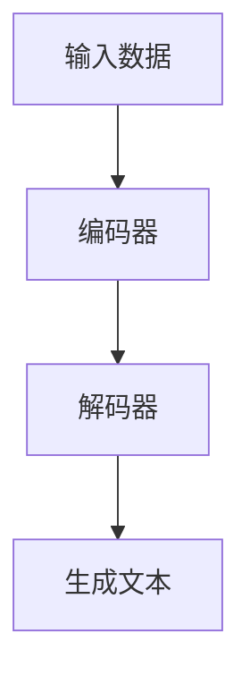
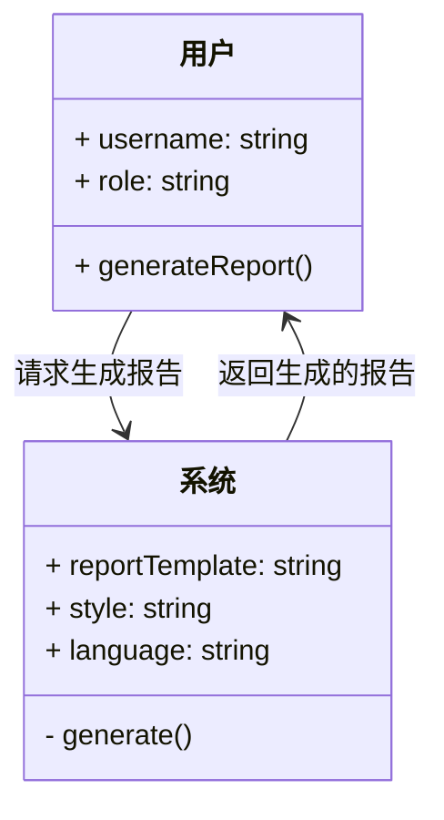
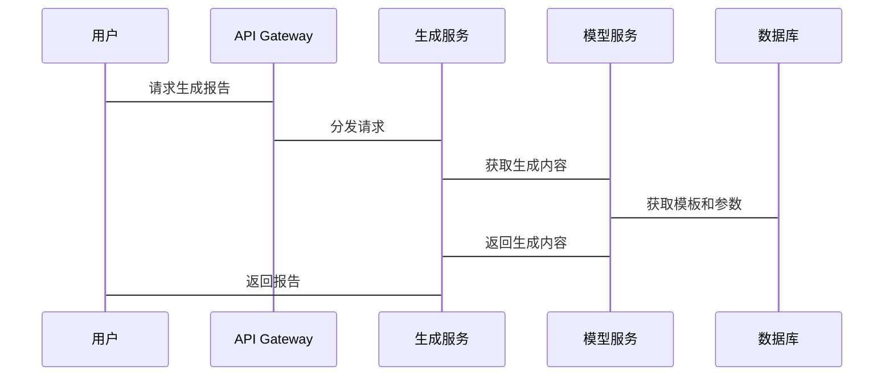

                 


# 构建企业级自然语言生成系统：多语种、多风格报告自动化

**关键词：** 自然语言生成，企业级系统，多语种，多风格，报告自动化

**摘要：** 本文将详细探讨如何构建一个企业级的自然语言生成系统，实现多语种、多风格报告的自动化生成。文章从背景介绍、核心概念、算法原理、系统架构到项目实战，全面解析自然语言生成系统的构建过程，帮助读者掌握从理论到实践的全栈技术。

---

## 第一部分：自然语言生成系统概述

### 第1章：自然语言生成系统背景与应用

#### 1.1 自然语言生成系统概述

自然语言生成（Natural Language Generation, NLG）是人工智能领域的重要分支，旨在将结构化数据转化为自然流畅的文本。企业级自然语言生成系统能够根据输入的数据和需求，自动生成符合特定风格和语言的报告、摘要、新闻稿等文本内容。

- **核心目标**：实现自动化、高效的文本生成，满足企业对多语种、多风格报告的需求。
- **边界与外延**：自然语言生成的外延包括文本摘要、机器翻译、对话生成等，而其核心在于生成符合语法规则和语义逻辑的自然语言文本。

#### 1.2 自然语言生成系统的应用领域

- **企业级报告生成**：企业可以通过自然语言生成系统自动生成财务报告、市场分析、项目总结等。
- **多语种内容生成**：支持多种语言的文本生成，帮助企业实现国际化内容输出。
- **多风格文本生成**：根据目标受众或场景，生成不同风格（正式、口语化、技术性等）的文本。

#### 1.3 自然语言生成系统的挑战

- **数据质量与多样性问题**：生成系统需要依赖高质量、多样化的训练数据，否则容易出现生成内容缺乏逻辑性或相关性的问题。
- **模型训练与优化挑战**：大规模模型的训练需要大量的计算资源和时间，同时需要不断优化模型以提升生成质量。
- **多语种与多风格的平衡**：在支持多语种的同时，还要兼顾不同语言的风格差异，这对模型的设计和训练提出了更高的要求。

---

## 第二部分：自然语言生成系统的核心概念与联系

### 第2章：自然语言生成系统的原理与核心要素

#### 2.1 自然语言生成系统的基本原理

- **输入与输出**：生成系统接收结构化数据或关键词作为输入，输出自然流畅的文本。
- **内部处理流程**：系统通过对输入数据的解析、语义分析和生成策略的应用，完成文本生成。
- **输出结果评估**：通过预设的评估指标（如BLEU、ROUGE等）对生成内容的质量进行评估。

#### 2.2 自然语言生成系统的核心要素

- **数据集与训练策略**：高质量的训练数据和合理的训练策略是模型性能的基础。
- **模型结构与参数设置**：模型的架构设计和参数调优直接影响生成效果。
- **生成策略与优化方法**：生成策略的选择（如贪心搜索、Beam Search）和优化方法（如温度调节）是提升生成质量的关键。

#### 2.3 自然语言生成系统的属性特征对比

| 特性         | 基于RNN的生成模型       | 基于Transformer的生成模型   | 混合模型         |
|--------------|------------------------|--------------------------|------------------|
| 处理速度      | 较慢                   | 较快                     | 根据模型设计而定  |
| 并行能力      | 较差                   | 优秀                     | 优秀             |
| 上下文捕捉    | 依赖循环结构           | 通过自注意力机制         | 结合两者优势     |
| 应用场景      | 适合短文本生成         | 适合长文本生成           | 适合复杂场景     |

#### 2.4 自然语言生成系统的ER实体关系图


---

## 第三部分：自然语言生成系统的算法原理讲解

### 第3章：自然语言生成系统的算法原理

#### 3.1 自然语言生成系统的主流算法

- **基于RNN的生成模型**：通过循环神经网络处理序列数据，生成文本。
- **基于Transformer的生成模型**：采用自注意力机制，提升对长序列的处理能力。
- **基于混合模型的生成方法**：结合RNN和Transformer的优势，优化生成效果。

#### 3.2 自然语言生成系统的算法流程



#### 3.3 自然语言生成系统的数学模型

- **转换器架构**：
  $$ \text{Encoder}(x) = \text{LayerNorm}(x) + \text{MultiHeadAttention}(x) $$
  $$ \text{Decoder}(y, \text{EncoderOutput}) = \text{LayerNorm}(y) + \text{MultiHeadAttention}(y, \text{EncoderOutput}) $$

- **注意力机制**：
  $$ \text{Attention}(Q, K, V) = \text{softmax}\left(\frac{QK^T}{\sqrt{d_k}}\right)V $$

#### 3.4 自然语言生成系统的代码实现

```python
import torch
import torch.nn as nn

class TransformerDecoder(nn.Module):
    def __init__(self, d_model, nhead, dropout=0.1):
        super(TransformerDecoder, self).__init__()
        self.decoder = nn.TransformerDecoder(
            nn.TransformerDecoderLayer(d_model=d_model, nhead=nhead, dropout=dropout),
            num_layers=2
        )
    
    def forward(self, x, mask):
        return self.decoder(x, mask)
```

---

## 第四部分：系统分析与架构设计方案

### 第4章：系统分析与架构设计

#### 4.1 问题场景介绍

企业级自然语言生成系统需要支持多语种、多风格的文本生成，适用于财务报告、市场分析、新闻稿等多种场景。

#### 4.2 项目介绍

- **项目目标**：构建一个多语种、多风格的自然语言生成系统。
- **项目背景**：企业对自动化报告生成的需求日益增长，传统的人工生成方式效率低下。

#### 4.3 系统功能设计



#### 4.4 系统架构设计


#### 4.5 系统接口设计



---

## 第五部分：项目实战

### 第5章：项目实战

#### 5.1 环境配置

- **安装Python和相关库**：
  ```bash
  pip install torch transformers
  ```

#### 5.2 核心代码实现

```python
from transformers import AutoTokenizer, AutoModelForCausalLM

tokenizer = AutoTokenizer.from_pretrained('gpt2')
model = AutoModelForCausalLM.from_pretrained('gpt2')

def generate_text(prompt, max_length=50):
    inputs = tokenizer.encode(prompt, return_tensors='pt')
    outputs = model.generate(inputs, max_length=max_length, do_sample=True)
    return tokenizer.decode(outputs[0], skip_special_tokens=True)
```

#### 5.3 案例分析

- **案例1**：生成财务报告摘要
  ```python
  prompt = "财务报告：2023年Q1收入同比增长10%，净利润..."
  result = generate_text(prompt)
  ```

- **案例2**：生成多语种新闻稿
  ```python
  prompt = "新产品发布：..."
  result = generate_text(prompt, language='spanish')
  ```

#### 5.4 总结与优化

- **总结**：通过上述步骤，可以快速搭建一个企业级的自然语言生成系统。
- **优化**：可以根据具体需求优化模型参数和生成策略，提升生成质量。

---

## 第六部分：总结与展望

### 6.1 总结

本文详细介绍了企业级自然语言生成系统的构建过程，从背景、核心概念到算法实现、系统架构和项目实战，为读者提供了一个全面的技术指南。

### 6.2 展望

随着深度学习技术的不断进步，自然语言生成系统将更加智能化和多样化，未来可以在更多领域实现更广泛的应用。

---

## 注意事项

- **数据预处理**：确保输入数据的高质量和多样性。
- **模型调优**：根据具体需求优化模型参数和生成策略。
- **性能监控**：实时监控系统性能，及时发现和解决问题。

---

## 拓展阅读

- **《生成式AI：从算法到应用》**：深入讲解生成式人工智能的核心算法和应用场景。
- **《自然语言处理实战：模型与算法》**：系统介绍自然语言处理领域的主流算法和实战技巧。

通过本文的学习，读者可以全面掌握企业级自然语言生成系统的构建方法，并在实际项目中灵活应用这些技术。

