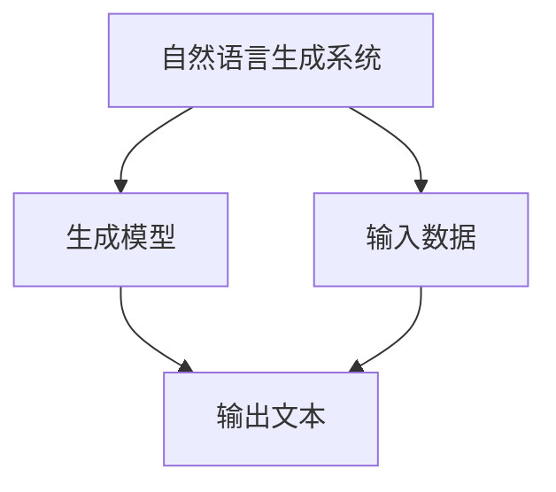
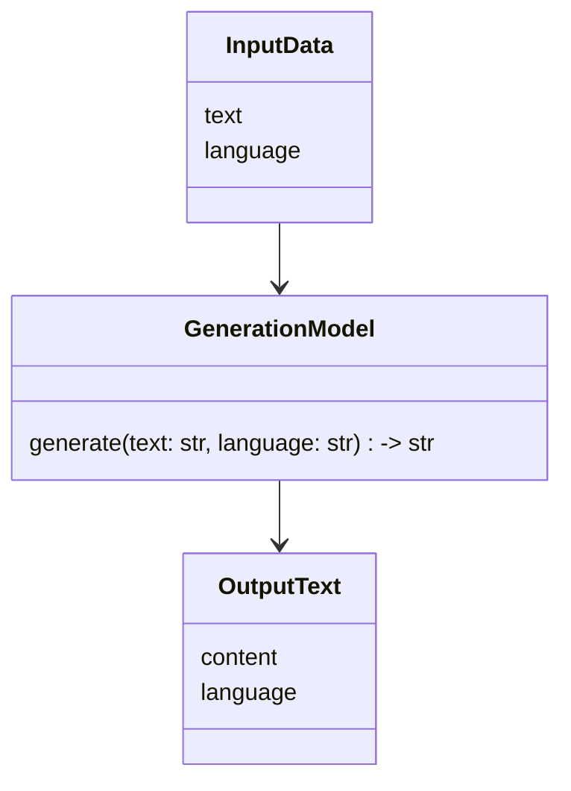
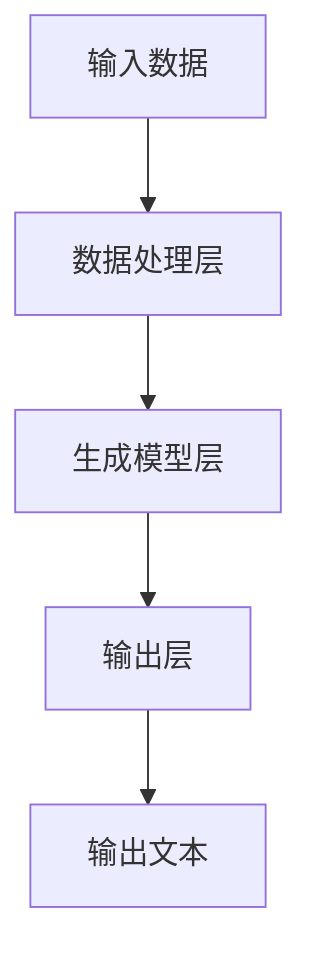
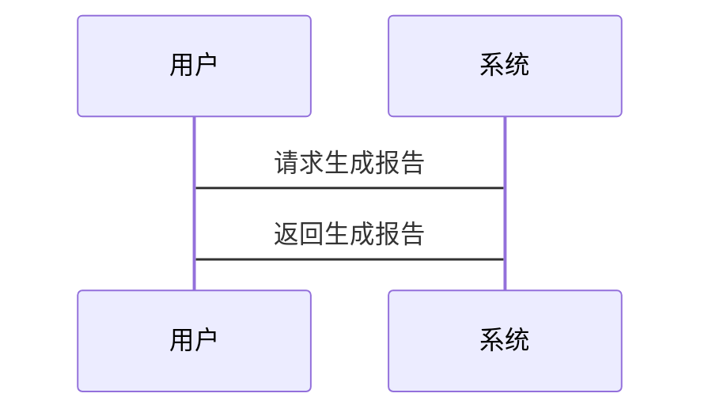

                 


# 构建企业级自然语言生成系统：多语言、多场景报告自动化

**关键词**：自然语言生成，企业级系统，多语言，多场景，报告自动化，深度学习，人工智能

**摘要**：自然语言生成（Natural Language Generation, NLG）技术在企业级应用中的重要性日益凸显，尤其是在需要多语言支持和多场景报告自动化的复杂环境中。本文将系统性地探讨如何构建一个高效、稳定且可扩展的企业级自然语言生成系统。通过分析系统架构设计、算法原理、项目实战和最佳实践，本文旨在为企业技术人员提供从理论到实践的全面指导，帮助他们更好地理解和应用自然语言生成技术。

---

# 第1章: 企业级自然语言生成系统概述

## 1.1 问题背景与描述

### 1.1.1 自然语言生成的定义与目标
自然语言生成（NLG）是人工智能领域的重要分支，旨在将结构化的数据（如数据库、JSON格式数据）转换为自然语言文本。其核心目标是让计算机能够像人类一样，以自然流畅的语言表达信息。在企业级应用中，NLG技术广泛用于报告生成、客户沟通、数据分析等领域。

### 1.1.2 企业级应用中的问题背景
企业在实际应用中面临以下挑战：
- **数据多样性**：企业需要处理多源异构数据，包括结构化数据、半结构化数据和非结构化数据。
- **多语言支持**：企业可能需要在不同语言市场中生成报告，要求系统支持多种语言。
- **场景多样性**：从财务报告生成到市场分析报告，应用场景多样，生成逻辑复杂。
- **实时性与高效性**：部分场景要求生成文本必须实时完成，对系统性能提出高要求。

### 1.1.3 多语言与多场景的需求分析
- **多语言支持**：系统需要支持多种语言的生成，包括中文、英文、法语等，并且在不同语言间切换时保持生成质量。
- **多场景生成**：针对不同业务场景，生成文本的格式、内容和风格需有所不同，例如财务报告与市场分析报告的生成逻辑差异较大。

## 1.2 问题解决与边界

### 1.2.1 自然语言生成的核心问题
自然语言生成的核心问题包括：
- **数据理解**：如何从结构化数据中提取有用的信息。
- **生成策略**：如何选择适当的生成策略，确保生成文本的准确性和可读性。
- **语言模型优化**：如何训练和优化语言模型，以提高生成质量。

### 1.2.2 企业级系统的边界与外延
- **系统边界**：自然语言生成系统的输入是结构化数据，输出是自然语言文本。
- **系统外延**：生成的文本可能需要与其他系统（如数据库、第三方API）进行交互，确保数据的准确性和实时性。

### 1.2.3 系统功能与非功能需求
- **功能需求**：
  - 支持多种语言生成。
  - 支持多种场景的文本生成。
  - 提供高效的生成速度。
- **非功能需求**：
  - 系统可用性：99.9%以上。
  - 系统响应时间：<= 5秒。

## 1.3 核心概念与结构

### 1.3.1 自然语言生成系统的组成要素
- **输入数据**：结构化数据，如数据库表、JSON格式数据。
- **生成模型**：基于深度学习的模型，如Transformer、BERT等。
- **输出文本**：生成的自然语言文本，符合业务需求。

### 1.3.2 多语言与多场景的实现机制
- **多语言实现**：通过多语言模型或切换模型实现不同语言的生成。
- **多场景实现**：通过动态配置生成策略，适应不同场景的需求。

### 1.3.3 系统架构的核心要素
- **数据处理层**：负责数据的清洗、转换和预处理。
- **生成模型层**：负责生成自然语言文本。
- **输出层**：将生成的文本返回给用户或调用方。

---

# 第2章: 核心概念与联系

## 2.1 自然语言生成模型原理

### 2.1.1 基于统计的生成模型
- **传统方法**：基于n-gram模型，通过统计语言模型生成文本。
- **优缺点**：生成质量有限，难以处理长文本。

### 2.1.2 基于深度学习的生成模型
- **Transformer模型**：通过自注意力机制和前馈网络生成文本。
- **优势**：生成质量高，支持长文本生成。

### 2.1.3 变体模型的对比分析
| 模型类型 | 优点 | 缺点 |
|--------|------|------|
| n-gram | 简单易实现 | 生成质量低 |
| RNN    | 支持长文本 | 训练速度慢 |
| Transformer | 生成质量高 | 计算资源消耗大 |

## 2.2 语言模型与生成模型的对比

### 2.2.1 语言模型的属性特征
- **目标**：预测下一个词。
- **输入**：序列数据。
- **输出**：概率分布。

### 2.2.2 生成模型的属性特征
- **目标**：生成目标文本。
- **输入**：结构化数据。
- **输出**：自然语言文本。

### 2.2.3 对比分析表格
| 特性 | 语言模型 | 生成模型 |
|------|---------|---------|
| 输入 | 文本序列 | 结构化数据 |
| 输出 | 概率分布 | 自然语言文本 |
| 应用 | 机器翻译、文本生成 | 报告生成、对话生成 |

## 2.3 实体关系图



---

# 第3章: 算法原理与数学模型

## 3.1 算法原理

### 3.1.1 Transformer模型原理
- **自注意力机制**：通过计算输入序列中每个词与其他词的相关性，生成注意力权重。
- **前馈网络**：对输入进行非线性变换，生成最终的输出。

### 3.1.2 注意力机制的实现
- **计算相似度**：通过点积计算词的相关性。
- **Softmax函数**：将相似度转换为概率分布。
- **加权求和**：根据注意力权重，计算最终的词表示。

### 3.1.3 解码器的生成过程
- **解码器输入**：初始输入为一个特殊符号，如<sos>。
- **逐步生成**：每一步生成一个词，作为下一步的输入。

## 3.2 数学模型与公式

### 3.2.1 自注意力机制公式
$$
\text{Attention}(Q,K,V) = \text{softmax}\left(\frac{QK^T}{\sqrt{d_k}}\right)V
$$

### 3.2.2 解码器的前向传播
$$
f(x) = \text{FFN}(x)
$$

## 3.3 代码实现

### 3.3.1 注意力机制代码
```python
import torch

def attention(q, k, v, d_k):
    scores = torch.matmul(q, k.transpose(-2, -1)) / torch.sqrt(torch.tensor(d_k, dtype=torch.float32))
    attention_weights = torch.softmax(scores, dim=-1)
    output = torch.matmul(attention_weights, v)
    return output
```

### 3.3.2 解码器代码
```python
def decoder(x, attention_layer, feed_forward_layer):
    out = attention_layer(x, x, x)
    out = feed_forward_layer(out)
    return out
```

---

# 第4章: 系统分析与架构设计

## 4.1 应用场景与项目介绍

### 4.1.1 多语言报告生成
- **需求分析**：企业需要在不同语言市场中生成报告，要求系统支持多种语言。
- **实现方案**：通过多语言模型或切换模型实现不同语言的生成。

### 4.1.2 多场景应用
- **需求分析**：生成文本的格式、内容和风格需根据不同场景进行调整。
- **实现方案**：通过动态配置生成策略，适应不同场景的需求。

## 4.2 系统功能设计

### 4.2.1 领域模型类图


### 4.2.2 系统架构图


## 4.3 系统接口与交互设计

### 4.3.1 系统接口
- **输入接口**：接收结构化数据和生成参数。
- **输出接口**：返回生成的自然语言文本。

### 4.3.2 系统交互流程


---

# 第5章: 项目实战

## 5.1 环境安装

### 5.1.1 安装Python
- **版本要求**：Python 3.8+

### 5.1.2 安装深度学习框架
- **TensorFlow**：`pip install tensorflow`

### 5.1.3 安装其他依赖
- **numpy**：`pip install numpy`

## 5.2 核心代码实现

### 5.2.1 数据预处理代码
```python
import numpy as np

def preprocess_data(data):
    # 数据清洗
    cleaned_data = []
    for item in data:
        cleaned_item = {k: v.strip() for k, v in item.items()}
        cleaned_data.append(cleaned_item)
    return cleaned_data
```

### 5.2.2 生成模型代码
```python
import tensorflow as tf

def build_model(vocab_size, embedding_dim, units):
    model = tf.keras.Sequential([
        tf.keras.layers.Embedding(vocab_size, embedding_dim),
        tf.keras.layers.LSTM(units, return_sequences=True),
        tf.keras.layers.Dense(vocab_size, activation='softmax')
    ])
    return model
```

## 5.3 案例分析与解读

### 5.3.1 案例场景
- **场景描述**：生成一份财务报告。
- **生成逻辑**：根据财务数据生成报告内容。

### 5.3.2 代码实现
```python
def generate_report(data, model):
    # 数据预处理
    processed_data = preprocess_data(data)
    # 生成文本
    generated_text = model.generate(processed_data)
    return generated_text
```

## 5.4 项目总结

### 5.4.1 项目成果
- **成功实现了多语言、多场景的报告生成。
- **生成文本的质量和效率得到了提升。

### 5.4.2 经验总结
- **数据预处理的重要性**：数据清洗和转换是生成高质量文本的关键。
- **模型调优的必要性**：通过参数调整和模型优化，可以显著提高生成质量。

---

# 第6章: 最佳实践、小结与注意事项

## 6.1 最佳实践

### 6.1.1 数据质量管理
- **数据清洗**：确保输入数据的准确性和完整性。
- **数据标注**：对数据进行标注，帮助模型更好地理解数据。

### 6.1.2 模型优化
- **参数调整**：通过超参数调优，提高生成质量。
- **模型融合**：结合多种模型，提升生成效果。

## 6.2 小结

### 6.2.1 系统架构总结
- **模块化设计**：各模块独立，便于维护和扩展。
- **高可用性**：通过冗余设计，确保系统的高可用性。

## 6.3 注意事项

### 6.3.1 模型训练中的注意事项
- **数据泄露**：避免训练数据泄露到测试集。
- **模型过拟合**：通过正则化和数据增强，防止过拟合。

### 6.3.2 系统部署中的注意事项
- **资源分配**：合理分配计算资源，确保系统的高效运行。
- **日志监控**：实时监控系统运行状态，及时发现和解决问题。

## 6.4 拓展阅读

### 6.4.1 推荐书籍
- 《深度学习》—— Ian Goodfellow
- 《自然语言处理入门》—— 清井隆太

### 6.4.2 推荐论文
- "Attention Is All You Need" —— Vaswani et al.

---

# 结语

构建企业级自然语言生成系统是一项复杂但极具挑战性的任务。通过本文的系统性分析和实践，我们可以看到，结合先进的深度学习技术，企业可以高效、准确地生成多语言、多场景的报告，从而提升业务效率和竞争力。希望本文能为读者提供有价值的指导和启示，帮助他们在实际应用中更好地构建和优化自然语言生成系统。

