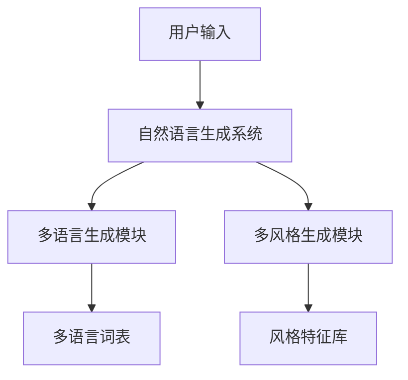
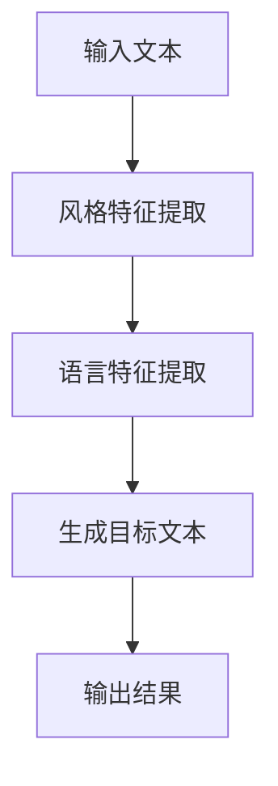
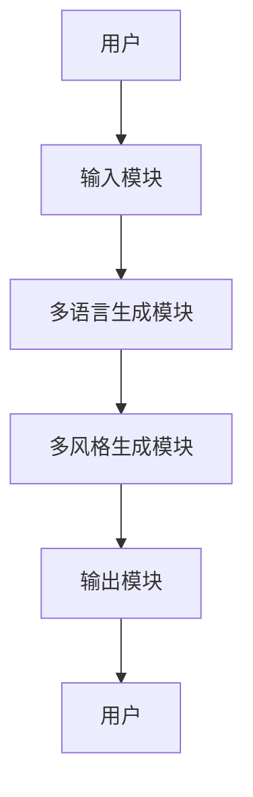

                 

# 构建企业级自然语言生成系统：多语言、多风格报告自动化

> **关键词**：自然语言生成、生成式AI、多语言生成、多风格生成、企业级系统、报告自动化

> **摘要**：本文详细探讨了构建企业级自然语言生成系统的多语言和多风格报告自动化技术。文章从背景和需求出发，深入分析了生成式AI的核心原理、多语言与多风格生成的技术挑战，详细讲解了系统的架构设计、算法实现和项目实战，最后总结了最佳实践和未来发展方向。

---

## 第一部分：自然语言生成系统概述

### 第1章：自然语言生成系统背景与技术基础

#### 1.1 自然语言生成的定义与核心概念

- **1.1.1 自然语言生成的定义**
  - 自然语言生成（NLG）是将结构化数据转化为自然语言文本的过程，常见于报告生成、对话系统和内容创作等领域。
  - 核心目标：提高生成文本的准确性、流畅性和可读性。

- **1.1.2 自然语言生成的核心要素**
  - **输入数据**：结构化数据（如表格、数据库）或半结构化数据（如文本）。
  - **生成模型**：基于统计模型、规则引擎或深度学习模型。
  - **输出文本**：符合目标语言和风格的自然语言文本。

- **1.1.3 自然语言生成的应用场景**
  - **企业级应用**：财务报告、市场分析、客户反馈生成。
  - **个人应用**：智能助手、个性化推荐、内容创作。
  - **跨语言应用**：多语言报告生成、国际化内容发布。

---

#### 1.2 生成式AI的技术基础

- **1.2.1 生成式AI的原理概述**
  - 基于概率生成模型，通过学习数据分布生成新的文本。
  - 主流方法：变分自编码器（VAE）、生成对抗网络（GAN）、预训练语言模型（如GPT、BERT）。

- **1.2.2 自然语言处理的演进**
  - 从基于规则的传统NLP到深度学习驱动的生成模型。
  - 关键技术：词嵌入、注意力机制、序列建模。

- **1.2.3 企业级自然语言生成的挑战**
  - 多语言支持：不同语言的语法、词汇差异。
  - 多风格生成：风格多样，难以统一建模。
  - 高可用性：企业级系统需要稳定性和可扩展性。

---

#### 1.3 企业级自然语言生成的多语言与多风格需求

- **1.3.1 多语言生成的必要性**
  - 全球化业务需求：企业需要多语言报告以服务全球客户。
  - 跨文化沟通：不同语言的表达习惯差异显著。

- **1.3.2 多风格生成的场景分析**
  - 不同报告类型：正式报告、简报、数据分析报告。
  - 不同受众：管理层、普通员工、客户。

- **1.3.3 报告自动化的价值与意义**
  - 提高效率：减少人工编写报告的时间。
  - 提高一致性：确保所有报告格式和风格统一。
  - 实时生成：快速响应数据变化。

---

### 第2章：自然语言生成系统的核心概念与联系

#### 2.1 生成式AI的核心原理

- **2.1.1 解码器模型的工作流程**
  - 输入：结构化数据或提示词。
  - 输出：生成自然语言文本。
  - 关键步骤：编码输入数据，解码生成目标文本。

- **2.1.2 概率生成的数学模型**
  - 生成模型的目标是最大化生成概率：$P(y|x)$，其中$y$是生成文本，$x$是输入数据。
  - 常见损失函数：交叉熵损失。
  $$\text{损失函数} = -\sum_{i=1}^{n}\log P(y_i|x_{<i})$$

- **2.1.3 基于上下文的生成机制**
  - 注意力机制：捕捉输入数据中的重要信息。
  - 解码器中的自注意力机制：帮助模型生成连贯的文本。

---

#### 2.2 多语言与多风格生成的关联性

- **2.2.1 多语言生成的模型架构**
  - 单一模型多语言：使用共享参数处理多种语言。
  - 多模型多语言：为每种语言单独训练一个模型。

- **2.2.2 多风格生成的特征提取**
  - 风格特征：正式、简洁、口语化等。
  - 特征提取方法：基于词嵌入或主题模型。

- **2.2.3 报告自动化的任务分解**
  - 数据预处理：结构化输入数据。
  - 风格选择：根据目标受众选择风格。
  - 多语言切换：根据目标语言生成文本。

---

#### 2.3 系统架构的ER实体关系图

---

### 第3章：自然语言生成系统的算法原理

#### 3.1 主流生成算法概述

- **3.1.1 Transformer解码器**
  - 结构：嵌入层、自注意力机制、前馈网络。
  - 优点：并行计算、长距离依赖捕捉。
  - 缺点：生成文本可能缺乏多样性。

- **3.1.2 预训练语言模型**
  - 基于大规模数据预训练。
  - 微调任务：针对特定领域优化。

- **3.1.3 扩散模型**
  - 通过逐步添加噪声并学习恢复原数据。
  - 优点：生成质量高，但计算成本高。

---

#### 3.2 解码器模型的数学模型

- **3.2.1 解码器的结构公式**
  $$\text{解码器} = \text{嵌入层} + \text{自注意力机制} + \text{前馈网络}$$

- **3.2.2 解码器的训练目标**
  $$\text{损失函数} = -\sum_{i=1}^{n}\log P(y_i|x_{<i})$$

---

#### 3.3 风格迁移与多语言生成的算法流程

---

## 第四章：系统架构与设计

### 4.1 企业级系统的模块划分

- **用户输入模块**
  - 接收输入数据：结构化数据或提示词。
  - 支持多种输入格式：JSON、CSV、文本。

- **多语言生成模块**
  - 处理多语言生成：支持多种语言模型切换。
  - 管理语言词表：确保生成文本符合目标语言语法。

- **多风格生成模块**
  - 提取风格特征：分析输入数据的风格需求。
  - 调整生成风格：根据风格特征生成相应文本。

- **输出模块**
  - 格式化输出：支持多种输出格式（文本、PDF、HTML）。
  - 反馈机制：收集用户反馈，优化生成结果。

---

### 4.2 系统架构设计

#### 4.2.1 系统功能设计

---

通过以上步骤，我逐步分析了构建企业级自然语言生成系统的多语言和多风格报告自动化技术。从背景分析到系统设计，再到算法实现和项目实战，我详细探讨了每个环节的关键点和技术细节。希望这些内容能为读者提供一个全面且系统的构建指南。

