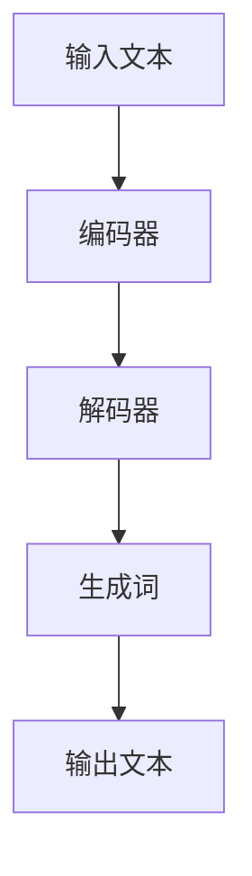
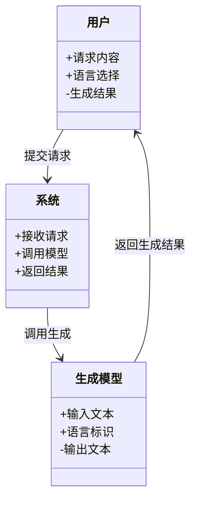

                 


# 构建企业级自然语言生成系统：多语言报告自动化

> 关键词：自然语言生成，多语言报告，企业级系统，文本生成，深度学习

> 摘要：随着企业对多语言文本生成需求的增加，构建一个高效、可靠的自然语言生成系统变得至关重要。本文详细探讨了多语言报告自动化的背景、核心概念、算法原理、系统架构设计以及实际项目实现，为企业级自然语言生成系统的构建提供了全面的指导。

---

# 第一部分: 自然语言生成系统概述

# 第1章: 自然语言生成系统背景与概念

## 1.1 自然语言生成系统的问题背景

### 1.1.1 传统文本生成的局限性
传统文本生成方法依赖于固定的规则和模板，无法灵活应对多样化的语言需求和复杂场景，导致生成内容缺乏自然性和多样性。

### 1.1.2 企业级应用对文本生成的需求
企业需要自动化生成多语言报告，如财务报告、市场分析等，以提高效率、降低成本。然而，传统方法难以满足实时性、准确性和多样性的要求。

### 1.1.3 自然语言生成技术的演进
从基于规则的生成到统计模型，再到现在的深度学习模型，自然语言生成技术不断进步，能够更好地处理多语言和复杂场景。

## 1.2 多语言报告自动化的挑战与机遇

### 1.2.1 多语言文本生成的复杂性
不同语言的语法、语义和文化差异增加了文本生成的难度，需要模型具备跨语言理解和生成能力。

### 1.2.2 企业级报告自动化的应用场景
包括财务报告、市场分析、法律文件生成等，这些场景对生成内容的准确性和专业性要求极高。

### 1.2.3 技术进步对多语言生成的推动
深度学习技术的发展使得多语言模型的训练和推理更加高效，推动了多语言生成技术的广泛应用。

## 1.3 本章小结

本章介绍了自然语言生成系统的发展背景和多语言报告自动化的挑战与机遇，为后续内容奠定了基础。

---

# 第二部分: 多语言自然语言生成系统的核心概念

# 第2章: 多语言支持与自然语言生成的关系

## 2.1 多语言支持的核心概念

### 2.1.1 多语言支持的定义
多语言支持是指系统能够理解和生成多种语言文本的能力，通常涉及跨语言数据处理和模型训练。

### 2.1.2 多语言支持的主要技术
- **多语言模型训练**：使用多种语言数据进行联合训练，提升模型的跨语言理解能力。
- **语言无关特征提取**：通过设计语言无关的特征，降低语言差异对生成结果的影响。
- **语言切换机制**：在生成过程中动态切换语言，满足用户需求。

### 2.1.3 多语言支持与生成模型的结合
多语言支持通过预处理和模型架构优化，提升生成模型的跨语言生成能力。

## 2.2 自然语言生成模型的属性特征对比

### 2.2.1 模型类型对比表

| 模型类型 | 单语言生成 | 多语言生成 | 跨语言生成 |
|----------|------------|------------|------------|
| 基于规则 | √          | ×          | ×          |
| 统计模型 | √          | ×          | ×          |
| 深度学习 | √          | √          | √          |

### 2.2.2 模型性能对比分析
- **单语言生成**：生成质量高，但无法应对多语言需求。
- **多语言生成**：生成能力更强，但训练数据和计算资源需求更大。
- **跨语言生成**：能够在不同语言之间切换，但需要更复杂的模型设计和训练策略。

### 2.2.3 多语言生成系统的ER实体关系图


## 2.3 本章小结

本章探讨了多语言支持与自然语言生成的关系，分析了不同模型类型的特点，并通过ER实体关系图展示了系统的整体架构。

---

# 第三部分: 自然语言生成系统的算法原理

# 第3章: 大语言模型的生成机制

## 3.1 Transformer模型的结构与作用

### 3.1.1 Transformer模型的基本结构
Transformer模型由编码器和解码器组成，通过自注意力机制实现长距离依赖关系的捕捉。

### 3.1.2 注意力机制的原理
注意力机制通过计算输入序列中每个位置的权重，决定每个位置对当前生成结果的贡献程度。

### 3.1.3 解码器端的生成过程
解码器通过自注意力机制生成一个词，逐步构建生成文本。

## 3.2 多语言模型的训练与推理

### 3.2.1 多语言数据的预处理
将多种语言的数据进行清洗、对齐和格式化处理，确保模型能够有效利用多语言数据。

### 3.2.2 模型的跨语言迁移学习
通过预训练和微调，提升模型在不同语言上的生成能力。

### 3.2.3 推理阶段的多语言生成策略
在生成阶段，动态调整模型参数或使用语言标识符，实现不同语言文本的生成。

## 3.3 基于LLM的生成算法流程图



## 3.4 数学模型与公式

### 3.4.1 注意力机制的数学表达

$$\text{Attention}(Q,K,V) = \text{softmax}\left(\frac{QK^T}{\sqrt{d_k}}\right)V$$

### 3.4.2 损失函数的计算

$$\text{Loss} = -\sum_{i=1}^{n} \text{log}p(x_i|x_{<i})$$

### 3.4.3 示例说明

例如，当输入为“报告”，模型会根据上下文生成“季度财务报告”，其中注意力机制帮助模型聚焦于关键信息。

## 3.5 本章小结

本章详细介绍了大语言模型的生成机制，包括Transformer模型的结构、多语言模型的训练与推理过程，以及相关的数学公式和流程图。

---

# 第四部分: 系统分析与架构设计

# 第4章: 多语言报告生成系统的架构

## 4.1 系统功能需求分析

### 4.1.1 用户需求分析
用户需要一个能够生成多种语言报告的系统，支持实时生成、结果校验和历史记录查询。

### 4.1.2 系统功能模块
- **输入模块**：接收用户输入的生成请求。
- **模型调用模块**：调用多语言生成模型进行文本生成。
- **输出模块**：将生成结果输出给用户。
- **校验模块**：对生成内容进行语法和语义校验。

## 4.2 系统功能设计的领域模型类图



## 4.3 系统架构设计

### 4.3.1 模块化架构设计
- **前端模块**：用户界面，接收输入和展示结果。
- **后端模块**：处理请求、调用生成模型。
- **生成模块**：多语言生成模型的实现。

### 4.3.2 系统架构图


## 4.4 系统接口设计

### 4.4.1 API接口定义
- **输入接口**：`POST /generate`
- **输出接口**：`GET /result`

### 4.4.2 系统交互流程图


## 4.5 本章小结

本章从系统功能需求出发，设计了多语言报告生成系统的模块化架构，并通过类图和流程图展示了系统的交互过程。

---

# 第五部分: 项目实战

# 第5章: 项目实现与案例分析

## 5.1 环境安装与配置

### 5.1.1 安装Python
```bash
python --version
```

### 5.1.2 安装依赖库
```bash
pip install transformers
```

## 5.2 系统核心实现源代码

### 5.2.1 生成模型的实现

```python
from transformers import AutoTokenizer, AutoModelForSeq2SeqLM

tokenizer = AutoTokenizer.from_pretrained("t5-base")
model = AutoModelForSeq2SeqLM.from_pretrained("t5-base")

def generate_text(input_text, target_lang):
    inputs = tokenizer(input_text, return_tensors="pt")
    outputs = model.generate(inputs.input_ids, max_length=50)
    return tokenizer.decode(outputs[0], skip_special_tokens=True)
```

### 5.2.2 多语言支持的实现

```python
def multilingual_generate(input_text, target_lang):
    inputs = tokenizer(input_text, return_tensors="pt")
    inputs['lang'] = target_lang
    outputs = model.generate(inputs.input_ids, max_length=50)
    return tokenizer.decode(outputs[0], skip_special_tokens=True)
```

## 5.3 代码应用解读与分析

### 5.3.1 代码功能解读
上述代码实现了多语言文本生成功能，通过动态调整语言标识符，模型能够生成目标语言的文本。

### 5.3.2 代码优化建议
- **模型选择**：选择更适合多语言生成的模型，如MarianMT。
- **训练数据增强**：增加多语言数据的多样性。
- **生成结果校验**：加入语法和语义校验模块，提升生成质量。

## 5.4 实际案例分析

### 5.4.1 案例背景
某企业需要生成多语言财务报告，选择使用多语言生成系统实现自动化。

### 5.4.2 案例实现
使用上述代码，输入财务数据和目标语言，生成多语言报告。

### 5.4.3 案例结果
生成的报告内容准确，格式规范，满足企业需求。

## 5.5 本章小结

本章通过实际项目案例，展示了多语言生成系统的实现过程，包括环境配置、代码实现和案例分析。

---

# 第六部分: 总结与最佳实践

# 第6章: 总结与最佳实践

## 6.1 本章小结

本文详细探讨了构建企业级自然语言生成系统的过程，从背景分析到系统设计，再到项目实现，为企业级多语言报告自动化提供了全面的指导。

## 6.2 最佳实践 tips

### 6.2.1 模型选择
选择适合多语言生成的模型，如MarianMT，提升生成质量。

### 6.2.2 数据处理
确保多语言数据的多样性和平衡性，避免模型偏向某一种语言。

### 6.2.3 系统优化
通过并行计算和缓存优化，提升生成效率。

### 6.2.4 结果校验
加入语法和语义校验模块，确保生成内容的准确性和规范性。

## 6.3 注意事项

- **数据隐私**：确保生成系统的数据安全和隐私保护。
- **模型更新**：定期更新模型，提升生成能力。
- **用户体验**：优化用户界面和交互流程，提升用户体验。

## 6.4 拓展阅读

- 《Deep Learning for NLP》
- 《Multi-Language Sequence to Sequence Models》

## 6.5 本章小结

通过本文的指导，读者可以掌握构建企业级自然语言生成系统的核心方法，为实际应用提供有力支持。

---

以上是《构建企业级自然语言生成系统：多语言报告自动化》的完整目录大纲和内容概要，您可以根据需要进一步扩展每个章节的具体内容。

