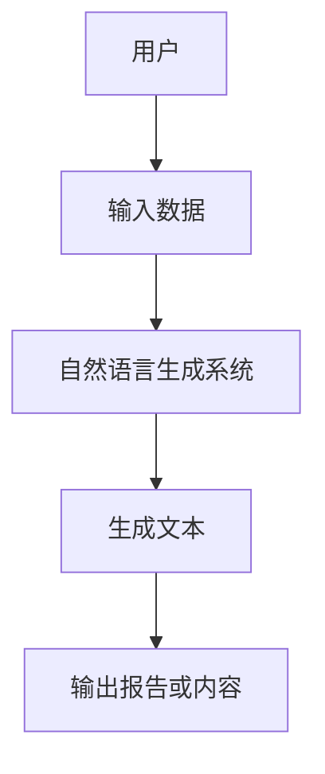
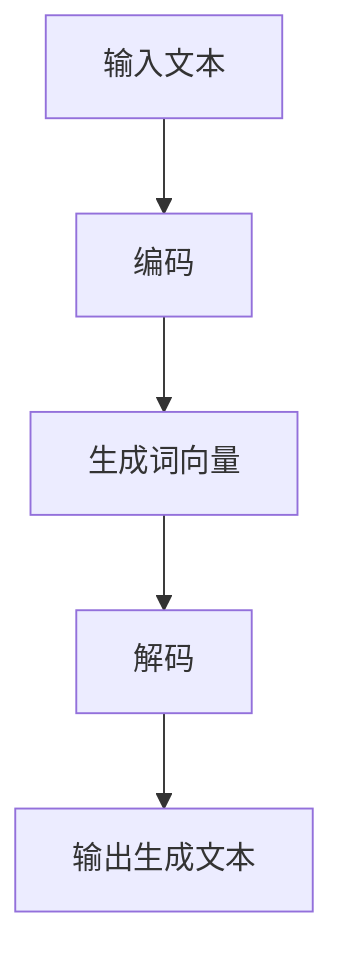
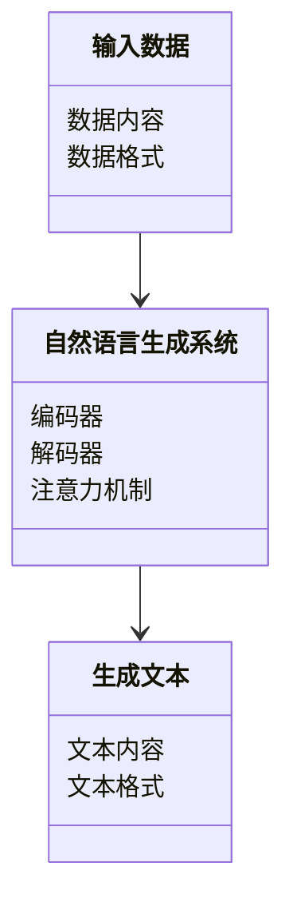
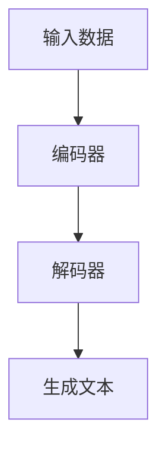
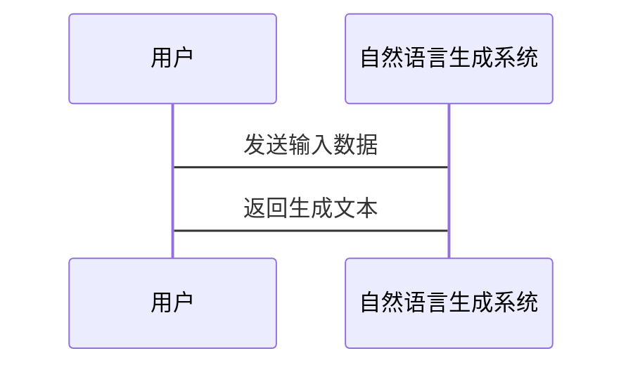

                 


# 构建企业级自然语言生成系统：自动报告与内容创作

> 关键词：自然语言生成，企业级系统，自动报告，内容创作，NLP，深度学习

> 摘要：本文详细探讨了如何构建一个企业级的自然语言生成系统，重点介绍其在自动报告和内容创作中的应用。文章从技术背景、核心概念、算法原理、系统设计、项目实战到最佳实践，全面解析了构建该系统的关键步骤和方法。通过本文，读者可以掌握从理论到实践的全过程，为实际应用提供参考。

---

## 第一部分: 自然语言生成系统概述

### 第1章: 自然语言生成系统背景与需求

#### 1.1 自然语言生成的定义与技术发展
自然语言生成（Natural Language Generation, NLG）是自然语言处理（NLP）的一个重要分支，旨在将结构化的数据转化为自然语言文本。近年来，随着深度学习技术的发展，NLG技术在企业中的应用越来越广泛。

**1.1.1 自然语言生成的定义**  
自然语言生成是指将计算机能够理解的结构化数据（如数据库中的记录、JSON格式的数据等）转换为人类可读的自然语言文本。例如，将一组销售数据生成一份销售报告，或将用户查询的结果生成一段自然语言的解答。

**1.1.2 自然语言生成技术的发展历程**  
早期的自然语言生成技术主要基于模板和规则，生成的内容较为简单且缺乏灵活性。随着神经网络技术的发展，尤其是Transformer模型的出现，生成的文本质量有了显著提升。

**1.1.3 自然语言生成在企业中的应用价值**  
在企业中，自然语言生成技术可以用于自动生成报告、营销文案、新闻稿等，显著提高了内容创作的效率，降低了人工成本。

#### 1.2 企业级自然语言生成系统的背景
随着企业对自动化和智能化的需求日益增加，构建一个高效、可靠的自然语言生成系统变得尤为重要。

**1.2.1 企业自动化报告的需求**  
企业需要定期生成各种报告，如财务报告、销售报告、项目进度报告等。传统的手动报告生成方式效率低下，容易出错，而自动化生成可以显著提高效率。

**1.2.2 内容创作的痛点与挑战**  
内容创作需要耗费大量的人力和时间，尤其是对于需要大量重复性内容的场景，如营销文案、社交媒体内容等。自然语言生成技术可以解决这一问题。

**1.2.3 自然语言生成技术的解决方案**  
通过自然语言生成技术，企业可以自动化生成高质量的内容，同时可以根据具体需求调整生成的内容风格和语气。

#### 1.3 本章小结
本章介绍了自然语言生成的定义、技术发展历程及其在企业中的应用价值，强调了构建企业级自然语言生成系统的重要性和必要性。

---

## 第二部分: 核心概念与联系

### 第2章: 自然语言生成的核心概念与联系

#### 2.1 自然语言生成的原理
自然语言生成的核心是将结构化的数据转化为自然语言文本。这一过程通常包括以下几个步骤：数据输入、编码、生成和解码。

**2.1.1 自然语言生成的基本原理**  
自然语言生成的基本原理可以简单地理解为将数据转化为文本。例如，给定一组销售数据，生成一份销售报告。

**2.1.2 自然语言生成的关键技术**  
- **编码**：将输入数据编码为向量表示。
- **生成**：基于编码向量生成文本。
- **解码**：将生成的文本解码为人类可读的形式。

#### 2.2 自然语言生成与自然语言处理的关系
自然语言生成是自然语言处理的一个重要组成部分，两者既有区别又有联系。

**2.2.1 自然语言处理的定义与范围**  
自然语言处理（NLP）是研究如何让计算机理解和生成人类语言的学科，包括文本分类、实体识别、情感分析等多个任务。

**2.2.2 自然语言生成在NLP中的位置**  
自然语言生成是NLP的一个子领域，专注于将结构化数据转化为自然语言文本。

**2.2.3 两者的区别与联系**  
- **区别**：自然语言处理更注重理解和分析文本，而自然语言生成注重将数据转化为文本。
- **联系**：自然语言生成依赖于自然语言处理技术，如分词、句法分析等。

#### 2.3 自然语言生成系统的实体关系图
以下是自然语言生成系统的实体关系图：



#### 2.4 本章小结
本章详细讲解了自然语言生成的核心概念及其与自然语言处理的关系，通过实体关系图展示了系统的组成和流程。

---

## 第三部分: 算法原理讲解

### 第3章: 自然语言生成的算法原理

#### 3.1 主流的自然语言生成模型
目前，主流的自然语言生成模型主要包括Transformer模型和基于Transformer的变体，如GPT系列。

**3.1.1 Transformer模型**  
Transformer模型由Google于2017年提出，主要应用于机器翻译任务。其核心思想是引入注意力机制，使得模型可以关注输入中的重要部分。

**3.1.2 BERT与GPT系列**  
- **BERT**：全称是Bidirectional Encoder Representations from Transformers，是一种基于Transformer的预训练模型，主要应用于文本理解任务。
- **GPT**：全称是Generative Pre-trained Transformer，是一种基于Transformer的预训练模型，主要应用于生成任务。

**3.1.3 其他生成模型**  
除了Transformer模型，还有循环神经网络（RNN）及其变体LSTM和GRU等，但目前Transformer模型在生成任务中表现更为优异。

#### 3.2 自然语言生成的算法流程
以下是自然语言生成的算法流程图：



#### 3.3 基于Transformer的生成模型
基于Transformer的生成模型是目前最常用的自然语言生成模型之一。

**3.3.1 Transformer的结构**  
Transformer模型由编码器和解码器组成。编码器负责将输入数据编码为向量表示，解码器负责将向量解码为自然语言文本。

**3.3.2 注意力机制的数学公式**  
注意力机制的数学公式如下：

$$\text{Attention}(Q, K, V) = \text{softmax}\left(\frac{QK^T}{\sqrt{d_k}}\right)V$$

其中：
- Q是查询向量
- K是键向量
- V是值向量
- $d_k$是向量的维度

#### 3.4 生成算法的实现
**3.4.1 基于贪心算法的生成**  
贪心算法是一种简单的生成方法，每次选择概率最大的词生成下一个词。

**3.4.2 基于Beam Search的生成**  
Beam Search是一种基于宽度优先搜索的生成方法，可以生成更高质量的文本。

**3.4.3**

---

## 第四部分: 系统分析与架构设计

### 第4章: 自然语言生成系统的分析与架构设计

#### 4.1 项目场景介绍
本项目旨在构建一个企业级的自然语言生成系统，用于自动生成报告和内容创作。

#### 4.2 系统功能设计
系统功能设计包括数据输入、生成文本、输出报告等模块。

**4.2.1 领域模型类图**  
以下是领域模型类图：



#### 4.3 系统架构设计
**4.3.1 系统架构图**  
以下是系统架构图：



#### 4.4 系统接口设计
**4.4.1 输入接口**  
系统提供一个API接口，用于接收输入数据。

**4.4.2 输出接口**  
系统提供一个API接口，用于输出生成的文本。

#### 4.5 系统交互序列图
以下是系统交互序列图：



#### 4.6 本章小结
本章详细讲解了自然语言生成系统的分析与架构设计，包括系统功能设计、架构设计、接口设计和交互设计。

---

## 第五部分: 项目实战

### 第5章: 自然语言生成系统项目实战

#### 5.1 环境搭建
**5.1.1 安装Python环境**  
需要安装Python 3.6及以上版本。

**5.1.2 安装必要的库**  
需要安装TensorFlow、Keras、numpy等库。

#### 5.2 系统核心代码实现
以下是系统核心代码实现：

```python
import tensorflow as tf
from tensorflow.keras.layers import Input, Dense, LSTM, GRU, Attention
from tensorflow.keras.models import Model
from tensorflow.keras.preprocessing.sequence import pad_sequences

# 定义编码器
def encoder(input_shape):
    inputs = Input(shape=input_shape)
    lstm = LSTM(128, return_sequences=True)(inputs)
    attention = Attention()([lstm, lstm])
    dense = Dense(64, activation='relu')(attention)
    return Model(inputs=inputs, outputs=dense)

# 定义解码器
def decoder(input_shape):
    inputs = Input(shape=input_shape)
    gru = GRU(128, return_sequences=True)(inputs)
    dense = Dense(64, activation='relu')(gru)
    output = Dense(vocabulary_size, activation='softmax')(dense)
    return Model(inputs=inputs, outputs=output)

# 定义整个模型
def nlg_model(encoder_input_shape, decoder_input_shape, vocabulary_size):
    encoder = encoder(encoder_input_shape)
    decoder = decoder(decoder_input_shape)
    model = Model(inputs=[encoder inputs, decoder inputs], outputs=decoder output)
    model.compile(optimizer='adam', loss='sparse_categorical_crossentropy', metrics=['accuracy'])
    return model

# 训练模型
model = nlg_model((max_length, input_dim), (max_length, output_dim), vocabulary_size)
model.fit([encoder_input, decoder_input], targets, epochs=10, batch_size=64)
```

#### 5.3 功能扩展
**5.3.1 支持多种语言**  
可以通过添加多语言数据集来扩展系统的语言支持。

**5.3.2 支持不同的内容风格**  
可以通过调整模型参数或引入风格控制模块来支持不同的内容风格。

#### 5.4 测试与优化
**5.4.1 模型测试**  
需要对模型进行测试，确保生成的文本质量符合要求。

**5.4.2 模型优化**  
可以通过调整模型参数、引入更复杂的模型结构等方式来优化模型性能。

#### 5.5 本章小结
本章通过具体的代码实现，展示了如何构建一个自然语言生成系统，并对系统的功能扩展和优化进行了探讨。

---

## 第六部分: 最佳实践与总结

### 第6章: 最佳实践与总结

#### 6.1 关键点总结
- 系统设计要清晰，功能模块划分要合理。
- 模型选择要根据具体任务需求进行调整。
- 数据预处理是模型训练的关键步骤。

#### 6.2 实践中的注意事项
- 数据质量和多样性对生成效果有重要影响。
- 模型的训练数据要经过清洗和标注。
- 生成文本的质量评估要结合人工评估和自动评估指标。

#### 6.3 未来挑战与趋势
- 模型的可解释性是一个重要挑战。
- 多模态生成是未来的重要研究方向。

#### 6.4 拓展阅读
- 《Effective Preaching: The Art of Generating Compelling Content》
- 《Deep Learning for Natural Language Processing》

#### 6.5 本章小结
本章总结了构建自然语言生成系统的最佳实践，并对未来的发展趋势进行了展望。

---

## 附录: 工具与API接口

### 附录A: 自然语言生成工具推荐
- **Hugging Face**：提供多种自然语言生成模型和工具。
- **OpenAI**：提供GPT系列模型的API接口。
- **Google AI**：提供BERT和GPT-2等模型的API接口。

### 附录B: 自然语言生成API接口
- **API Endpoint**  
  ```
  POST /generate
  ```

- **请求参数**  
  ```
  {
    "input_data": "...",
    "parameters": {
      "temperature": 0.7,
      "max_length": 500
    }
  }
  ```

- **响应格式**  
  ```
  {
    "generated_text": "...",
    "status": "success"
  }
  ```

### 附录C: 术语表
- **NLG**：自然语言生成
- **NLP**：自然语言处理
- **Transformer**：一种基于注意力机制的神经网络模型
- **API**：应用程序编程接口

---

以上就是《构建企业级自然语言生成系统：自动报告与内容创作》的完整内容。通过本文的详细讲解，读者可以全面了解如何构建一个高效、可靠的自然语言生成系统，并将其应用于实际的企业场景中。

