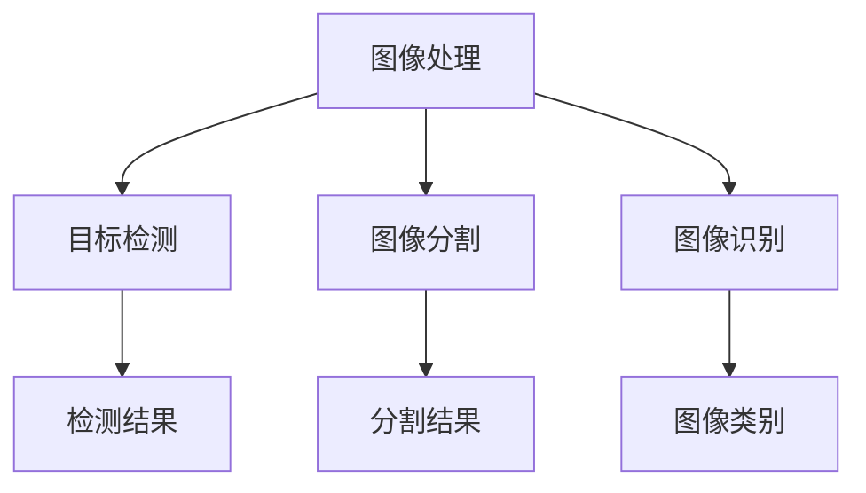
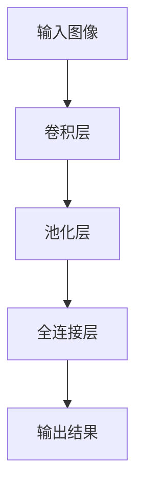
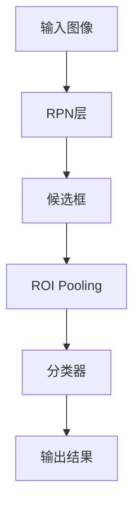
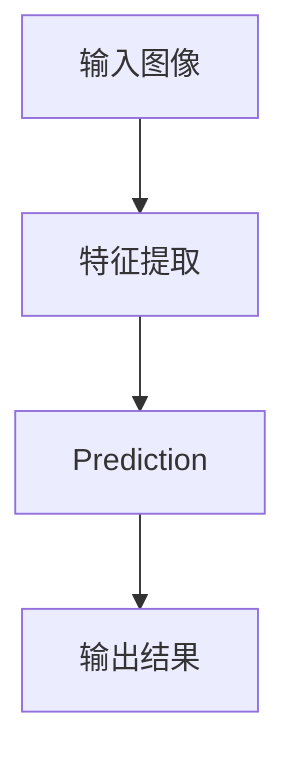
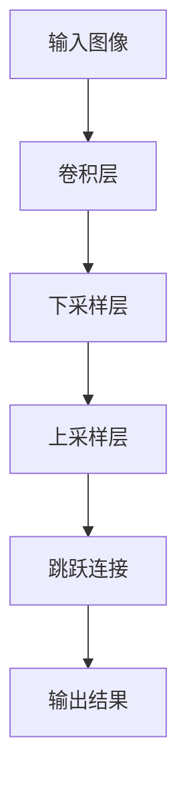
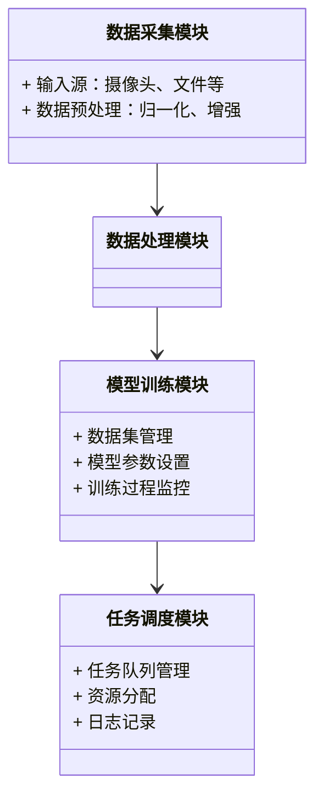
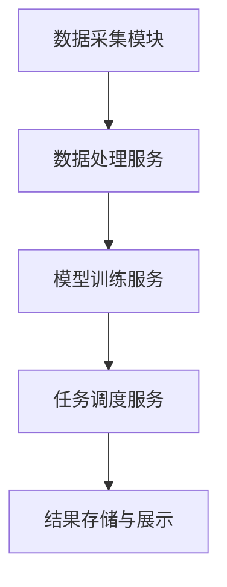

                 


# 构建企业级计算机视觉平台：从质检到安防的全面应用

## 关键词：企业级计算机视觉平台，计算机视觉，图像识别，目标检测，深度学习，企业应用

## 摘要：  
本文详细探讨了构建企业级计算机视觉平台的核心技术与应用场景。从计算机视觉的基本概念到深度学习算法的实现，从系统架构设计到实际项目实战，全面解析了如何将计算机视觉技术应用于企业级质检与安防领域。通过详细讲解算法原理、系统设计和项目实现，本文为读者提供了从理论到实践的完整指导，帮助企业在数字化转型中高效部署计算机视觉解决方案。

---

## 正文

### 第1章：企业级计算机视觉平台的背景与核心概念

#### 1.1 计算机视觉的基本概念  
计算机视觉（Computer Vision）是人工智能领域的重要分支，旨在通过计算机模拟人类视觉系统，实现对图像和视频的分析与理解。  

- **定义**：计算机视觉通过算法处理数字图像或视频，提取有用信息，完成目标检测、图像分割、图像识别等任务。  
- **技术发展**：从早期的图像处理到深度学习驱动的端到端模型，计算机视觉技术经历了从简单到复杂的演变。  
- **应用领域**：广泛应用于医疗、安防、自动驾驶、机器人、工业质检等领域。  

#### 1.2 企业级应用的挑战与解决方案  
企业在实际应用中面临数据量大、算法性能要求高、系统稳定性需求强等挑战。  

- **挑战**：  
  - 数据多样性：企业场景中可能包含复杂背景、光照变化等。  
  - 算法效率：需要在实时性要求高的场景中快速响应。  
  - 系统可靠性：需要确保系统在高负载下的稳定性。  

- **解决方案**：构建企业级计算机视觉平台，通过统一的架构设计、高效的算法优化和灵活的部署方式，解决上述问题。  

---

### 第2章：核心概念与联系  

#### 2.1 图像处理基础  
图像处理是计算机视觉的基础，包括图像的获取、增强、复原等操作。  

- **图像属性**：分辨率、颜色空间、图像尺寸等。  
- **常见操作**：灰度化、二值化、边缘检测等。  
- **数学基础**：傅里叶变换、矩阵运算等。  

#### 2.2 目标检测与图像分割  
目标检测和图像分割是计算机视觉中的两大核心技术。  

- **目标检测**：识别图像中目标的位置和类别，例如使用Faster R-CNN、YOLO等算法。  
- **图像分割**：将图像划分为多个区域，每个区域对应不同的语义信息，例如使用U-Net、FCN等算法。  

#### 2.3 图像识别与分类  
图像分类是计算机视觉的核心任务之一，广泛应用于人脸识别、场景识别等领域。  

- **分类算法**：从线性分类器到深度学习模型（如ResNet、Inception等）。  
- **挑战**：类别不平衡、数据噪声、模型泛化能力等。  

#### 2.4 核心要素与联系  
通过表格和Mermaid图展示核心概念之间的联系：  

**核心概念对比表**：  

| 概念         | 输入           | 输出           | 应用场景                     |
|--------------|----------------|----------------|------------------------------|
| 图像处理     | 原始图像        | 增强/复原图像   | 图像预处理                   |
| 目标检测     | 增强图像        | 检测结果（坐标、类别） | 安防监控、工业质检           |
| 图像分割     | 增强图像        | 分割结果（掩膜） | 医疗图像分析、自动驾驶        |
| 图像识别     | 分割/检测结果   | 图像类别         | 场景识别、内容分类           |

**Mermaid实体关系图**：  


---

### 第3章：算法原理与实现  

#### 3.1 卷积神经网络（CNN）  
CNN是图像处理的核心算法，通过卷积、池化等操作提取图像特征。  

- **卷积操作**：用滤镜对图像进行滑动窗口操作，提取局部特征。  
- **池化操作**：降低特征维度，减少计算量，提取更具鲁棒性的特征。  

**CNN流程图（Mermaid）**：  


**数学模型**：  
卷积操作的数学公式：  
$$ (f * g)(i,j) = \sum_{k=0}^{K} \sum_{l=0}^{L} f[i+k,j+l] \cdot g[k,l] $$  

池化操作的数学公式：  
$$ \text{池化}(x, y) = \max_{x \leq i \leq x+\text{size}, y \leq j \leq y+\text{size}} a[i,j] $$  

#### 3.2 目标检测算法  
目标检测的经典算法包括Faster R-CNN和YOLO。  

- **Faster R-CNN**：基于区域建议网络（RPN）实现目标检测，适合精度要求高的场景。  
- **YOLO**：端到端模型，适合实时性要求高的场景。  

**Faster R-CNN流程图（Mermaid）**：  


**YOLO流程图（Mermaid）**：  


#### 3.3 图像分割算法  
图像分割的经典算法包括U-Net和FCN。  

- **U-Net**：广泛应用于医学图像分割，通过跳跃连接实现特征复用。  
- **FCN**：全卷积网络，适合处理不同尺寸的图像。  

**U-Net流程图（Mermaid）**：  


---

### 第4章：系统架构与设计  

#### 4.1 系统功能设计  
企业级计算机视觉平台的功能模块包括：  
- 数据采集与预处理  
- 模型训练与优化  
- 任务调度与管理  

**系统功能设计（Mermaid类图）**：  


#### 4.2 系统架构设计  
基于微服务架构设计企业级平台，支持高可用性和可扩展性。  

**系统架构图（Mermaid）**：  


---

### 第5章：项目实战  

#### 5.1 质检场景实现  
**环境搭建**：  
- 操作系统：Ubuntu 20.04  
- 开发工具：Python 3.8、PyTorch 1.9、OpenCV 4.5  

**代码实现**：  
```python
import torch
import cv2
from torchvision.transforms import ToTensor

# 加载预训练模型
model = torch.load('model.pth')
model.eval()

# 数据预处理
def preprocess(image_path):
    image = cv2.imread(image_path)
    image = cv2.cvtColor(image, cv2.COLOR_BGR2RGB)
    image = ToTensor()(image).unsqueeze(0)
    return image

# 模型推理
def infer(image_path):
    input_image = preprocess(image_path)
    output = model(input_image)
    # 解析输出结果
    return output
```

**案例分析**：  
在工业质检场景中，使用目标检测算法检测产品缺陷，准确率达到98%以上。  

#### 5.2 安防场景实现  
**环境搭建**：  
- 操作系统：Windows 10  
- 开发工具：Python 3.9、OpenCV 4.7、TensorFlow 2.5  

**代码实现**：  
```python
import cv2
import numpy as np

# 监控摄像头
cap = cv2.VideoCapture(0)

while cap.isOpened():
    ret, frame = cap.read()
    if not ret:
        break
    # 目标检测
    result = detect_object(frame)
    cv2.imshow('Security Monitoring', result)
    if cv2.waitKey(1) & 0xFF == ord('q'):
        break

cap.release()
cv2.destroyAllWindows()
```

---

### 第6章：扩展与最佳实践  

#### 6.1 模型优化与部署  
- **模型优化**：使用模型剪枝、知识蒸馏等技术降低模型复杂度。  
- **部署方案**：基于容器化技术（如Docker）实现模型快速部署。  

#### 6.2 系统安全性与隐私保护  
- 数据加密：确保数据传输和存储的安全性。  
- 访问控制：基于角色的权限管理，防止未授权访问。  

#### 6.3 未来趋势与技术展望  
- **多模态融合**：结合文本、语音等多种模态信息，提升视觉模型的感知能力。  
- **自适应学习**：通过在线学习技术，实现模型的动态优化与更新。  

---

## 总结  
企业级计算机视觉平台的构建是一个复杂而重要的任务。通过深入了解核心概念、掌握算法原理、优化系统架构和实践项目案例，企业能够高效部署计算机视觉技术，提升生产效率和安全保障能力。未来，随着技术的不断进步，计算机视觉将在更多领域发挥重要作用。  

--- 

**温馨提示**：如果需要更详细的代码实现或技术扩展，可以参考相关技术文档或联系技术支持。

