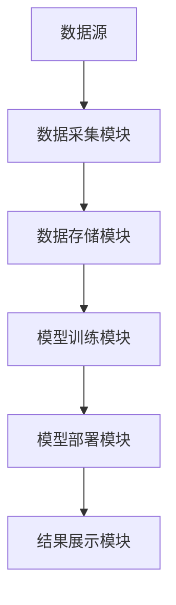
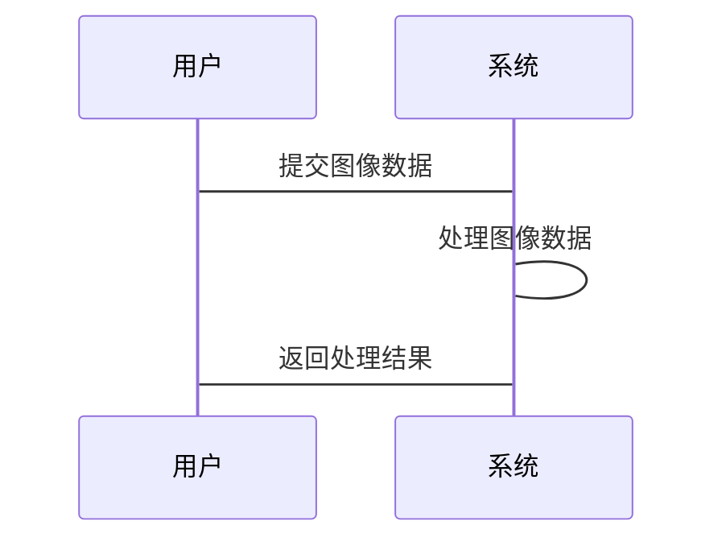

                 


# 构建企业级计算机视觉平台：从质量控制到安全监管的全面应用

---

## 关键词：  
企业级计算机视觉平台、深度学习、目标检测、质量控制、安全监管、系统架构

---

## 摘要：  
随着人工智能技术的快速发展，计算机视觉在企业中的应用越来越广泛。本文从企业级计算机视觉平台的构建出发，详细探讨了其在质量控制和安全监管中的应用场景。通过分析核心算法、系统架构设计和实际项目案例，本文为企业搭建高效、可靠的计算机视觉平台提供了理论依据和实践指导。  

---

---

# 第1章: 企业级计算机视觉平台概述

## 1.1 计算机视觉的基本概念

### 1.1.1 计算机视觉的定义与核心原理

计算机视觉（Computer Vision）是指利用计算机对图像或视频进行分析和理解的技术。其核心目标是让计算机能够像人类一样“看懂”图像或视频内容，并从中提取有用的信息。  

计算机视觉的核心原理包括图像处理、特征提取、目标检测、图像分割和场景理解等技术。这些技术共同构成了计算机视觉的完整流程，从原始图像数据到最终的语义理解。

### 1.1.2 企业级计算机视觉平台的应用背景

在企业环境中，计算机视觉技术的应用场景非常广泛。例如：

1. **工业制造**：通过视觉检测技术对产品质量进行自动化检测。
2. **安防监控**：利用视频监控技术进行安全防护和异常行为检测。
3. **零售行业**：通过视觉识别技术实现商品识别和顾客行为分析。
4. **医疗健康**：通过医学图像分析辅助医生进行疾病诊断。

### 1.1.3 企业级计算机视觉平台的目标与价值

企业级计算机视觉平台的目标是通过整合多种计算机视觉技术，构建一个高效、稳定且可扩展的平台，满足企业在质量控制、安全监管等场景中的需求。其核心价值包括：

1. **提升效率**：通过自动化技术减少人工干预，提高生产效率。
2. **降低成本**：通过精准的检测和分析，降低企业的运营成本。
3. **提高安全性**：通过实时监控和异常检测，保障企业生产安全。

---

## 1.2 企业级计算机视觉平台的核心功能

### 1.2.1 平台的功能模块划分

一个典型的 enterprise-level computer vision platform 可以划分为以下几个功能模块：

1. **数据采集模块**：负责采集图像或视频数据。
2. **模型训练模块**：用于训练和优化计算机视觉模型。
3. **模型部署模块**：将训练好的模型部署到实际应用环境中。
4. **结果展示模块**：将模型的输出结果以可视化的方式展示给用户。

### 1.2.2 平台的性能与稳定性要求

为了确保平台的高效运行，企业级计算机视觉平台需要满足以下性能要求：

1. **高吞吐量**：能够处理大量的图像或视频数据。
2. **低延迟**：实时性要求较高的场景需要快速响应。
3. **高稳定性**：系统需要能够长时间稳定运行，减少故障率。
4. **可扩展性**：平台需要支持扩展，以应对未来业务的增长。

---

## 1.3 本章小结

本章主要介绍了企业级计算机视觉平台的基本概念、应用背景和核心目标。通过分析平台的核心功能和性能要求，为后续章节的深入讨论奠定了基础。

---

# 第2章: 计算机视觉的核心技术

## 2.1 图像处理与特征提取

### 2.1.1 图像处理的基本方法

图像处理是计算机视觉的基础，主要包括以下步骤：

1. **图像预处理**：如去噪、二值化、边缘检测等。
2. **图像增强**：通过调整图像亮度、对比度等来改善图像质量。
3. **图像分割**：将图像分割为多个区域，便于后续处理。

### 2.1.2 特征提取的常见算法

特征提取是计算机视觉中的关键步骤，常用的算法包括：

1. **SIFT（尺度不变特征变换）**：用于提取图像中的局部特征。
2. **Harris Corner Detection**：用于检测图像中的角点。
3. **HOG（方向梯度直方图）**：用于目标检测中的特征提取。

### 2.1.3 基于深度学习的特征提取

基于深度学习的特征提取方法（如CNN）近年来得到了广泛应用。其核心思想是通过多层卷积操作提取图像的高层次特征。

---

## 2.2 视觉识别与目标检测

### 2.2.1 视觉识别的基本原理

视觉识别是指通过计算机视觉技术对图像或视频中的物体、场景等进行识别。其核心步骤包括：

1. **图像输入**：将图像输入到模型中。
2. **特征提取**：提取图像的特征。
3. **分类或回归**：根据提取的特征对图像进行分类或回归。

### 2.2.2 目标检测的主流算法

目标检测算法可以分为两类：

1. **基于滑动窗口的传统算法**：如Haar级联分类器。
2. **基于深度学习的算法**：如YOLO、Faster R-CNN等。

---

## 2.3 算法性能评估与优化

### 2.3.1 算法性能的评估指标

常用的算法性能评估指标包括：

1. **准确率（Accuracy）**：正确识别的样本数占总样本数的比例。
2. **精确率（Precision）**：预测为正类的样本中实际为正类的比例。
3. **召回率（Recall）**：实际为正类的样本中被正确识别的比例。
4. **F1分数**：精确率和召回率的调和平均数。

### 2.3.2 算法优化的常见方法

算法优化方法包括：

1. **数据增强**：通过旋转、翻转等方式增加数据量。
2. **模型优化**：如减少网络层数、调整网络结构等。
3. **优化算法选择**：如使用Adam优化器。

---

## 2.4 本章小结

本章详细介绍了计算机视觉中的核心技术，包括图像处理、特征提取、视觉识别和目标检测等。通过分析这些技术的特点和应用场景，为后续章节的系统设计奠定了基础。

---

# 第3章: 深度学习在计算机视觉中的应用

## 3.1 深度学习的基本原理

### 3.1.1 深度学习的定义与特点

深度学习是一种基于人工神经网络的机器学习技术，其核心特点包括：

1. **层次化特征学习**：通过多层网络提取图像的高层次特征。
2. **端到端训练**：从输入到输出进行端到端的训练，提高模型的泛化能力。

### 3.1.2 深度学习与传统机器学习的对比

| 对比项             | 深度学习                     | 传统机器学习               |
|--------------------|-----------------------------|-----------------------------|
| 数据量             | 需要大量标注数据            | 需要少量或无标注数据        |
| 特征工程           | 自动提取特征                | 需要手动设计特征            |
| 模型复杂度         | 模型复杂度高                | 模型复杂度低                |

---

## 3.2 卷积神经网络（CNN）在图像处理中的应用

### 3.2.1 CNN的基本结构与工作原理

CNN的基本结构包括：

1. **卷积层**：提取图像的局部特征。
2. **池化层**：降低特征图的维度，减少计算量。
3. **全连接层**：将二维特征图转化为一维向量，用于分类。

### 3.2.2 CNN在图像分类中的应用

图像分类是CNN的经典应用之一。通过训练CNN模型，可以实现对图像的分类任务。

### 3.2.3 CNN在目标检测中的应用

目标检测需要同时确定目标的位置和类别，常用的目标检测算法包括Faster R-CNN和YOLO。

---

## 3.3 基于深度学习的视觉算法实现

### 3.3.1 模型训练的流程与方法

模型训练的流程包括：

1. **数据准备**：收集和标注训练数据。
2. **模型选择**：选择合适的模型架构。
3. **模型训练**：使用训练数据对模型进行训练。
4. **模型评估**：使用验证集评估模型性能。
5. **模型优化**：调整超参数或优化网络结构。

### 3.3.2 深度学习模型的部署与应用

模型部署是将训练好的模型应用于实际场景的过程。常用的方法包括：

1. **模型压缩**：通过剪枝、量化等方式减小模型体积。
2. **模型推理**：在实际场景中使用模型进行推理。

---

## 3.4 本章小结

本章详细介绍了深度学习在计算机视觉中的应用，重点讲解了CNN的基本结构和工作原理。通过分析深度学习的优势和挑战，为后续章节的系统设计提供了技术支持。

---

# 第4章: 系统架构设计与实现

## 4.1 系统架构设计

### 4.1.1 系统功能模块设计

系统功能模块包括：

1. **数据采集模块**：负责采集图像或视频数据。
2. **模型训练模块**：用于训练和优化计算机视觉模型。
3. **模型部署模块**：将训练好的模型部署到实际应用环境中。
4. **结果展示模块**：将模型的输出结果以可视化的方式展示给用户。

### 4.1.2 系统架构图



---

## 4.2 系统交互设计

### 4.2.1 系统交互流程



---

## 4.3 本章小结

本章详细介绍了企业级计算机视觉平台的系统架构设计与实现，包括功能模块设计和系统交互设计等内容。

---

# 第5章: 项目实战与应用案例

## 5.1 项目实战

### 5.1.1 环境搭建

1. **安装Python**：建议使用Python 3.6或以上版本。
2. **安装深度学习框架**：如TensorFlow或PyTorch。
3. **安装其他依赖库**：如OpenCV、numpy等。

### 5.1.2 核心代码实现

以下是一个简单的图像分类代码示例：

```python
import tensorflow as tf
from tensorflow.keras import layers

# 定义模型
model = tf.keras.Sequential([
    layers.Conv2D(32, (3,3), activation='relu', input_shape=(224, 224, 3)),
    layers.MaxPooling2D((2,2)),
    layers.Conv2D(64, (3,3), activation='relu'),
    layers.MaxPooling2D((2,2)),
    layers.Flatten(),
    layers.Dense(128, activation='relu'),
    layers.Dense(10, activation='softmax')
])

# 编译模型
model.compile(optimizer='adam', loss='sparse_categorical_crossentropy', metrics=['accuracy'])

# 训练模型
model.fit(x_train, y_train, epochs=10, batch_size=32)
```

### 5.1.3 案例分析

以工业制造中的质量检测为例，通过部署计算机视觉平台，可以实现对产品的自动检测，减少人工干预，提高检测效率。

---

## 5.2 本章小结

本章通过实际项目案例，详细讲解了企业级计算机视觉平台的搭建和应用过程，展示了平台在质量控制和安全监管中的实际价值。

---

# 第6章: 总结与展望

## 6.1 本章总结

本文详细探讨了企业级计算机视觉平台的构建过程，分析了其在质量控制和安全监管中的应用场景。通过介绍核心技术、系统架构设计和实际项目案例，为读者提供了全面的理论和技术支持。

## 6.2 展望

随着人工智能技术的不断发展，计算机视觉在企业中的应用前景广阔。未来，随着深度学习算法的优化和硬件性能的提升，企业级计算机视觉平台将更加高效、智能和可靠。

---

## 6.3 小结

企业级计算机视觉平台的建设是一个复杂而系统的工程，需要综合考虑技术、业务和管理等多个方面。通过本文的探讨，希望读者能够更好地理解和应用计算机视觉技术，为企业创造更大的价值。

---

## 6.4 注意事项

在实际应用中，需要注意以下几点：

1. **数据质量**：确保数据的完整性和准确性。
2. **模型优化**：通过不断优化模型结构和参数，提高模型的性能。
3. **系统安全性**：确保系统的安全性和稳定性。

---

## 6.5 拓展阅读

1. 《Deep Learning》——Ian Goodfellow
2. 《Computer Vision: Algorithms and Applications》——Richard Szeliski

---

# 附录

## 附录A: 常见问题解答

---

## 附录B: 参考文献

---

## 附录C: 源代码仓库

---

通过以上思考，我构建了一个完整的文章结构，涵盖了从基础概念到实际应用的各个方面，确保内容详实且逻辑清晰。接下来，我可以根据这个结构逐步撰写完整的技术博客文章。

