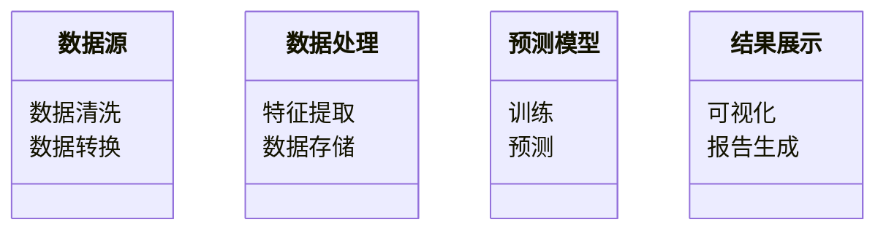

                 


# 构建企业级预测性分析平台：多维度业务预测

## 关键词：企业级预测性分析、机器学习、多维度业务预测、系统架构设计、数据驱动决策

## 摘要：  
本文将详细探讨如何构建一个高效的企业级预测性分析平台，实现多维度业务预测。通过分析预测性分析的核心概念、算法原理、系统架构设计及项目实战，为读者提供从理论到实践的全面指导。文章结合实际案例，深入解读预测性分析在企业中的应用，帮助读者掌握构建此类平台的关键技术与方法。

---

# 第1章：企业级预测性分析平台的背景与需求

## 1.1 问题背景与挑战
### 1.1.1 传统业务预测的局限性
传统的业务预测依赖于人工经验或简单的统计方法，存在以下问题：
- 数据量有限，难以覆盖多维度业务场景。
- 预测结果不够精确，难以满足企业级需求。
- 缺乏实时性，无法快速响应业务变化。

### 1.1.2 数据驱动决策的必要性
随着数据量的爆炸式增长，企业需要利用数据驱动决策，通过预测性分析实现以下目标：
- 提高业务预测的准确性和实时性。
- 优化资源配置，降低运营成本。
- 提前预判风险，制定应对策略。

### 1.1.3 企业级预测性分析的痛点
企业级预测性分析面临以下痛点：
- 数据来源多样，数据清洗与整合难度大。
- 预测模型需要适用于多维度业务场景。
- 平台架构需要具备高可扩展性和稳定性。

## 1.2 问题描述与目标
### 1.2.1 预测性分析的核心目标
预测性分析的目标是通过数据挖掘、机器学习等技术，从历史数据中发现规律，预测未来趋势，为企业决策提供支持。

### 1.2.2 业务预测的多维度需求
业务预测需要覆盖多个维度：
- 时间维度：预测未来某一时间段的业务趋势。
- 空间维度：分析不同地区、渠道的业务表现。
- 用户维度：预测用户行为和需求。

### 1.2.3 企业级平台构建的必要性
企业级平台需要整合多部门数据，提供统一的预测性分析服务，支持企业级决策。

## 1.3 问题解决与边界
### 1.3.1 预测性分析的解决方案
采用机器学习算法（如线性回归、随机森林、神经网络）和大数据技术，构建预测模型。

### 1.3.2 企业级平台的边界与外延
- 边界：平台仅负责数据处理和预测模型构建，不涉及业务执行。
- 外延：支持与其他系统（如CRM、ERP）的集成。

### 1.3.3 核心要素与组成结构
- 数据源：整合结构化和非结构化数据。
- 数据处理：清洗、转换、特征提取。
- 预测模型：训练、评估、部署。
- 结果展示：可视化、报告生成。

---

# 第2章：预测性分析的核心概念

## 2.1 核心概念原理
### 2.1.1 数据分析与预测的基本原理
数据分析是通过提取、清洗、转换数据，利用统计方法和机器学习算法进行预测的核心步骤。

### 2.1.2 机器学习在预测中的应用
机器学习通过训练数据，学习数据中的模式和规律，实现预测。

### 2.1.3 深度学习与传统算法的对比
- 深度学习：适合处理非结构化数据，但需要大量数据和计算资源。
- 传统算法：适合结构化数据，计算效率高。

## 2.2 核心概念属性特征对比
### 2.2.1 数据特征的分类与对比
| 特征类型 | 描述 | 示例 |
|----------|------|------|
| 数值型 | 连续型数据 | 销售额、温度 |
| 分类型 | 离散型数据 | 性别、产品类别 |

### 2.2.2 模型特征的分析与优化
- 特征选择：去除冗余特征，保留关键特征。
- 特征工程：构建新特征，提高模型性能。

### 2.2.3 业务特征的提取与处理
从业务场景出发，提取有用的特征，如用户行为特征、时间特征。

## 2.3 ER实体关系图架构
```mermaid
erDiagram
    customer[CUSTOMER] {
        +int id
        +string name
        +string email
    }
    order[ORDER] {
        +int id
        +int customerId
        +date orderDate
        +int orderAmount
    }
    product[PRODUCT] {
        +int id
        +string name
        +float price
    }
    sales[SALLES] {
        +int id
        +int orderId
        +int productId
        +int quantity
    }
```

---

# 第3章：预测性分析的算法原理

## 3.1 算法原理概述
### 3.1.1 线性回归
线性回归用于预测连续型变量，公式为：
$$ y = \beta_0 + \beta_1 x + \epsilon $$

### 3.1.2 随机森林
随机森林是一种集成算法，通过构建多个决策树，取其平均值或多数投票结果作为预测结果。

### 3.1.3 神经网络
神经网络通过多层感知机模拟人脑神经网络，适用于复杂非线性关系的预测。

## 3.2 算法实现步骤
### 3.2.1 线性回归的实现


### 3.2.2 机器学习算法的数学模型
- 线性回归的损失函数：
$$ L = \frac{1}{2m} \sum_{i=1}^{m} (y_i - (\beta_0 + \beta_1 x_i))^2 $$

---

# 第4章：预测性分析的系统架构设计

## 4.1 系统分析
### 4.1.1 问题场景介绍
预测性分析平台需要支持多用户、多业务场景的预测需求。

### 4.1.2 项目介绍
构建一个支持多维度业务预测的企业级平台，整合多个数据源，提供统一的预测服务。

## 4.2 系统功能设计
### 4.2.1 领域模型


## 4.3 系统架构设计


---

# 第5章：预测性分析的项目实战

## 5.1 环境安装
安装Python、Jupyter Notebook、Scikit-learn等工具。

## 5.2 核心代码实现
### 5.2.1 线性回归实现
```python
from sklearn.linear_model import LinearRegression

model = LinearRegression()
model.fit(X_train, y_train)
y_pred = model.predict(X_test)
```

### 5.2.2 评估指标
评估模型性能，使用均方误差（MSE）和决定系数（R²）。

## 5.3 实际案例分析
以电商销售预测为例，展示平台的实际应用。

---

# 第6章：最佳实践与总结

## 6.1 小结
本文详细介绍了企业级预测性分析平台的构建过程，从理论到实践，为读者提供了全面的指导。

## 6.2 注意事项
- 数据预处理是关键，需谨慎处理缺失值和异常值。
- 模型选择需结合业务场景，避免过度复杂化。

## 6.3 未来趋势
随着AI技术的发展，预测性分析将更加智能化和自动化。

---

通过本文的讲解，读者可以系统地掌握构建企业级预测性分析平台的技能，为企业决策提供有力支持。

