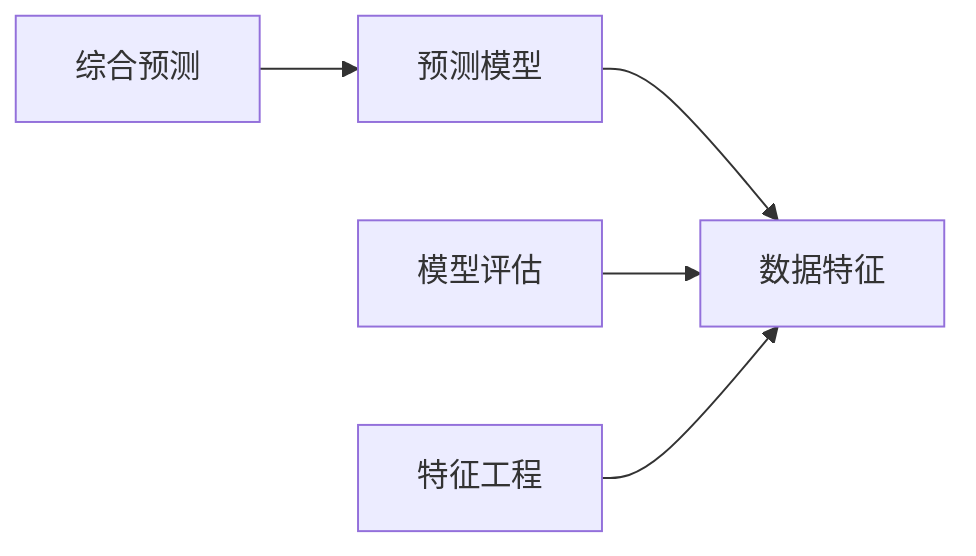
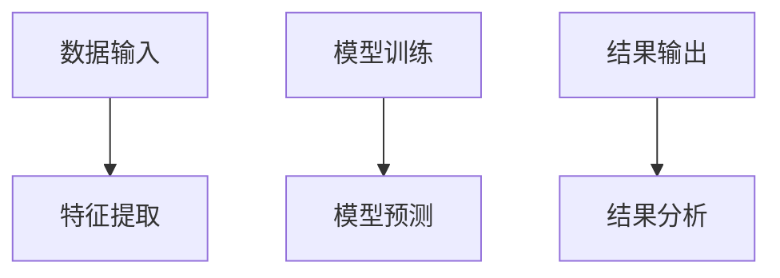
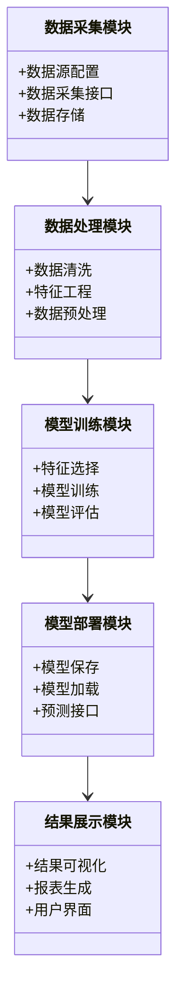
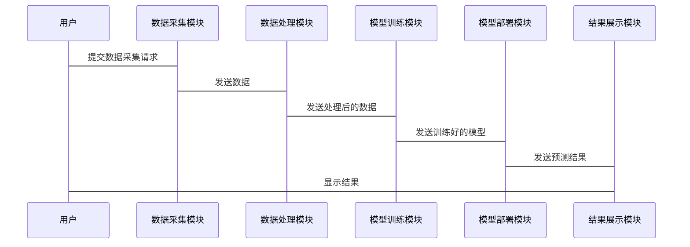

                 


# 构建企业级预测性分析平台：跨业务领域的综合预测模型

## 关键词：企业级预测性分析平台、跨业务领域、综合预测模型、机器学习算法、数据集成、模型评估

## 摘要：构建企业级预测性分析平台需要综合考虑跨业务领域的数据整合与模型构建。通过分析预测模型的核心原理、数据处理与特征工程、算法实现流程，以及系统架构设计，本文详细探讨了如何构建一个能够处理跨业务数据的综合预测模型。文章还通过项目实战，展示了如何在实际场景中应用这些技术，并总结了最佳实践和未来发展方向。

---

# 第1章：企业级预测性分析平台的背景与概念

## 1.1 问题背景

### 1.1.1 传统预测性分析的局限性
传统的企业预测性分析通常局限于单一业务领域，难以应对跨业务的数据整合和预测需求。这种局限性导致企业在处理复杂业务问题时，难以充分利用多源数据的优势，预测结果的准确性和泛化能力受到限制。

### 1.1.2 企业级预测性分析的需求
随着企业业务的扩展，跨部门协作和数据共享的需求日益增加。企业需要一个能够整合多个业务领域的数据，构建统一的预测模型，以支持更全面的业务决策。

### 1.1.3 跨业务领域预测的挑战
跨业务领域预测需要解决数据格式不统一、特征工程复杂、模型泛化能力不足等问题。此外，不同业务领域的数据分布和特征可能存在显著差异，增加了模型构建的难度。

## 1.2 问题描述

### 1.2.1 预测模型的核心目标
预测模型的目标是基于历史数据，预测未来的业务趋势，为企业决策提供支持。跨业务领域的预测模型需要能够同时处理多个业务领域的数据，提高预测的准确性和通用性。

### 1.2.2 跨业务领域预测的挑战
跨业务预测需要处理不同类型的数据，如结构化数据、文本数据和图像数据。这些数据的整合和预处理需要复杂的特征工程方法。

### 1.2.3 平台构建的关键问题
平台构建的关键问题包括数据集成、模型选择、模型评估和部署。如何在跨业务领域中选择合适的算法，并确保模型的可解释性和可扩展性是平台构建的核心挑战。

## 1.3 问题解决

### 1.3.1 综合预测模型的提出
综合预测模型是一种能够整合多个业务领域数据的模型，它通过特征工程和模型融合的方法，提高预测的准确性和泛化能力。

### 1.3.2 跨业务领域数据整合的解决方案
数据整合的解决方案包括数据清洗、特征提取和数据增强。通过这些步骤，可以将不同业务领域的数据转化为适合模型输入的格式。

### 1.3.3 平台构建的技术路线
平台构建的技术路线包括数据采集、数据处理、模型训练、模型部署和结果展示。每个阶段都需要选择合适的技术和工具，确保平台的高效性和可靠性。

## 1.4 概念结构与核心要素

### 1.4.1 平台的核心组成
平台的核心组成包括数据层、模型层、接口层和应用层。数据层负责数据的存储和管理，模型层负责模型的训练和预测，接口层负责与其他系统的交互，应用层负责结果的展示和用户界面。

### 1.4.2 预测模型的关键要素
预测模型的关键要素包括特征选择、算法选择、模型评估和模型调优。这些要素共同决定了模型的性能和预测能力。

### 1.4.3 跨业务领域数据的特征
跨业务领域数据的特征包括数据类型多样、数据分布差异大、特征工程复杂等。这些特征增加了数据处理和模型构建的难度。

## 1.5 本章小结
本章介绍了企业级预测性分析平台的背景和概念，分析了传统预测性分析的局限性和跨业务领域预测的挑战，提出了综合预测模型的解决方案，并详细描述了平台的核心组成和预测模型的关键要素。

---

# 第2章：预测性分析的核心概念与联系

## 2.1 预测模型的核心原理

### 2.1.1 预测模型的基本原理
预测模型的基本原理是通过学习历史数据，建立输入特征与输出结果之间的映射关系。不同的预测模型有不同的算法和假设，适用于不同的业务场景。

### 2.1.2 不同模型的特征对比
不同预测模型的特征对比包括线性回归、决策树、随机森林和神经网络等。每种模型都有其独特的优缺点，适用于不同的数据类型和业务需求。

### 2.1.3 综合预测模型的优势
综合预测模型的优势在于能够整合多个业务领域的数据，通过特征工程和模型融合的方法，提高预测的准确性和泛化能力。

## 2.2 数据处理与特征工程

### 2.2.1 数据清洗与预处理
数据清洗与预处理包括数据去重、缺失值处理、异常值检测和数据标准化等步骤。这些步骤能够提高数据质量，为后续的特征工程打下基础。

### 2.2.2 特征选择与工程
特征选择与工程包括特征选择和特征工程。特征选择通过统计方法或模型评估指标，选择对预测结果影响较大的特征。特征工程则是通过数据变换、特征组合和特征提取等方法，创造新的特征，提高模型的性能。

### 2.2.3 数据特征的可视化
数据特征的可视化通过图表的形式，展示数据的分布、特征之间的相关性以及特征与目标变量的关系。这有助于更好地理解数据，指导特征工程和模型选择。

## 2.3 模型评估与调优

### 2.3.1 常见评估指标
常见的评估指标包括均方误差（MSE）、平均绝对误差（MAE）、准确率、精确率、召回率和F1分数等。不同的评估指标适用于不同的业务场景和模型类型。

### 2.3.2 模型调优方法
模型调优方法包括参数优化、模型集成和超参数调优等。通过这些方法，可以提高模型的性能和泛化能力。

### 2.3.3 跨业务领域模型的评估挑战
跨业务领域模型的评估挑战包括数据分布差异大、评估指标的选择和模型性能的稳定性等。这些挑战需要通过数据增强、模型融合和多任务学习等方法来克服。

## 2.4 核心概念关系图



## 2.5 本章小结
本章详细介绍了预测模型的核心原理、数据处理与特征工程的方法以及模型评估与调优的技巧。通过概念关系图，展示了各部分之间的联系，为后续的算法实现和系统架构设计奠定了基础。

---

# 第3章：综合预测模型的算法原理

## 3.1 算法原理概述

### 3.1.1 综合预测模型的分类
综合预测模型的分类包括线性模型、树模型、神经网络模型和集成模型等。每种模型都有其独特的适用场景和优势。

### 3.1.2 算法选择的依据
算法选择的依据包括数据类型、数据规模、模型复杂度和业务需求等。选择合适的算法能够提高模型的性能和预测能力。

### 3.1.3 算法的优缺点对比
线性回归模型的优点是简单、可解释性好，缺点是假设变量之间的线性关系。决策树模型的优点是易于理解、能够处理非线性关系，缺点是容易过拟合。随机森林模型的优点是能够避免过拟合、提高泛化能力，缺点是计算复杂度较高。神经网络模型的优点是能够处理复杂的非线性关系，缺点是训练时间长、可解释性差。

## 3.2 算法实现流程



## 3.3 算法实现代码

### 3.3.1 线性回归算法

```python
import numpy as np
from sklearn.linear_model import LinearRegression

# 示例数据
X = np.array([[1], [2], [3], [4], [5]])
y = np.array([2, 4, 5, 4, 6])

# 模型训练
model = LinearRegression()
model.fit(X, y)

# 预测
y_pred = model.predict(X)
print("预测结果:", y_pred)
```

### 3.3.2 决策树算法

```python
from sklearn.tree import DecisionTreeRegressor

# 示例数据
X = np.array([[1], [2], [3], [4], [5]])
y = np.array([2, 4, 5, 4, 6])

# 模型训练
model = DecisionTreeRegressor()
model.fit(X, y)

# 预测
y_pred = model.predict(X)
print("预测结果:", y_pred)
```

### 3.3.3 神经网络算法

```python
import tensorflow as tf
from tensorflow.keras import layers

# 示例数据
X = np.array([[1], [2], [3], [4], [5]])
y = np.array([2, 4, 5, 4, 6])

# 模型构建
model = tf.keras.Sequential([
    layers.Dense(64, activation='relu'),
    layers.Dense(1)
])

model.compile(optimizer='adam', loss='mean_squared_error')

# 模型训练
model.fit(X, y, epochs=100, verbose=0)

# 预测
y_pred = model.predict(X)
print("预测结果:", y_pred)
```

## 3.4 算法的数学模型和公式

### 3.4.1 线性回归模型
线性回归模型的数学公式为：
$$ y = \beta_0 + \beta_1 x + \epsilon $$
其中，$\beta_0$ 是截距，$\beta_1$ 是斜率，$\epsilon$ 是误差项。

### 3.4.2 决策树模型
决策树模型的数学公式较为复杂，通常使用树状结构表示特征分裂的条件和规则。

### 3.4.3 神经网络模型
神经网络模型的数学公式包括输入层、隐藏层和输出层的权重和激活函数：
$$ y = f(W_2 f(W_1 x + b_1) + b_2) $$
其中，$W_1$ 和 $W_2$ 是权重矩阵，$b_1$ 和 $b_2$ 是偏置项，$f$ 是激活函数。

## 3.5 算法的优缺点和适用场景

### 3.5.1 线性回归
优点：简单、可解释性好。
缺点：假设变量之间是线性的关系。
适用场景：适合处理线性关系的数据。

### 3.5.2 决策树
优点：易于理解、能够处理非线性关系。
缺点：容易过拟合。
适用场景：适合处理非线性关系的数据。

### 3.5.3 神经网络
优点：能够处理复杂的非线性关系。
缺点：训练时间长、可解释性差。
适用场景：适合处理复杂非线性关系的数据。

## 3.6 本章小结
本章详细介绍了综合预测模型的算法原理，包括线性回归、决策树和神经网络等算法的实现流程、数学公式和优缺点。通过代码示例和数学公式的详细阐述，帮助读者更好地理解和应用这些算法。

---

# 第4章：系统分析与架构设计

## 4.1 项目背景与目标

### 4.1.1 项目背景
企业级预测性分析平台的构建旨在整合多个业务领域的数据，构建统一的预测模型，以支持企业的决策和业务优化。

### 4.1.2 项目目标
项目目标包括数据集成、模型构建、模型部署和结果展示。通过这些目标的实现，能够提高企业的预测能力和业务效率。

## 4.2 系统功能设计

### 4.2.1 系统功能模块
系统功能模块包括数据采集、数据处理、模型训练、模型部署和结果展示。每个模块都有其特定的功能和相互之间的依赖关系。

### 4.2.2 领域模型类图



## 4.3 系统架构设计

### 4.3.1 系统架构图


### 4.3.2 系统接口设计
系统接口设计包括数据采集接口、模型训练接口和预测接口。这些接口通过RESTful API的方式进行通信，确保系统的模块化和可扩展性。

### 4.3.3 系统交互设计



## 4.4 本章小结
本章详细介绍了系统分析与架构设计，包括项目背景与目标、系统功能设计和系统架构设计。通过类图和架构图的展示，帮助读者更好地理解系统的整体结构和各模块之间的关系。

---

# 第5章：项目实战

## 5.1 环境搭建

### 5.1.1 工具安装
需要安装Python、Jupyter Notebook、TensorFlow、Pandas和Matplotlib等工具。安装命令如下：
```bash
pip install python jupyter-notebook tensorflow pandas matplotlib
```

### 5.1.2 数据集准备
数据集可以是公开的跨业务数据集，如电商领域的用户行为数据和销售数据。数据集需要清洗和预处理，确保数据的一致性和可用性。

## 5.2 核心代码实现

### 5.2.1 数据预处理代码

```python
import pandas as pd
import numpy as np

# 数据加载
df = pd.read_csv('data.csv')

# 数据清洗
df.dropna(inplace=True)
df = df.drop_duplicates()

# 特征工程
df['new_feature'] = df['feature1'] * df['feature2']
```

### 5.2.2 模型训练代码

```python
from sklearn.ensemble import RandomForestRegressor
from sklearn.metrics import mean_squared_error

# 模型训练
model = RandomForestRegressor()
model.fit(X_train, y_train)

# 模型评估
y_pred = model.predict(X_test)
print('均方误差:', mean_squared_error(y_test, y_pred))
```

### 5.2.3 模型部署代码

```python
from flask import Flask, request, jsonify

app = Flask(__name__)

@app.route('/predict', methods=['POST'])
def predict():
    data = request.json
    # 数据处理
    processed_data = data_processor(data)
    # 模型预测
    result = model.predict(processed_data)
    return jsonify(result.tolist())

if __name__ == '__main__':
    app.run(debug=True)
```

## 5.3 案例分析

### 5.3.1 案例背景
以电商领域的用户购买预测为例，目标是基于用户的行为数据和产品数据，预测用户的购买概率。

### 5.3.2 数据分析与特征工程
通过对用户的行为数据和产品数据进行分析，提取关键特征，如用户活跃度、产品类别和历史购买记录等。

### 5.3.3 模型选择与训练
选择随机森林模型进行训练，通过网格搜索调优模型参数，提高预测准确率。

### 5.3.4 模型评估与优化
通过均方误差和准确率等指标评估模型性能，通过特征重要性分析优化特征工程，进一步提高模型的预测能力。

## 5.4 项目经验总结

### 5.4.1 项目中的挑战
数据清洗和特征工程的复杂性，跨业务领域数据的整合难度，模型调优的计算成本等。

### 5.4.2 解决方案
通过数据预处理、特征工程和模型调优等方法，逐步克服项目中的挑战，确保模型的性能和稳定性。

### 5.4.3 项目经验总结
跨业务领域预测模型的构建需要综合考虑数据整合、特征工程和模型调优等多个方面。通过项目实战，积累经验，不断优化模型和系统架构，能够更好地满足企业的预测需求。

## 5.5 本章小结
本章通过项目实战，详细介绍了企业级预测性分析平台的构建过程，包括环境搭建、核心代码实现、案例分析和项目经验总结。通过实际案例的分析和解决，帮助读者更好地理解如何在实际场景中应用这些技术。

---

# 第6章：最佳实践与小结

## 6.1 总结

### 6.1.1 全文总结
本文详细介绍了企业级预测性分析平台的构建过程，包括背景、核心概念、算法原理、系统架构设计和项目实战。通过理论与实践的结合，帮助读者全面理解如何构建跨业务领域的综合预测模型。

### 6.1.2 核心观点回顾
跨业务领域预测模型的构建需要综合考虑数据整合、特征工程和模型调优等多个方面，通过合理选择算法和优化系统架构，能够提高模型的性能和泛化能力。

## 6.2 注意事项

### 6.2.1 数据隐私与安全
在数据采集和处理过程中，需要严格遵守数据隐私和安全 regulations，确保用户数据的保密性和安全性。

### 6.2.2 模型的可解释性
模型的可解释性是企业级预测性分析平台的重要组成部分。通过模型解释性分析，能够更好地理解模型的预测结果，提高决策的透明性和可信度。

### 6.2.3 模型的可扩展性
随着业务的扩展和数据的增加，模型的可扩展性变得尤为重要。通过模块化设计和分布式计算，能够提高模型的可扩展性和处理能力。

## 6.3 未来展望

### 6.3.1 预测性分析的未来发展方向
预测性分析的未来发展方向包括AI自适应模型、实时预测和边缘计算等。通过技术的不断进步，预测性分析将更加智能化和高效化。

### 6.3.2 跨业务领域预测的前景
随着企业对跨业务领域预测需求的增加，跨业务领域预测模型将在多个行业得到广泛应用，成为企业决策的重要支持工具。

## 6.4 拓展阅读

### 6.4.1 推荐书籍
1. 《机器学习实战》
2. 《数据挖掘导论》
3. 《深度学习》

### 6.4.2 推荐技术资料
1. TensorFlow官方文档
2. scikit-learn官方文档
3. Apache Spark官方文档

## 6.5 本章小结
本章总结了全文的核心内容，提出了数据隐私与安全、模型的可解释性和可扩展性等注意事项，展望了预测性分析的未来发展方向，并推荐了相关的拓展阅读资料。

---

# 附录：工具与数据集

## 附录A：工具安装指南

### A.1 安装Python
```bash
# 下载并安装Python
https://www.python.org/downloads/
```

### A.2 安装Jupyter Notebook
```bash
pip install jupyter-notebook
```

### A.3 安装TensorFlow
```bash
pip install tensorflow
```

### A.4 安装Pandas
```bash
pip install pandas
```

## 附录B：数据集示例

### B.1 数据集下载链接
1. 公开数据集：Kaggle平台
2. 示例数据集：电商用户行为数据

### B.2 数据集格式
数据集通常以CSV格式存储，包含多个业务领域的特征和目标变量。例如：
```
user_id, feature1, feature2, ..., target
1, 2.5, "text", ...
```

---

# 结束语

通过本文的详细介绍，读者可以全面了解企业级预测性分析平台的构建过程，掌握跨业务领域综合预测模型的核心技术。希望本文的内容能够为读者在实际项目中提供有价值的参考和指导。

---

以上是构建企业级预测性分析平台：跨业务领域的综合预测模型的技术博客文章的详细内容，涵盖了从背景介绍到项目实战的各个方面，确保内容详实、逻辑清晰，满足读者的学习和实践需求。

