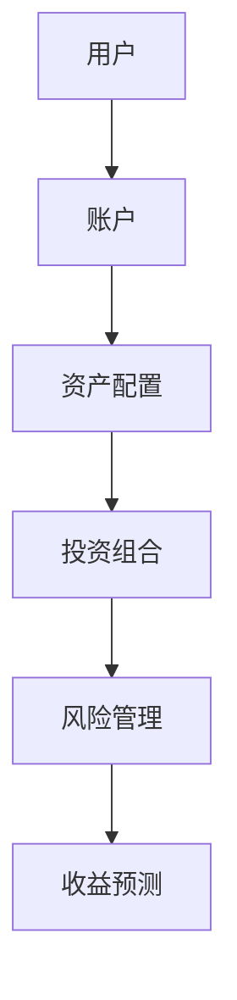
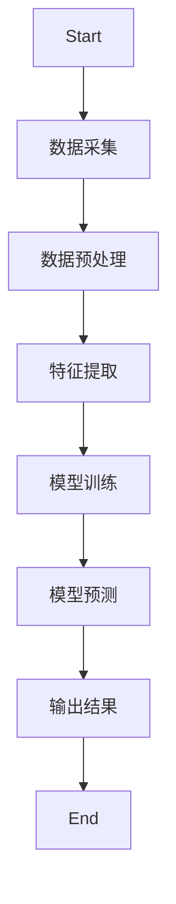
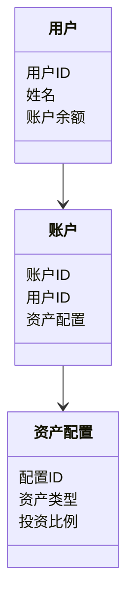
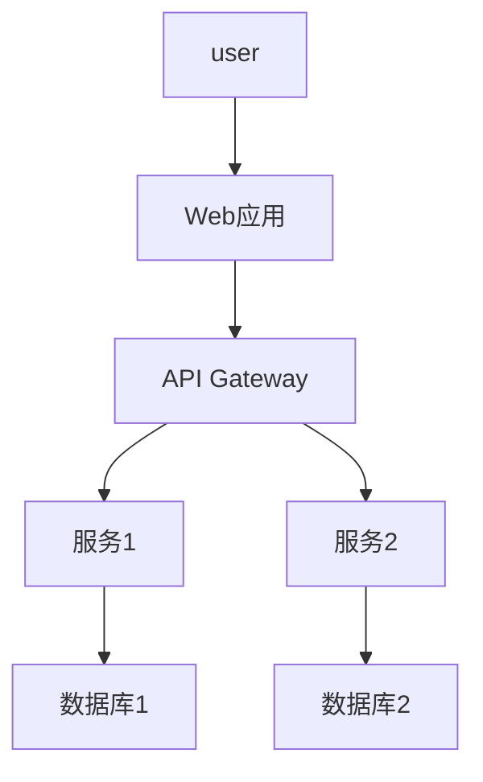
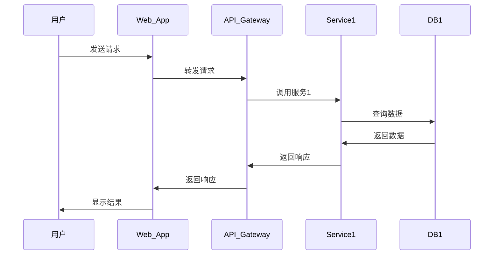

                 


# 构建全方位的AI驱动财富管理平台

## 关键词：人工智能、财富管理、系统架构、算法原理、项目实战

## 摘要：AI驱动的财富管理平台利用人工智能技术，通过数据分析和智能算法，实现个性化的资产配置、风险管理、收益预测和客户服务。本文详细阐述了构建这样一个平台的背景、核心概念、算法原理、系统架构设计及项目实战，旨在为读者提供一个全面的技术指南。

---

# 第一部分：AI驱动财富管理平台的背景与核心概念

## 第1章：AI驱动财富管理平台的背景

### 1.1 问题背景与目标

#### 1.1.1 传统财富管理的痛点
传统财富管理依赖人工经验，存在以下问题：
- 服务效率低：人工操作耗时长，难以满足大规模客户需求。
- 数据分散：客户数据、市场数据分散在不同系统中，难以整合分析。
- 决策滞后：依赖历史数据和经验，难以快速响应市场变化。

#### 1.1.2 AI技术如何解决这些问题
人工智能技术通过以下方式解决传统财富管理的痛点：
- 数据整合与分析：利用大数据技术整合多源数据，提供实时分析。
- 智能决策：通过机器学习模型快速预测市场趋势，优化资产配置。
- 自动化服务：AI驱动的自动化流程减少人工干预，提高服务效率。

#### 1.1.3 平台的核心目标与价值
AI驱动的财富管理平台的核心目标是：
- 提供个性化、智能化的财富管理服务。
- 实现资产的最优配置和风险控制。
- 提高服务效率，降低运营成本。

平台的价值体现在：
- 为用户提供精准的投资建议。
- 帮助机构提高服务效率和客户满意度。
- 通过智能化手段降低投资风险。

### 1.2 技术背景与趋势

#### 1.2.1 AI技术在金融领域的应用现状
人工智能在金融领域的应用已非常广泛，包括：
- 股票预测：利用机器学习模型分析市场数据，预测股票走势。
- 风险控制：通过AI技术识别潜在风险，评估客户信用。
- 自动交易：算法交易成为主流，AI驱动的高频交易系统广泛应用。

#### 1.2.2 大数据与云计算对财富管理的影响
大数据和云计算为财富管理带来了新的可能性：
- 数据处理能力提升：云计算提供了强大的数据存储和处理能力。
- 数据分析效率提高：大数据技术能够快速处理海量数据，支持实时分析。
- 智能化服务增强：通过数据挖掘和分析，提供更精准的客户画像和服务。

#### 1.2.3 未来财富管理的智能化趋势
随着技术的进步，未来财富管理将更加智能化：
- 自动化投资顾问：通过AI技术实现24/7的自动化投资建议。
- 个性化服务：基于客户的实时数据，提供动态的资产配置建议。
- 智能风控：通过实时数据分析，快速识别和应对潜在风险。

### 1.3 AI驱动财富管理的边界与外延

#### 1.3.1 平台的功能边界
AI驱动的财富管理平台的功能边界包括：
- 资产配置：根据客户风险偏好，推荐最优投资组合。
- 收益预测：基于市场数据和模型，预测投资收益。
- 风险管理：实时监控投资组合，识别潜在风险。

#### 1.3.2 与传统金融工具的区分
AI驱动的财富管理平台与传统金融工具的主要区别在于：
- 传统工具依赖人工经验，而AI平台依靠数据和算法。
- 传统工具的服务范围有限，而AI平台可以覆盖更广泛的客户群体。

#### 1.3.3 核心要素与组成部分
AI驱动的财富管理平台的核心要素包括：
- 数据采集与处理：整合客户数据、市场数据等多源数据。
- 智能算法：利用机器学习和深度学习算法进行预测和优化。
- 用户界面：提供直观的用户界面，方便用户操作和查询。

## 1.4 本章小结
本章介绍了AI驱动财富管理平台的背景，分析了传统财富管理的痛点以及AI技术如何解决这些问题。同时，还探讨了当前的技术背景和未来的发展趋势，并明确了平台的功能边界和核心要素。

---

## 第2章：AI驱动财富管理的核心概念与联系

### 2.1 核心概念原理

#### 2.1.1 数据驱动的决策机制
数据驱动的决策机制是AI财富管理的核心：
- 数据采集：整合客户数据、市场数据、宏观经济数据等。
- 数据分析：利用大数据技术进行清洗、处理和分析。
- 决策支持：基于数据分析结果，生成投资建议。

#### 2.1.2 智能分析与预测模型
智能分析与预测模型是AI驱动的核心：
- 机器学习模型：用于预测市场走势和客户行为。
- 深度学习模型：用于复杂场景的分析和预测。
- 自然语言处理：用于分析新闻、财报等文本数据。

#### 2.1.3 个性化服务与用户体验
个性化服务是提升用户体验的关键：
- 客户画像：基于数据分析，构建客户画像，提供个性化服务。
- 动态调整：根据市场变化和客户需求，实时调整投资策略。
- 用户界面：提供友好的用户界面，方便用户操作和查询。

### 2.2 核心概念属性对比

| 特性                | 传统财富管理         | AI驱动财富管理       |
|---------------------|--------------------|---------------------|
| 数据来源            | 单一来源，依赖经验   | 多源数据，依赖算法   |
| 决策速度            | 较慢，依赖人工       | 实时响应，快速决策   |
| 服务范围            | 有限，覆盖范围小     | 广泛，覆盖范围大     |

### 2.3 ER实体关系图架构



### 2.4 本章小结
本章详细阐述了AI驱动财富管理的核心概念，包括数据驱动的决策机制、智能分析与预测模型以及个性化服务。并通过对比分析和ER实体关系图，明确了平台的组成部分和数据流向。

---

## 第3章：AI驱动财富管理的算法原理

### 3.1 算法原理概述

#### 3.1.1 机器学习在财富管理中的应用
机器学习在财富管理中的应用包括：
- 股票预测：利用回归模型预测股票价格。
- 风险评估：通过分类模型评估客户信用风险。
- 资产配置：基于聚类分析优化投资组合。

#### 3.1.2 深度学习的优势与局限
深度学习的优势在于：
- 处理复杂数据：能够处理图像、文本等多种数据类型。
- 自动特征提取：无需手动提取特征，自动学习数据特征。
- 高准确性：在复杂场景下表现优于传统机器学习方法。

深度学习的局限性：
- 计算资源需求高：需要大量计算资源和数据支持。
- 黑箱问题：模型难以解释，影响可解释性。

#### 3.1.3 自然语言处理在金融分析中的作用
自然语言处理在金融分析中的作用包括：
- 信息提取：从新闻、财报中提取关键信息。
- 情感分析：分析市场情绪，预测股价走势。
- 文本分类：对金融文本进行分类，如分类新闻类别。

### 3.2 算法流程图



### 3.3 算法实现代码

#### 3.3.1 机器学习模型实现

```python
import pandas as pd
from sklearn.model_selection import train_test_split
from sklearn.linear_model import LinearRegression
from sklearn.metrics import mean_squared_error

# 数据加载与处理
data = pd.read_csv('stock_data.csv')
X = data[['opening_price', 'closing_price', 'volume']]
y = data['next_day_price']

# 数据分割
X_train, X_test, y_train, y_test = train_test_split(X, y, test_size=0.2)

# 模型训练
model = LinearRegression()
model.fit(X_train, y_train)

# 模型预测
y_pred = model.predict(X_test)

# 模型评估
mse = mean_squared_error(y_test, y_pred)
print(f"均方误差: {mse}")
```

#### 3.3.2 深度学习模型实现

```python
import tensorflow as tf
from tensorflow.keras import layers

# 数据预处理
(X_train, y_train), (X_test, y_test) = tf.keras.datasets.mnist.load_data()

# 模型构建
model = tf.keras.Sequential([
    layers.Flatten(),
    layers.Dense(128, activation='relu'),
    layers.Dense(10, activation='softmax')
])

# 模型编译
model.compile(optimizer='adam', loss='sparse_categorical_crossentropy', metrics=['accuracy'])

# 模型训练
model.fit(X_train, y_train, epochs=10, batch_size=32)

# 模型预测
predictions = model.predict(X_test)
```

### 3.4 数学模型与公式

#### 3.4.1 线性回归模型
线性回归模型的目标是最小化预测值与真实值之间的平方差之和：
$$ \text{损失函数} = \sum_{i=1}^{n} (y_i - \hat{y_i})^2 $$

#### 3.4.2 神经网络模型
神经网络模型的前向传播过程：
$$ \hat{y} = \sigma(Wx + b) $$
其中，$W$ 是权重矩阵，$b$ 是偏置向量，$\sigma$ 是激活函数。

### 3.5 本章小结
本章详细讲解了AI驱动财富管理中常用的算法原理，包括机器学习和深度学习的应用，通过代码示例和数学公式，展示了算法实现的具体步骤和方法。

---

## 第4章：AI驱动财富管理的系统分析与架构设计

### 4.1 系统分析

#### 4.1.1 问题场景介绍
系统需要解决以下问题：
- 如何高效地处理和分析海量金融数据。
- 如何快速响应用户的查询和请求。
- 如何保证系统的安全性和稳定性。

#### 4.1.2 项目介绍
本项目旨在构建一个AI驱动的财富管理平台，实现以下功能：
- 资产配置：根据客户需求推荐投资组合。
- 风险管理：实时监控投资组合，识别潜在风险。
- 收益预测：基于市场数据预测投资收益。

### 4.2 系统功能设计

#### 4.2.1 领域模型设计



#### 4.2.2 系统架构设计



### 4.3 系统接口设计

#### 4.3.1 API接口设计
- 用户登录接口：`POST /api/login`
- 资产配置接口：`POST /api/asset_configure`
- 收益预测接口：`POST /api/return_prediction`

#### 4.3.2 系统交互设计



### 4.4 本章小结
本章通过对系统进行详细分析和设计，明确了系统的功能模块、架构设计和接口设计，为后续的开发和实现奠定了基础。

---

## 第5章：AI驱动财富管理的项目实战

### 5.1 环境安装与配置

#### 5.1.1 安装Python和必要的库
```bash
python -m pip install --upgrade pip
pip install numpy pandas scikit-learn tensorflow
```

#### 5.1.2 安装开发工具
推荐使用Jupyter Notebook进行开发和调试。

### 5.2 核心代码实现

#### 5.2.1 数据加载与预处理

```python
import pandas as pd

# 加载数据
data = pd.read_csv('stock_data.csv')

# 查看数据描述
print(data.describe())

# 数据清洗
data.dropna(inplace=True)
```

#### 5.2.2 模型训练与预测

```python
from sklearn.model_selection import train_test_split
from sklearn.linear_model import LinearRegression

# 数据分割
X = data[['opening_price', 'closing_price', 'volume']]
y = data['next_day_price']

X_train, X_test, y_train, y_test = train_test_split(X, y, test_size=0.2)

# 模型训练
model = LinearRegression()
model.fit(X_train, y_train)

# 模型预测
y_pred = model.predict(X_test)

# 模型评估
print('均方误差:', mean_squared_error(y_test, y_pred))
```

### 5.3 代码解读与分析

#### 5.3.1 数据预处理部分
- 数据加载：使用Pandas加载CSV格式的股票数据。
- 数据清洗：删除缺失值，确保数据完整性。

#### 5.3.2 模型训练部分
- 数据分割：将数据划分为训练集和测试集。
- 模型训练：使用线性回归模型进行训练。
- 模型预测：利用训练好的模型进行预测。

### 5.4 实际案例分析

#### 5.4.1 案例背景
某客户希望进行资产配置，风险偏好为中等。

#### 5.4.2 案例分析
- 数据分析：根据客户的风险偏好，推荐股票和债券的混合投资组合。
- 模型预测：预测未来3个月的投资收益。

### 5.5 项目小结
本章通过实际案例，展示了AI驱动财富管理平台的实现过程，包括环境配置、数据处理、模型训练和预测分析。

---

## 第6章：AI驱动财富管理的最佳实践与注意事项

### 6.1 最佳实践

#### 6.1.1 数据质量管理
- 数据清洗：确保数据的完整性和准确性。
- 数据标准化：统一数据格式，便于模型处理。

#### 6.1.2 模型优化策略
- 参数调整：通过网格搜索优化模型参数。
- 模型融合：结合多种模型结果，提高预测准确性。

#### 6.1.3 系统安全性
- 数据加密：保护用户数据安全。
- 权限管理：控制系统的访问权限。

### 6.2 小结
AI驱动的财富管理平台的成功离不开高质量的数据、优化的模型和安全的系统。

### 6.3 注意事项

#### 6.3.1 数据隐私
- 遵守数据隐私法规，如GDPR。
- 加强数据加密，防止数据泄露。

#### 6.3.2 模型可解释性
- 选择可解释性强的模型，方便调试和优化。
- 提供模型解释功能，增强用户信任。

#### 6.3.3 系统稳定性
- 建立完善的监控体系，及时发现和解决问题。
- 制定应急预案，应对突发事件。

### 6.4 拓展阅读
建议读者阅读以下书籍和文章，以深入理解AI在金融领域的应用：
- 《机器学习实战》
- 《深度学习入门：基于Python的CNN、RNN、GAN等人工智能技术》
- 《金融数据挖掘与人工智能》

---

## 本章小结
通过本文的详细阐述，读者可以全面了解AI驱动财富管理平台的构建过程，从背景分析、核心概念、算法原理到系统设计和项目实战，为实际应用提供了理论支持和实践指导。

